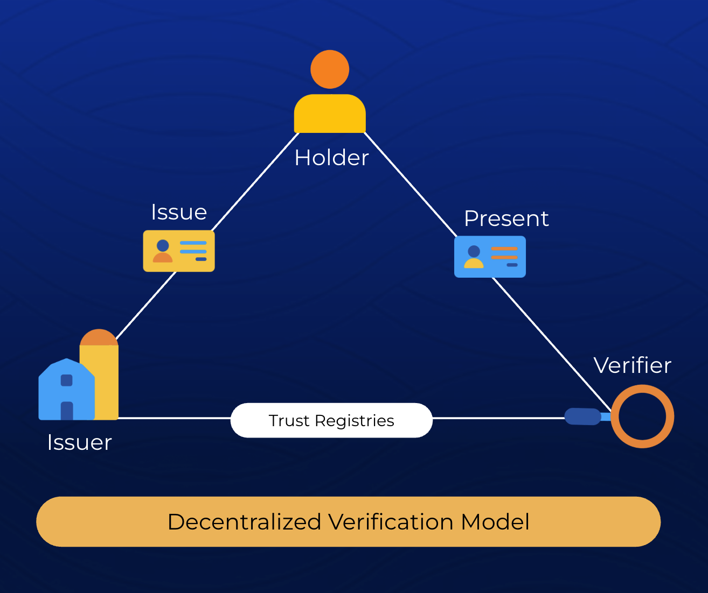
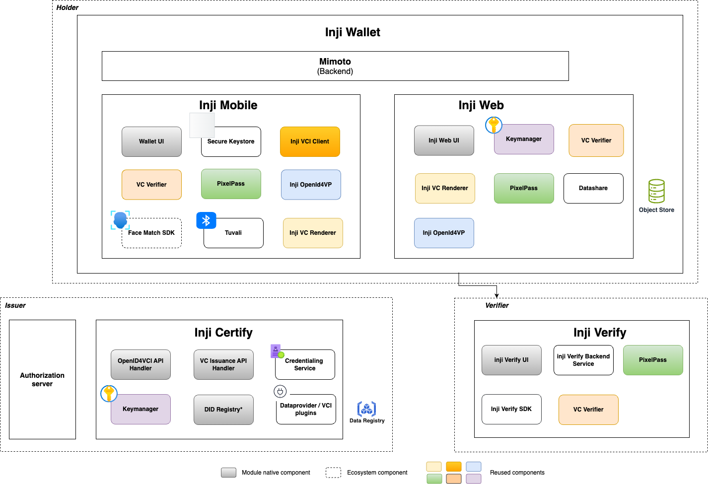

# Inji

## Overview

Inji is a verifiable credentialing stack that provides a way to share tamper-proof, instantly verifiable data which is cryptographically signed by a trusted issuer, and users can store them securely on their devices or browsers and share them when needed.

* **Issuer**: The entity that issues the credential and makes claims about the subject (e.g., a university issuing a degree, a government issuing a passport, an employer issuing a work permit). The issuer cryptographically signs the VC. Inji's 'Issuance-module' is called [Inji Certify](inji-certify/overview/).
* **Holder**: The individual or entity which possesses the credential (e.g., the student with the degree, the citizen with the passport, the employee with the work permit). The holder stores and manages their VCs. Inji's 'Holder-module' is called [Inji Wallet](inji-wallet/inji-mobile/).
* **Verifier**: The entity that requests and verifies the credential to confirm a claim (e.g., an employer checking a degree, a border agent checking a passport, a landlord checking a work permit). The verifier checks the cryptographic proofs to ensure the VC's authenticity and integrity. [Inji Verify](inji-verify/overview/).

Some everyday examples of Verifiable Credentials include:

* A national ID issued as a digital credential
* A diploma issued by a university
* A background verification report from an employer
* A subsidy or benefit eligibility certificate from a government agency

VCs allow:

* Instant verification, even offline
* User control over when and how data is shared
* Interoperability across platforms and borders
* Reduced fraud and manual checks

For a quick overview of **Inji**, which primarily includes **Inji Wallet, Inji Verify** and the **Inji Certify** as key components, you can watch the video titled _"Inji Stack End To End Use Case Demonstration"._ This video provides a visual walkthrough of the key features and showcases how all modules interact through a persona-based demonstration, highlighting its real-world application. Head to the section titled “_What Does Inji Include_” for a comprehensive overview of how Inji functions, explaining how each component operates independently, while maintaining the interoperability necessary for seamless and secure credential verification.



### Inji’s Key Capabilities

**Secure Issuance**: Issue verifiable credentials with digital signatures, ensuring authenticity. Cross-Platform Accessibility: Available via mobile app or web interface, ensuring inclusivity for all users. Privacy-Preserving Sharing: Users control what they share, with whom, and for how long. Offline Compatibility: Works in low-connectivity or offline environments, critical for inclusion. Fast, Trusted Verification: Credentials can be verified quickly and securely, even by non-technical service providers.

### Inji Stack Components

#### Inji Certify– Credential Issuance

Enables trusted entities to issue digitally signed credentials. Supports:

* Multiple formats: JSON-LD, SD-JWT,mDOC and many more. A tool that enables issuers to seamlessly connect with existing data sources to issue verifiable credentials.
* Connecting with existing databases and offering configurable credential schemas, it caters to diverse use cases across different sectors and industries.
* Revocation management
* Ledger and credential status checks
* Schema and credential registry management

#### Inji Wallet – Credential Holding and Sharing

Empowers users to manage their credentials on different devices:

* Inji Mobile: Android and iOS app to download, store, and present credentials securely
* Inji Web: Browser-based wallet for users without smartphones, offering print and share features

#### Inji Verify – Credential Verification

Allows service providers and organizations to:

* Scan and validate credentials
* Check credential status (validity, expiry, revocation)
* Integrate with the existing relying party or service providers

### Real-World Applications

<table><thead><tr><th width="166.6666259765625">Domain</th><th>Example Applications</th></tr></thead><tbody><tr><td>Healthcare</td><td>Immunization records, medical certifications</td></tr><tr><td>Education</td><td>Degrees, training certificates, learning records</td></tr><tr><td>Social Welfare</td><td>Benefit eligibility, ration cards</td></tr><tr><td>Finance</td><td>KYC credentials, account onboarding</td></tr><tr><td>Mobility</td><td>Driving licenses, transportation passes</td></tr><tr><td>Employment</td><td>Job credentials, background checks</td></tr><tr><td>Others</td><td>Many more</td></tr></tbody></table>

### Interoperability and Standards

Inji follows widely adopted open standards, ensuring flexibility and long-term sustainability:

* W3C Verifiable Credentials Data Model
* OpenID for Verifiable Presentation (OpenID4VP)
* OpenID for Verifiable Credential Issuance (OpenID4VCI)
* Claim 169
* ISO/IEC 18013-5: mDoc/mDL
* IETF SD-JWT-based Verifiable Credentials
* W3C based SD-JWT-based Verifiable Credentials
* DID (Decentralised Identifiers) support

### Inji: How the Pieces Work Together

This section will contain a clear diagram illustrating the interaction between Inji Certify, Inji Wallet (mobile + web), Inji Verify. The diagram should also show the components involved to build Inji.

#### How it works?

* **Issuance**: An issuer creates a digital credential with claims about a subject and cryptographically signs it.
* **Holding**: The signed credential is then given to the holder, who stores it securely in a digital wallet or similar application.
* **Presentation**: When needed, the holder can present the VC (or a verifiable presentation, which can include multiple VCs or selectively disclosed information) to a verifier.
* **Verification**: The verifier uses the cryptographic proofs within the VC to confirm that it was issued by a trusted party and has not been tampered with. This verification often involves checking against a "Verifiable Data Registry" where public keys of issuers are stored.

### Summary

Inji provides a secure, inclusive, and interoperable solution for issuing and managing digital credentials. By enabling individuals to hold their credentials and share them when needed, Inji supports faster access to services while protecting privacy and reducing fraud. Whether you are:

* A user needing better control over their identity and credentials,
* An issuer needing to deliver secure digital certificates, or
* A verifier needing reliable proof of information, Inji offers the tools you need to make digital credentialing simple, trusted, and universal.
