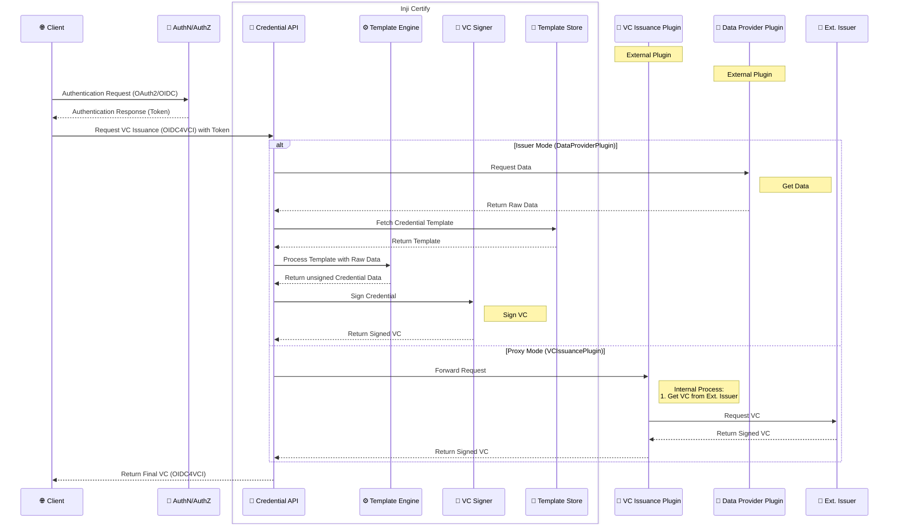

# Workflow

## Workflow

## Overview

Inji Certify is a platform designed to manage and facilitate the issuance of Verifiable Credentials (VCs). It features a modular architecture that supports both direct issuance and proxying of VCs from external sources. It interacts with external digital wallets via APIs.

The workflow for credential issuance in the described scenario can be summarized as follows:

### Digital Wallet (External)

* Description: Digital wallets are external applications used by users to store and manage their VCs. Inji Certify does not include a built-in wallet. Instead, it provides APIs for seamless integration with various wallet providers.

#### API Layer

* Description: This layer serves as the entry point for all interactions with Inji Certify, including requests from external Digital Wallets. It handles routing, authorization (using OAuth2 OpenID Connect), and request validation.

#### Core Layer (Internal Components within the Blue Box)

This section comprises the core components responsible for VC processing:

* **VC Signer**:
* Description: Digitally signs Verifiable Credentials to guarantee authenticity and integrity.
* **Template Engine**:
  * Description: Manages templates for different VC types, populating them with data before signing.
* **Keymanager Service**:
  * Description: Securely stores and manages the cryptographic keys used for signing VCs.

#### Data Sources Layer (Bottom Left)\*\*

* **Description**: This layer encompasses the databases and data stores holding the information required to generate VCs in "issuer mode".

#### Plugins (Middle Bottom)

Inji Certify operates in two primary modes via its plugin system:

* **Issuer Mode (using Data Provider Plugin)**:
* **Data Provider Plugin**: Retrieves data from various sources (databases, APIs, etc.) to populate VC templates. In this mode, Inji Certify generates and issues VCs directly.
* **Proxy Mode (using VC Issuance Plugin)**:
* **VC Issuance Plugin**: Handles the specifics of proxying VCs issued by external sources. In this mode, Inji Certify does not generate the VC itself, but acts as a conduit for VCs issued elsewhere.
* **Audit Plugin**: Logs all significant events related to VC Issuance and other events.

#### External Verifiable Credentials Issuers (Bottom Right)

**Description**: Represents external entities that issue VCs. Inji Certify can operate in "proxy mode" to distribute VCs from these external issuers.

#### Infrastructure Components (Bottom)

* **Postgres DB**: The main database.
* **Cache**: The caching system.
* **HSM** (Hardware Security Module): For secure key management.
