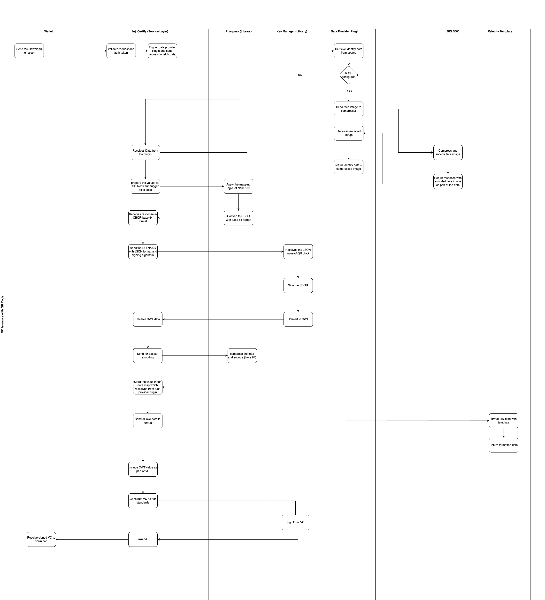

# Issuing VC with QR Code

### **Overview**

The QR Code Embedded Verifiable Credential feature enhances the usability and privacy of digital identity by enabling Inji Certify to generate Verifiable Credentials (VCs) with embedded QR codes containing selectively disclosed identity attributes.

Each QR code encapsulates identity data encoded as a CBOR Web Token (CWT), aligned with Claim 169 specifications. This allows verifiers to scan a QR code and validate only the required attributes without accessing the complete Personally Identifiable Information (PII).

This feature is aligned with the W3C Verifiable Credentials Data Model and supports interoperable, privacy-preserving verification using standardized QR encoding mechanisms.

### **Why This Feature Matters**

QR Code Embedded VC brings several advantages:

* **Privacy by Design**: Enables selective disclosure, ensuring only required attributes are shared.
* **Improved User Experience**: Simplifies verification through QR scanning without full credential sharing.
* **Offline Verification Support**: QR codes enable verification even in low-connectivity environments.
* **Standards Compliance**: Aligns with [Claim 169](https://docs.mosip.io/1.2.0/readme/standards-and-specifications/mosip-standards/169-qr-code-specification-1), CBOR, and CWT specifications.
* **Flexible Configuration**: Issuers can define multiple QR codes with different attribute sets.

### **How It Works – Step-by-Step (Certify Perspective)**

The following sequence describes how Inji Certify generates a Verifiable Credential with embedded QR codes.

#### **1. Issuer Configures QR Settings**

During VC type onboarding, the issuer configures:

* Number of QR codes
* Attributes included in each QR
* Label or purpose of each QR (e.g., Age Verification, Identity Verification)

These configurations are stored in the system and used during VC generation.

#### **2. Certify Receives Issuance Request**

The wallet initiates a VC download request.

Certify:

* Validates the request and authentication
* Identifies the VC configuration, including QR settings

#### **3. Data Retrieval and Image Processing**

Certify retrieves identity data through the data provider plugin.

If required:

* Face image is compressed and optimized
* Converted into Base64 format for embedding

#### **4. QR Data Preparation**

Based on configuration:

* Certify selects the required attributes for each QR
* Prepares structured data for QR generation

The data is passed for QR encoding.

#### **5. QR Encoding**

The QR data is processed to:

* Map attributes to Claim 169 numeric keys
* Convert data into CBOR format
* Encode the payload for secure transport

#### **6. QR Signing (CWT Generation)**

The encoded QR payload is:

* Enriched with metadata such as issuer and expiry
* Signed using the issuer’s configured algorithm
* Converted into a CWT (CBOR Web Token)

#### **7. VC Construction**

Certify constructs the Verifiable Credential by:

* Embedding QR codes (CWT values)
* Adding identity attributes and metadata
* Applying the configured template

#### **8. VC Signing and Packaging**

The complete VC is digitally signed to ensure integrity and authenticity.

Supported formats include:

* JSON-LD (W3C VC)
* mDoc (ISO standards)
* SD-JWT
* JWT VC

#### **9. Delivery to Wallet**

The signed VC is sent to the wallet.

The resident can:

* Store the VC
* Use embedded QR codes for verification

### **Feature Flow Chart**

Refer to the architecture and sequence diagrams for detailed flow of QR data preparation, encoding, signing, and embedding within the VC.

<figure><figcaption></figcaption></figure>

### **Security Considerations**

* **Selective Disclosure**: Only configured attributes are shared via QR
* **Data Integrity**: QR payload is signed as a CWT
* **Key Security**: Private keys are securely managed
* **Minimal Exposure**: Full identity data is not shared during verification
* **Image Optimization**: Biometric images are compressed to reduce payload size

### **Core Behaviors**

#### **Multiple QR Codes**

* Supports embedding multiple QR codes in a single VC
* Each QR represents a specific verification purpose

#### **Claim 169 Alignment**

* QR payload follows Claim 169 mapping
* Attributes are mapped to numeric identifiers as per IANA registry

#### **Configurable Attribute Mapping**

Issuers can define:

* Attributes per QR
* Attribute order
* QR labels

#### **Biometric Support**

* Supports embedding biometric data (e.g., face image)
* Image is compressed and Base64 encoded

#### **QR Constraints**

* QR version supported up to 23
* Face image size should be within configured limits (recommended <1KB)

### **Additional Considerations**

| Aspect           | Requirement                                            |
| ---------------- | ------------------------------------------------------ |
| Revocation       | VC may include reference to status list (out of scope) |
| Versioning       | Claim 169 version maintained in configuration          |
| Security         | All QR payloads must be signed as CWT                  |
| Interoperability | Compliant with W3C VC and MOSIP context                |
| Performance      | Designed for scalable QR generation                    |

### **Limitations**

* Revocation validation via QR is not supported
* Claim 169 currently supports only English
* Mapping of custom fields outside Claim 169 requires external handling
* Offline mapping resolution is dependent on external mechanisms
* QR payload size constraints may limit data inclusion
* VC format supported is only JSON-LD

Please refer to the relevant [GitHub technical documentation](https://github.com/inji/inji-certify/tree/master/docs) for detailed configuration, policy setup, and API‑level implementation details.
