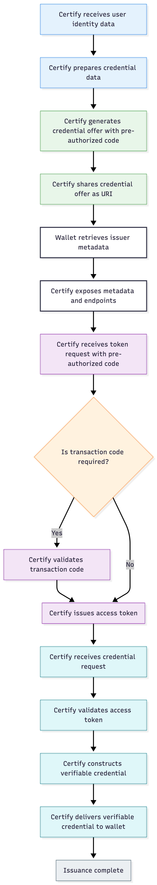

# Pre-Authorized Issuance

### Overview

The **Pre-Authorized Code Flow with Credential Offer** enhances the credential issuance experience by enabling wallets to obtain Verifiable Credentials (VCs) directly using a _pre-authorized code_ embedded in a credential offer. This flow is part of the OpenID for Verifiable Credential Issuance (OpenID4VCI) standard, designed to streamline issuance where the issuer has already authenticated the user or established user context outside of the standard interactive authentication flow.

In this flow, the Credential Issuer prepares and issues a _Credential Offer_ that contains:

* Credential metadata
* Issuer endpoints
* A _pre-authorized code_ that the wallet can exchange for an access token

The wallet then uses this pre-authorized code to securely request the VC from the issuer without requiring the user to authenticate again through a separate interactive login step.

### Why This Feature Matters

The Pre-Authorized Code Flow brings several advantages:

* **Seamless User Experience:** Eliminates the need for end-user interactive authentication (e.g., signing in) during VC issuance when prior authentication is already completed by the issuer.
* **Flexible Delivery:** Credential Offers can be delivered via QR codes, deep links, or other channels, enabling both same-device and cross-device issuance experiences.
* **Optional Transaction Code:** Issuers can require an additional user transaction code (PIN), adding an extra factor of security during issuance.
* **Interoperability:** Aligns with OpenID4VCI standards, improving compatibility with other identity systems and wallets.

### How It Works – Step-by-Step (Certify Perspective)

The following sequence describes how **Inji Certify** handles credential issuance using the Pre-Authorized Code Flow.

#### 1. Certify Prepares the Credential Offer

Inji Certify collects the required user claims and generates a **Credential Offer** containing:

* A pre-authorized code
* Credential metadata
* Issuer endpoints

The credential offer is exposed as a **URI** which can be sent to the user as notification or other modes.

#### 2. Certify Exposes Issuer Metadata

When the wallet processes the credential offer, it requests issuer metadata from Certify’s .well-known endpoint. Certify responds with discovery information, including:

* Supported credential configurations
* Token endpoint details
* Credential endpoint details
* Required parameters for token exchange

This enables the wallet to understand how to interact with Certify for issuance.

#### 3. Certify Receives Token Request

Certify receives a back-channel token request from the wallet at the Token Endpoint. The request includes:

* The pre-authorized code
* An optional transaction code (PIN), if configured

Certify validates the pre-authorized code and, where applicable, verifies the transaction code before proceeding.

#### 4. Certify Issues Access Token

Upon successful validation, Certify issues an **access token** to the wallet. This token authorizes the wallet to request the verifiable credential.

#### 5. Certify Issues the Verifiable Credential

Certify receives a credential request from the wallet at the Credential Endpoint, secured using the access token. Certify validates the token, constructs the Verifiable Credential based on the requested configuration, and returns the issued VC to the wallet.

The wallet then securely stores the credential for the holder’s use.

<figure><figcaption></figcaption></figure>

### Security Considerations

* **Replay Attacks:** Because the pre-authorized code can be replayed if disclosed publicly, issuers may enforce mitigations such as PIN requirements or time-limited codes.
* **Metadata Validation:** Wallets must validate issuer metadata before proceeding with token exchanges to prevent malicious credential offers.

### Limitations

* Client authorisation is not supported. Therefore, only a single issuance mode can be configured for an issuer. For example, if an issuer is configured to issue Verifiable Credentials using the pre-authorised flow, other modes—such as wallet-initiated issuance—will not be supported.

### Supported Issuance Modes

* Pre-Authorized Code Flow **without PIN** – direct token exchange using pre-authorized code
* Pre-Authorized Code Flow **with PIN** – token exchange requires both a pre-authorized code and a user transaction code

Please refer to this [link](https://github.com/inji/inji-certify/tree/master/docs) to know more about the technical design and configuration.
