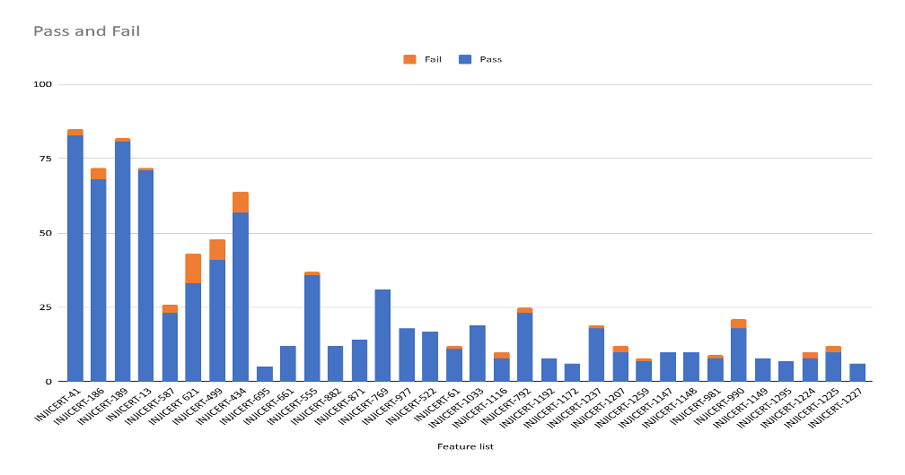

# Test Report

## Introduction

The scope of testing is to verify fitment to the specification from the perspective of Functionality, Configurability and Customizability. Verification is performed not only from the end-user perspective but also from the System Integrator (SI) point of view. Hence, the Configurability and Extensibility of the software are also assessed. This ensures the readiness of the software for use in multiple countries and diverse identity ecosystems.

### Overview and Scope

Testing scope has been focused on the following features:

* Inji certify Docker compose testing (Data provider CSV plugin, Data provider Postgres plugin)
* Insurance, MosipId and Mock (Issuance and Data provider (Postgres plugin)), which covered Land registry, school and Farmer use case
* Integration with Inji Web and Inji verify
* DB upgrade scripts testing, Backward compatibility - from Docker setup
* Preauthcode
* Presentation during issuance
* Claim 169
* Mdoc mdl format

## Test Approach

The Functional verification of the Inji Mobile Wallet application is performed on Android and iOS platforms to ensure alignment with product specifications and business requirements. Analyzed with respect to functional stability, data integrity, and UI consistency. The validation adopts a persona-based testing strategy, simulating real-world user scenarios across diverse device matrices and multi-language configurations to ensure robustness in both online and offline environments.

* Functionality
* Combination
* Configurability
* Customizability

## Test Organization

Table: Test Organization

<table><thead><tr><th width="161.375" valign="top">Name</th><th width="154.796875" valign="top">Functional Role</th><th valign="top">Responsibilities</th></tr></thead><tbody><tr><td valign="top">Likhitha R L</td><td valign="top">QA Engineer</td><td valign="top">Verifying the functionality, Automation scenarios development and report preparation</td></tr><tr><td valign="top">Chaitanya K</td><td valign="top">QA Manager</td><td valign="top">Overviewing the test execution and review of the report.</td></tr><tr><td valign="top">Ragini Krishna</td><td valign="top">Senior QA Manager</td><td valign="top">High-level governance and executive reviews of reports and execution.</td></tr></tbody></table>

### Test Planning

* Data Readiness: Validate the availability of all services along with configured identity schemas (UIN/VID) to authentication flows.

### Test Environment

Table: Test Environment

<table><thead><tr><th valign="top">Images (qa-inji1 env)</th></tr></thead><tbody><tr><td valign="top">injistackqa/inji-certify-with-plugins:0.14.x</td></tr><tr><td valign="top">injistackqa/uitest-web:release-0.16.x</td></tr><tr><td valign="top">injistack/mimoto:0.21.0</td></tr><tr><td valign="top">injistackqa/inji-verify-service:develop</td></tr><tr><td valign="top">injistackqa/inji-verify-ui:develop</td></tr><tr><td valign="top">Nginx</td></tr><tr><td valign="top">mosipid/softhsm:v2</td></tr><tr><td valign="top">mosipid/kernel-config-server:1.3.0</td></tr><tr><td valign="top">mosipqa/postgres-init:develop</td></tr><tr><td valign="top">injistackqa/apitest-inji-certify:0.14.x</td></tr></tbody></table>

<table><thead><tr><th valign="top">Images (released env)</th></tr></thead><tbody><tr><td valign="top">mosipid/credential-service:1.2.2.2</td></tr><tr><td valign="top">mosipid/data-share-service:1.2.0.1</td></tr><tr><td valign="top">mosipid/data-share-service:1.3.0-beta.2 - Injiweb</td></tr><tr><td valign="top">mosipid/digital-card-service:1.2.0.1</td></tr><tr><td valign="top">mosipid/esignet:1.6.2</td></tr><tr><td valign="top">mosipid/mock-identity-system:0.11.1</td></tr><tr><td valign="top">sunbird-rc/sunbird-rc-core:v1.0.0</td></tr><tr><td valign="top">sunbird-rc/sunbird-rc-credential-schema:v2.0.0-rc3</td></tr><tr><td valign="top">sunbird-rc/sunbird-rc-credentials-service:v2.0.0-rc3</td></tr><tr><td valign="top">sunbird-rc/sunbird-rc-identity-service:v2.0.0-rc3</td></tr></tbody></table>

## Test Execution Report

### Test case execution summary

Manual Test Execution was completed in qa-inji1 env achieving a 100% execution rate for all planned scenarios. The testing validated core functionalities with a high pass rate, while identified issues on both platforms have been logged for defect resolution.

Table: Test Execution Summary

<table><thead><tr><th valign="top">Total</th><th valign="top">Pass</th><th valign="top">Fail</th><th valign="top">Skip</th></tr></thead><tbody><tr><td valign="top">880</td><td valign="top">859</td><td valign="top">21</td><td valign="top">0</td></tr></tbody></table>

#### Feature Health

<figure><figcaption></figcaption></figure>

### Automation Results

#### Sunbird use case

<table><thead><tr><th width="275.56640625" valign="top">Total</th><th width="105.97265625" valign="top">Passed</th><th width="108.859375" valign="top">Failed</th><th width="118.26953125" valign="top">Ignored</th><th valign="top">Known issues</th></tr></thead><tbody><tr><td valign="top">622</td><td valign="top">79</td><td valign="top">0</td><td valign="top">526</td><td valign="top">17</td></tr><tr><td valign="top">Test Rate: 100%, With Pass Rate: 100% and Fail Rate: 0%</td><td valign="top"></td><td valign="top"></td><td valign="top"></td><td valign="top"></td></tr></tbody></table>

#### Mock Use case

<table><thead><tr><th width="200.79296875" valign="top">Total</th><th width="102.171875" valign="top">Passed</th><th width="101.53125" valign="top">Failed</th><th width="102.23828125" valign="top">Ignored</th><th valign="top">Known issues</th></tr></thead><tbody><tr><td valign="top">622</td><td valign="top">53</td><td valign="top">0</td><td valign="top">552</td><td valign="top">17</td></tr><tr><td valign="top">Test Rate: 100%, With Pass Rate: 100% and Fail Rate: 0%</td><td valign="top"></td><td valign="top"></td><td valign="top"></td><td valign="top"></td></tr></tbody></table>

#### Mock (Data provider) Land registry Use case

<table><thead><tr><th width="206.19921875" valign="top">Total</th><th width="105.734375" valign="top">Passed</th><th width="101.74609375" valign="top">Failed</th><th width="104.32421875" valign="top">Ignored</th><th valign="top">Known issues</th></tr></thead><tbody><tr><td valign="top">622</td><td valign="top">326</td><td valign="top">0</td><td valign="top">279</td><td valign="top">17</td></tr><tr><td valign="top">Test Rate: 100%, With Pass Rate:97.02% and Fail Rate: 2.98%</td><td valign="top"></td><td valign="top"></td><td valign="top"></td><td valign="top"></td></tr></tbody></table>

#### MosipId Use case

<table><thead><tr><th width="206.19140625" valign="top">Total</th><th width="107.42578125" valign="top">Passed</th><th width="101.515625" valign="top">Failed</th><th width="113.81640625" valign="top">Ignored</th><th valign="top">Known issues</th></tr></thead><tbody><tr><td valign="top">622</td><td valign="top">73</td><td valign="top">0</td><td valign="top">532</td><td valign="top">17</td></tr><tr><td valign="top">Test Rate: 100%, With Pass Rate: 100% and Fail Rate: 0%</td><td valign="top"></td><td valign="top"></td><td valign="top"></td><td valign="top"></td></tr></tbody></table>

#### Preauth code(academic) Use case

<table><thead><tr><th width="209.94140625" valign="top">Total</th><th width="108.5703125" valign="top">Passed</th><th width="103.796875" valign="top">Failed</th><th width="115.0859375" valign="top">Ignored</th><th valign="top">Known issues</th></tr></thead><tbody><tr><td valign="top">622</td><td valign="top">28</td><td valign="top">0</td><td valign="top">577</td><td valign="top">17</td></tr><tr><td valign="top">Test Rate: 100%, With Pass Rate: 90.32% and Fail Rate:9.68%</td><td valign="top"></td><td valign="top"></td><td valign="top"></td><td valign="top"></td></tr></tbody></table>

#### PDI (mdoc) Use case

<table><thead><tr><th width="215.1328125" valign="top">Total</th><th width="104.51171875" valign="top">Passed</th><th width="103.4296875" valign="top">Failed</th><th width="102.4765625" valign="top">Ignored</th><th valign="top">Known issues</th></tr></thead><tbody><tr><td valign="top">622</td><td valign="top">24</td><td valign="top">0</td><td valign="top">581</td><td valign="top">17</td></tr><tr><td valign="top">Test Rate: 100%, With Pass Rate: 88.99% and Fail Rate: 11.11%</td><td valign="top"></td><td valign="top"></td><td valign="top"></td><td valign="top"></td></tr></tbody></table>

#### Mdoc mdl Use case

<table><thead><tr><th width="218.46875" valign="top">Total</th><th width="99.03125" valign="top">Passed</th><th width="109.3828125" valign="top">Failed</th><th width="98.34765625" valign="top">Ignored</th><th valign="top">Known issues</th></tr></thead><tbody><tr><td valign="top">622</td><td valign="top">19</td><td valign="top">0</td><td valign="top">586</td><td valign="top">17</td></tr><tr><td valign="top">Test Rate: 100%, With Pass Rate:95% and Fail Rate: 5%</td><td valign="top"></td><td valign="top"></td><td valign="top"></td><td valign="top"></td></tr></tbody></table>

## Defect Metrics

### Defect Metrics for the Release 0.14.0

The following table depicts only the bugs which are found and not addressed in the current release.

Table: Defect Metrics for the Release

<table><thead><tr><th valign="top">Blocker</th><th valign="top">Critical</th><th valign="top">Major</th><th valign="top">Minor</th><th valign="top">Total</th></tr></thead><tbody><tr><td valign="top">0</td><td valign="top">0</td><td valign="top">6</td><td valign="top">1</td><td valign="top">7</td></tr></tbody></table>

## Conclusion

This section summarizes the key findings of test execution. It also provides a final QA recommendation on the build's readiness for release. The functional verification for Inji certify release version 0.14.0 has been successfully completed. The testing cycle achieved a 100% execution rate with a 97% pass rate across a total of 880 test cases. Additionally, API automation achieved an average of 95% across different use cases.

While there are 18 open defects (14 Major, 4 Minor) and as known issues, there are zero blocker defects that are open. Testing has demonstrated functional stability and data integrity consistent with product specifications.

### QA Approval

The build has successfully met the defined exit criteria and is recommended for release. The approval is based on the following satisfied conditions:

* Test Case Execution Completion: 100% of planned scenarios executed.
* Defect Status: No Blocker defects remain open.
* Documentation Sign-off: Reports are finalized.
* Test Environment Stability: The test environment remained stable throughout the execution cycle.

Table: Report is signed off details

<table><thead><tr><th valign="top">Name</th><th valign="top">Functional Role</th><th valign="top">Responsibilities</th></tr></thead><tbody><tr><td valign="top">Chaitanya K</td><td valign="top">QA Manager</td><td valign="top"></td></tr><tr><td valign="top">Ragini Krishna</td><td valign="top">Senior QA Manager</td><td valign="top"></td></tr></tbody></table>

## Appendix

This includes additional reference information for the report. It contains a history of document versions and a list of acronyms and their meanings.

### Appendix A: Versions

<table><thead><tr><th>Version</th><th>Date</th><th>Author</th><th valign="top">Reviewers</th></tr></thead><tbody><tr><td>V1.0</td><td>17/03/2026</td><td>Likhitha R L</td><td valign="top">
Chaitanya K

Ragini Krishna
</td></tr></tbody></table>

### Appendix B: Acronyms

<table><thead><tr><th width="187.234375" valign="top">Acronym</th><th valign="top">Literal Translation</th></tr></thead><tbody><tr><td valign="top">MOSIP</td><td valign="top">Modular Open-Source Identity Platform</td></tr><tr><td valign="top">UIN</td><td valign="top">Unique Identification Number</td></tr><tr><td valign="top">VID</td><td valign="top">Virtual Identification</td></tr><tr><td valign="top">SVG</td><td valign="top">Scalable Vector Graphics</td></tr><tr><td valign="top">SD-JWT</td><td valign="top">Selective Disclosure - JSON Web Token</td></tr><tr><td valign="top">VC</td><td valign="top">Verifiable Credentials</td></tr><tr><td valign="top">OpenID4VC</td><td valign="top">OpenID for Verifiable Credentials</td></tr></tbody></table>

### Document History

It outlines the strategy used to ensure a comprehensive evaluation.

<table><thead><tr><th width="108.19140625">Version</th><th>Author</th><th width="147.11328125">Date</th><th width="159.94921875" valign="top">Review</th><th valign="top">Affected Sections</th></tr></thead><tbody><tr><td>V1.0</td><td>Likhitha R L</td><td>17/03/2025</td><td valign="top"><ol start="1"><li>Chaitanya Kesiraju</li><li>Ragini Krishna</li></ol></td><td valign="top">New Document</td></tr></tbody></table>

Refer to the github link for more on reports [**here**](https://github.com/mosip/test-management/tree/master/inji-certify/0.14.0).
