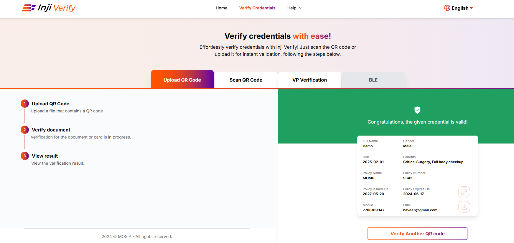
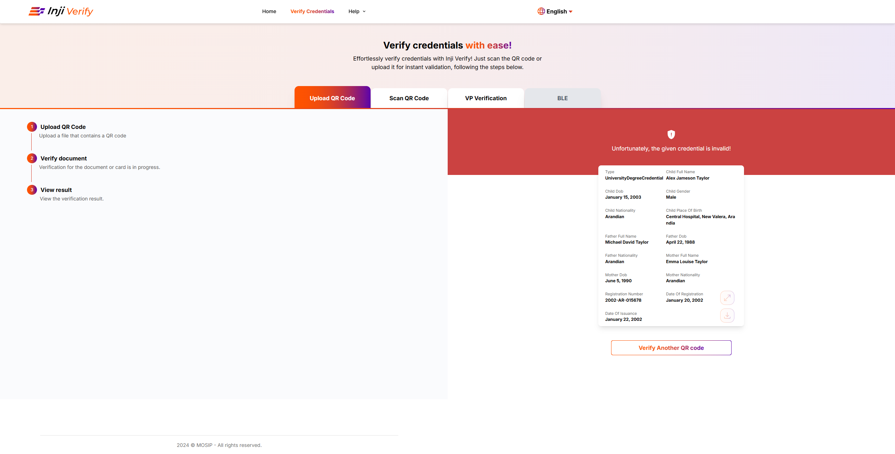
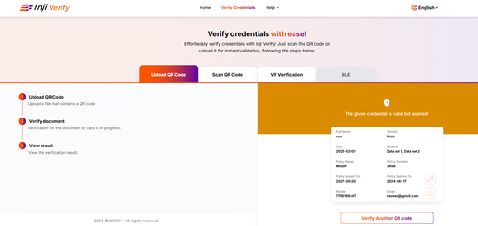
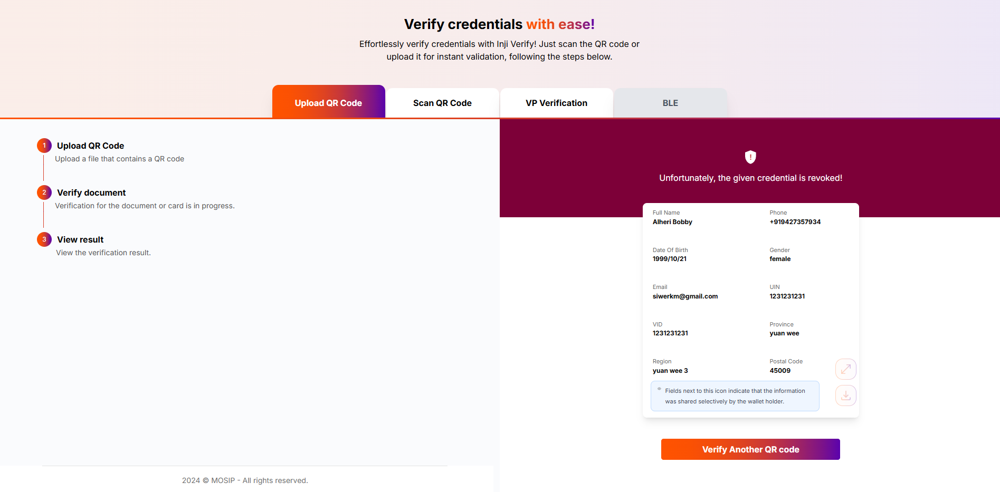
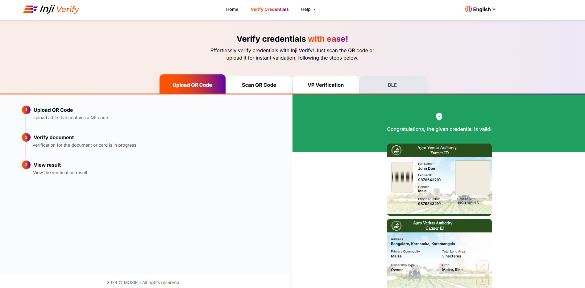
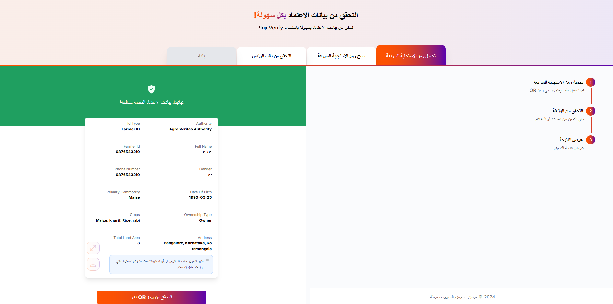

# Credential Display Capabilties

## Overview

This guide covers how Inji Verify displays verification results and renders credentials after validation. Understanding these display capabilities helps verifiers quickly interpret credential status, view issuer-branded presentations, and access multilingual claim values.

Inji Verify provides clear visual indicators for credential validity, supports SVG-based rendering to preserve issuer branding, and enables multilingual display for global accessibility.

### Valid Credentials

* These credentials are currently active and verified using the Inji Verify Portal.

<figure><figcaption></figcaption></figure>

### Invalid Credentials

* These credentials are currently active but invalid.

<figure><figcaption></figcaption></figure>

### Expired Credentials

* These credentials have passed their validity period and are no longer active.

<figure><figcaption></figcaption></figure>

### Revoked Credentials

Inji Verify can now detect “Revoked” credentials if it is invalidated by the issuer. It ensures that verifiers can always check the latest credential status and helps maintain the integrity and trustworthiness of the verification process.

<figure><figcaption></figcaption></figure>

### SVG Credential Rendering

This feature enables the rendering of Verifiable Credentials in Scalable Vector Graphics (SVG) format, preserving the original design, layout, and branding of the credential. As a result, the displayed credential closely matches the issuer’s intended visual presentation, ensuring both authenticity and aesthetic consistency.

<figure><figcaption></figcaption></figure>

### Multilingual Credentials

VCs can now display claims in multiple languages. It allows issuers to include localized claim values, enabling verifiers and holders to view credentials in their preferred language, thereby improving accessibility and inclusivity across different regions and user groups.

<figure><figcaption></figcaption></figure>
