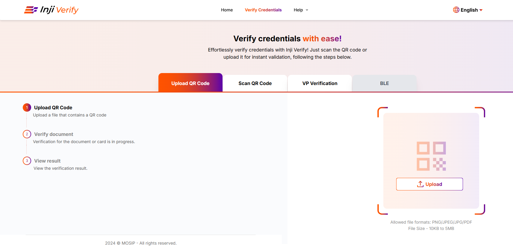
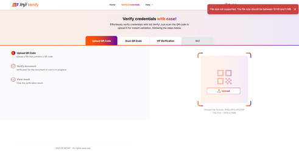
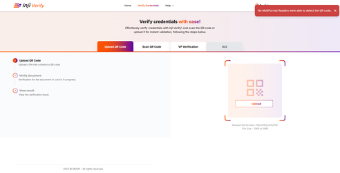
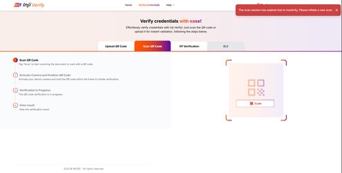
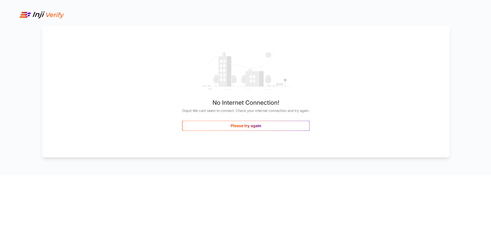
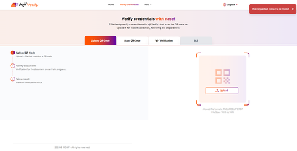

# Error Handling

## **Error Handling**

**Scenario 1:** If Pixel Pass encounters difficulties in decoding the data or encounters an unsupported QR code format, Inji Verify returns to the home screen.

* An error message stating "**QR code format not supported"** is displayed to the user.

<figure><figcaption></figcaption></figure>

**Scenario 2:** If the QR code size or file size exceeds the permissible limit where the maximum size is 5MB, Inji Verify returns to the home screen.

* An error message stating "**File size not supported. The file should be between 10Kb and 5 MB.**"

<figure><figcaption></figcaption></figure>

**Scenario 3:** If the QR code is unreadable or blurry then Inji Verify returns to the home screen.

* An error message stating **"No multi-format readers were able to read the QR code."**

<figure><figcaption></figcaption></figure>

**Scenario 4:** If the user fails to scan the QR code within the 60-second timeframe then Inji Verify returns to the home screen.

* An error message stating "**The scan session has expired due to inactivity. Please initiate a new scan**."

<figure><figcaption></figcaption></figure>

**Scenario 5:** When a PDF containing VC is uploaded and the QR Code is not valid, then the following error message is displayed- 'Something went wrong with your request. Please check and try again.'

**Scenario 6:** If there is no internet connectivity, the following error message is displayed while using Inji Verify - 'No Internet Connection! Oops! We can't seem to connect. Check your internet connection and try again'

<figure><figcaption></figcaption></figure>

**Scenario 7:** When the request in the application url is invalid, the error message displayed- 'The requested resource is invalid'.

<figure><figcaption></figcaption></figure>

**Scenario 8:** When the server is down, then the error message displayed is - 'The service is currently unavailable. Please try again later'.
