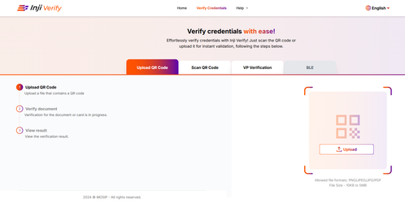
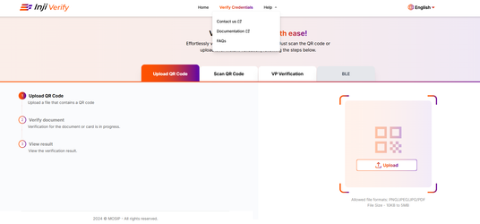
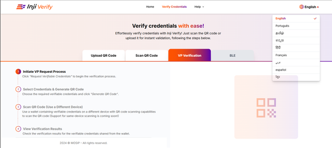

# Interface Overview

## Introduction

This guide provides an overview of the Inji Verify user interface based on the reference implementation. It covers the key sections and features available to end users for credential verification workflows.

For hands-on exploration and testing, you can refer to the Inji Verify collab environment.

## **Header Section**

### **Home**

### **Verify Credentials**

* The Verify Credentials Page will showcase two main features of Inji Verify that is "Upload QR Code" and "Scan the QR Code".

<figure><figcaption></figcaption></figure>

### **Help**

The Help section includes three sub-sections or sub-menus:

* **Contact Us**: This directs you to our MOSIP Community where you can write to us with any queries related to Inji Verify or general inquiries.
* **Documentation**: This directs you to the Inji Verify documentation page for detailed information about Inji Verify.
* **FAQ**: This section is still under development.

<figure><figcaption></figcaption></figure>

### **Language Selection**

Language dropdown is provided for verifier to select a language of his interest for better usability . The languages currently supported are: Portuguese, Spanish, French, English, Arabic, Tamil, Khmer, Hindi and Kannada.

<figure><figcaption></figcaption></figure>
