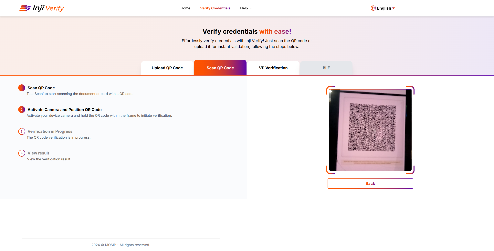
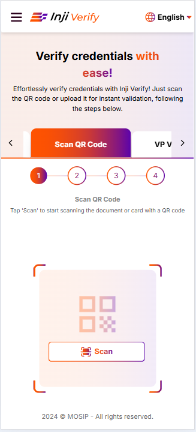
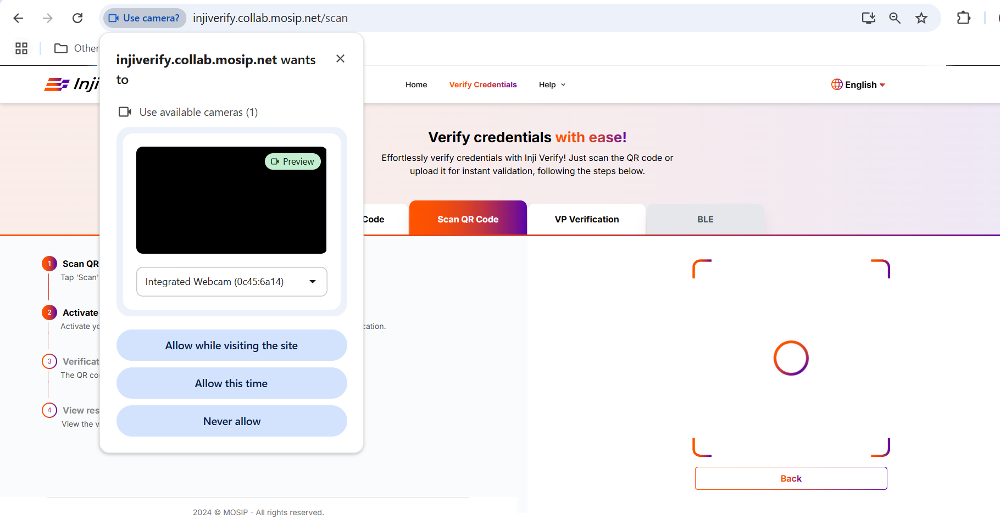
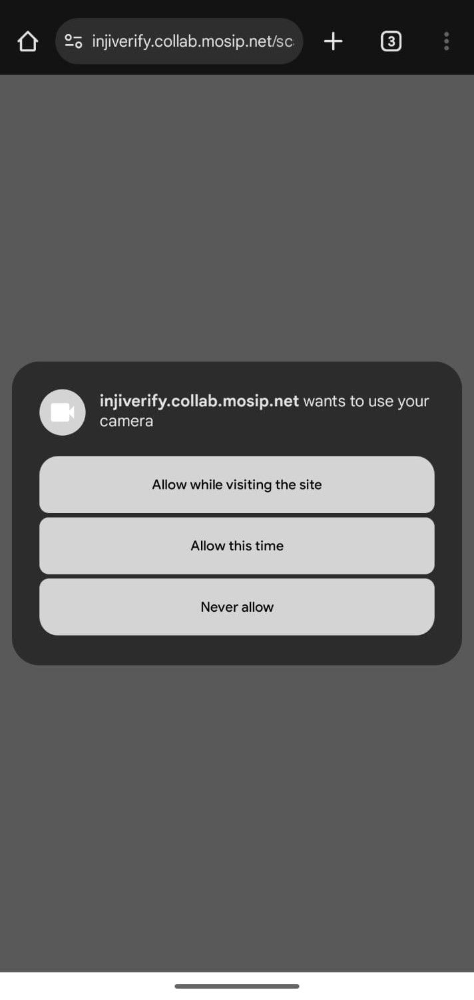
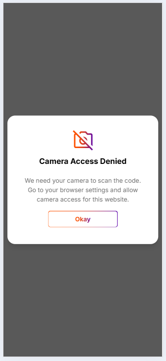
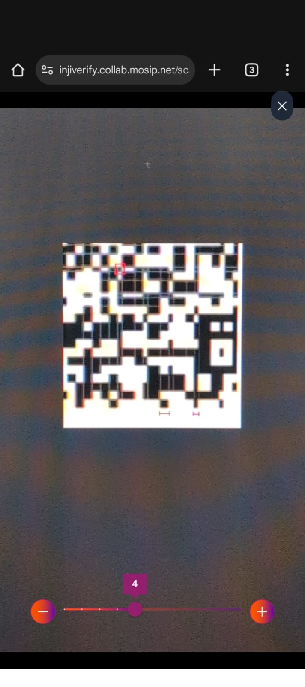
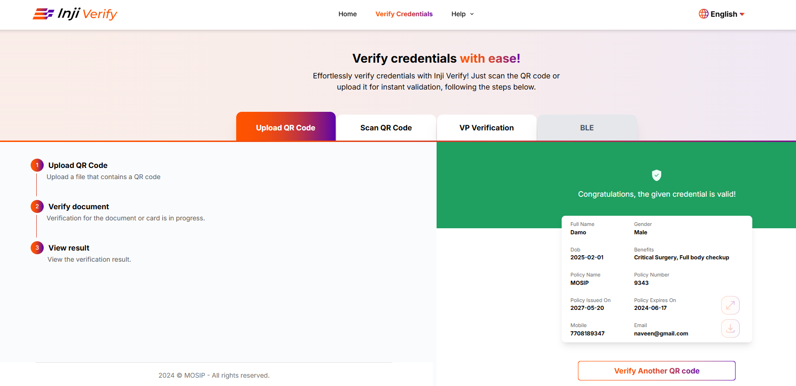
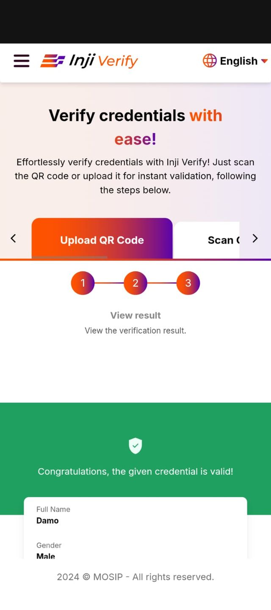

# Verify by scanning the QR Code

## Overview

This guide walks you through verifying credentials by scanning QR codes directly using your device's camera. The scan feature provides real-time verification—simply point your camera at a QR code, and Inji Verify decodes the credential data using the PixelPass library and validates it using the Verification SDK. The scanning workflow supports zoom controls for optimal capture accuracy and displays verification results with full credential details upon successful validation.

## Verify by scanning the QR Code

**Initiate Scan Request:**

1. Go to the Inji Verify portal and select the tab **Scan the QR Code** tab where the Scan QR code section will come up.
2. Click on the Scan button to initiate the scanning process.

<figure><figcaption>
Desktop View
</figcaption></figure>

<figure><figcaption>
Mobile View
</figcaption></figure>

3. Click the Allow button to give the portal access to your device's camera, you are prompted to grant the necessary camera permissions for the Inji Verify portal when you initiate the scan.

<figure><figcaption>
Desktop View
</figcaption></figure>

<figure><figcaption>
Mobile View
</figcaption></figure>

4. If camera access is denied the screen displays a message indicating the camera permission is denied.

<figure><figcaption>
Camera Permission Denied
</figcaption></figure>

5. **Scan the QR Code**

* Scan QR Code
  * Position the device's camera in front of the QR code you wish to scan.
  * Zoom slider is used to adjust the magnification level of capturing QR code while scanning.
  * Capture the QR code by aligning it within the frame displayed on your device's screen.
  * Once the QR code is captured, the data is sent to the Inji Verify portal for processing.
* **How is QR Code decoded?:**
  * The QR data is passed to the Pixel Pass library for decoding.
  * Pixel Pass returns the decoded data to Inji Verify for further processing.
  * Inji Verify then verifies the decoded data using the Verification SDK.

<figure><figcaption>
Zoom Slider
</figcaption></figure>

6. **Display Credential Details:** - On successful verification, Inji Verify retrieves the display properties of the credential from the issuer's configuration. The credential details are displayed on the portal's interface using the fetched display properties.

<figure><figcaption>
Desktop View
</figcaption></figure>

<figure><figcaption>
Mobile View
</figcaption></figure>
