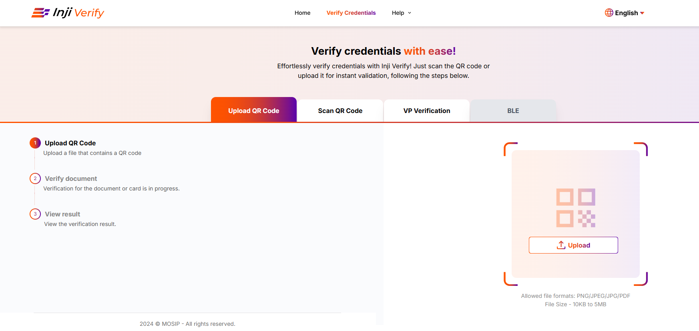
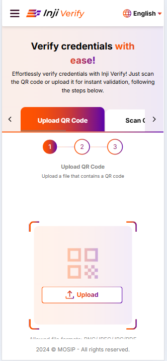
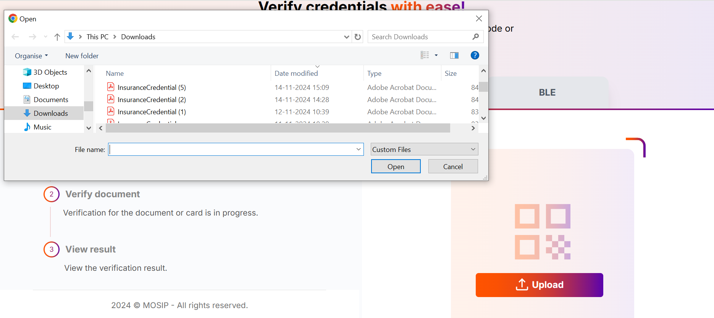
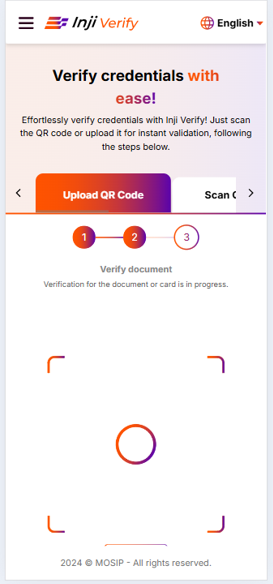

# Verify by uploading the QR Code

## Overview

This guide explains how to verify credentials by uploading documents containing QR codes when camera scanning isn't available or practical. The upload feature supports PDF, JPEG, JPG, and PNG files, and can process higher-density QR codes (up to version 32) that may exceed camera scanning capability.

Once uploaded, Inji Verify extracts the QR data using the PixelPass library and validates the credential using the Verification SDK, displaying the full credential details upon successful verification.

## Verify by uploading the QR Code

**Upload QR Code:**

1. Go to the Inji Verify portal and select the tab **Upload QR Code** where the Upload QR code section will come up and click on the **Upload** button to initiate the process.

<figure><figcaption>
Desktop View
</figcaption></figure>

<figure><figcaption>
Mobile View
</figcaption></figure>

2. Click on the **"Upload"** button on the **Upload QR Code** Page as you select the option to upload a file containing the QR code or credential document you wish to verify from your device's (Desktop or Mobile browser) file explorer. Click on the file to proceed.
3. **How is QR Code decoded and verified once you have uploaded it?:** Inji Verify passes the QR data from the uploaded file to the Pixel Pass library for processing.
   * The QR data is passed to the Pixel Pass SDK for decoding.
   * Pixel Pass returns the decoded data to Inji Verify for further processing.
   * Inji Verify then verifies the decoded data using the Verification SDK.

<figure><figcaption>
Desktop View
</figcaption></figure>

<figure><figcaption>
Mobile View
</figcaption></figure>

4. **Display Credential Details:** - Upon successful verification, Inji Verify retrieves the display properties of the credential and presents the details on the portal's interface.

<figure><figcaption>
Desktop View
</figcaption></figure>

<figure><figcaption>
Mobile View
</figcaption></figure>
