# VP Verification - Cross Device Flow

## Overview

This guide covers the cross-device Verifiable Presentation (VP) verification flow, where the verifier and credential holder use separate devices. The verifier generates a QR code containing an authorization request, which the holder scans using their mobile wallet (such as Inji Wallet) on a different device.

This flow follows the OpenID4VP specification and enables secure credential sharing without requiring the verifier and holder to be on the same device. The wallet authenticates the user, collects consent, and sends the VP response back to Inji Verify for validation and result display.

## VP Verification (Cross Device Flow)

1. **Initiate VP Request Process**

* Initiate VP Request Process by clicking on '**Request Verifiable Credentials'** to begin the verification process.

<figure>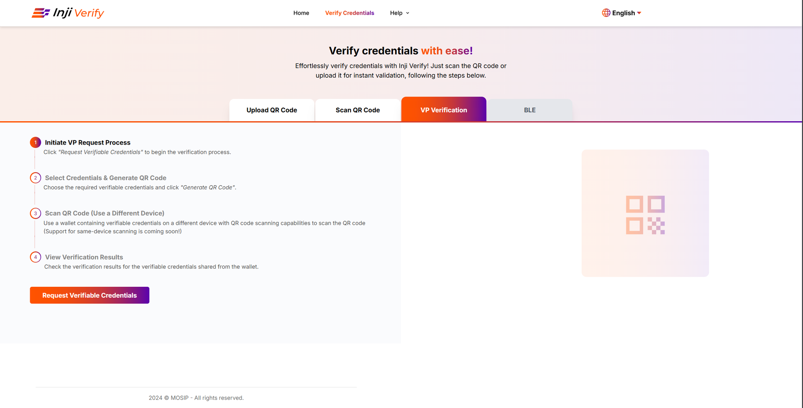<figcaption></figcaption></figure>

2. **Select Credentials & Generate QR Code**: The verifier is presented with a list of verifiable credential types with specific credentials already pre-selected(configurable) based on a specific usecase.

* Pre-selected credential types are listed on the top and rest of the credentials (non-selected ones) are displayed in alphabetical order.
* The list of VCs can also sorted in ascending or descending order using Sort option.
* Each credential type is displayed with a checkbox next to it.
* The verifier reviews the list and selects the desired credentials by clicking the checkboxes provided in the list.
* Verifier can also search for a credential by entering the credential type (1 or more letters to be entered in the search box and filtered results appear in the dropdown).

<figure>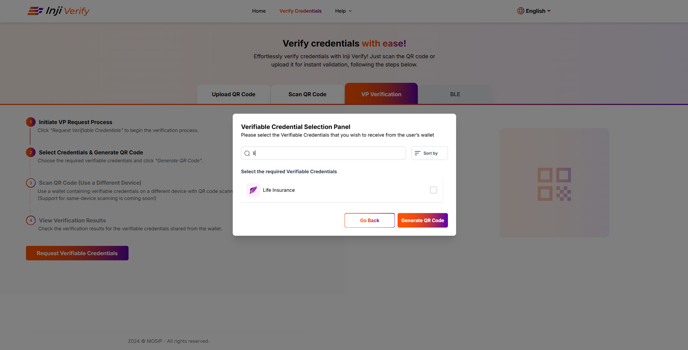<figcaption></figcaption></figure>

* Choose the required verifiable credentials from the popup window and click '**Generate QR Code'**.

<figure>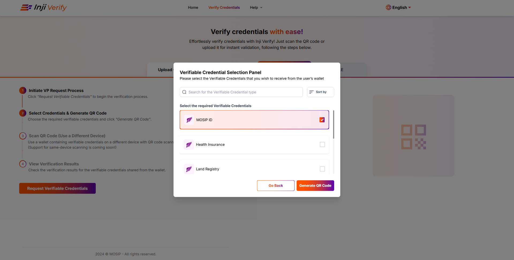<figcaption></figcaption></figure>

3. **Scan QR Code from Mobile wallet (Use a Different Device)**: Use a wallet containing verifiable credentials on a different device with QR code scanning capabilities to scan the QR code.

<figure>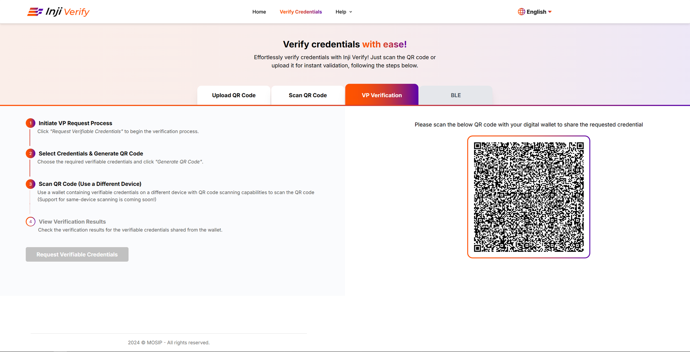<figcaption></figcaption></figure>

Note: The steps that Inji wallet performs to support this interaction are:

* The Wallet interprets the VP request and lists all the matching credentials available in the Wallet.
* The Wallet prompts the user to authenticate and then seeks consent to share the requested credential(s).
* The Wallet sends the VP response via HTTPS POST to the Inji Verify portal.

4. **View Verification Results in Inji Verify**: Inji Verify displays the verification results of the verifiable credentials shared from the wallet which could be either 'Valid', 'Valid\
   but Expired', 'Invalid'.

* **Single VC display**
  * **Valid VC**

<figure>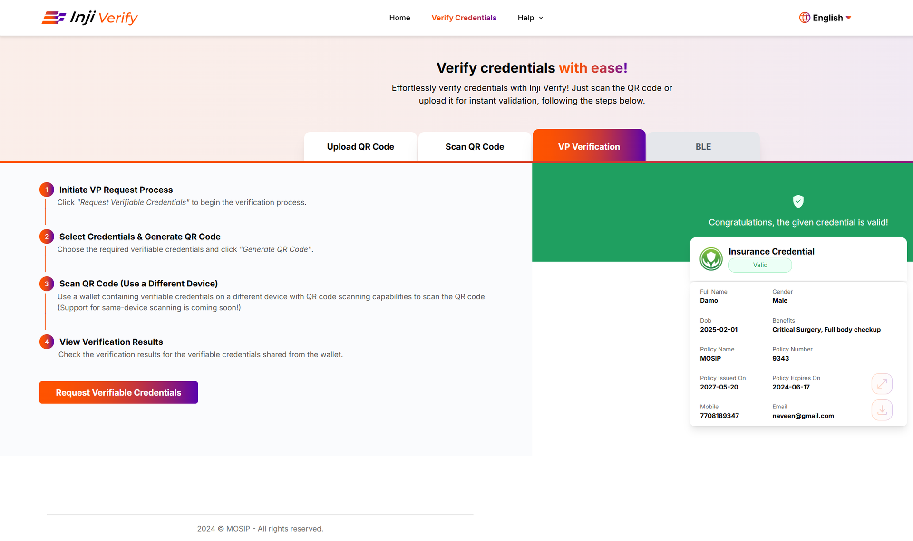<figcaption></figcaption></figure>

* Click on full screen option to view the Verifiable Credentials data as an enlarged view.

<figure>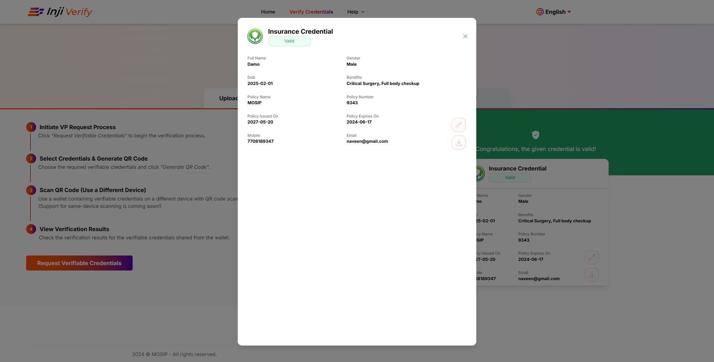<figcaption></figcaption></figure>

* Click on download option to download the VC data as a json file.

<figure>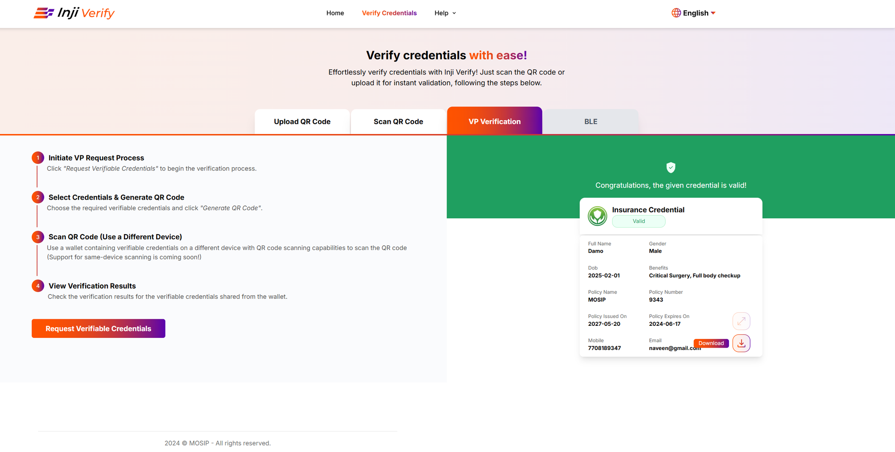<figcaption></figcaption></figure>

* **Expired VC**

<figure>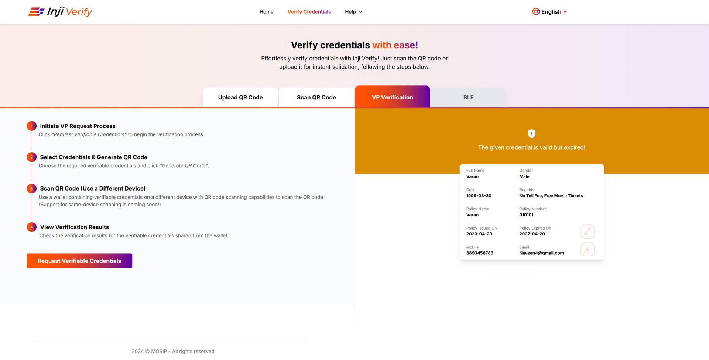<figcaption></figcaption></figure>

* **Invalid VC**

<figure>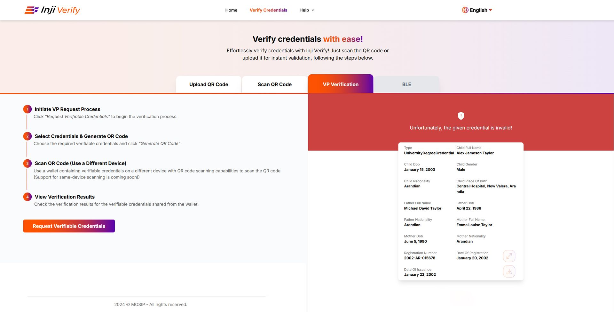<figcaption></figcaption></figure>

* **Multiple VCs display**

<figure>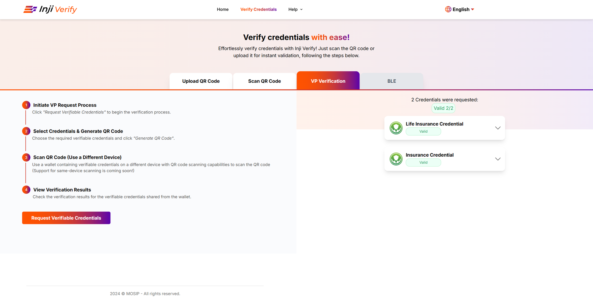<figcaption></figcaption></figure>

#### **Partial sharing of requested credentials**

If not all the requested VCs are shared from wallet, then the status of missing VC result area is displayed as 'Not Shared'

<figure>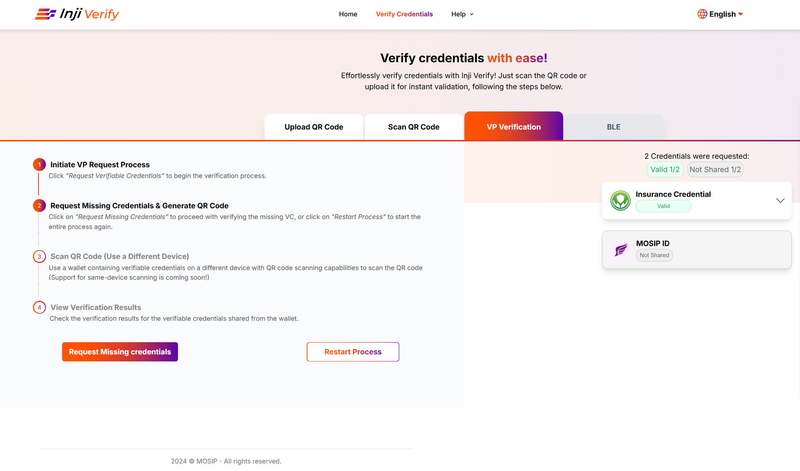<figcaption></figcaption></figure>

As the verifier is informed of the missing credentials in VC result section, the verifier has to **either Generate Request for Missing Credentials or Generate a New Request for restarting the VP sharing flow.** The verifier can request for missing credentials by continuing the flow by clicking on 'Request Missing Credentials' to generate another QR code that requests the missing credentials.

Another button - 'Restart Process' helps user to re-initiate the VP Request process\
all over again (by displaying the popup window to select the credentials and rest of the process continues to be the same), if required.

**Re-Generate VP Request for missing VPs**

1. **Request Missing Credentials**: Upon clicking "Request Missing Credentials" button, the Verifier portal automatically identifies the credentials that were not received in the previous transaction. A new Verifiable Presentation (VP) request is generated, containing only the missing credentials.

<figure>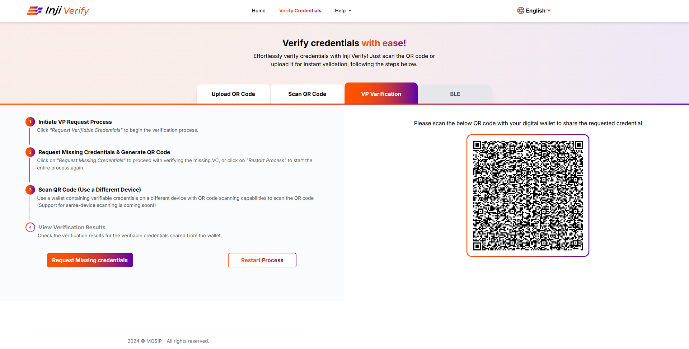<figcaption></figcaption></figure>

2. **QR Code/Link Display:**

* The new VP request is encoded into a QR code.
* The QR code is displayed on the Verifier portal and is ready for the Holder to scan or access.

<figure>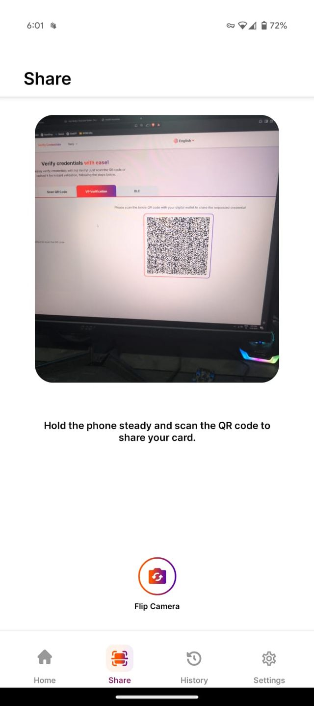<figcaption></figcaption></figure>

3. **Holder Interaction:**

* The Holder (Inji Wallet) scans the new QR code or accesses the link.
* The Wallet fetches the new VP request and lists the pending credentials (if they are available in the Wallet) along with the list of previously verified credentials from our original request.

<figure>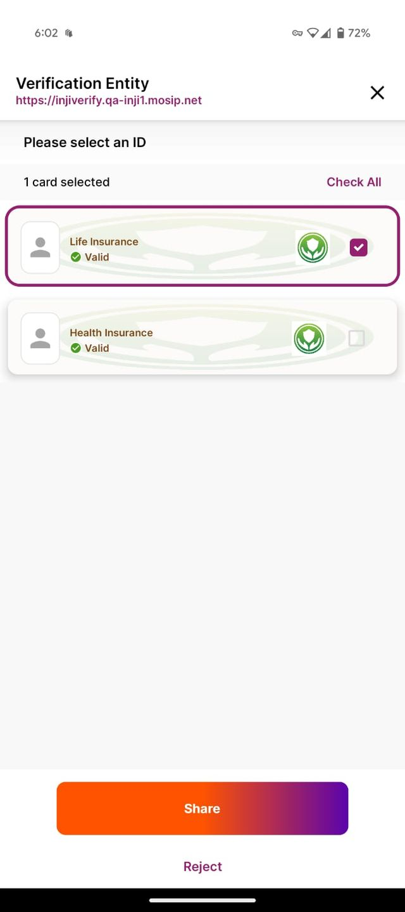<figcaption></figcaption></figure>

4. **Credential Sharing and Verification:**

* The process of selecting credentials, providing user consent, and sending the VP response follows the standard flow.
* The Verifier receives the pending credentials and completes the verification process.

<figure><figcaption></figcaption></figure>

5. **Final Verification Completion:**

* Once all credentials are received and verified, the Verifier portal displays a final confirmation message indicating that all requested credentials have been successfully verified.
* The process is marked as complete.

<figure>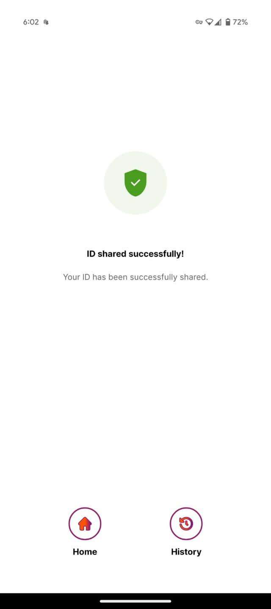<figcaption></figcaption></figure>

**Note:**

1. For any VCs displayed after verification, the verifier is provided with an option to download the VCs in json format.
2. For any VCs displayed after verification, the verifier is provided\
   with an option to expand the VCs to full view.
