# VP Verification - Same Device Flow

## Overview

This guide covers the same-device Verifiable Presentation (VP) verification flow, where both the verifier portal and credential wallet operate on the same mobile device. Instead of scanning a QR code, Inji Verify invokes the wallet directly via deep link, enabling seamless app-to-app credential sharing without requiring a second device.

This flow follows the OpenID4VP specification with `response_mode=direct_post`. The wallet receives the authorization request containing credential requirements, authenticates the user, collects consent, and returns the VP response back to Inji Verify for validation and result display.

### Step 1: Initiate VP Request Process

Navigate to the **VP Verification** tab in Inji Verify on your mobile device.\
Click **Request Verifiable Credentials** to begin.

<figure>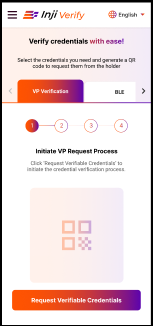<figcaption></figcaption></figure>

### Step 2: Select Credential Types

A popup titled **Verifiable Credential Selection Panel** appears.\
You can search, sort, and select the required credential types.\
Some credentials may be pre-selected based on configuration.

<figure>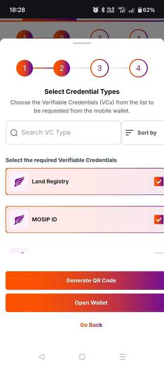<figcaption></figcaption></figure>

### Step 3: Open Wallet on Same Device

After selecting credentials, a **Wallet Selection Panel** appears listing available wallets on your mobile device.\
Select your preferred wallet. If only one wallet is available, you will be redirected automatically.

<figure>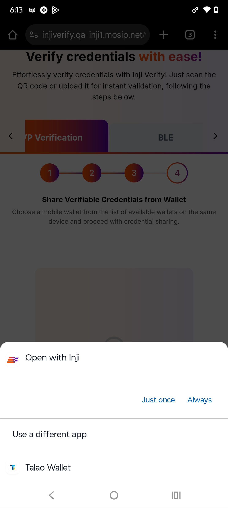<figcaption></figcaption></figure>

<figure>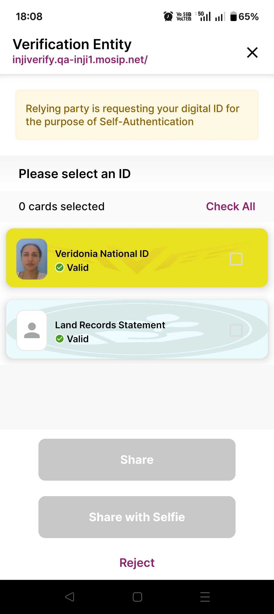<figcaption></figcaption></figure>

### Step 4: Deep Link to Wallet

The system invokes your wallet via deep link (e.g., `injiwallet://vp-request?...`).\
The wallet receives the authorization request with credential requirements.

### Step 5: Wallet Authentication & Consent

The wallet checks which credentials match the request.\
You are prompted to authenticate and provide consent to share the selected credentials.

<figure>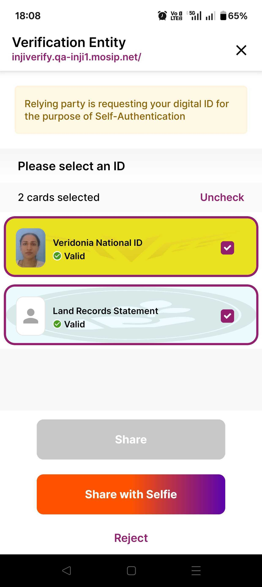<figcaption></figcaption></figure>

<figure>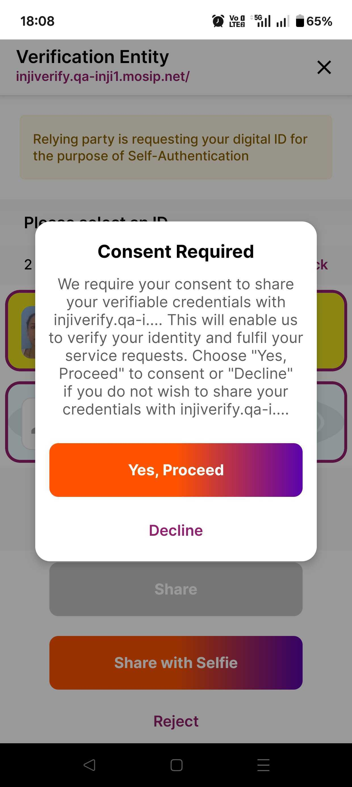<figcaption></figcaption></figure>

### Step 6: Wallet Sends VP Response

The wallet prepares the Verifiable Presentation (VP) and returns the `vp_token` in an authorization response via redirect.

<figure>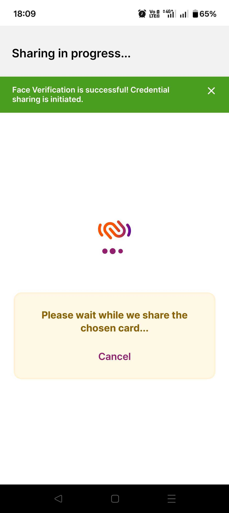<figcaption></figcaption></figure>

### Step 7: View Results in Inji Verify

Inji Verify parses the `vp_token`, validates claims, and displays the results.\
Credential status may be **Valid**, **Expired**, or **Invalid**.\
For multiple VCs, results are shown as expandable cards with tabular view for multi-attribute values.\
Options are provided to **Download JSON** or **Expand View**.

<figure>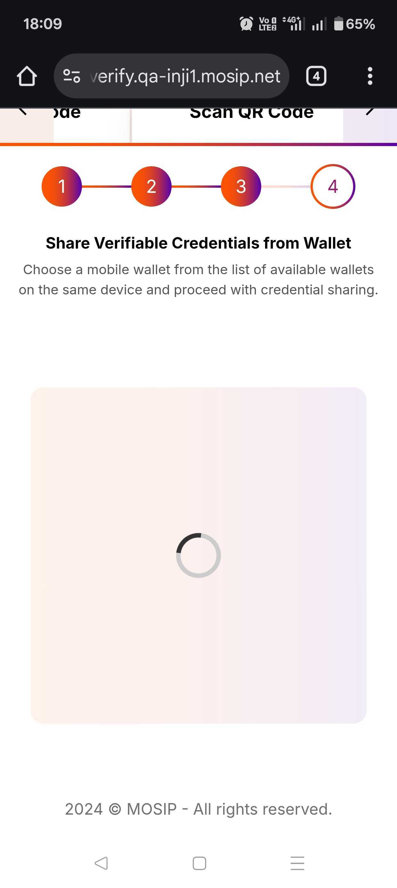<figcaption></figcaption></figure>

<figure>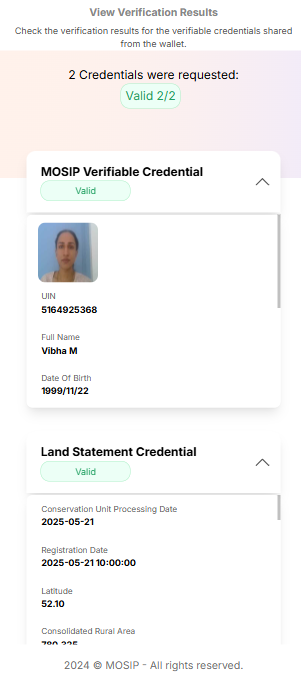<figcaption></figcaption></figure>

#### Credential Status Examples

* **Invalid VC display:**\
  \&#xNAN;_Shows the credential marked as invalid._

<figure>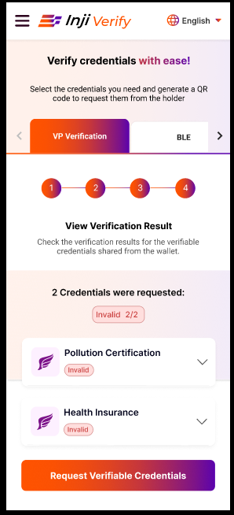<figcaption></figcaption></figure>

* **Expired VC:**\
  \&#xNAN;_Shows the credential marked as expired._

<figure>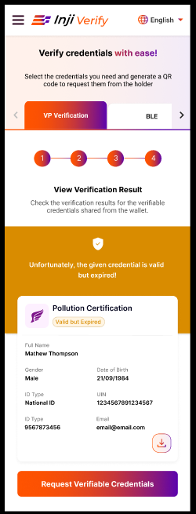<figcaption></figcaption></figure>

### Same Device Flow Scenarios

* **Scenario 1:** All credentials shared → List of credentials with status.

<figure>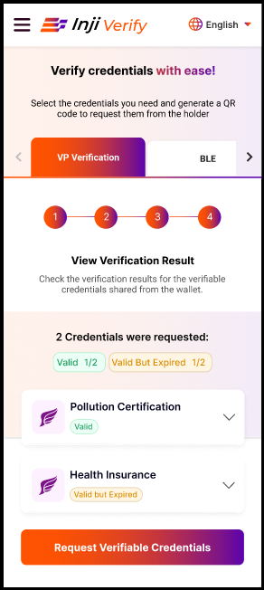<figcaption></figcaption></figure>

* **Scenario 2:** Partial sharing → Display missing credentials with options to **Request Missing Credentials** or **Restart Process**.

<figure>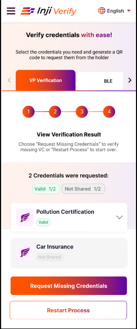<figcaption></figcaption></figure>
