# VP Verification with Inji Verify via Inji Web Wallet

This feature enables OpenID for Verifiable Presentations (OpenID4VP) integration between Inji Verify and the Inji Web Wallet, facilitating seamless, secure, and standardized credential exchange. It establishes a well-defined, interoperable flow where the verifier (Inji Verify) can request specific credentials and the holder (via the Inji Web Wallet) can present them in a compliant and privacy-preserving manner. In this flow, Inji Verify generates an OpenID4VP request specifying the required credentials and constraints. The Inji Web Wallet receives this request, authenticates the user, and allows them to review and consent to share the requested information. Upon approval, the wallet constructs a Verifiable Presentation (VP) and securely transmits it back to the verifier for validation.

This feature enhances user experience through a smooth and consent-driven interaction model, ensures adherence to global OpenID standards, and strengthens interoperability across identity ecosystems while maintaining strong privacy and security guarantees.

1\. Go to Inji Verify Home page, choose VP Verification option to proceed.

2\. Click on Request Verifiable Credentials.

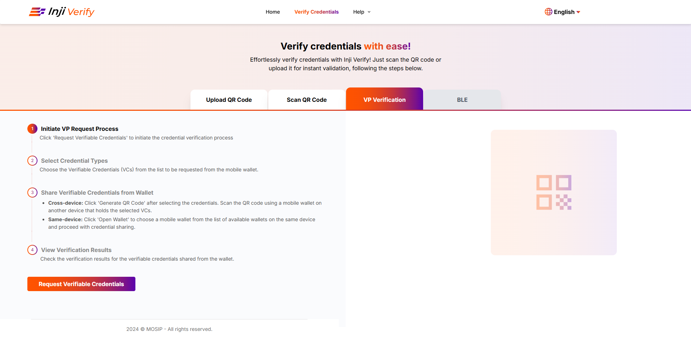

3\. From the list of VCs, choose the VC/VCs that you want to request from the holder and click on 'Open Web Wallets' button.

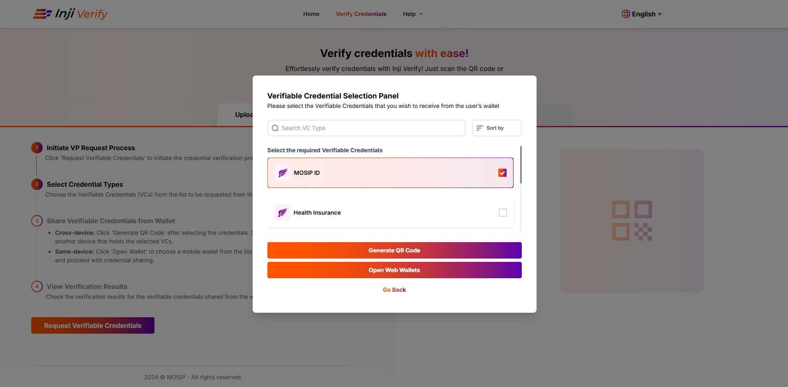

4\. Choose the wallet that you want to open and click on Proceed.

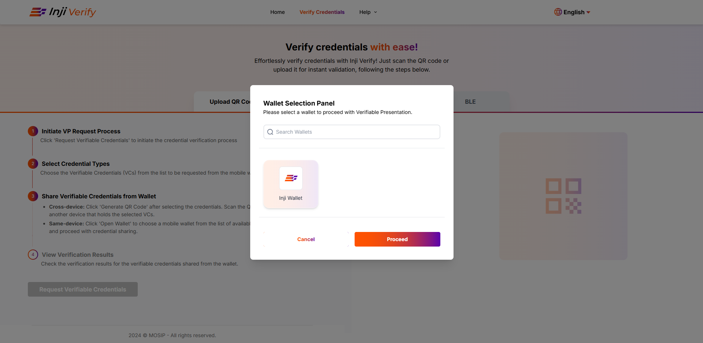

5\. The user will be redirected to Inji Web Wallet Login page. You can then login using their valid credentials.

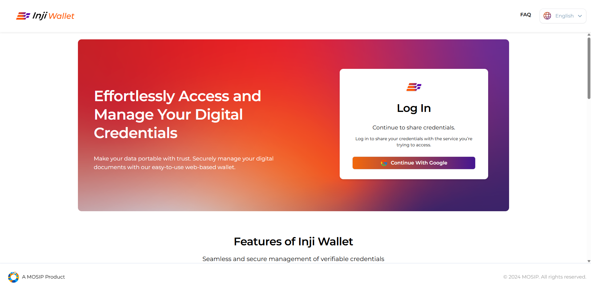

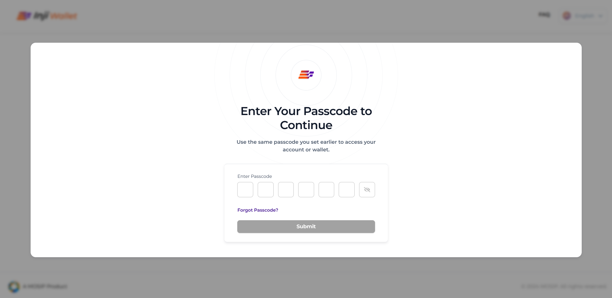 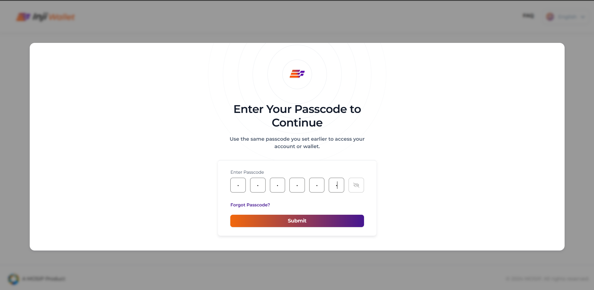

6\. Upon successfully login, the user will have to select the VCs that they would want to share and then click on 'I consent & share'.

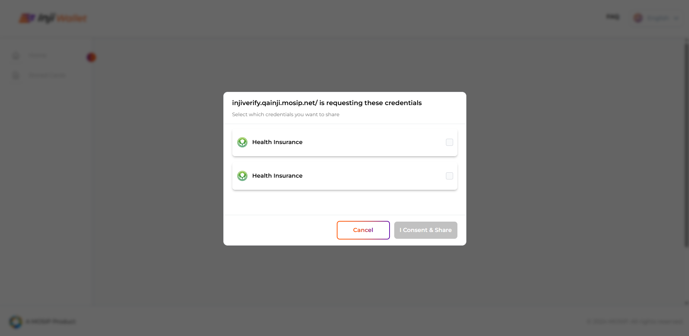

7\. After that, the user will be automatically redirected to Inji Verify.&#x20;

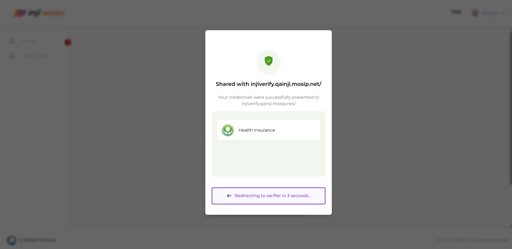

8\. Once the user lands on Inji Verify, verification result of the shared VC will be displayed. 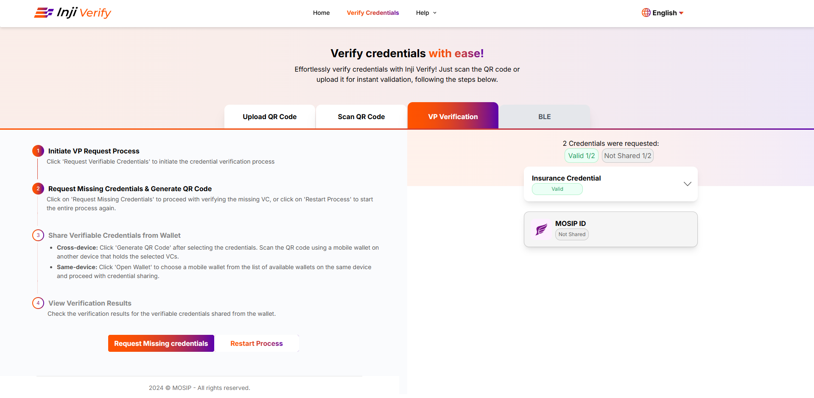  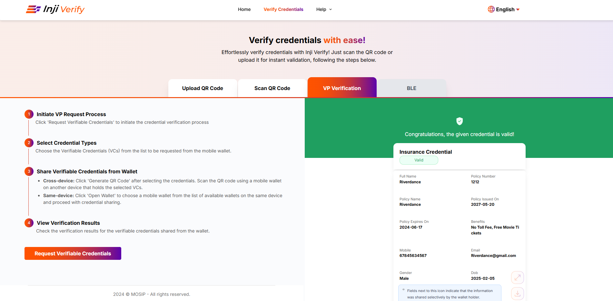

**Alternate Flow**: In case the requested VCs are not already available in Web Wallet, the user will be prompted to download the corresponding credentials and will be requested to reinitiate the sharing process.

&#x20;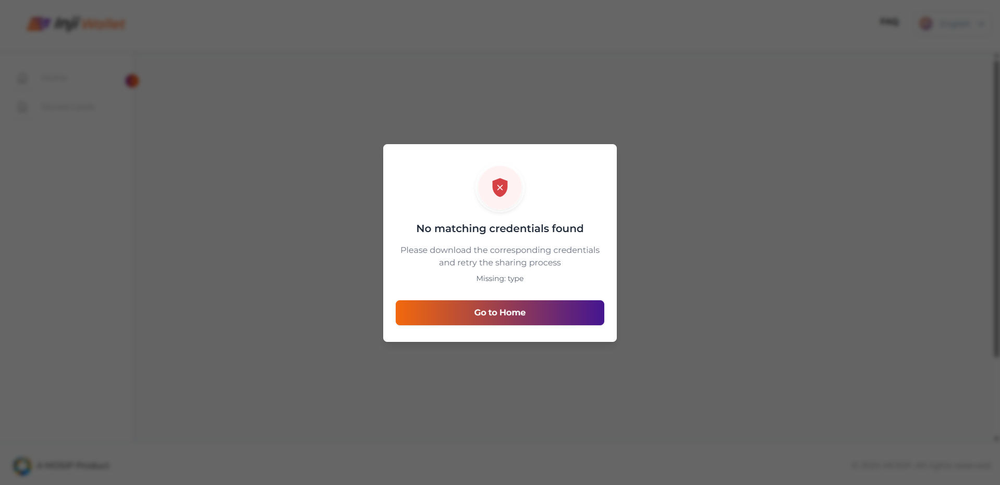
