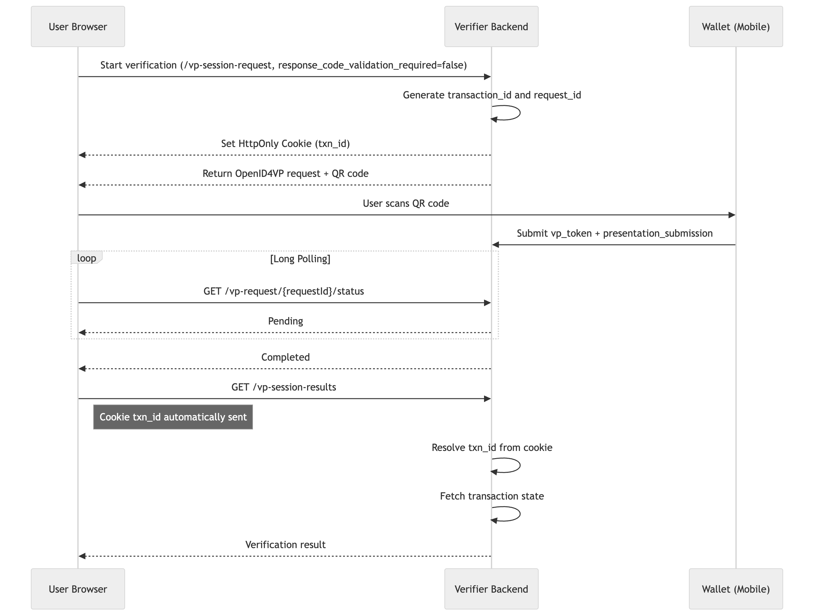
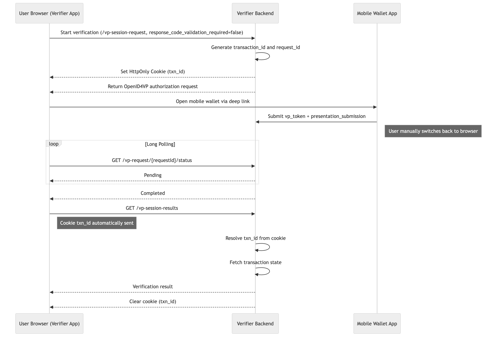
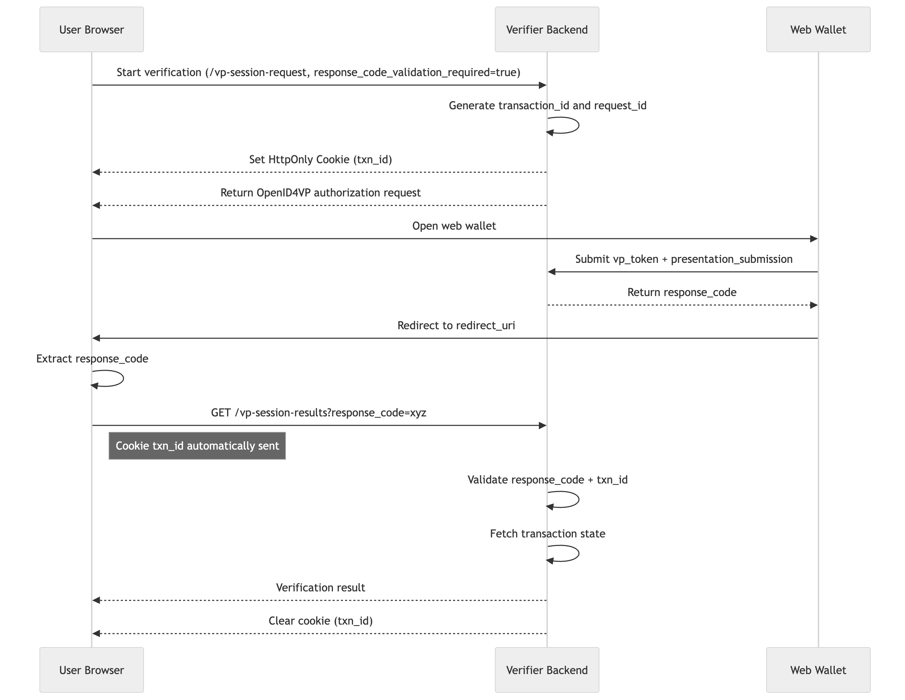

# Inji Verify SDK

Inji Verify SDK is a library which exposes React components for integrating Inji Verify features seamlessly into any relaying party application.

### Features

* **OpenID4VPVerification** component that creates a QR code and performs the OpenID4VP sharing backend flow. It supports both **Cross-Device** and **Same-Device** flows. OpenID4VP flow can be performed by following the steps provided in [End User Guide](https://mosip.atlassian.net/wiki/spaces/PROD/pages/1297285260)
* **QRCodeVerification** component that allows scanning and uploading images to verify the verifiable credentials. Scan/ Upload flow can be performed by following the steps provided in [End User Guide](https://mosip.atlassian.net/wiki/spaces/PROD/pages/1297285260)

### Local Publishing Guide

Install the dependencies\
`npm install`

Build the project\
`npm run build`

Publish the npm package using Verdaccio\
We use [verdaccio](https://verdaccio.org/docs/what-is-verdaccio). npm link or yarn link won't work as we have peer dependencies. Follow the docs to setup Verdaccio. Then run\
`npm publish --registry <http://localhost:<VERADACCIO_PORT>>`

**Prerequisites**

* Ract Project Setup
* Proper permissions for camera access (mobile/web) (QRCodeVerification)


**NOTE**\
The component does not support other frontend frameworks like Angular, Vue, or React Native.\
The component is written in React + TypeScript


**Backend Requirements**

To use the component, you must host a verification backend that implements the OpenID4VP protocol. This backend is referred to as the inji-verify-service. It also needs to adehere to the OpenAPI spec defined here in case if the backend service is not inji-verify-service.


⚠️ Important: The component expects these endpoints to be accessible via a base URL (verifyServiceUrl).\
Example:\
If you deploy the inji-verify/verify-service at:\
”[https://your-backend.com/v1/verify](https://your-backend.com/v1/verify)”\
Then use this as the verifyServiceUrl in the component:\
verifyServiceUrl="[https://your-backend.com/v1/verify](https://your-backend.com/v1/verify)"



**Note**

* The SDK uses a session-based verification flow internally.
* Session handling, redirects, and result fetching are managed by the SDK.
* No manual handling of transactionId or browser storage is required.


### Integration Guide

#### Step 1: Install the Package

```
npm i @injistack/react-inji-verify-sdk
```

#### Step 2: Import & Usage

```
import {
  OpenID4VPVerification,
  QRCodeVerification,
} from "@injistack/react-inji-verify-sdk";
```

#### Step 3: Choose Verification Method

**Option A: QR Code Verification (Scan & Upload)**

```
function MyApp() {
  return (
    <QRCodeVerification
        triggerElement={triggerElement} //UI element used to start verification.
        verifyServiceUrl="https://your-backend.com/v1/verify"
        isEnableScan={false}
        onVCProcessed={(result) => {
            console.log("Verification complete:", result);
            // Handle the verification result here
        }}
        onError={(error) => {
            console.log("Something went wrong:", error);
        }}
        clientId="did:example:123456789" // DID example
    />
  );
}
```

**Option B: OpenID4VP Verification**

```
function MyApp() {
  return (
    <OpenID4VPVerification
        triggerElement={<button>Show QR for Wallet Scan</button>}
        verifyServiceUrl="https://your-backend.com/v1/verify"
        clientId="did:example:123456789" // DID example
        presentationDefinitionId="your-definition-id"
        isSameDeviceFlowEnabled={false} // QR code flow
        onVPProcessed={(result) => {
            console.log("VP processed:", result);
        }}
        onQrCodeExpired={() => {
            console.log(" QR code expired - ask user to retry");
        }}
        onError={(error) => {
            console.error("Verification error:", error);
        }}
    />
  );
}
```

### Verification Response

Once verification is complete, the response depends on the summariseResults attribute (default = true)

If summariseResults = true, the response will be:

**For QRCodeVerification (Upload / Scan):**

```
{
    "verificationStatus":"STATUS"
}
```

**For OpenID4VPVerification:**

```
{
  "vcResults": [
    {
      "vc": { /* Your verified credential data */ },
      "vcStatus": "SUCCESS" // or  "INVALID", "EXPIRED"
    }
  ],
  "vpResultStatus": "SUCCESS" // Overall verification status
}
```



**Security Recommendation**

Avoid consuming results directly from VPProcessed or VCProcessed.\
Instead, use VPReceived or VCReceived events to capture the transactionId, then retrieve the verification results securely from your backend's verification service endpoint.\
This ensures data integrity and prevents reliance on client-side verification data for final decisions.



### Detailed Component Guide

The following sections provide advanced usage and detailed configuration for each component.

> The package should already be installed as described in the Integration Guide.

#### OpenID4VP Verification

This guide walks you through integrating the OpenID4VPVerification component into your React TypeScript project. It facilitates Verifiable Presentation (VP) verification using the OpenID4VP protocol and supports flexible workflows, including client-side and backend-to-backend verification.

**Perfect for:** Integrating with digital wallets

Follow these steps to integrate:

**Import & Usage**

```
import {OpenID4VPVerification} from "@injistack/react-inji-verify-sdk";
```

**1. Cross-device flow (QR code scan from another device)**

```
import { OpenID4VPVerification } from "@injistack/react-inji-verify-sdk";
export default function VerifyCrossDevice() {
    return (
        <OpenID4VPVerification
            triggerElement={<button>Show QR for Wallet Scan</button>}
            verifyServiceUrl="https://your-backend.com/v1/verify"
            clientId="did:example:123456789" // DID example
            presentationDefinition={{
                id: "custom-verification",
                purpose: "We need to verify your identity",
                format: {
                    ldp_vc: {
                        proof_type: ["Ed25519Signature2020"],
                    },
                },
                input_descriptors: [
                    {
                        id: "id-card-check",
                        constraints: {
                            fields: [
                                {
                                    path: ["$.type"],
                                    filter: {
                                        type: "object",
                                        pattern: "DriverLicenseCredential",
                                    },
                                },
                            ],
                        },
                    },
                ],
            }}
            isSameDeviceFlowEnabled={false} // QR code flow
            onVPProcessed={(result) => {
                console.log("VP processed:", result);
            }}
            onQrCodeExpired={() => {
                console.log(" QR code expired - ask user to retry");
            }}
            onError={(error) => {
                console.error("Verification error:", error);
            }}
        />
    );
}
```


<figure><figcaption></figcaption></figure>


**2. Same Device Flow with Mobile Wallet**

Used when a native mobile wallet app is triggered via deep link.

```
import { OpenID4VPVerification } from "@injistack/react-inji-verify-sdk";
export default function VerifySameDevice() {
    return (
        <OpenID4VPVerification
            triggerElement={<button>Verify with Wallet</button>}
            verifyServiceUrl="https://your-backend.com/v1/verify"
            clientId="client-12345" // non-DID example
            presentationDefinition={{
                id: "custom-verification",
                purpose: "We need to verify your identity",
                format: {
                    ldp_vc: {
                        proof_type: ["Ed25519Signature2020"],
                    },
                },
                input_descriptors: [
                    {
                        id: "id-card-check",
                        constraints: {
                            fields: [
                                {
                                    path: ["$.type"],
                                    filter: {
                                        type: "object",
                                        pattern: "DriverLicenseCredential",
                                    },
                                },
                            ],
                        },
                    },
                ],
            }}
            isSameDeviceFlowEnabled={true} //default value
            // No webWalletBaseUrl → triggers mobile wallet via deep link
            onVPProcessed={(result) => {
                console.log("VP processed:", result);
            }}
            onError={(error) => {
                console.error("Verification error:", error);
            }}
        />
    );
}
```


<figure><figcaption></figcaption></figure>


**3. Same Device Flow with Web Wallet**

Used when verification happens in a web-based wallet on the same device.

```
import { OpenID4VPVerification } from "@injistack/react-inji-verify-sdk";
export default function VerifySameDevice() {
    return (
        <OpenID4VPVerification
            triggerElement={<button>Verify with Wallet</button>}
            verifyServiceUrl="https://your-backend.com/v1/verify"
            clientId="did:example:123456789" // DID example
            presentationDefinition={{
                id: "custom-verification",
                purpose: "We need to verify your identity",
                format: {
                    ldp_vc: {
                        proof_type: ["Ed25519Signature2020"],
                    },
                },
                input_descriptors: [
                    {
                        id: "id-card-check",
                        constraints: {
                            fields: [
                                {
                                    path: ["$.type"],
                                    filter: {
                                        type: "object",
                                        pattern: "DriverLicenseCredential",
                                    },
                                },
                            ],
                        },
                    },
                ],
            }}
            isSameDeviceFlowEnabled={true} //default value
            webWalletBaseUrl="https://wallet.example.com" // required to support web-wallets 
            onVPProcessed={(result) => {
                console.log("VP processed:", result);
            }}
            onError={(error) => {
                console.error("Verification error:", error);
            }}
        />
    );
}
```


<figure><figcaption></figcaption></figure>


> **NOTE**
>
> When webWalletBaseUrl is configured, we use web-wallets to support verification flow.\
> In the absence of webWalletBaseUrl, the SDK falls back to a deep link mechanism to launch the native wallet application if any supported mobile wallet is installed.

**4. Server-to-server callback (onVPReceived)**

```
import { OpenID4VPVerification } from "@injistack/react-inji-verify-sdk";
export default function VerifyServerToServer() {
    return (
        <OpenID4VPVerification
            triggerElement={<button>Start Verification</button>}
            verifyServiceUrl="https://your-backend.com/v1/verify"
            clientId="did:example:123456789" // DID example
            presentationDefinition={{
            id: "custom-verification",
            purpose: "We need to verify your identity",
            format: {
                ldp_vc: {
                    proof_type: ["Ed25519Signature2020"],
                },
            },
            input_descriptors: [
                {
                    id: "id-card-check",
                    constraints: {
                        fields: [
                            {
                                path: ["$.type"],
                                filter: {
                                    type: "object",
                                    pattern: "DriverLicenseCredential",
                                },
                            },
                        ],
                    },
                },
            ],
        }}            
            isSameDeviceFlowEnabled={false}
            onVPReceived={(transactionId) => {
                //using the transactionId one can securely fetch the result from service
                console.log("VP received transactionId:", transactionId);
            }}
            onQrCodeExpired={() => {
                console.log("QR code expired");
            }}
            onError={(error) => {
                console.error("Verification error:", error);
            }}
        />
    );
}
```

#### Verification Response

Once VP Verification is complete, the response depends on the summariseResults attribute (default = true)

If summariseResults = true, the response will be:

```
 {
        "vcResults": [
            {
                "vc": { /* verified credential data */ },
                "vcStatus": "SUCCESS" // or  "INVALID", "EXPIRED","REVOKED"
            }
        ],
            "vpResultStatus": "SUCCESS" //  or "INVALID" Overall verification status
    }
```

If summariseResults = false, the response will be:

```
{
    "transactionId": "txn_11",
        "allChecksSuccessful": true,
        "credentialResults": [
        {
            "verifiableCredential": "{...}",
            "allChecksSuccessful": true,
            "holderProofCheck": { "valid": true, "error": null },
            "schemaAndSignatureCheck": { "valid": true, "error": null },
            "expiryCheck": { "valid": true },
            "statusChecks": [
                { "purpose": "revocation", "valid": true, "error": null }
            ],
            "claims": {..}
        }
    ]
}  
```

**Response Fields Summary**

| Property                | Type    | Description                                               |
| ----------------------- | ------- | --------------------------------------------------------- |
| allChecksSuccessful     | boolean | Final aggregated validation flag                          |
| verifiableCredential    | string  | The VC which needs to be verified                         |
| holderProofCheck        | object  | Validates if presenter owns the credential                |
| schemaAndSignatureCheck | object  | Validates schema and signature check                      |
| expiryCheck             | object  | If false, the credential is EXPIRED                       |
| statusChecks            | array   | Contains revocation and other status validations          |
| statusChecks.error      | object  | If present, throws an error instead of returning a status |
| statusChecks.purpose    | string  | Identifies purpose (e.g., "revocation")                   |
| statusChecks.valid      | boolean | If false for revocation → credential is revoked           |
| claims                  | object  | Includes all claims from credentialSubject                |

#### Presentation Definition:

**Define What to Verify:**

> Only one of the following should be provided:

| Prop                     | Description                                         |
| ------------------------ | --------------------------------------------------- |
| presentationDefinitionId | Fetch a predefined definition from the backend      |
| presentationDefinition   | Provide the full definition inline as a JSON object |

**Option 1: Use a predefined template ID**

```
presentationDefinitionId = "drivers-license-check";
```

**Option 2: Define Presentation Definition**

```
presentationDefinition={{
  id: "custom-verification",
  purpose: "We need to verify your identity",
  format: {
    ldp_vc: {
      proof_type: ["Ed25519Signature2020"],
    },
  },
  input_descriptors: [
    {
      id: "id-card-check",
      constraints: {
        fields: [
          {
            path: ["$.type"],
            filter: {
              type: "object",
              pattern: "DriverLicenseCredential",
            },
          },
        ],
      },
    },
  ],
}}
```

>

### Option B: QR Code Verification (Scan & Upload)

The QRCodeVerification component enables end-to-end Verifiable Credential (VC) verification using QR codes in Inji-Verify. It supports both camera-based scanning and file upload for QR code verification.

**Perfect for:** Scanning QR codes from documents, or uploading QR codes (PNG, JPEG, JPG, PDF) within the supported size range of 10 KB to 5 MB.

Follow these steps to integrate:

**Import & Usage**

```
import {QRCodeVerification} from "@injistack/react-inji-verify-sdk";
```

**1. Uploading a Verifiable Credential (VC) for verification**

a. Client-side handling (onVCProcessed)

```
function MyApp() {
  return (
  <QRCodeVerification 
      triggerElement={triggerElement} //UI element used to start verification.
      verifyServiceUrl="https://your-backend.com/v1/verify"
      isEnableScan={false}
      onVCProcessed={(result) => {
        console.log("Verification complete:", result);
        // Handle the verification result here
      }}
      onError={(error) => {
        console.log("Something went wrong:", error);
      }}
      clientId="did:example:123456789" // DID example
    />
  );
}
```

b. Server-to-server handling (onVCReceived)

```
function MyApp() {
  return (
  <QRCodeVerification 
      triggerElement={triggerElement}
      verifyServiceUrl="https://your-backend.com/v1/verify"
      isEnableScan={false}
      onVCReceived={(transactionId) => {
          //using the transactionId, one can securely fetch the result from service
          console.log("VC received transactionId:", transactionId);
      }}
      onError={(error) => {
        console.log("Something went wrong:", error);
      }}
      clientId="client-12345" // non-DID example
    />
  );
}
```

> 🔁 **Verification Handling Modes**
>
> **Client-side Handling (**&#x6F;nVCProcessed / onVPProcessed)
>
> * SDK returns verification result directly to frontend
> * Faster and simple
>
> **Server-to-server Handling (**&#x6F;nVCReceived / onVPReceived)
>
> * SDK returns only transactionId
> * Backend fetches result securely

**2. Scanning a Verifiable Credential (VC) Using Device Camera**

a. Client-side handling (onVCProcessed)

```
function MyApp() {
  return (
  <QRCodeVerification
      scannerActive={scannerActive}
      verifyServiceUrl="https://your-backend.com/v1/verify"
      isEnableUpload={false}
      onClose={onClose} // invoked when scanner is closed 
      onVCProcessed={(result) => {
        console.log("Verification complete:", result);
        // Handle the verification result here
      }}
      onError={(error) => {
        console.log("Something went wrong:", error);
      }}
      clientId="did:example:123456789" // DID example
    />
  );
}
```

b. Server-to-server handling (onVCReceived)

```
function MyApp() {
  return (
  <QRCodeVerification
      scannerActive={scannerActive}
      verifyServiceUrl="https://your-backend.com/v1/verify"
      isEnableUpload={false}
      onClose={onClose} // invoked when scanner is closed 
      onVCReceived={(transactionId) => {
          //using the transactionId, one can securely fetch the result from service
          console.log("VC received transactionId:", transactionId);
      }}
      onError={(error) => {
        console.log("Something went wrong:", error);
      }}
      clientId="did:example:123456789" // DID example
    />
  );
}
```

#### Verification Response

Once VC Verification is complete, the response depends on the summariseResults attribute (default = true)

If summariseResults = true, the response will be:

```
{
    "verificationStatus":"STATUS"
}
```

If summariseResults = false, the response will be:

```
{
    "allChecksSuccessful": true, 
    "schemaAndSignatureCheck": { "valid": true, "error": null },
    "expiryCheck": { "valid": true },
    "statusChecks": [
        { "purpose": "revocation", "valid": true, "error": null }
    ], 
    "claims": {...}
}
```

**Response Fields Summary**

| Property                | Type    | Description                                               |
| ----------------------- | ------- | --------------------------------------------------------- |
| allChecksSuccessful     | boolean | Final aggregated validation flag                          |
| schemaAndSignatureCheck | object  | Validates schema and signature check                      |
| expiryCheck             | object  | If false, the credential is EXPIRED                       |
| statusChecks            | array   | Contains revocation and other status validations          |
| statusChecks.error      | object  | If present, throws an error instead of returning a status |
| statusChecks.purpose    | string  | Identifies purpose (e.g., "revocation")                   |
| statusChecks.valid      | boolean | If false for revocation → credential is revoked           |
| claims                  | object  | Includes all claims from credentialSubject                |

### 🎛️ Component Options Reference

#### Common Props (Both Components)

| Property                   | Type          | Required | Description                                 |
| -------------------------- | ------------- | -------- | ------------------------------------------- |
| verifyServiceUrl           | string        | ✅        | Backend verification URL                    |
| onError                    | function      | ✅        | Callback invoked when an error occurs       |
| triggerElement             | React element | ❌        | Custom button/element to start verification |
| transactionId              | string        | ❌        | Optional client-side tracking ID            |
| clientId                   | string        | ✅        | Client identifier (DID or Non-DID)          |
| acceptVPWithoutHolderProof | boolean       | ❌        | Allow unsigned Verifiable Presentations     |
| summariseResults           | boolean       | ❌        | Decides format of SDK Response              |

#### QRCodeVerification Specific

| Property                | Type     | Default | Description                                |
| ----------------------- | -------- | ------- | ------------------------------------------ |
| onVCProcessed           | function | -       | Get full results immediately               |
| onVCReceived            | function | -       | Get transaction ID only                    |
| isEnableUpload          | boolean  | true    | Allow file uploads                         |
| isEnableScan            | boolean  | true    | Allow camera scanning                      |
| isEnableZoom            | boolean  | true    | Allow camera zoom (for mobile and tablets) |
| uploadButtonStyle       | string   | -       | Custom upload button styling               |
| isVPSubmissionSupported | boolean  | false   | Toggle VP submission support               |
| vcVerificationV2Request | object   | -       | contains request body for VC Verification  |

#### OpenID4VPVerification Specific

| Property                 | Type     | Default        | Description                               |
| ------------------------ | -------- | -------------- | ----------------------------------------- |
| protocol                 | string   | "openid4vp://" | Protocol for QR codes (optional)          |
| presentationDefinitionId | string   | -              | Predefined verification template          |
| presentationDefinition   | object   | -              | Custom verification rules                 |
| onVPProcessed            | function | -              | Get full results immediately              |
| onVPReceived             | function | -              | Get transaction ID only                   |
| onQrCodeExpired          | function | -              | Handle QR code expiration                 |
| isSameDeviceFlowEnabled  | boolean  | true           | Enable same-device flow (optional)        |
| qrCodeStyles             | object   | -              | Customize QR code appearance              |
| vpVerificationRequest    | object   | -              | contains request body for VP Verification |

### ⚠️ Important Limitations

* **React Only:** Won't work with Angular, Vue, or React Native
* **Backend Required:** You must have a verification service running

**Related content**&#x20;
