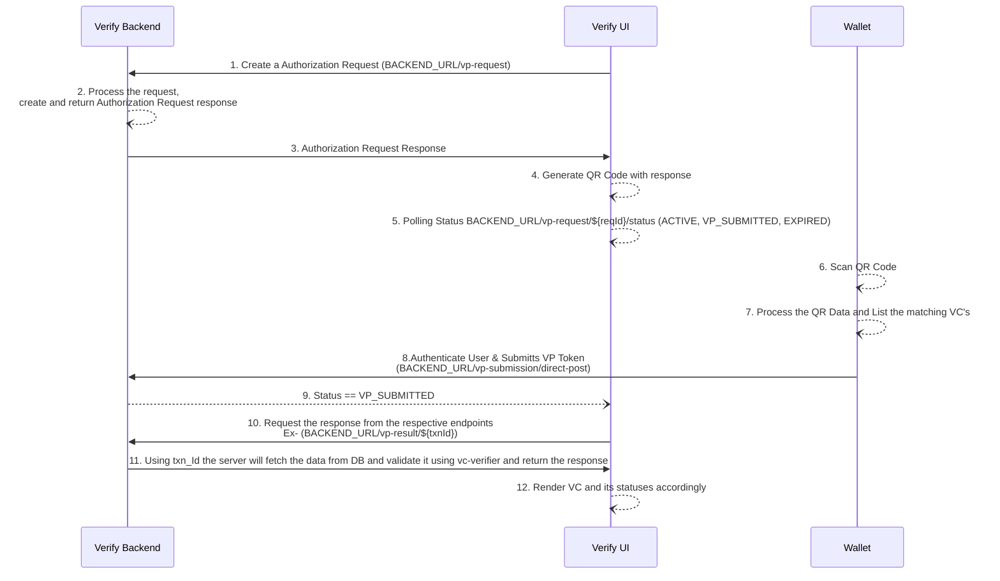

# OpenID4VP Cross Device Flow

### Overview

In this flow, Inji Verify prepares an Authorization Request and renders it as a QR Code. The End-User then uses the Wallet to scan the QR Code. The Verifiable Presentations are sent to the Inji Verify backed in a direct HTTP POST request to a URL controlled by Inji Verify. The flow uses the Response Type `vp_token` in conjunction with the Response Mode `direct_post`, both defined in this specification.

1. Inji Verify UI sends a POST request to create a new Authorization Request with

* `clientId`: (required) - ID of the client requesting the Verifiable Presentation.
* `presentationDefinition`: One of **presentationDefinitionID** or **presentationDefinition** (required) - Presentation Definition for the Verifiable Presentation.
* `presentationDefinitionID`: One of **presentationDefinitionID** or **presentationDefinition** (required) - Presentation Definition ID for the Verifiable Presentation requesting, which is saved in backend.
* `transactionID` - (optional) - A unique identifier for the current authorization request transaction.

2. Inji Verify backend creates a new Authorization Request
3. Inji Verify backend returns the newly created Authorization Request
4. Inji Verify UI generates a QR code with response
5. Inji Verify UI Starts polling for the current transaction status
6. Wallet Scans QR code
7. Wallet reads the QR code data and initiates a OpenId4VP flow on wallets end.
8.  Wallet creates a VP based on the VP selected VCs and POST it to responseUri from the QR code

    **Wallet Authorization Response Types**

    The Wallet can return two types of responses to an Authorization Request:

    **1. Successful Authorization Response**

    Includes:

    * **vp\_token**: The signed Verifiable Presentation (VP) or an array of VPs.
    * **presentation\_submission**: Mappings between the requested credentials and their location within the VP.
    * **state**: The transaction identifier, used to correlate with the original request.

    This response indicates that the Wallet has successfully processed the request and generated a valid presentation.

    **2. Error Response**

    Includes:

    * **error**: An error code indicating the reason for failure (e.g., `invalid_request`, `invalid_presentation_definition`, `unsupported_vp_format`).
    * **error\_description**: A human-readable explanation of the error.
    * **state**: The same transaction identifier used in the original request.

    This response indicates that the Wallet encountered an issue and could not generate or send a valid Verifiable Presentation.
9. Inji Verify UI Starts polling status becomes `VP_SUBMITTED`
10. Inji Verify UI requests for the submitted result with its verification statuses
11. Using transactionId Inji v will fetch the data from DB and validate it using vc-verifier and return the response(11) Using transactionId Inji Verify Backed will fetch the data from DB and validate it using `vc-verifier` and returns the response
12. Inji Verify UI renders the response accordingly, the response may be:
    * **JSON VC (already decoded):**
      * Render the credential details directly in the UI.
    * **SD-JWT VC (encoded string format):**
      * Decode using [`@sd-jwt/decode`](https://www.npmjs.com/package/@sd-jwt/decode) before rendering.
    * **Display outcomes:**
      * Show successful validation results.
      * If verification fails, display error messages and failure details.
