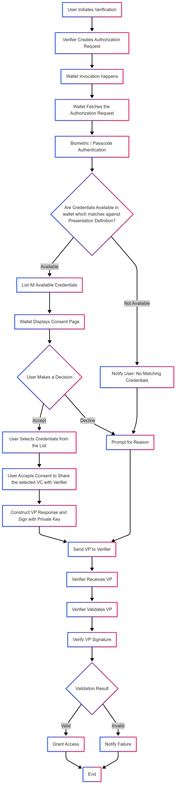

# OpenID4VP Same Device Flow

### OpenID4VP Same Device Flow

<figure><figcaption></figcaption></figure>

#### Same Device Flow Overview

**Description of the Flow** The Same Device Flow in the OpenID for Verifiable Presentations enables the interaction between a verifier and a wallet where both the applications are on the same device, Unlike Scanning the QR code from the wallet application manually as we do in cross-device flow

The flow here utilizes the simple redirection to pass the Authorization request and Authorization response between the verifier and the wallet

**Key Steps in the Flow**

1. **Initiation**: The flow begins when the user in the Verifier application selects an option to verify their credentials or when the user wishes to present the credentials as Verifiable Credentials from their wallet to the application they are using
2. **Authorization Request**: The Verifier App constructs an authorization request that contains several parameters like

* **response\_type**: Specifies the type of response expected from the authorization server(wallet) for example in our case response\_type = vp\_token
* **client\_id**: The unique identifier for the client (Verifier) application making the request
* **redirect\_uri**: This is the URI where the authorization server (Wallet) will send the authorization response and redirect the user back to the verifier(client) application
* **request\_uri**: This is a URL where the verifier application directs the Wallet to retrieve the actual Authorization Request, used when the request object is too large to be transmitted directly, helping to keep the Request Object size smaller.
* **response\_mode**: This parameter tells the wallet that how it should send the vp\_token to the verifier application

| Response Mode              | Description                                                                                                                                                                                                                                                                                                                                                                                                                                      |
| -------------------------- | ------------------------------------------------------------------------------------------------------------------------------------------------------------------------------------------------------------------------------------------------------------------------------------------------------------------------------------------------------------------------------------------------------------------------------------------------ |
| **direct\_post** (Default) | Response is sent to the verifier using an HTTP POST request. The response body is encoded with content type `application/x-www-form-urlencoded`. The response is sent to a specific resource (`response_uri`) controlled by the verifier. The verifier fetches the response (`vp_token`) from this resource using a unique transaction ID. The verifier provides the resource URI to the wallet via `response_uri` in the Authorization request. |
| **fragment**               | Response is encoded in the fragment part of the `redirect_uri` and sent to the verifier when redirecting the end-user back to the verifier.                                                                                                                                                                                                                                                                                                      |

* **presentation\_definition** (Required)- It is an JSON object which contains the info about the credentials that are being requested by the verifier.
* **presentation\_definition\_uri** - to reduce the size of the request or QR code sometimes the verifier stores the presentation\_definition Json object at some resource endpoint and sends that resource uri to wallet and wallet call this endpoint and gets the presentation definition object.
* **client\_id\_scheme** - this value used by the Verifier to tell wallet about how it needs to interpret the client identifier provided by the verifier based on the scheme selected.
* **client\_metadata** - Json object which contains the verifier metadata
* **state** - It contains request-id and it is a random value generated by verifier cryptographically and it is used for binding the Authorization request and response.
* **nonce** - it is a random value generated by verifier cryptographically and used for preventing the replay attacks. Here this random value will be binded to the authorization response so that even if attacker intercepts the VP response, they cannot replay the VP response again.
* **response\_uri** - if verifier send the response mode as Direct post, then verifier is expecting the response to be sent to some resource which will be under the control of the verifier and verifier will get the response from this response-uri.

3. **Request Transmission**: The constructed authorization request is sent directly to the wallet application on the same device. This transmission can occur via a custom URL scheme or domain-bound links, depending on the implementation.

* The Authorization Request can be of by value or by reference
* Then the Wallet app is invoked, and the authorization Request is passed to it

4. **User Consent**: Upon receiving the request, the wallet displays a consent page to the user which has the options to accept or decline the request

once the user accepts to share the credentials to the verifier application wallet proceeds to create a verifiable presentation, if the user declines the request, then the wallet prompts a reason or simply cancel request

5. **Authorization Response**: After the user accepts the request, the wallet checks for credentials that match the Presentation Definition (which the verifier Requested for).

If no matching credentials are found in the wallet, or if any issue occurs during credential retrieval or VP creation (such as malformed request, signing error, or invalid presentation definition), the wallet returns an **Error Response** to the verifier.

**The Error Response includes:**

* `error`: The error code indicating the reason for failure (e.g., `no_matching_credentials`, `invalid_request`, `invalid_presentation_definition`, `unsupported_vp_format`).
* `error_description`: A human-readable explanation of the issue encountered.
* Other parameters include: `state` (request-id), `code`, `id_token`

This indicates that the wallet encountered an issue and could not generate or send a valid Verifiable Presentation.

If matching credentials are available, the wallet:

* Displays the list of matching credentials to the user for selection.
* Once the user selects the credentials, the wallet constructs a Verifiable Presentation (VP) and signs it using the holder’s private key.
* The wallet then sends a **Successful Authorization Response** to the verifier.

**The Successful Authorization Response includes:**

* `vp_token`: JSON string or object which contains either a single VP or array of VPs. Each VC in every VP can be either encoded using base64url or sent as JSON object.
* `presentation_submission`: Contains mappings between the requested Verifiable Credentials and where to find them within the returned VP Token.
* Other parameters include: `state` (request-id), `code`, `id_token`
* **Response Parameters**:
  * **vp\_token** - JSON string or object which contains either a single VP or array of VP’s. Each VC in every VP can be either encoded using base64url or sent as JSON object.
  * **presentation\_submission** - It contains mappings between the requested Verifiable Credentials and where to find them within the returned VP Token.
  * **other parameters** include - state(request-id), code, id\_token

6. **Transmission of Authorization Response**: Once the Wallet prepares the VP, Wallet sends it back to verifier application (using redirect URI) based on the response\_mode and the response\_type specified by the verifier application in the Authorization Request
7. **Validation of the Authorization Response**: Upon receiving the Response (Authorization Response) from the Wallet, the verifier validates the signature of the Verifiable Presentation (VP) using its public key. Additionally, the verifier checks the signature of each Verifiable Credential (VC) by examining the proof details provided in each VC by the issuer.

If validation is successful, the verifier grants access or approval to the user. If validation fails, the verifier notifies the user of the failure
