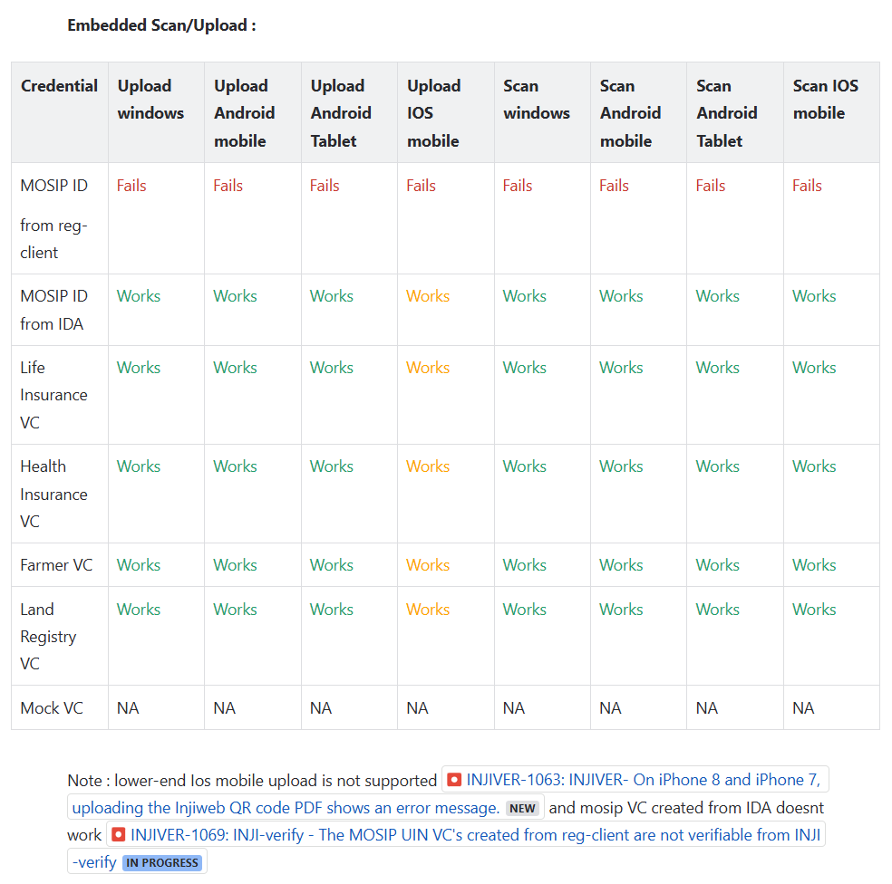
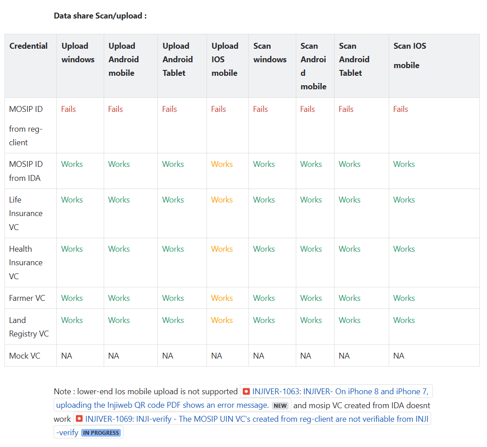
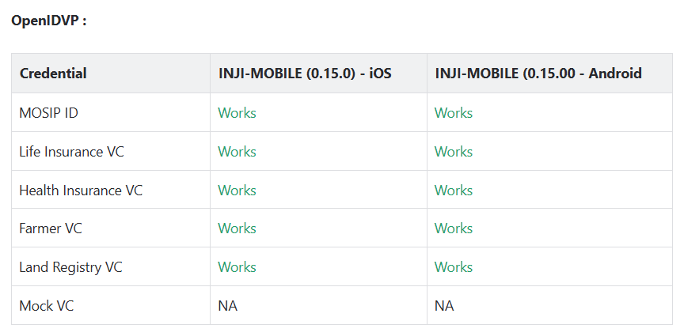
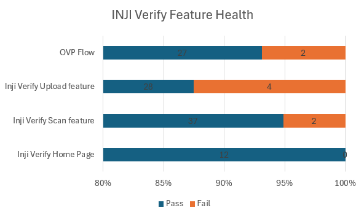

# Test Report

## Testing Scope

The scope of testing is to verify fitment to the specification from the\
perspective of

* Functionality
* Deployability
* Configurability
* Customizability

Verification is performed not only from the end-user perspective but also from the System Integrator (SI) point of view. Hence, the configurability and extensibility of the software are also assessed. This ensures the readiness of the software for use in multiple countries. Since MOSIP is an "API First" product platform, these aspects are critical for its adaptability and scalability.

Testing scope has been focused around the following features:

* Inji Verify Home page
* Verify Scan Feature
* Verify Upload Feature
* OVP Flow

Below are the combinations that QA verified and Certified INJI Verify:

**Upload feature Verification**:

1. Windows: using Edge, Firefox and Chrome browsers.
2. Android: using Edge, Firefox and Chrome browsers.
3. iPhone: using Safari, Edge, Firefox and Chrome browsers.
4. MAC: using Safari Edge, Firefox and Chrome browsers.

**Scan functionality Verification**:

1. MAC (Laptop) with a front camera of 2 megapixel using Chrome, edge,\
   Firefox and Safari browsers.
2. Windows laptop with a front camera of 2 megapixel using Chrome,\
   edge, and Firefox browsers.
3. Mobile phone Android with back camera 16 megapixel using browsers\
   Chrome, Edge and Firefox browsers.
4. Mobile phone Android and Android Tablet with back camera 8\
   megapixel using browsers Chrome, Edge and Firefox browsers.
5. iPhone and iPad with 12 megapixel back camera Chrome, edge, Firefox\
   and Safari browsers.
6. Verified in low light to scan the QR code
7. Verified scan with blur, cracked, low quality QR codes was\
   verified

**OVP** **functionality Verification:**

1. Windows: using Edge, Firefox and Chrome browsers.
2. Android: using Edge, Firefox and Chrome browsers, 0.15.0\
   inji-mobile.
3. iPhone: using Safari, Edge, Firefox and Chrome browsers, 0.15.0\
   inji-mobile.
4. MAC: using Safari Edge, Firefox and Chrome browsers.

Note: OVP flow supports **0.15.0 inji-mobile build only**\
https://mosip.atlassian.net/browse/INJIVER-1086\*\*.\*\*

### Testing results:

Below are the results for Upload, Scan and OVP flow functionality with\
Windows, Android phone, MAC, Android Tablet, iPad and iPhone with\
different browsers:

<figure><figcaption></figcaption></figure>

<figure><figcaption></figcaption></figure>

<figure><figcaption></figcaption></figure>

Note: OVP flow supports **0.15.0 inji-mobile build only**\
https://mosip.atlassian.net/browse/INJIVER-1086\*\*.\*\*

## Test Approach

Persona-based approach has been adopted to perform the IV\&V, by simulating test scenarios that resemble a real-time implementation.

A Persona is a fictional character/user profile created to represent a user type that might use a product or a service in a similar way. Persona-based testing is a software testing technique that puts software testers in the customer's shoes, assesses their needs from the software, and thereby determines use cases or scenarios that the customers will execute. The persona needs may be addressed through any of the following.

* Functionality
* Deployability
* Configurability
* Customizability

The verification methods may differ based on how the need was addressed.

## Verified configuration

Verification is performed on various configurations as mentioned\
below

* Default configuration - with 1 Lang
  * English

## Feature Health

<figure><figcaption></figcaption></figure>

## Test execution statistics

### Functional test results

Below are the test metrics by performing functional testing. The process followed was black box testing, which based its test cases on the specifications of the software component under test. Functional testing was performed in a combination of individual module testing as well as integration testing. Test data were prepared in line with the user stories. Expected results were monitored by examining the user interface. The coverage includes GUI testing, System testing, and End-To-End flows across multiple configurations. The testing cycle included the simulation of multiple identity schemas and respective UI schema configurations.

| **Total** | **Passed** | **Failed** | **Skipped** |
| --------- | ---------- | ---------- | ----------- |
| 486       | 411        | 75         | 0           |

Test Rate: 100%, Pass Rate: 84%

### UI Automation results

The below section provides details on UI Automation by executing MOSIP\
functional automation Framework.

| **Total** | **Passed** | **Failed** | **Skipped** |
| --------- | ---------- | ---------- | ----------- |
| 10        | 10         | 0          | 0           |

Test Rate: 100%, Pass Rate: 100%

Functional and test rig code base branch which is used for the above\
metrics is:

Hash Tag: dee1915d76f02b9e85eb0afd14cbcb2b44bacb15

### Verify API Test Rig Automation results

The below section provides details on UI Automation by executing MOSIP\
functional automation Framework.

| **Total** | **Passed** | **Failed** | **Skipped** |
| --------- | ---------- | ---------- | ----------- |
| 27        | 27         | 0          | 0           |

Test Rate: 100%, Pass Rate: 100%

Functional and test rig code base branch which is used for the above\
metrics is:

Hash Tag: sha256:0c3e6307334a29a3dc82a15e80fd10ecf5b66b6eb0f8111bc1dff207bab6d933

### Detailed Test Metrics

Below are the detailed test metrics by performing manual/automation testing. The project metrics are derived from Defect density, Test coverage, Test execution coverage, test tracking, and efficiency.

The various metrics that assist in test tracking and efficiency are as follows:

* Passed Test Cases Coverage: It measures the percentage of passed\
  test cases. (Number of tests passed / Total number of tests\
  executed) x 100
* Failed Test Case Coverage: It measures the percentage of all the\
  failed test cases. (Number of failed tests / Total number of test\
  cases executed) x 100

Git hub link for all the report files is [**here**](https://github.com/mosip/test-management/tree/master/inji%20verify/0.11.0).
