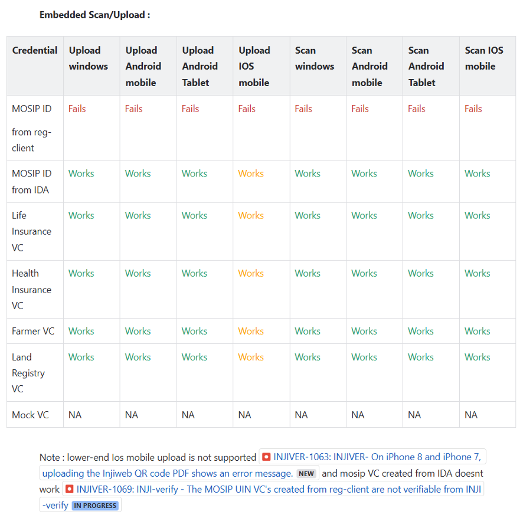
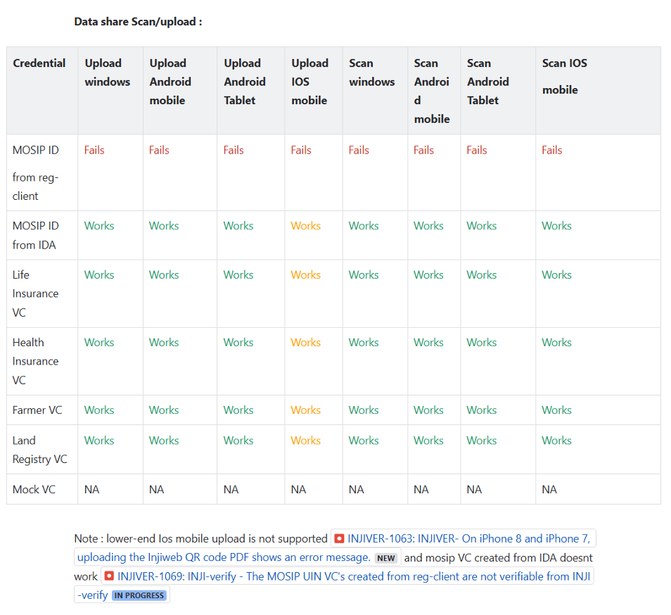
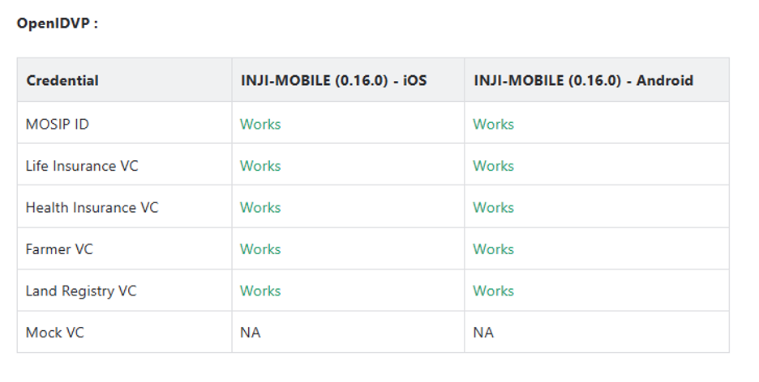
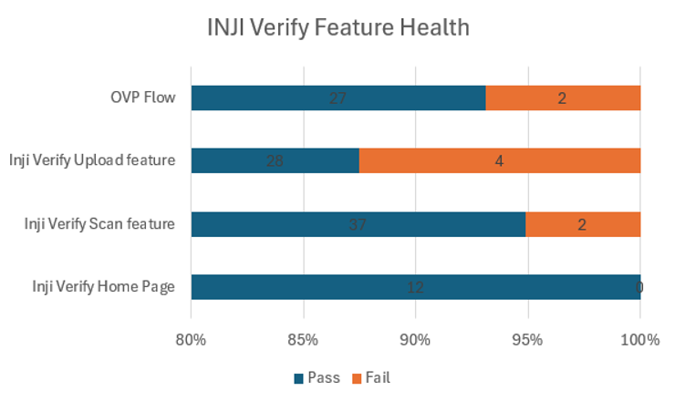

# Test Report

## Testing Scope

The scope of testing is to verify fitment to the specification from the perspective of:

* Functionality
* Deployability
* Configurability
* Customizability

Verification is performed not only from the end user perspective but also from the System Integrator (SI) point of view. Hence Configurability and Extensibility of the software is also assessed. This ensures readiness of software for use in multiple countries. Since MOSIP is an “API First” product platform.

Testing scope has been focused on sanity around the following features:

* Inji Verify Home page
* Verify Scan Feature
* Verify Upload Feature
* OVP Flow

**OVP functionality Verification**:

1. Windows: using Edge, Firefox and Chrome browsers.
2. Android: using Edge, Firefox and Chrome browsers, 0.16.0 inji-mobile.
3. iPhone: using Safari, Edge, Firefox and Chrome browsers, 0.16.0 inji-mobile.
4. MAC: using Safari Edge, Firefox and Chrome browsers.

### Testing results

Below are the results for Upload, Scan and OVP flow functionality with Windows, Android phone, MAC, Android Tablet, iPad and iPhone with different browsers:

<figure><figcaption></figcaption></figure>

<figure><figcaption></figcaption></figure>

<figure><figcaption></figcaption></figure>

## Test Approach

Persona based approach has been adopted to perform the IV\&V, by simulating test scenarios that resemble a real-time implementation.

A Persona is a fictional character/user profile created to represent a user type that might use a product/or a service in a similar way. Persona based testing is a software testing technique that puts software testers in the customer's shoes, assesses their needs from the software and thereby determines use cases/scenarios that the customers will execute. The persona needs may be addressed through any of the following.

* Functionality
* Deployability
* Configurability
* Customizability

The verification methods may differ based on how the need was addressed.

## Verified configuration

Verification is performed on various configurations as mentioned below

* Default configuration - with 1 Lang
  * English

## Feature Health

<figure><figcaption></figcaption></figure>

## Test execution statistics

### UI Automation results

The below section provides details on UI Automation by executing MOSIP functional automation Framework.

<table data-header-hidden><thead><tr><th valign="top"></th><th valign="top"></th><th valign="top"></th><th valign="top"></th></tr></thead><tbody><tr><td valign="top">Total</td><td valign="top">Passed</td><td valign="top">Failed</td><td valign="top">Skipped</td></tr><tr><td valign="top">10</td><td valign="top">10</td><td valign="top">0</td><td valign="top">0</td></tr><tr><td valign="top">Test Rate: 100% With Pass Rate: 100%</td><td valign="top"></td><td valign="top"></td><td valign="top"></td></tr></tbody></table>

Functional and test rig code base branch which is used for the above metrics is:

Hash Tag: dee1915d76f02b9e85eb0afd14cbcb2b44bacb15

### Verify API Test Rig Automation results

The below section provides details on UI Automation by executing MOSIP functional automation Framework.

<table data-header-hidden><thead><tr><th valign="top"></th><th valign="top"></th><th valign="top"></th><th valign="top"></th></tr></thead><tbody><tr><td valign="top">Total</td><td valign="top">Passed</td><td valign="top">Failed</td><td valign="top">Skipped</td></tr><tr><td valign="top">27</td><td valign="top">27</td><td valign="top">0</td><td valign="top">0</td></tr><tr><td valign="top">Test Rate: 100% With Pass Rate: 100%</td><td valign="top"></td><td valign="top"></td><td valign="top"></td></tr></tbody></table>

Functional and test rig code base branch which is used for the above metrics is:

Hash Tag: sha256:0c3e6307334a29a3dc82a15e80fd10ecf5b66b6eb0f8111bc1dff207bab6d933

### Detailed Test Metrics

Below are the detailed test metrics by performing manual/automation testing. The project metrics are derived from Defect density, Test coverage, Test execution coverage, test tracking and efficiency.

The various metrics that assist in test tracking and efficiency are as follows:

* Passed Test Cases Coverage: It measures the percentage of passed test cases. (Number of tests passed / Total number of tests executed) x 100
* Failed Test Case Coverage: It measures the percentage of all the failed test cases. (Number of failed tests / Total number of test cases executed) x 100

Git hub link for all the test report files is [**here**](https://github.com/mosip/test-management/tree/163abe899980dee6e975058eea5333640aba8df3/inji%20verify/0.11.1).
