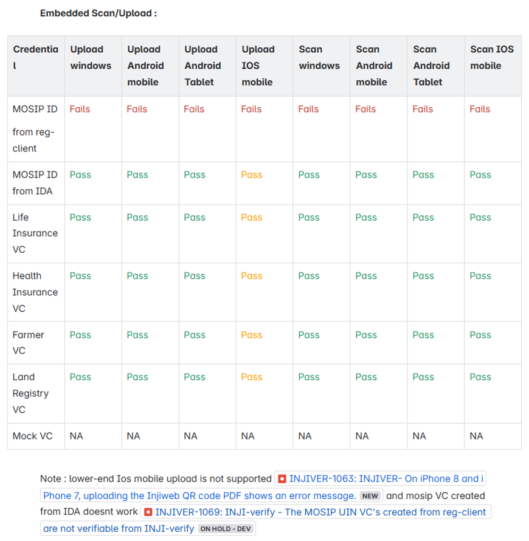
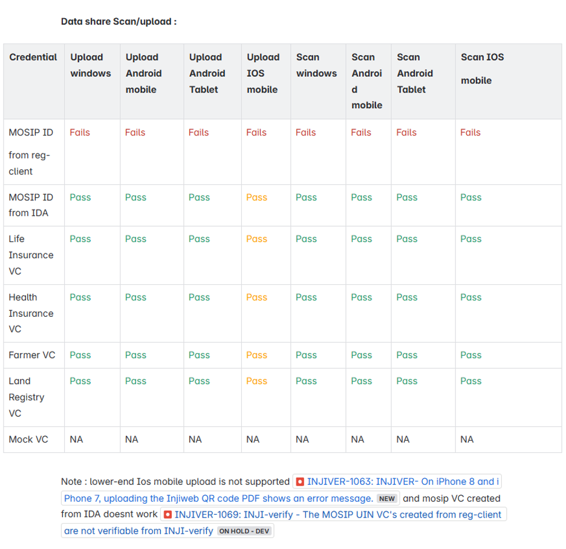
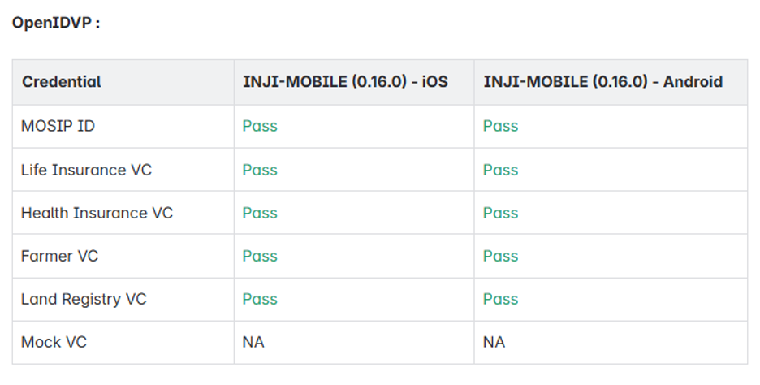
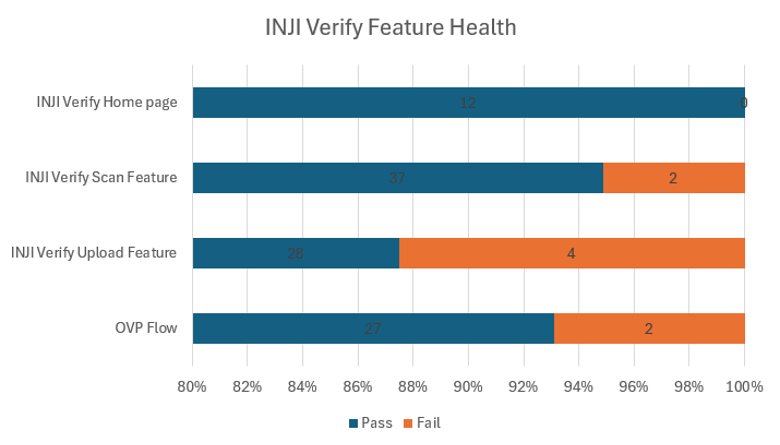

# Test Report

## Testing Scope

The scope of testing is to verify fitment to the specification from the perspective of

* Functionality
* Deployability
* Configurability
* Customizability

Verification is performed not only from the end user perspective but also from the System Integrator (SI) point of view. Hence Configurability and Extensibility of the software is also assessed. This ensures readiness of software for use in multiple countries. Since MOSIP is an “API First” product platform.

Testing scope has been focused around the below features:

* Inji Verify Home page
* Verify Scan Feature
* Verify Upload Feature
* OVP Flow

Below are the combinations that QA verified and Certified INJI Verify:

**Upload feature Verification**:

1. Windows using Edge, Firefox and Chrome browsers.
2. Android using Edge, Firefox and Chrome browsers.
3. iPhone using Safari, Edge, Firefox and Chrome browsers.
4. MAC using Safari Edge, Firefox and Chrome browsers.

**Scan functionality Verification**:

1. MAC (Laptop) with a front camera of 2 megapixel using Chrome, edge, Firefox and Safari browsers.
2. Windows laptop with a front camera of 2 megapixel using Chrome, edge, and Firefox browsers.
3. Mobile phone Android with back camera 16 megapixel using browsers Chrome, Edge and Firefox browsers.
4. Mobile phone Android and Android Tablet with back camera 8 megapixel using browsers Chrome, Edge and Firefox browsers.
5. iPhone and iPad with 12 megapixel back camera Chrome, edge, Firefox and Safari browsers.
6. Verified in low light to scan the QR code.
7. Verified scan with blur, cracked, low quality QR codes was verified.

**OVP functionality Verification**:

1. Windows using Edge, Firefox and Chrome browsers.
2. Android using Edge, Firefox and Chrome browsers, 0.16.0 inji-mobile.
3. iPhone using Safari, Edge, Firefox and Chrome browsers, 0.16.0 inji-mobile.
4. MAC using Safari Edge, Firefox and Chrome browsers.

### Testing results 

Below are the results for Upload, Scan and OVP flow functionality with Windows, Android phone, MAC, Android Tablet, iPad and iPhone with different browsers:

<figure><figcaption></figcaption></figure>

<figure><figcaption></figcaption></figure>

<figure><figcaption></figcaption></figure>


**Note** : OVP flow supports 0.16.0 inji-mobile build only


## Test Approach 

Persona based approach has been adopted to perform the IV\&V, by simulating test scenarios that resemble a real-time implementation.

A Persona is a fictional character/user profile created to represent a user type that might use a product/or a service in a similar way. Persona based testing is a software testing technique that puts software testers in the customer's shoes, assesses their needs from the software and thereby determines use cases/scenarios that the customers will execute. The persona needs may be addressed through any of the following.

* Functionality
* Deployability
* Configurability
* Customizability

The verification methods may differ based on how the need was addressed.

## Verified configuration 

Verification is performed on various configurations as mentioned below

* Default configuration - with 1 Lang
  * English

## Feature Health 

<figure><figcaption></figcaption></figure>

## Test execution statistics 

### Functional test results 

Below are the test metrics by performing functional testing. The process followed was black box testing which based its test cases on the specifications of the software component under test. Functional test was performed in combination of individual module testing as well as integration testing. Test data were prepared in line with the user stories. Expected results were monitored by examining the user interface. The coverage includes GUI testing, System testing, End-To-End flows across multiple configurations. The testing cycle included simulation of multiple identity schema and respective UI schema configurations.

<table data-header-hidden><thead><tr><th width="364.45379638671875" valign="top"></th><th valign="top"></th><th valign="top"></th><th valign="top"></th></tr></thead><tbody><tr><td valign="top">Total</td><td valign="top">Passed</td><td valign="top">Failed</td><td valign="top">Skipped</td></tr><tr><td valign="top">505</td><td valign="top">429</td><td valign="top">76</td><td valign="top">0</td></tr><tr><td valign="top">Test Rate: 100%, With Pass Rate: 84%</td><td valign="top"></td><td valign="top"></td><td valign="top"></td></tr></tbody></table>

### UI Automation results 

Below section provides details on UI Automation by executing MOSIP functional automation Framework.

<table data-header-hidden><thead><tr><th valign="top"></th><th valign="top"></th><th valign="top"></th><th valign="top"></th></tr></thead><tbody><tr><td valign="top">Total</td><td valign="top">Passed</td><td valign="top">Failed</td><td valign="top">Skipped</td></tr><tr><td valign="top">10</td><td valign="top">10</td><td valign="top">0</td><td valign="top">0</td></tr><tr><td valign="top">Test Rate: 100% With Pass Rate: 100%</td><td valign="top"></td><td valign="top"></td><td valign="top"></td></tr></tbody></table>

Functional and test rig code base branch which is used for the above metrics is:

Hash Tag: 3705d872beb6f103a787badd5d1e141937abb14a

### Verify API Test Rig Automation results 

Below section provides details on UI Automation by executing MOSIP functional automation Framework.

<table data-header-hidden><thead><tr><th width="348.46661376953125" valign="top"></th><th valign="top"></th><th valign="top"></th><th valign="top"></th></tr></thead><tbody><tr><td valign="top">Total</td><td valign="top">Passed</td><td valign="top">Failed</td><td valign="top">Skipped</td></tr><tr><td valign="top">27</td><td valign="top">27</td><td valign="top">0</td><td valign="top">0</td></tr><tr><td valign="top">Test Rate: 100% With Pass Rate: 100%</td><td valign="top"></td><td valign="top"></td><td valign="top"></td></tr></tbody></table>

Functional and test rig code base branch which is used for the above metrics is:

Hash Tag: a1924880ffba43036f8d6ca8faafca2a36962df1

### Detailed Test metrics 

Below are the detailed test metrics by performing manual/automation testing. The project metrics are derived from Defect density, Test coverage, Test execution coverage, test tracking and efficiency.

The various metrics that assist in test tracking and efficiency are as follows:

* Passed Test Cases Coverage: It measures the percentage of passed test cases. (Number of passed tests / Total number of tests executed) x 100
* Failed Test Case Coverage: It measures the percentage of all the failed test cases. (Number of failed tests / Total number of test cases executed) x 100

Git hub link for more of the reports is [**here**](https://github.com/mosip/test-management/tree/master/inji%20verify/0.12.0).
