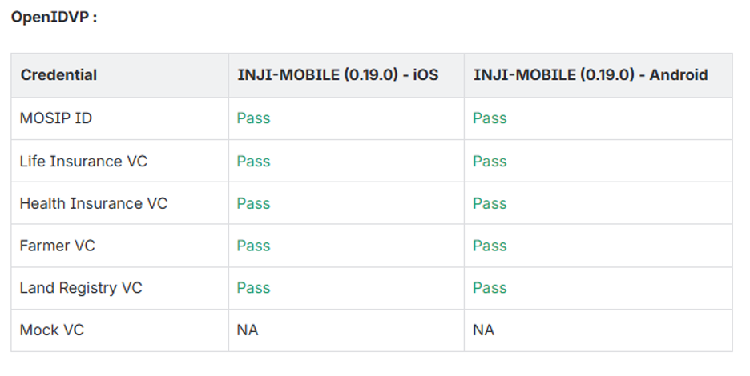
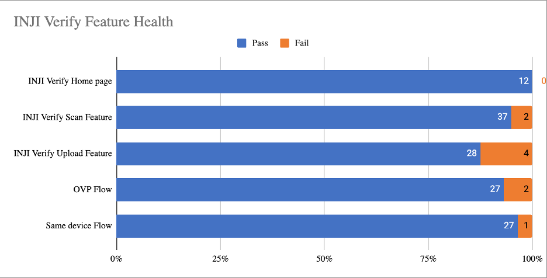

# Test Report

## Testing Scope

The testing scope covers verification against specifications from the perspectives of:

* Functionality
* Deployability
* Configurability
* Customizability

Verification is performed from both end-user and System Integrator (SI) viewpoints, assessing configurability and extensibility to ensure readiness for deployment in multiple countries. As MOSIP is an “API First” product platform, these aspects are critical.

### Features Tested

* Inji Verify Home page
* Verify Scan Feature
* Verify Upload Feature
* OVP Flow
* Same device flow

### QA Verified Combinations

**Upload Feature Verification:**

1. Windows: Edge, Firefox, Chrome
2. Android: Edge, Firefox, Chrome
3. iPhone: Safari, Edge, Firefox, Chrome
4. Mac: Safari, Edge, Firefox, Chrome

**Scan Functionality Verification:**

1. Mac (Laptop, 2MP front camera): Chrome, Edge, Firefox, Safari
2. Windows (Laptop, 2MP front camera): Chrome, Edge, Firefox
3. Android (Phone/Tablet, 16MP back camera): Chrome, Edge, Firefox
4. iPhone/iPad (12MP back camera): Chrome, Edge, Firefox, Safari
5. Verified QR code scanning in low light
6. Verified scanning with blurred, cracked, and low-quality QR codes

**OVP Functionality Verification (current INJI Verify version):**

1. Windows: Edge, Firefox, Chrome
2. Android: Edge, Firefox, Chrome (0.19.0 INJI-mobile)
3. iPhone: Safari, Edge, Firefox, Chrome (0.19.0 INJI-mobile)
4. Mac: Safari, Edge, Firefox, Chrome

**Same Device Flow Verification (current INJI Verify version):**

1. Android: Edge, Firefox, Chrome (0.19.0 INJI-mobile)
2. iPhone: Safari, Edge, Firefox, Chrome (0.19.0 INJI-mobile)

### Testing Results

Results for Upload, Scan, and OVP flow functionality were validated across Windows, Android phone, Mac, Android Tablet, iPad, and iPhone with various browsers.

<figure><figcaption></figcaption></figure>

<figure><figcaption></figcaption></figure>

<figure><figcaption></figcaption></figure>


**Note:** OVP flow supports only the 0.19.0 inji-mobile build.


## Test Approach

A persona-based approach was adopted for IV\&V, simulating real-world scenarios. Personas represent user types and help determine relevant use cases. Testing addressed:

* Functionality
* Deployability
* Configurability
* Customizability

Verification methods varied based on how each need was addressed.

## Verified Configuration

Verification was performed on the following configuration:

* Default configuration with 1 language:
  * English

## Feature Health

<figure><figcaption></figcaption></figure>

## Test Execution Statistics

### Functional Test Results

Functional testing followed a black box approach, covering individual modules and integration, with test data aligned to user stories. Coverage included GUI, system, and end-to-end flows across multiple configurations, simulating various identity and UI schema configurations.

| Total | Passed | Failed | Skipped |
| ----- | ------ | ------ | ------- |
| 655   | 562    | 93     | 0       |

Test Rate: 100%, Pass Rate: 85%

### UI Automation Results

MOSIP functional automation framework was used for UI automation.

| Total | Passed | Failed | Skipped |
| ----- | ------ | ------ | ------- |
| 17    | 17     | 0      | 0       |

Test Rate: 100%, Pass Rate: 100%

Functional and test rig code base branch used for these metrics:

* Hash Tag: `sha256:52554ad1062b28e67973e422f046bbc4b49ddad525498017996ed100422d1915`

### Verify API Test Rig Automation Results

| Total | Passed | Failed | Skipped |
| ----- | ------ | ------ | ------- |
| 29    | 29     | 0      | 0       |

Test Rate: 100%, Pass Rate: 100%

Functional and test rig code base branch used for these metrics:

* Hash Tag: `sha256:7c6529869cec006ae825ed85cc9af57818db11f3ed738de05e71bc9f31dfd532`

### Detailed Test Metrics

Manual and automation testing metrics are derived from defect density, test coverage, execution coverage, tracking, and efficiency.

* **Passed Test Cases Coverage:** (Number of passed tests / Total executed) × 100
* **Failed Test Cases Coverage:** (Number of failed tests / Total executed) × 100

GitHub link for the XLS file is here.
