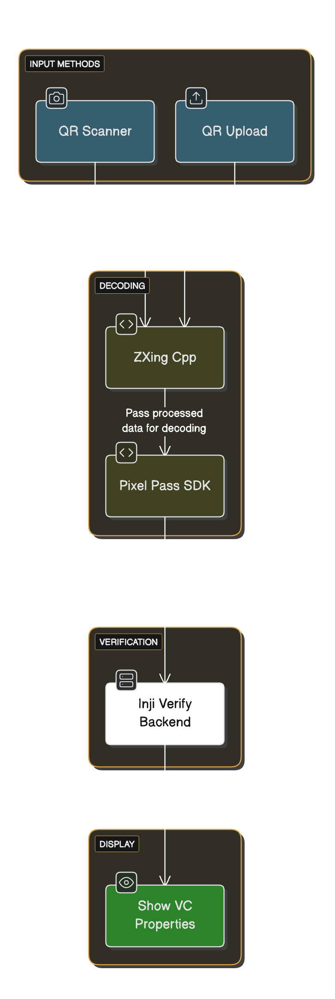
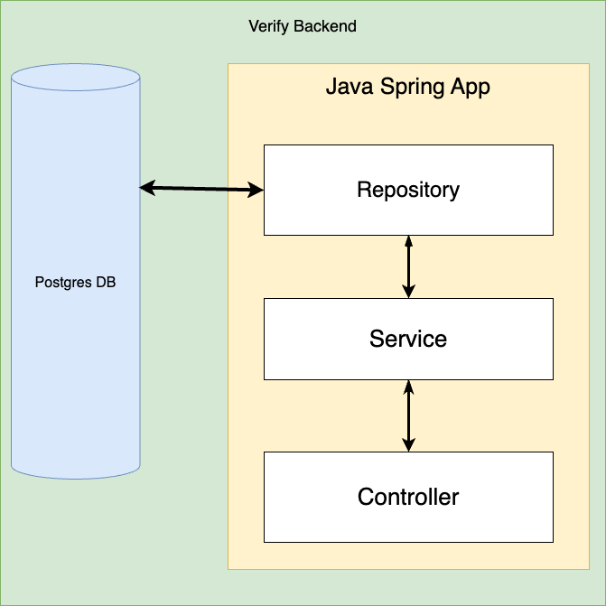

# Components

**Inji Verify** serves as a verification platform for verifiable credentials, offering an intuitive web portal designed to streamline the process of verifying VC for users.

**Technical Components of Verify:** The following component diagram illustrates the structure and components of Inji Verify. It offers a comprehensive explanation of how the platform operates and how its various elements interact to deliver its functionalities.

<figure><figcaption></figcaption></figure>

### Components

Let's briefly explore the key components that constitute Inji Verify:

1. **Inji Verify:** This is the user-facing web portal developed on React. It serves as the primary interface for users to verify Verifiable Credentials.

* Inji Verify offers functionalities for both scanning QR codes and uploading QR code files. Users interact with the portal to initiate the verification process and view the results.

2. **ZXing:** It is an open-source library that's used to read the QR code VC data.
3. **Pixel-Pass Library:** The [**Pixel-Pass Library** ](https://www.npmjs.com/package/@mosip/pixelpass/v/0.5.0)is a set of software tools and utilities designed to assist in the decoding of QR codes. It provides functions and algorithms to interpret the data encoded within QR codes accurately.

* The [**Pixel-Pass Library**](https://www.npmjs.com/package/@mosip/pixelpass/v/0.5.0) is integrated into Inji Verify to handle the decoding of QR code data received from scanned images or uploaded files.

4. **Pixel-Pass SDK:** The Pixel-Pass SDK is a comprehensive package of software tools, and libraries provided to developers to facilitate the integration of Pixel-Pass functionality into their applications.

* In the context of Inji Verify, the Pixel-Pass SDK is utilized to pass the decoded data for verification to the SDK.

5. **Inji Verify Backend:** The Verification of VC is done at Inji Verify Backend and it is a toolkit used for verifying the authenticity and validity of Verifiable Credentials. It contains algorithms, cryptographic functions, and validation methods required to ensure the integrity of credential data.
6. The [Verification library](https://github.com/mosip/vc-verifier/tree/master/vc-verifier/kotlin) is developed within Inji to perform verification checks on the decoded data obtained from QR codes. It validates the information against predefined criteria and standards to determine the legitimacy of the presented credentials and shows the VC properties.

* **Assumptions or Limitations:**
  * **Verification Method**: We are assuming the verification method currently only works with DID (Decentralized Identifier). However, it can also be a direct URL key reference. This distinction is crucial for correct implementation and usage. You can look at the specific code handling this verification method [here](https://github.com/mosip/inji-verify/blob/c32f37b1df3c99fc9ecda12af573e73083e02111/inji-verify/src/utils/verification-utils.js#L7).
* **Technical Components of Verify Backend:** The following component diagram illustrates the structure and components of Inji Verify backend. It offers a comprehensive explanation of how the platform operates and how its various elements interact to deliver its functionalities.

<figure><figcaption>
Scan QR Code Desktop View
</figcaption></figure>

6. **INJI verify SDK**\
   Inji Verify SDK is a library which exposes React components for integrating Inji Verify features seamlessly into any relaying party application. Currently the SDK exposes OpenID4VP component and Scan/upload component. The integration docs for SDK can be found [here](https://github.com/mosip/inji-verify/blob/release-0.14.x/inji-verify-sdk/Readme.md).

### Components

Let's briefly explore the key components that constitute Inji Verify Backend:

1. **Inji Verify Backend**: This is the service developed on Java with Spring boot. It serves as the core backend for Inji verify proving backend APIs for online VC verification and OpenID4VP sharing.
2. **JAVA Spring App**: This is the app which serves the APIs to users.
3. **Postgres DB**: The database used to store details required for OpenID4VP sharing, such as Presentation Definition, Transactions and VP token.
4. **Controller**: The controller exposes APIs for different operations. The API docs can be found [here](https://mosip.stoplight.io/docs/inji-verify/branches/main/)
5. **Service**: Performs all the logical operations.
6. **Repository**: Communicates with the database and performs CRUD operations.
