# End User Guide


**Important**: We are in the process of updating screenshots and content in the End User Guide to reflect our new branding. These updates will be available soon, thank you for your patience!


This document serves as a concise user guide for end users, providing comprehensive information on the features and functionalities offered by Inji Wallet.

## Installing Inji Wallet

The below sections explain the steps for installing the Inji Wallet application on Android and iOS platforms.

#### On Android device

1. To install the Inji Wallet app on an Android smartphone, click [**here**](https://drive.google.com/drive/folders/1gBjFSdpjxU4bsZi7-xS59W1-EIFKrkS8) to get the Inji Wallet `apk` file for installation.
2. Transfer the `apk` file onto the smartphone on which it is to be installed.
3. Click on the `apk` file and follow the OS installation instructions.

#### On iOS device

1. Install the test flight app on your device.
2. Follow the steps mentioned [here](https://docs.mosip.io/inji/inji-wallet/sandbox-details/inji-setup-guide#pre-requisites).

The below screenshots explain the next steps after you get access.

<figure><figcaption></figcaption></figure> <figure><figcaption>
Installation of Inji Wallet on iOS mobile device
</figcaption></figure> <figure><figcaption></figcaption></figure>

<figure><figcaption></figcaption></figure> <figure><figcaption>
Installation of Inji Wallet on iOS mobile device
</figcaption></figure> <figure><figcaption></figcaption></figure>

### First launch of the app

After installation when you launch the app for the first time:

* Select the preferred language.
* You can read though a five-page tutorial for the Inji Wallet which is presented.
* Choose a secure login method to enter the app (Biometric / PIN). This can be achieved through a PIN or the device's Biometrics (such as fingerprint or facial recognition). Once the setting is done you will be directed to the app's home page.

<figure><figcaption></figcaption></figure> <figure>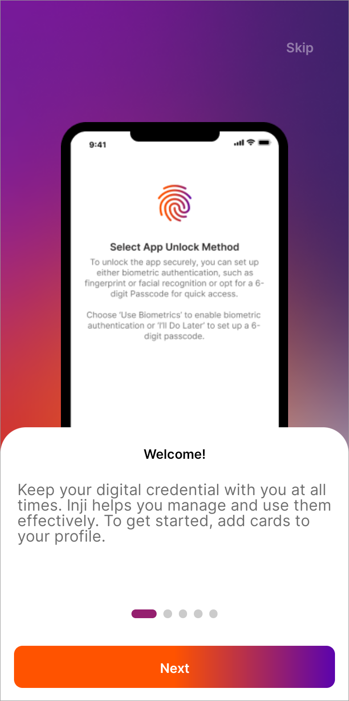<figcaption></figcaption></figure> <figure>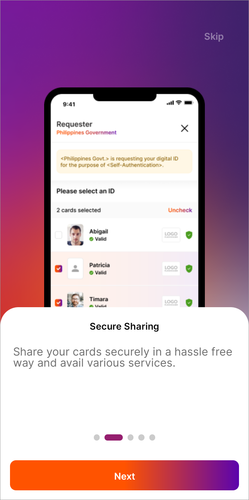<figcaption></figcaption></figure>

<figure>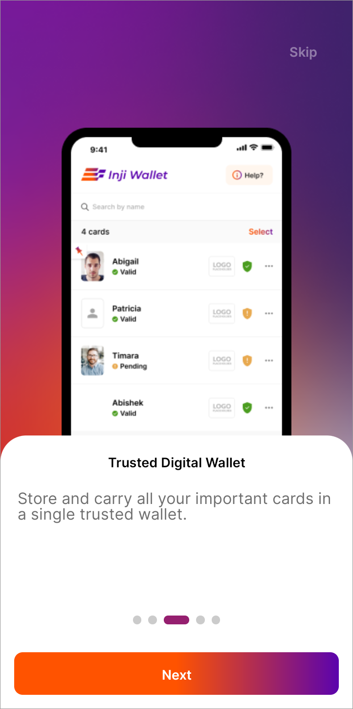<figcaption></figcaption></figure> <figure>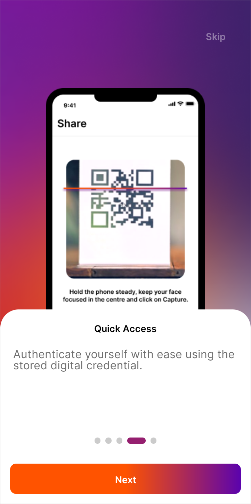<figcaption></figcaption></figure> <figure>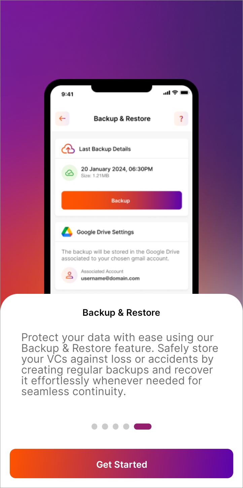<figcaption></figcaption></figure>

<figure>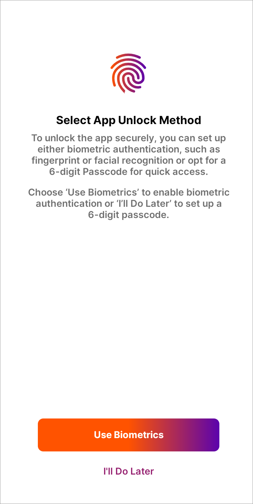<figcaption></figcaption></figure>

<figure>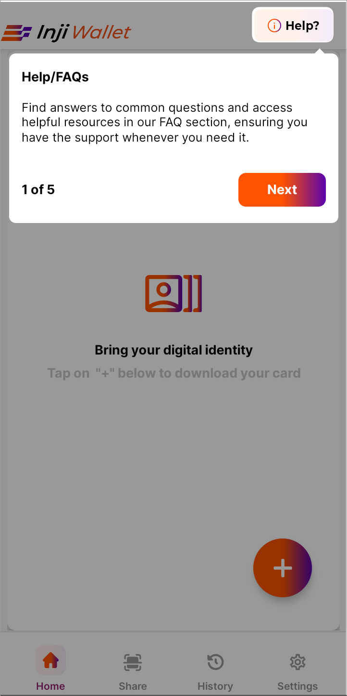<figcaption></figcaption></figure> <figure>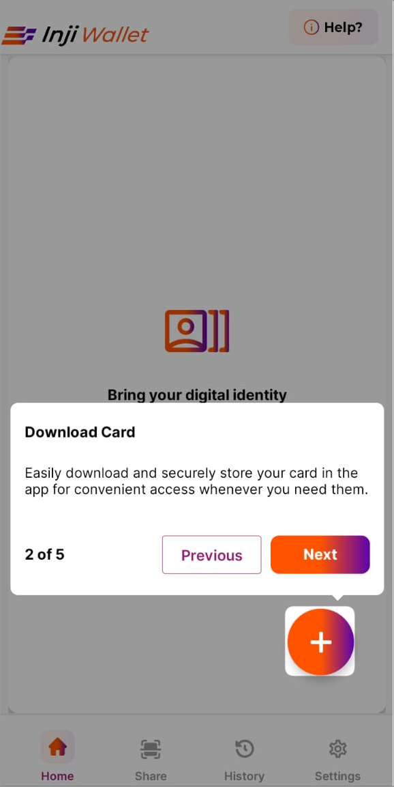<figcaption></figcaption></figure> <figure>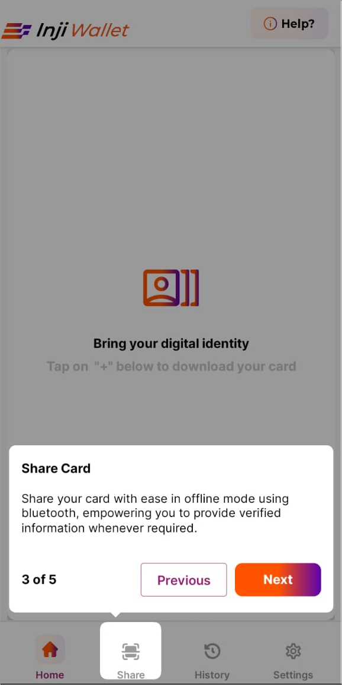<figcaption></figcaption></figure>

<figure>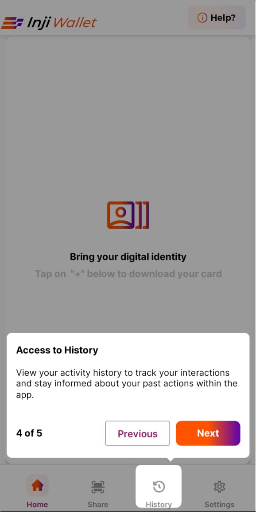<figcaption></figcaption></figure> <figure>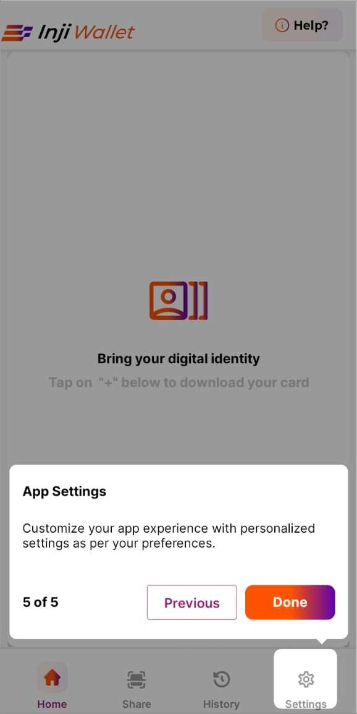<figcaption></figcaption></figure>

## Download of Verifiable Credentials

Inji Wallet supports VC downloads using **eSignet** as the authorization layer. Some of the available use-cases include:

* **Download National ID (MOSIP VC)**
* **Download Insurance VC**
* **And many more use-cases available to explore via eSignet!**

### **1. Download National ID (MOSIP VC)**

**Download credentials using UIN / VID**:

* On the home page, a plus "+" symbol will display the list of issuers from which you can download VCs.
* Select the issuer that states **National Identity Department** and choose a credential type (MOSIP National ID). Once clicked, the browser will open and take you to the eSignet page.
* On the authorization page (eSignet page), the user has to enter the UIN / VID and provide the OTP sent to the registered mobile number/email.
* Upon successful validation of OTP, the user will be taken back to the application and land on the loading screen. After the download process is completed, the user will be returned to the home page, where the Downloaded Credential will be available.

<figure><figcaption></figcaption></figure> <figure>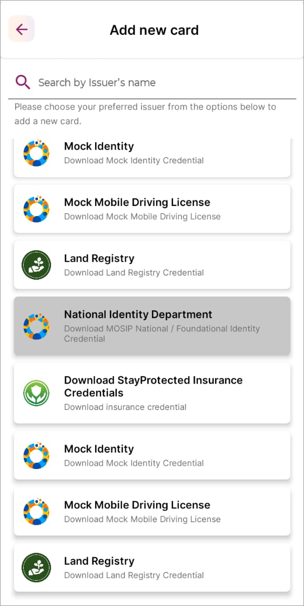<figcaption></figcaption></figure> <figure><figcaption></figcaption></figure>

<figure><figcaption></figcaption></figure> <figure><figcaption></figcaption></figure> <figure><figcaption></figcaption></figure>

<figure><figcaption></figcaption></figure> <figure><figcaption></figcaption></figure>

### 2. Download Insurance VC

**Download credentials using KBI:**

* A plus "+" symbol on the home page will display the list of issuers from which you can download VCs.
* Select the issuer that states **Stay Protected Insurance** and choose a credential type (Health Insurance, Life Insurance). Once clicked, the browser will open and take you to the eSignet page.
* On the authorization page (eSignet page), the user has to enter the Policy Number, Full Name, and Date Of Birth(D.O.B).
* Upon successful validation, the user will return to the application and land on the loading screen. Following the completion of the download process, the user will be returned to the home page, where the Downloaded Credential will be available.

<figure><figcaption></figcaption></figure> <figure><figcaption></figcaption></figure> <figure><figcaption></figcaption></figure>

<figure><figcaption></figcaption></figure> <figure><figcaption></figcaption></figure> <figure><figcaption></figcaption></figure>

## Detailed view of the downloaded VC

Once we click on the downloaded VC on the Home Page, the detailed view opens up for the VC.

### Detailed View of National ID VC

Users can see all the details of the National ID in the detailed view. In addition, the user can access the quick access menu (...) on the top right to perform actions such as Pin/Unpin, Share, Share with Selfie, QR Code Login, view Activity Log, and Remove from the detailed view of the VC.

<figure>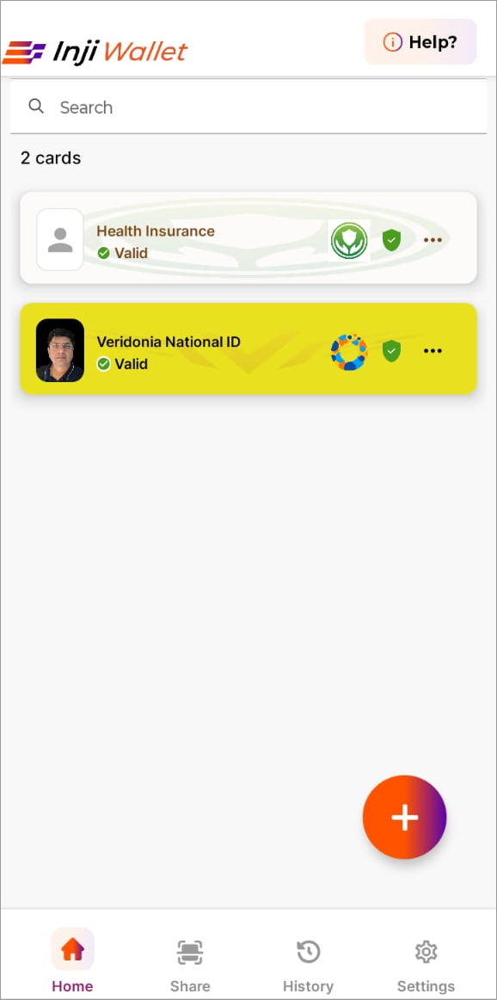<figcaption></figcaption></figure> <figure>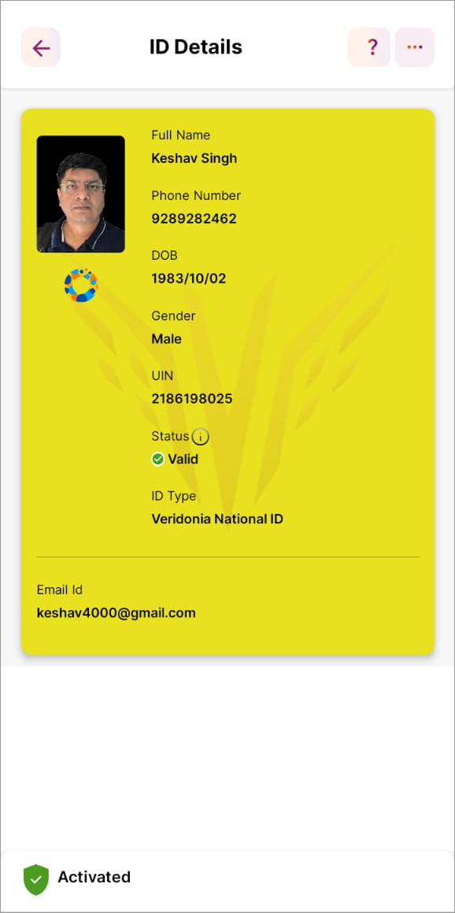<figcaption></figcaption></figure>

### Detailed View of Insurance VC

Users can see all the Insurance policy details in the detailed view along with the QR Code. The QR Code can be magnified which can be presented to the verifier for scanning. Through the quick access menu (...) on the top right user can also perform other actions like Share, Pin, Remove and Activity log on the VC.

<figure><figcaption></figcaption></figure> <figure>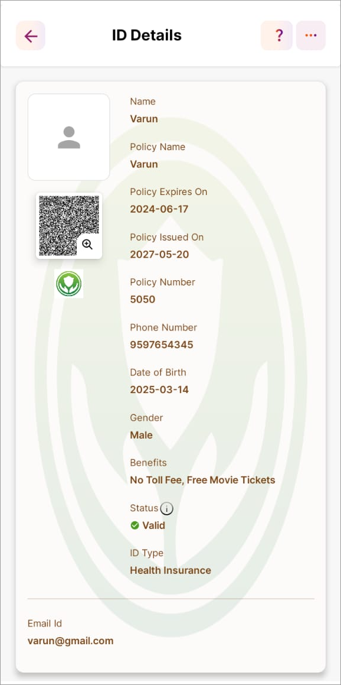<figcaption></figcaption></figure> <figure>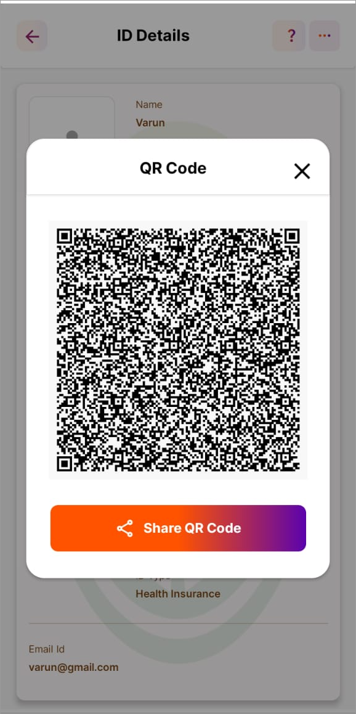<figcaption></figcaption></figure>

### Download Credential by Scanning a QR Code (Credential Offer with Pre-Auth Code)

This flow allows you to download credentials simply by scanning a QR code, **without login** or **manual input of ID/Identifier or other data**.

#### 1. Pre-Authorized Credential Offer (**Without Transaction Code**)

Used in public campaigns or mass rollouts (e.g., vaccine certificates, land cards).

1. On the issuer’s website, or from a flyer/poster, scan the QR code using the **Scan & Download** option available in Inji Wallet.
2. Click on the **"+" (Add Credential)** icon.

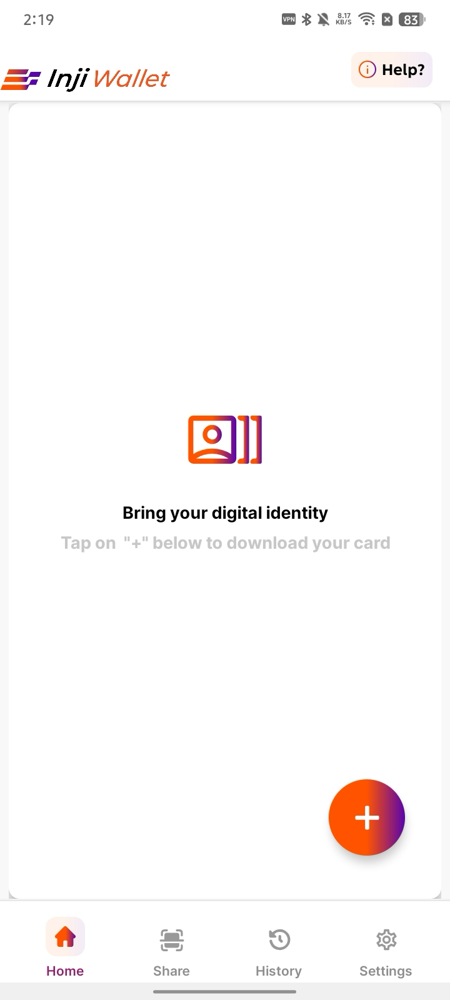

3. Select the first option: **Scan & Download**.

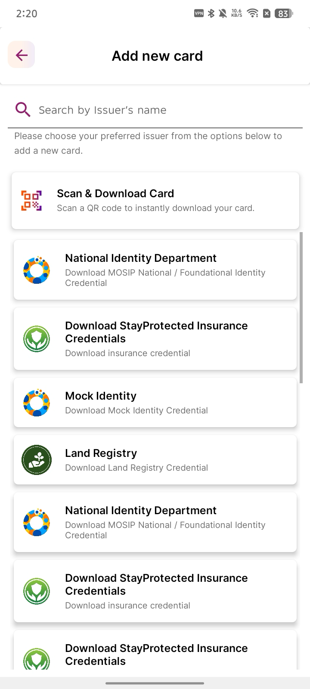

4. Scan the QR code from the issuer's website or printed material.

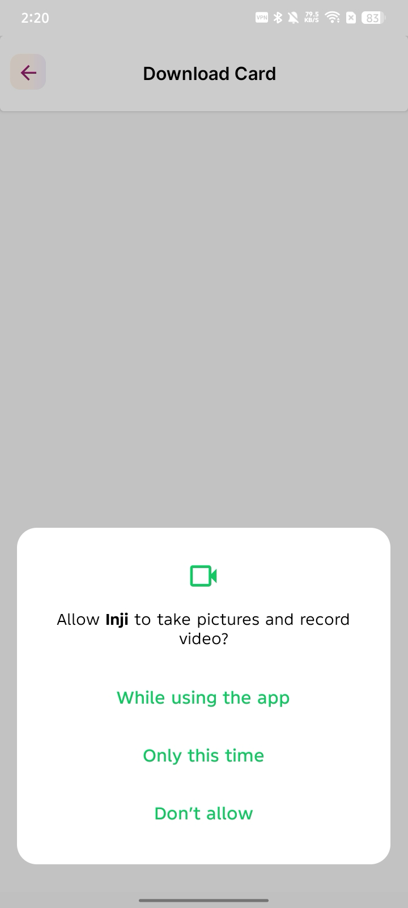 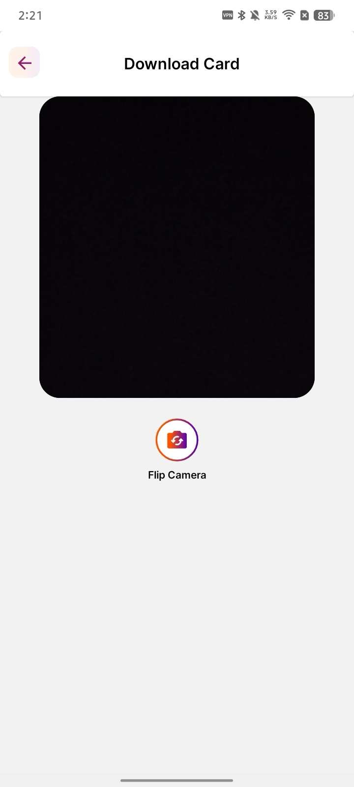 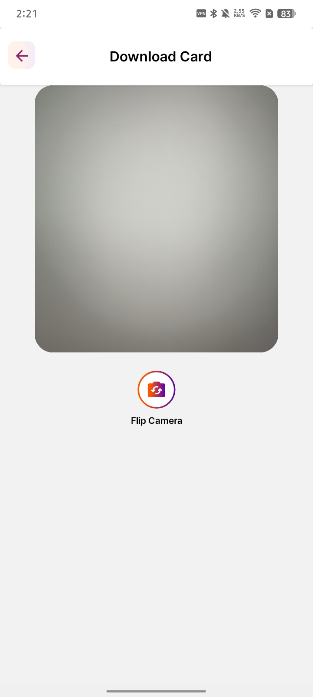 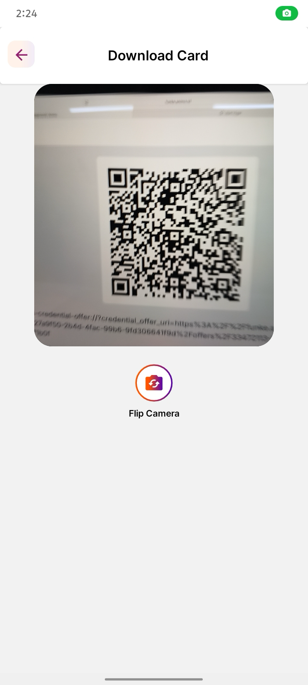 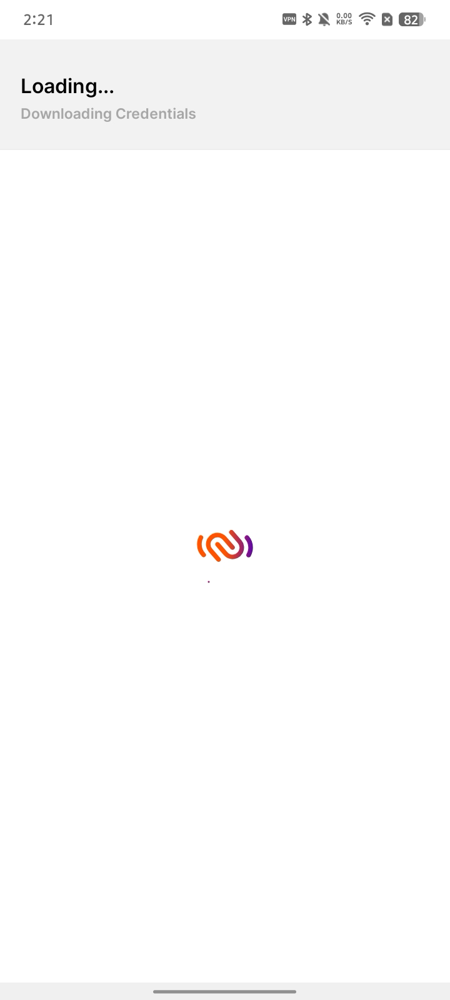

5. If this is your first time interacting with the issuer, a **trust screen** will appear asking you to trust the issuer.
6. You can **proceed to trust** and add the issuer to your trusted list or **decline** as per your preference. This prompt appears only **once per issuer**.
   * If you **Decline**, the download **will not proceed** further.
   * If you **Allow**, the download **will proceed** further.

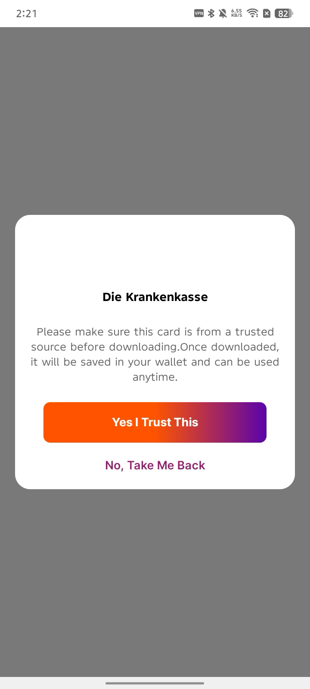

7. The wallet recognizes the embedded **credential offer**, without needing to log in or enter any data, your credential starts downloading.\
   \
   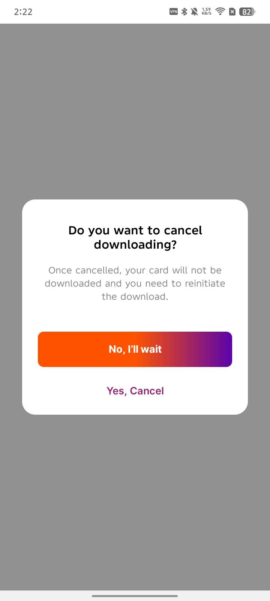
8. You’ll see a **success message** and the VC will appear in your wallet.

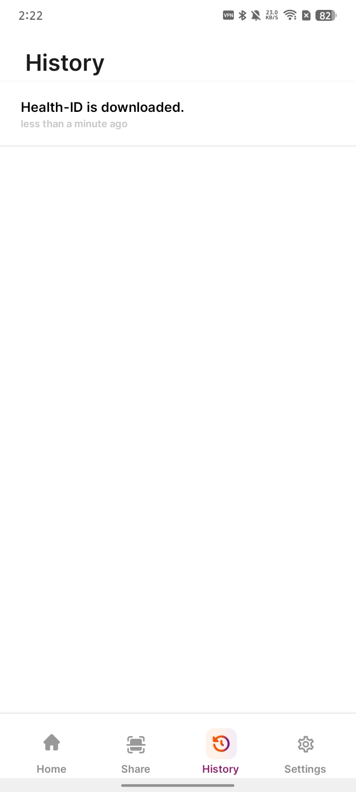 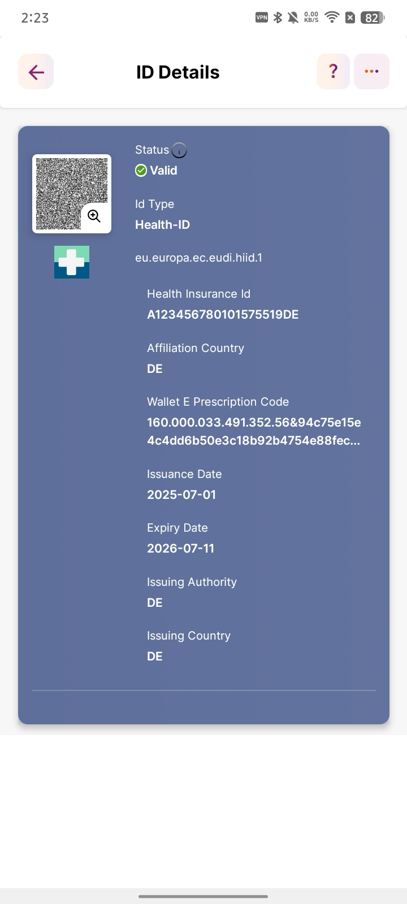 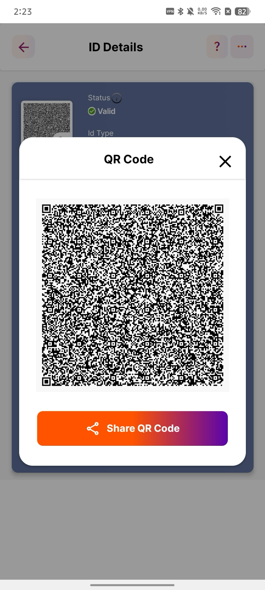

#### B. Pre-Authorized Credential Offer (**With Transaction Code**)

Used for personalized and secure issuance (e.g., mDL, insurance).

1. On the issuer’s website, or from a flyer/poster, scan the QR code using the **Scan & Download** option available in Inji Wallet.
2. Click on the **"+" (Add Credential)** icon.

3. Select the first option: **Scan & Download**.

4. Scan the QR code from the issuer's website or printed material.

    

5. If this is your first time interacting with the issuer, a **trust screen** will appear asking you to trust the issuer.

6. You can **proceed to trust** and add the issuer to your trusted list or **decline** as per your preference. This prompt appears only **once per issuer**.
   * If you **Decline**, the download **will not proceed** further.
   * If you **Allow**, the download **will proceed** further.
7. You will be prompted to **enter a Transaction Code / OTP** provided by the issuer via SMS or Email.

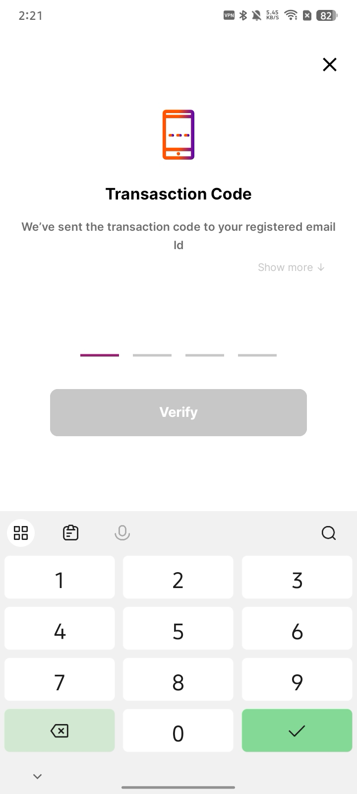 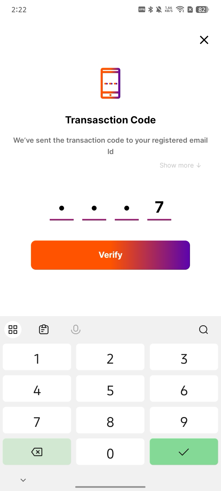

8. After entering the code, the wallet retrieves the credential securely.

9. The wallet recognizes the embedded **credential offer**, Without needing to log in or enter any data, your credential starts downloading.
10. You’ll see a **success message** and the VC will appear in your wallet.

  

### Viewing the history of the downloaded VC

After completing several scenarios, we can find it by selecting the third icon in the bottom right corner when we navigate to the history page. This page will display a comprehensive list of all the events.

<figure><figcaption></figcaption></figure>

### Activity Log for a VC:

Users can view the activity logs of a VC from the Home Page or the detailed view by choosing the menu option "View Activity Log" from the quick access menu (...).

<figure>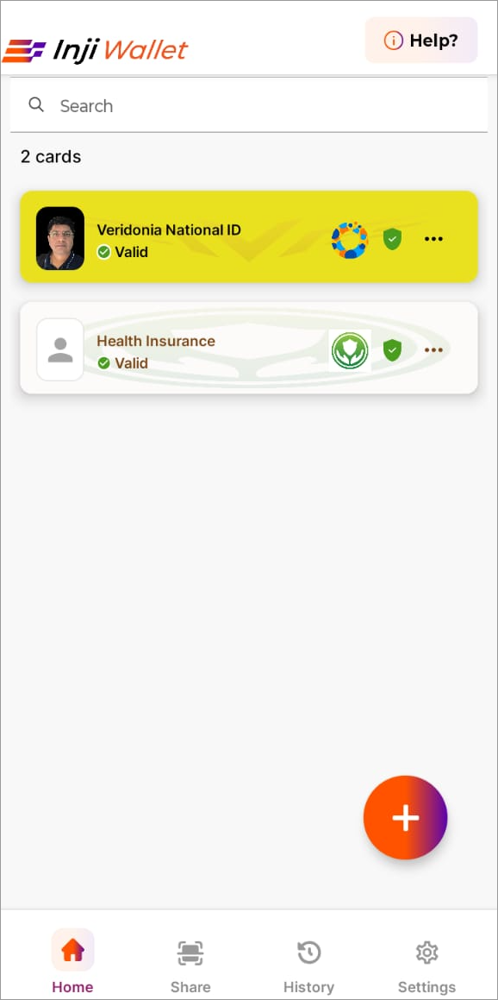<figcaption></figcaption></figure> <figure><figcaption></figcaption></figure> <figure><figcaption></figcaption></figure>

## Credential Sharing Methods

## Pre-requisites

* Two or more devices with Inji Wallet installed are required to share credentials. The relying party's phone should be an Android device.
* All required permissions like Bluetooth, location, and camera access are enabled on both devices.
* The parties involved are usually a Resident (sharing party) who wishes to share their credentials with a Relying party (receiving party), a banker, a health worker, or other professional service.

Users can now share their credentials using any of the methods listed below:

1. Share option from the NavBar.
2. Share or Share with Selfie option from the quick access menu (...) from a VC in the **Home Page**
3. Share or Share with Selfie option from quick access menu (...) in **detailed view** of VC.

Let us understand the process of sharing credentials using an example and see the step-wise process for all the above three methods. Suppose a Resident wishes to share their credentials with a Relying/ Requesting party through the receiver's phone, the following steps outline the procedure for both parties involved:

### **Share** **from Share Option in NavBar**

**On the Sharing Party's phone:**

* The resident opens the QR Code Scanner by clicking on the `Share` button in the NavBar. The application now prompts for permissions.
* Upon granting the necessary permissions, the app opens a camera where the resident can scan the QR code of the recipient's (Verifier/Relying Party) phone.
* Once the QR code is successfully scanned, both phones will establish a Bluetooth connection.
* The resident then needs to choose a downloaded VC and select either the Share or the Share with Selfie option.
* The Share button will solely share the VC, while the Share with Selfie option will verify if the sender's face matches the photo in the VC before proceeding to share.

<figure>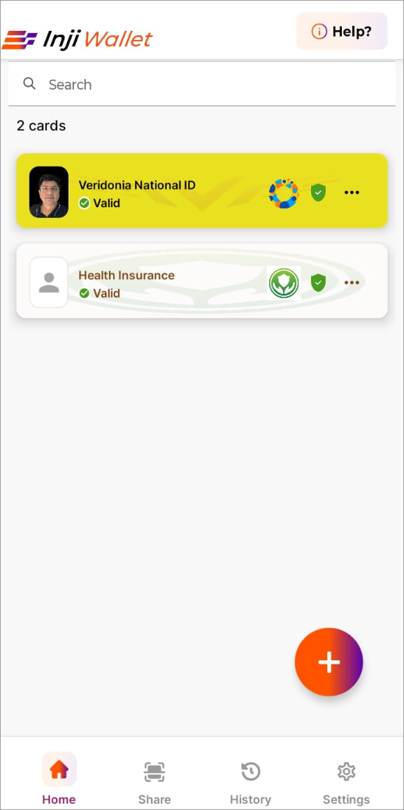<figcaption></figcaption></figure> <figure>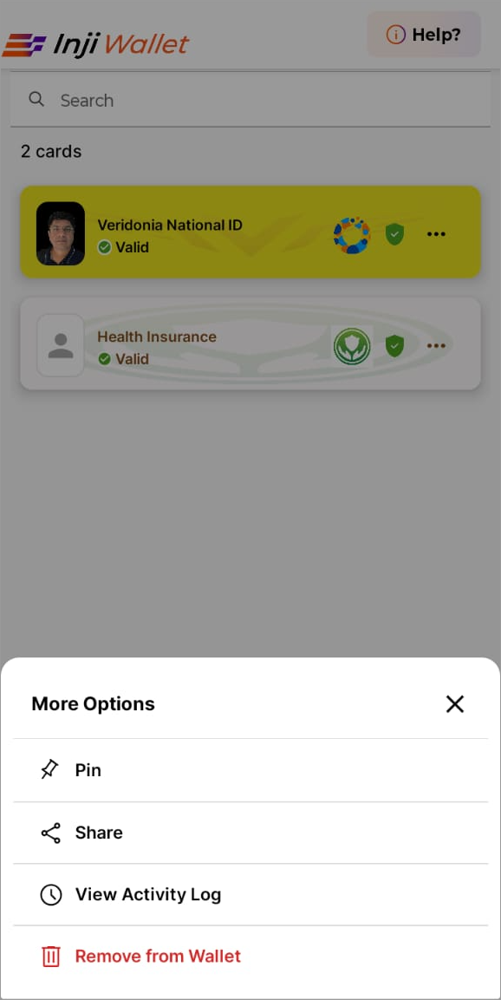<figcaption></figcaption></figure>

<figure>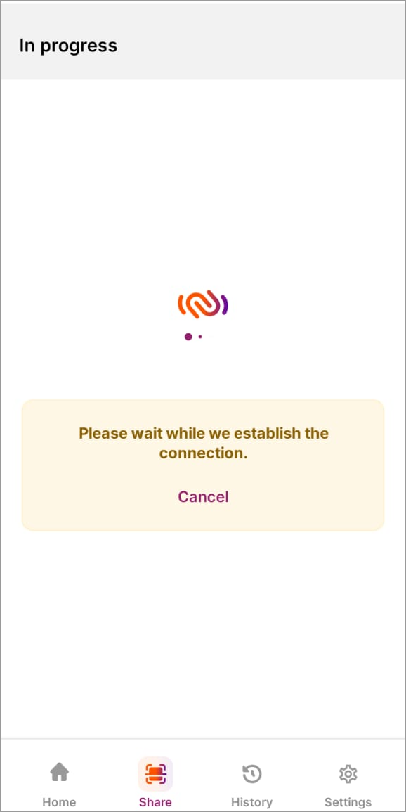<figcaption></figcaption></figure> <figure>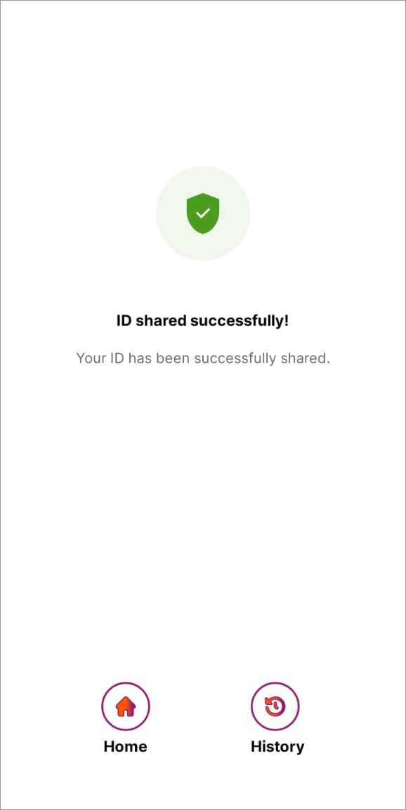<figcaption></figcaption></figure>

**On the Relying Party's phone**

* This functionality is only available on Android devices. To access it, the receiver needs to navigate to the settings page and locate the `Receive Cards` option.
* On selecting this option, it will open the QR code page. For the relying party to be able to receive a card, the resident needs to scan the QR code using a shared phone. Once the QR code is scanned and shared, the relying party will receive the VC and be able to preview its contents.
* To view the received cards, they would need to access the settings page and find the `Received Cards` section. Clicking on this section will display the received cards. If the receiver has not received any card, this section will be empty.
* Please note that the relying party can only view the received cards and will not be able to share or perform other actions with them.

<figure>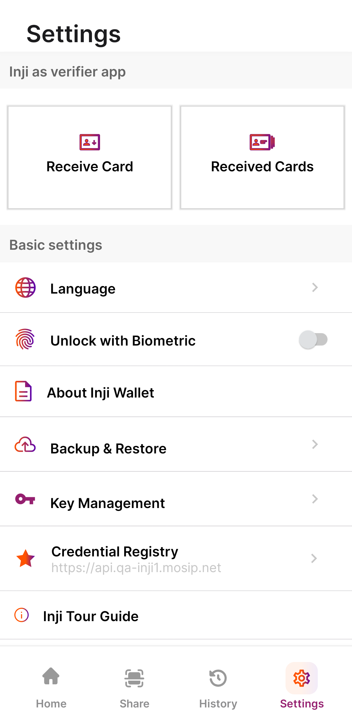<figcaption></figcaption></figure> <figure>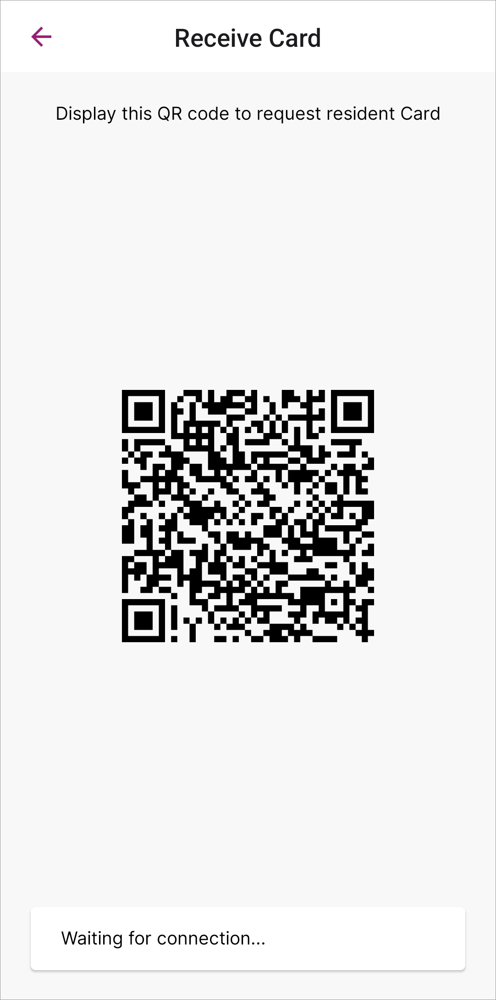<figcaption></figcaption></figure> <figure>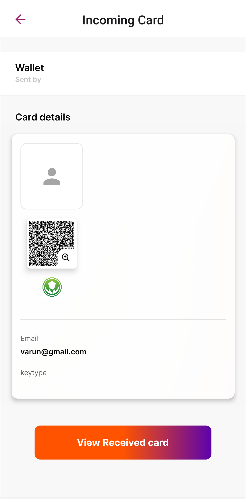<figcaption></figcaption></figure> <figure><figcaption></figcaption></figure>

### **Share / Share with Selfie from Home Page Quick Access menu**

**On the Sharing Party's phone:**

* The resident clicks on the quick access menu (...) from a VC on the Home Page and chooses the Share or Share with Selfie option from the menu.
* The application now prompts for permissions if not granted already.
* Upon granting the necessary permissions, the app opens a camera where the resident can scan the QR code of the recipient's (Verifier/Relying Party) phone.
* Once the QR code is successfully scanned, both phones will establish a Bluetooth connection.
* The Share button will solely share the VC, while the Share with Selfie option will verify if the sender's face matches the photo in the VC before proceeding to share.

<figure><figcaption></figcaption></figure> <figure><figcaption></figcaption></figure> <figure>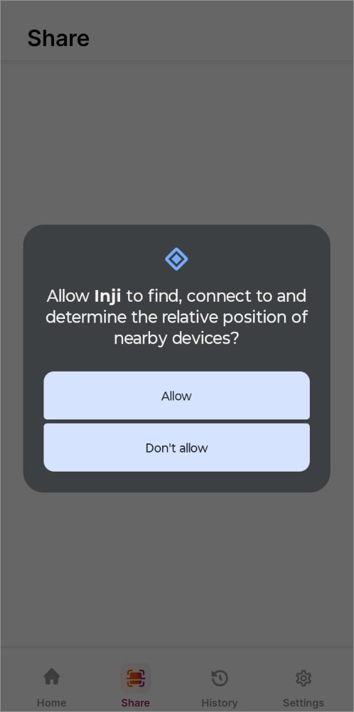<figcaption></figcaption></figure>

<figure>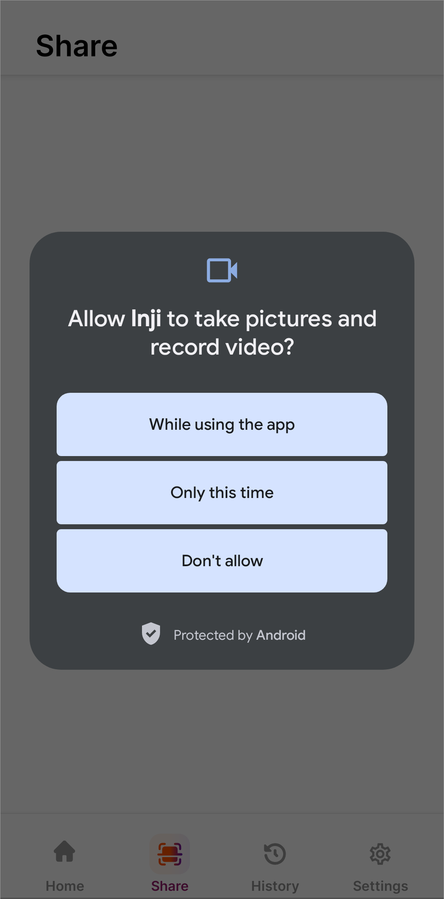<figcaption></figcaption></figure> <figure>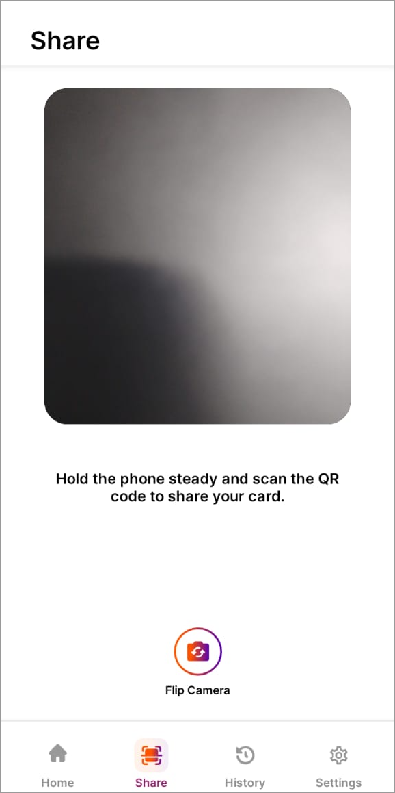<figcaption></figcaption></figure>

<figure>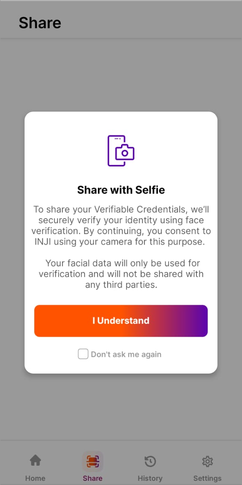<figcaption></figcaption></figure> <figure>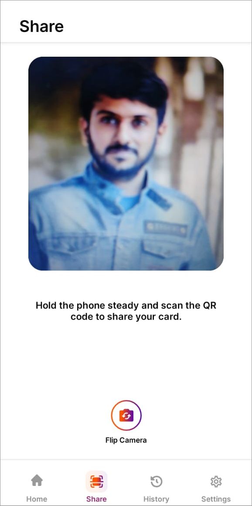<figcaption></figcaption></figure> <figure>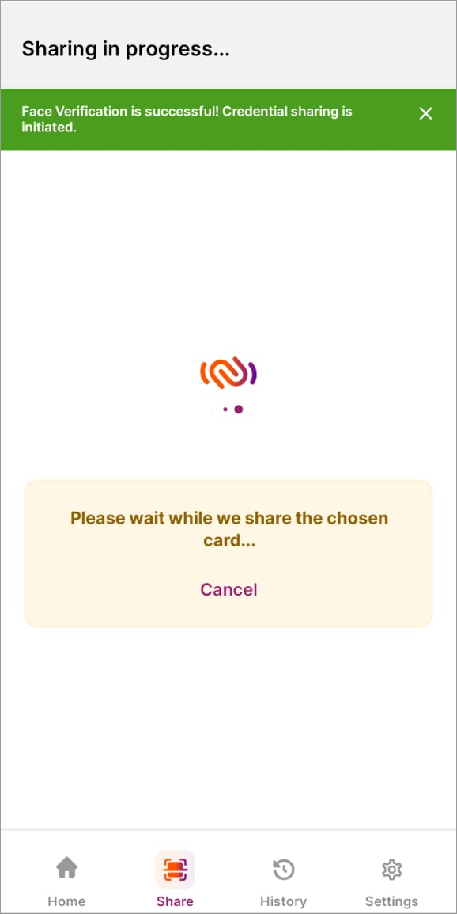<figcaption></figcaption></figure>

<figure>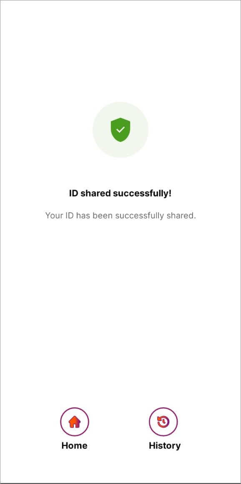<figcaption></figcaption></figure> <figure>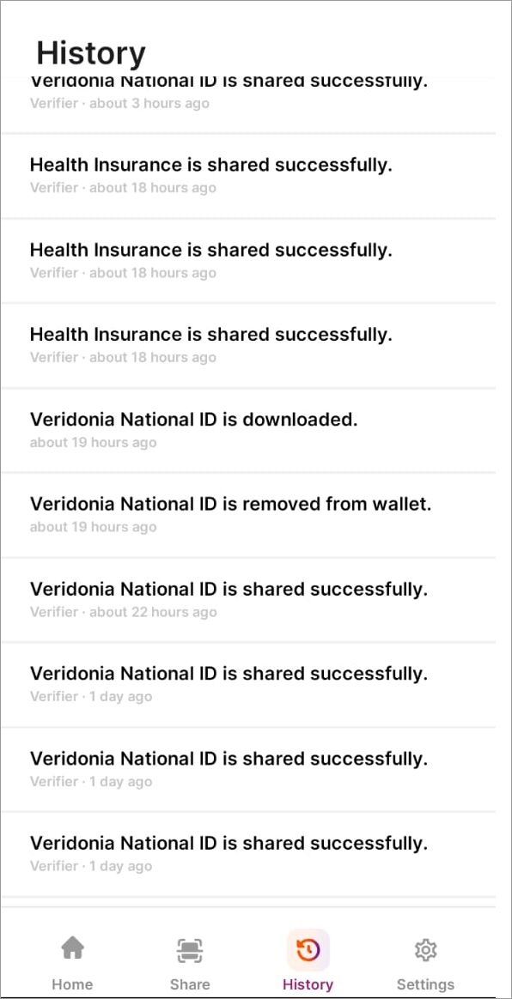<figcaption></figcaption></figure>

**On the Relying Party's phone**:

* This functionality is only available on Android devices. To access it, the receiver needs to navigate to the settings page and locate the `Receive Cards` option.
* On selecting this option, it will open the QR code page. For the relying party to be able to receive a card, the resident needs to scan the QR code using a shared phone. Once the QR code is scanned and shared, the relying party will receive the VC and be able to preview its contents.
* To view the received cards, they would need to access the settings page and find the `Received Cards` section. Clicking on this section will display the received cards. If the receiver has not received any card, this section will be empty.
* Please note that the relying party can only view the received cards and will not be able to share or perform other actions with them.

<figure>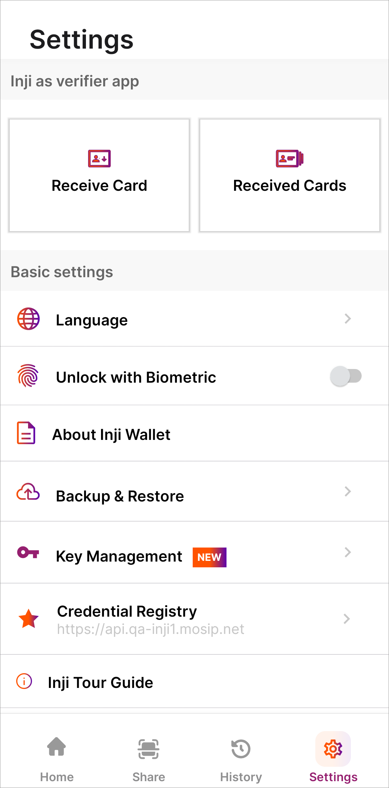<figcaption></figcaption></figure> <figure>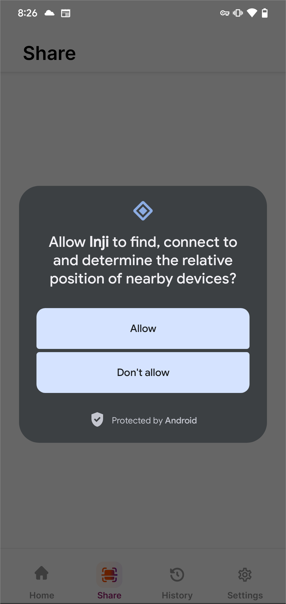<figcaption></figcaption></figure> <figure>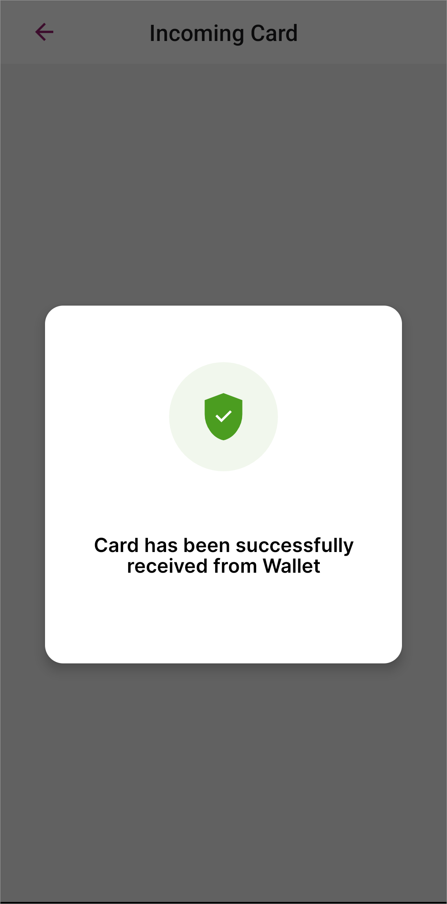<figcaption></figcaption></figure>

<figure>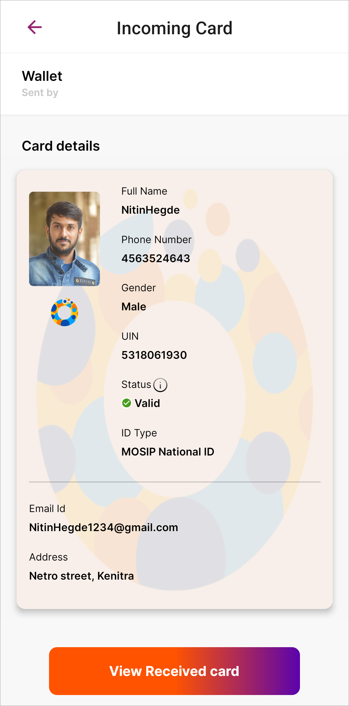<figcaption></figcaption></figure> <figure><figcaption></figcaption></figure>

### **Share with a selfie from VC Detailed View Quick Access menu**

**On the Sharing Party's phone**

* The resident clicks on the VC on the Home page and clicks on the quick access menu (...) in the detailed view. Resident can choose either Share or Share with Selfie option from the menu.
* The application now prompts for permissions if not granted already.
* Upon granting the necessary permissions, the app opens a camera where the resident can scan the QR code of the recipient's (Verifier/Relying Party) phone.
* Once the QR code is successfully scanned, both phones will establish a Bluetooth connection.
* The Share button will solely share the VC, while the Share with Selfie option will verify if the sender's face matches the photo in the VC before proceeding to share.

**On the Relying Party's phone:**

* This functionality is only available on Android devices. To access it, the receiver needs to navigate to the settings page and locate the `Receive Cards` option.
* On selecting this option, it will open the QR code page. For the relying party to be able to receive a card, the resident needs to scan the QR code using a shared phone. Once the QR code is scanned and shared, the relying party will receive the VC and be able to preview its contents.
* To view the received cards, they would need to access the settings page and find the `Received Cards` section. Clicking on this section will display the received cards. If the receiver has not received any card, this section will be empty.
* Please note that the relying party can only view the received cards and will not be able to share or perform other actions with them.

### **Verifiable Credential Sharing & Presentation via OpenID4VP**

> **Note:** Screenshots will be added soon to enhance the user experience and better explain the steps shown below.

Inji Wallet supports two primary modes of sharing Verifiable Credentials (VCs) using the **OpenID4VP** protocol:

* **Same-Device Flow**, where the wallet and verifier are accessed from the same mobile device.
* **Cross-Device Flow**, where the wallet and verifier operate on separate devices.

Both flows support **standard JSON-LD VCs**, **mDL (ISO 18013-5)**, and IETF **SD-JWT** credentials for full or non-selective disclosure sharing.\
For privacy-preserving selective disclosure, the **SD-JWT VP** flow is followed, as described below.

#### Cross-Device Flow (OpenID4VP)

This method is used when the **Inji Wallet** is on a **mobile phone**, and the **verifier** (such as a service provider portal, kiosk, or scanner) operates on a **different device** (e.g., laptop or tablet).

**Steps to Present Credentials:**

1. **Verifier generates a QR code** on their system/portal requesting specific credentials.
2. On your **Inji Wallet**, tap the **QR scanner icon** from the home screen or use the “Share” option.
3. **Scan the QR code** displayed by the verifier.
4. The wallet reads the verifier’s request and shows you a list of **matching credentials**.
5. You are prompted for **face authentication**.
6. Choose the credentials you want to share.
7. Tap **“Share”** to proceed. The wallet sends the Verifiable Presentation (VP) to the verifier securely.
8. You’ll see a confirmation message once the sharing is complete.

#### Same-Device Flow (OpenID4VP)

This method is useful when you’re accessing a portal from the **same mobile device** that has the **Inji Wallet** installed.

**Steps to Present Credentials:**

1. On your phone browser, visit the service portal that is requesting your credentials.
2. Tap on the **“QR Code”** or similar button.
3. This opens a **deep link** that launches your **Inji Wallet app** automatically.
4. The wallet fetches the verifier’s request.
5. A list of matching credentials is displayed.
6. You will be asked for **face authentication**.
7. Choose the credentials to be shared.
8. Tap **“Share”**.
9. You are automatically redirected back to the service portal (Android).
   * On **iOS**, you may need to manually switch back to the browser.

#### **Selective Disclosure Flow (IETF SD-JWT VP)**

This method allows users to share **only specific claims** from an IETF **SD-JWT credential**, ensuring **privacy-preserving** and **minimal disclosure** of information.

**Steps to Present Credentials with SD-JWT VP:**

1. Access the verifier’s **portal or service** (same-device or cross-device).
2. Initiate the **credential request** using the **OpenID4VP flow**.
3. The verifier specifies **required claims** (e.g., Name, Date of Birth).
4. The **Inji Wallet** parses the **SD-JWT credential** and identifies which claims can be selectively disclosed.
5. The wallet displays:
   * The verifier’s details and request information.
   * A **list of available claims** within the SD-JWT credential.
6. The user can **select only the claims** they wish to share.
7. The wallet generates a **Verifiable Presentation (VP)** containing only the selected claims.
8. You are prompted for **authentication** (Face) if VC contains a face photo.
9. Upon confirmation, the **SD-JWT VP** is securely shared with the verifier.
10. A success message confirms completion of the privacy-preserving sharing process.

### **Revocation Check**

1. **Download a new credential into the Inji Wallet.**\
   As soon as the download finishes, the app automatically begins checking whether the credential is still valid.
2. **The wallet looks up the status of the credential.**\
   It checks if the issuing authority has marked the credential as:
   * Active (valid)
   * Revoked (no longer valid)
   * Or if the status cannot be confirmed yet
3. **The wallet verifies the information.**\
   To make sure the status is trustworthy, the wallet:
   * Confirms the status file is valid
   * Checks that the information is current
4. **The wallet updates the credential status on the screen.**\
   Based on the result, you will see:
   * 🟢 **Valid** — you can use or share the credential
   * 🔴 **Revoked** — you cannot use it
   * 🟡 **Pending** — try again later; internet may be required
5. **The wallet logs the status check.**\
   The app saves a record in your **History** showing when the status was last checked.
6. **Manually check the status anytime.**\
   To check the status later, you can go to the card options and tap **Check Status**.

### Pinning a VC

After clicking on the ellipsis button on the downloaded VC, a button will appear allowing for the VC to be pinned. Selecting this option will pin the specific VC to the top of the screen.

<figure><figcaption>
Pinning a VC
</figcaption></figure> <figure>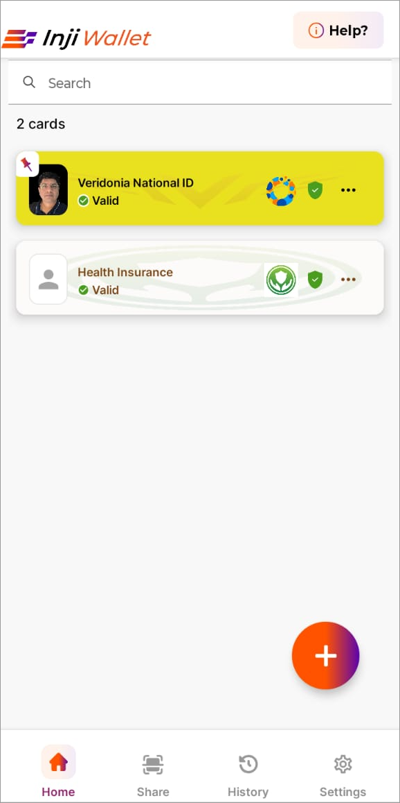<figcaption>
Pinning a VC
</figcaption></figure> <figure>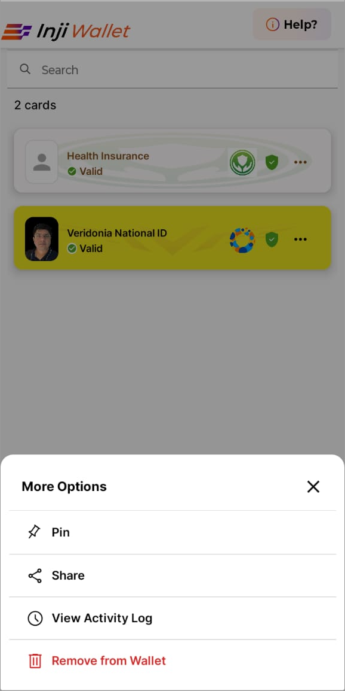<figcaption>
Pinning a VC
</figcaption></figure>

### Activating a VC

There are two ways to activate the VC:

* The first option is to click on the "Activate for online login" menu option by clicking on the quick access menu (...) of the card from the Home Page.
* The second option is to click on the "Activate for online login" menu option by clicking on the quick access menu (...) of the card from the detailed view of the VC.
* A confirmation alert message will be prompted upon clicking the "Activate for online login" option. Once permission is granted, the user will be directed to an OTP screen. After entering the correct OTP, the VC will be activated and projected on the screen with the same message.

<figure>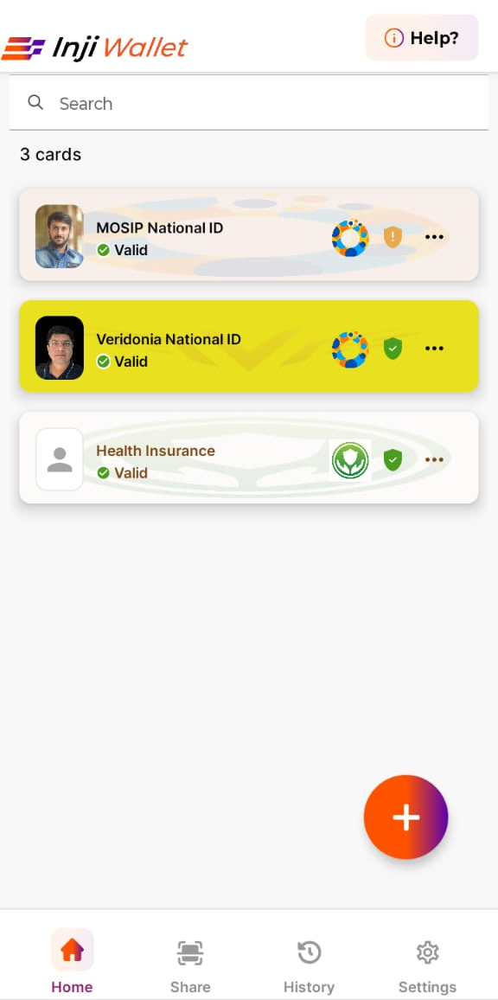<figcaption></figcaption></figure> <figure>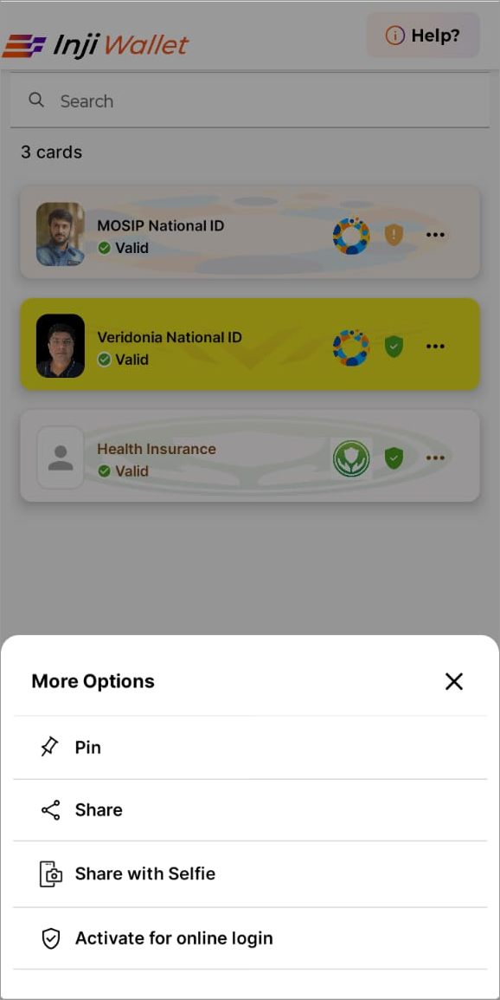<figcaption></figcaption></figure> <figure>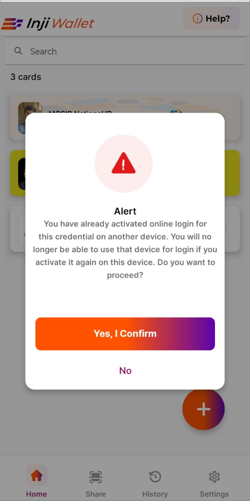<figcaption></figcaption></figure> <figure>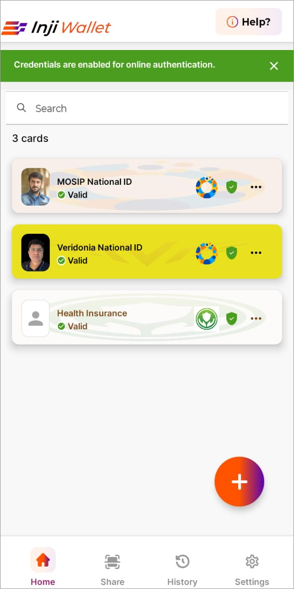<figcaption></figcaption></figure>

### Deleting a VC

There are two ways to remove/delete a VC from the wallet:

* The first option is to click on the Remove from Wallet menu option from the quick access menu (...) of the card from the Home Page.
* The second option is to choose the Remove from Wallet menu option from the quick access menu (...) of the card from the detailed view of the VC.
* Upon clicking this option, the user will be prompted with a pop-up for confirmation. If the user chooses, “Yes, I confirm” the VC will be removed from the wallet.

<figure><figcaption></figcaption></figure> <figure>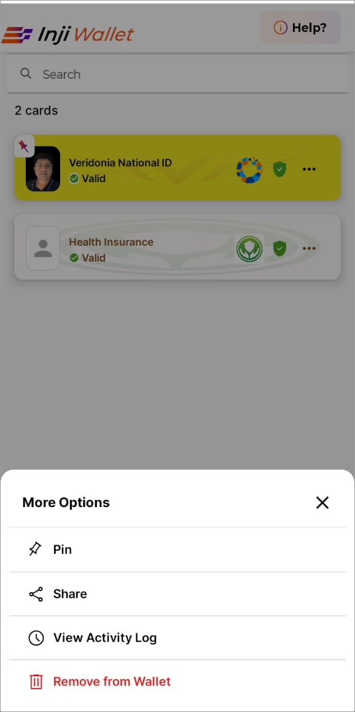<figcaption></figcaption></figure> <figure>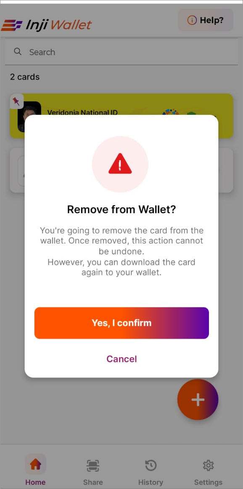<figcaption></figcaption></figure>

## Search

Users can now search for a VC by providing a search string in the search bar. VCs that match the search criteria will be displayed.

<figure><figcaption></figcaption></figure> <figure>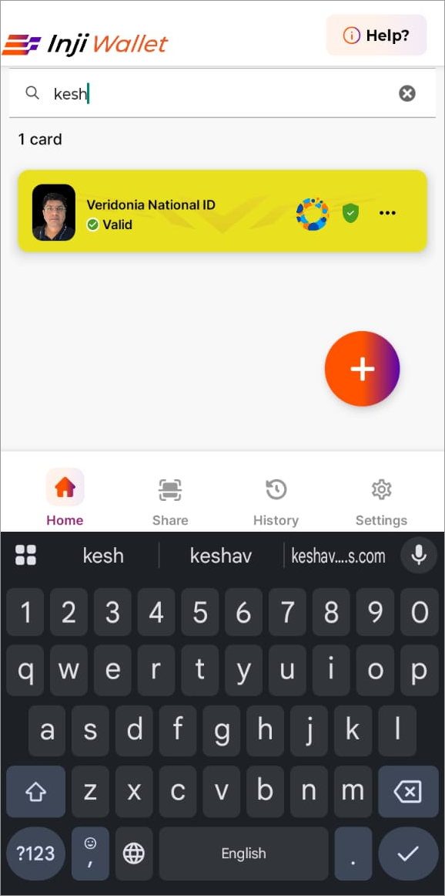<figcaption></figcaption></figure> <figure>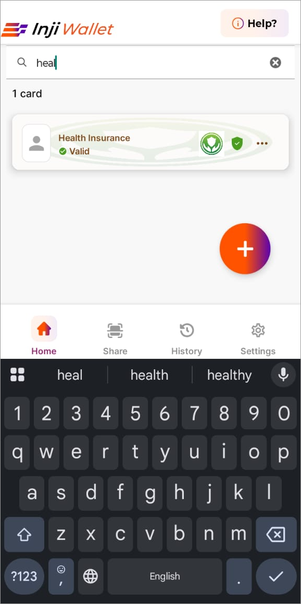<figcaption></figcaption></figure>

## Data backup and restore

### Backup

To backup VCs, the user has to choose their preference for the cloud based on the device they are using.

1. Firstly, the user has to go to settings and click on the Backup and Restore menu options.
2. The User should consent for the app to use the drive, and once consented, the application displays a backup and restore screen.
3. In this screen, the user can manually take a backup by clicking on the Backup button and this asynchronously happens allowing the user to use the application.
4. Users will be notified of success or failure.

### Data backup - Android

<figure><figcaption></figcaption></figure>

<figure><figcaption></figcaption></figure>

### Data backup- ios

<figure><figcaption></figcaption></figure>

<figure><figcaption></figcaption></figure>

### Restore

To restore backed-up VCs, the user has to choose their preference of the cloud based on the device and use the same Google/apple ID that they used for taking backups.

1. Firstly, the user has to go to settings and click on the Backup and Restore menu options.
2. The user should consent for the app to use the drive, and once consented, the application displays a backup and restore screen.
3. Users find the details of latest backup details in the Last Backup Details section.
4. In this screen, the user can manually restore a backup by clicking on the Restore button and this asynchronously happens allowing the user to use the application.
5. Users will be notified of success or failure.

### Restore - Android

<figure><figcaption></figcaption></figure>

### Restore - ios

<figure><figcaption></figcaption></figure>
