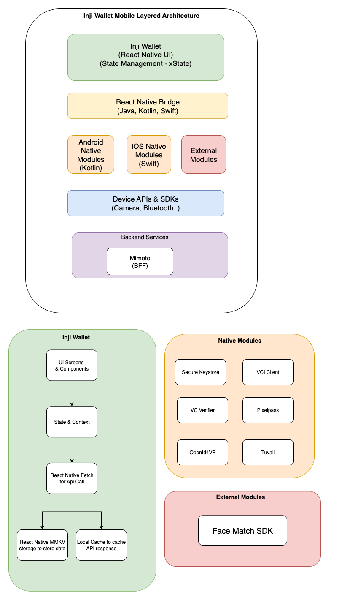

# Architecture

Inji Wallet is a mobile application designed to enhance user convenience by allowing them to securely download and manage their Verifiable Credentials (VC) offline. The diagram below illustrates the extensive features of Inji Mobile Wallet, highlighting the essential modules involved in issuing Verifiable Credentials.

Furthermore, this overview outlines various user flows, detailing the seamless processes users can follow. These processes include downloading VC by utilizing eSignet for authentication, securely activating VC, logging in to eSignet, and effortlessly sharing VCs.

<figure><figcaption>
Inji Wallet Architecture
</figcaption></figure>

The Inji Mobile Wallet adopts a layered architecture pattern, ensuring clear separation of concerns and robust security for verifiable credentials. Built with React Native, it delivers a seamless, cross-platform experience on both iOS and Android.

### Architecture Layers

1. **Presentation Layer (Green)**

* **Component:** Inji Wallet UI (React Native)
* **Purpose:** Renders the user interface and manages application state using xState.
* **Features:** Cross-platform UI, declarative state management, user interaction handling.

2. **Communication Bridge Layer (Yellow)**

* **Component:** React Native Bridge
* **Purpose:** Enables communication between JavaScript and native code (Java, Kotlin, Swift).
* **Functionality:** Accesses native platform features from React Native.

3. **Native Platform Layer (Orange)**

* **Components:** Android Native Modules (Kotlin), iOS Native Modules (Swift), External Modules
* **Purpose:** Handles platform-specific operations and SDK integrations.

4. **Device Hardware & API Layer (Blue)**

* **Component:** Device APIs & SDKs (Camera, Bluetooth, etc.)
* **Purpose:** Interfaces with device hardware and system APIs for features like camera access and BLE communication.

5. **Backend Services Layer (Purple)**

* **Component:** Mimoto (Backend for Frontend)
* **Purpose:** Orchestrates API calls, formats data, and manages authentication between the app and backend services.

### Detailed Component Breakdown

#### React Native Application Components

* **UI Screens & Components:** User interface elements and screens.
* **State & Context:** Application state management with context providers.
* **API Communication:** Uses React Native Fetch for backend requests.
* **Local Storage:** MMKV for high-performance key-value storage and local caching.

#### Native Modules

* **Secure Keystore:** Manages cryptographic keys and secure storage.
* **VCI Client:** Handles verifiable credential issuance.
* **VC Verifier:** Validates and verifies credentials.
* **Pixelpass:** Renders and displays credentials securely.
* **OpenId4VP:** Implements OpenID for Verifiable Presentations.
* **Tuvali:** Enables BLE-based peer-to-peer credential sharing.

#### External Modules

* **Face Match SDK:** Provides biometric authentication and face matching.

### Data Flow & Component Interactions

* **Vertical Flow:**\
  User Input → UI Screens → State Management → API Calls → Data Persistence (MMKV/Cache) → Native Operations → Hardware Access
* **Horizontal Integrations:**
  * **Backend Communication:** Mimoto (BFF)
  * **Security:** Secure Keystore
  * **Credential Management:** VCI Client, VC Verifier
  * **Peer-to-Peer Sharing:** Tuvali (BLE)
  * **Biometric Security:** Face Match SDK

### Key Architectural Principles

* **Layered Separation:** Distinct boundaries between UI, business logic, and data.
* **Cross-Platform Compatibility:** Single codebase for iOS and Android.
* **Security-First Design:** Hardware-backed keystore and biometric integration.
* **Modular Architecture:** Independent native modules for extensibility.
* **Standards Compliance:** OpenID4VP and W3C Verifiable Credentials.
* **Performance Optimization:** MMKV storage and local caching.

### Technology Stack Summary

* **Frontend:** React Native, xState
* **State Management:** xState
* **Storage:** MMKV
* **Native Development:** Kotlin (Android), Swift (iOS)
* **Communication:** BLE (Tuvali), HTTP (REST APIs)
* **Security:** Secure keystore, biometric authentication
* **Standards:** OpenID4VP, W3C Verifiable Credentials

This architecture ensures scalability, security, and maintainability, delivering a seamless digital credential management experience.
