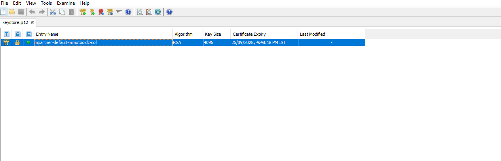
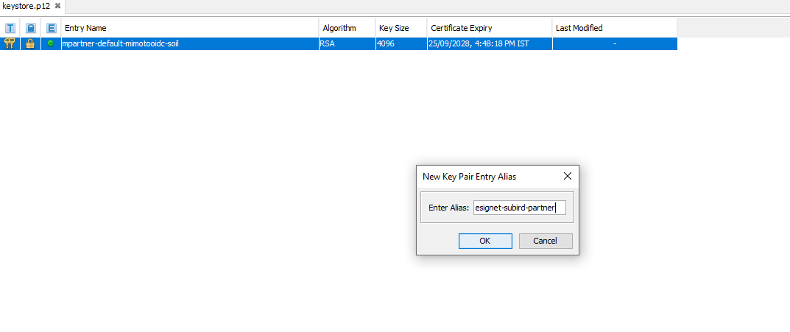

# Credential Providers

Inji Wallet Mobile gets its issuer list from Mimoto. Mimoto reads issuer definitions from [`mimoto-issuers-config.json`](https://github.com/inji/inji-config/blob/master/mimoto-issuers-config.json) in [`inji/inji-config`](https://github.com/inji/inji-config).

The wallet currently calls:

```http
GET /v1/mimoto/issuers
GET /v1/mimoto/issuers/{issuer-id}
```

Mimoto also has `/v2/issuers` endpoints, but the release 1.x mobile wallet code still uses the `/v1/mimoto/issuers` endpoints.

## Supported Issuer Protocols

Issuer entries use the `protocol` field:

| Protocol | Purpose |
| --- | --- |
| `OpenId4VCI` | OpenID for Verifiable Credential Issuance based credential download. |
| `OTP` | Legacy MOSIP OTP/UIN/VID/AID credential download flow. |

Current default issuer examples include `MosipOtp`, `Mosip`, `StayProtected`, `Mock`, `MosipTAN`, `Land`, and `MockMdl`. Environments can enable, disable, add, or remove entries according to their deployment needs.

## Add an OpenID4VCI Issuer

Add a new object to the `issuers` array in `mimoto-issuers-config.json`.

Minimum fields used by the wallet and Mimoto are:

```json
{
  "issuer_id": "ExampleIssuer",
  "credential_issuer": "ExampleIssuer",
  "credential_issuer_host": "https://issuer.example.org",
  "display": [
    {
      "name": "Example Issuer",
      "logo": {
        "url": "https://example.org/logo.png",
        "alt_text": "Example issuer logo"
      },
      "title": "Download Example Credential",
      "description": "Download example credential",
      "language": "en"
    }
  ],
  "protocol": "OpenId4VCI",
  "client_id": "${mimoto.oidc.example.partner.clientid}",
  "client_alias": "mpartner-default-mimoto-example-oidc",
  "wellknown_endpoint": "https://issuer.example.org/v1/certify/issuance/.well-known/openid-credential-issuer",
  "redirect_uri": "io.mosip.residentapp.inji://oauthredirect",
  "token_endpoint": "https://${mosip.api.public.host}/v1/mimoto/get-token/ExampleIssuer",
  "authorization_audience": "https://auth.example.org/v1/esignet/oauth/v2/token",
  "proxy_token_endpoint": "https://auth.example.org/v1/esignet/oauth/v2/token",
  "qr_code_type": "OnlineSharing",
  "enabled": "true"
}
```

Important rules:

* `issuer_id` is the stable key used by wallet state and API calls.
* `token_endpoint` must use the same issuer id in `/v1/mimoto/get-token/{issuer_id}`.
* `credential_issuer_host` is used by the wallet to fetch issuer well-known metadata.
* `wellknown_endpoint` must expose OpenID4VCI issuer metadata. Inji Certify deployments usually expose this at `/v1/certify/issuance/.well-known/openid-credential-issuer`.
* `display` controls how the issuer appears on the Add New Card screen. Add one object per supported language.
* `enabled` must resolve to `true` for the issuer to appear.

After adding the issuer, restart or refresh the Mimoto deployment so it reloads the configuration. The wallet caches issuer responses, so a fresh app launch or cache expiry may be needed before the new issuer is visible.

## Credential Formats and Verification

The release 1.x wallet supports these credential formats:

* `ldp_vc`
* `mso_mdoc`
* `vc+sd-jwt`
* `dc+sd-jwt`

For key management and signing, the wallet maps the following algorithms to local key types:

* `EdDSA` / `Ed25519`
* `ES256`
* `ES256K`
* `RS256`

Verification is not limited to RSA proof types. On Android the wallet uses the VC verifier module for supported formats. On iOS, `mso_mdoc`, `vc+sd-jwt`, and `dc+sd-jwt` currently return a successful verification result while native verifier support is being completed, and `ldp_vc` verification uses the supported JSON-LD suites. Credential-offer verification can also be disabled by configuration through `disableCredentialOfferVcVerification`.

## Onboard Mimoto as an OIDC Client

Each OpenID4VCI issuer needs a corresponding OIDC client entry for Mimoto.

### Step 1: Generate the key material

Use the provided cert generation utility to create the `oidckeystore.p12` and public JWK.



The `Userguide.md` inside the zip explains how to run the script.

### Step 2: Create the OIDC client

Create a client ID using the eSignet client management API:

```js
RequestURL : {{ESIGNET-URL}}/v1/esignet/client-mgmt/oidc-client
```

Sample request body:

```js
{
  "requestTime": "2024-06-19T11:56:01.925Z",
  "request": {
    "clientId": "client-id",
    "clientName": "client-name",
    "publicKey": "public-key",
    "relyingPartyId": "client-id",
    "userClaims": [
      "birthdate",
      "address",
      "gender",
      "name",
      "phone_number",
      "picture",
      "email",
      "individual_id"
    ],
    "authContextRefs": [
      "mosip:idp:acr:linked-wallet",
      "mosip:idp:acr:biometrics",
      "mosip:idp:acr:knowledge",
      "mosip:idp:acr:generated-code"
    ],
    "logoUri": "https://example.org/logo.png",
    "redirectUris": [
      "io.mosip.residentapp.inji://oauthredirect",
      "https://injiweb.example.org/redirect"
    ],
    "grantTypes": [
      "authorization_code"
    ],
    "clientAuthMethods": [
      "private_key_jwt"
    ]
  }
}
```

Sample response:

```js
{
  "responseTime": "2024-11-13T08:16:42.259Z",
  "response": {
    "clientId": "client-id",
    "status": "ACTIVE"
  },
  "errors": []
}
```


Create one client per environment unless there is a reason to rotate it. Reusing a public key and p12 pair for multiple client registrations can fail unless the previous entry is removed from the authorization server database.


### Step 3: Update Mimoto issuer config

Set the `client_id`, `client_alias`, `authorization_audience`, `proxy_token_endpoint`, `token_endpoint`, and `wellknown_endpoint` values in the issuer entry. The client id should match the value returned by the client creation API or the deployment property referenced by the issuer config.

### Step 4: Upload issuer logo

Upload the issuer logo to a publicly reachable file server and reference it from both:

* `display[].logo.url` in `mimoto-issuers-config.json`
* `logoUri` in the OIDC client registration, if the authorization server consent UI should show it


For each new issuer, generate key material, register the OIDC client, update the issuer config, and ensure the logo URL is reachable.


### Step 5: Mount the keystore in Mimoto

If the deployment already has an `oidckeystore.p12`, export it from the Mimoto pod, add the new keypair as a new alias, and remount the updated keystore.

```js
kubectl -n mimoto cp <mimoto-podname>:certs/..data/oidckeystore.p12 oidckeystore.p12
```

Use a keystore tool to import the new keypair into the existing p12. The alias should match the issuer's configured `client_alias`.

Back up the original secret:

```js
kubectl -n mimoto get secrets mimotooidc -o yaml | sed "s/name: mimotooidc/name: mimotooidc-backup/g" | kubectl -n mimoto create -f -
```

Replace the secret with the updated keystore:

```js
kubectl delete secret -n mimoto mimotooidc
kubectl -n mimoto create secret generic mimotooidc --from-file=./oidckeystore.p12
```

Then restart the Mimoto pod.

## Using MOSIP Services to Issue MOSIP Credentials

When the issuer is backed by MOSIP services:

1. Create and onboard the partner in the MOSIP ecosystem. See the MOSIP partner onboarding documentation for the target MOSIP release.
2. Add the partner keypair to the existing Mimoto OIDC keystore as another alias; do not replace the whole keystore unless the deployment intends to rotate all Mimoto OIDC clients.
3. Create or update deployment secrets such as `mimoto.oidc.<issuer>.partner.clientid`.
4. Ensure the config-server or deployment property source exposes those values to Mimoto.
5. Restart Mimoto and verify:
   * `GET /v1/mimoto/issuers` includes the issuer.
   * `GET /v1/mimoto/issuers/{issuer-id}` returns the issuer details.
   * The issuer well-known endpoint is reachable from the wallet/Mimoto environment.
   * The Add New Card screen displays the issuer.

<figure><figcaption><p>Original p12 file as downloaded from environment</p></figcaption></figure>

<figure><figcaption><p>Importing a new keypair</p></figcaption></figure>

The image below shows how to browse and select the client id's oidckeystore as the second alias. The decryption password field should have the password of the p12 file. Note: we have used `esignet-sunbird-partner` as client id for reference in the attachment.

<figure><figcaption><p>Selection of OIDC Keystore</p></figcaption></figure>

The image below shows how to add an alias for the new key pair, here the value is `esignet-sunbird-partner`.

<figure><figcaption><p>Alias for the new keypair</p></figcaption></figure>

<figure><figcaption><p>Add keypairs to keystore.p12</p></figcaption></figure>
