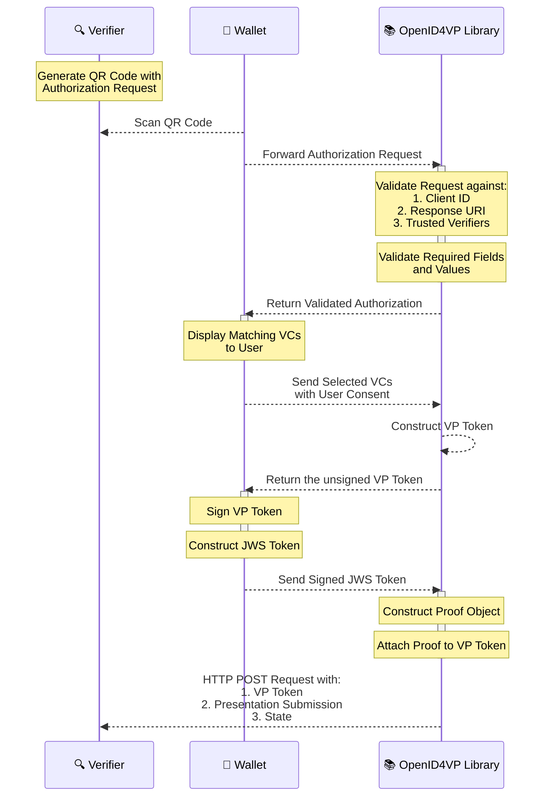

# OpenID4VP

## OpenID4VP - Online Sharing

This library enables consumer applications (mobile wallet) to share users Verifiable Credentials with Verifiers who request them online. It adheres to the OpenID4VP [specification](https://openid.net/specs/openid-4-verifiable-presentations-1_0-23.html) draft version 23, which outlines the standards for requesting and presenting Verifiable Credentials.

#### Library Functionalities: Processing the Request from Decoding to Verifier Response

1. Receives the Verifier's Authorization Request sent by the consumer application (mobile wallet).
2. Validates the received Authorization Request to check if the required details are present or not, and then returns the Authorization Request to the consumer application once all the validations are successful.
3. Receives the list of Verifiable Credentials from the consumer application which are selected by the consumer application end-user based on the credentials requested as part of Verifier Authorization request.
4. Constructs the vp\_token without proof section and sends it back to the consumer application for generating Json Web Signature (JWS).
5. Receives the generated signature along with the other details and generates vp\_token with proof section & presentation\_submission.
6. Sends a POST request with generated vp\_token and presentation\_submission to the received Verifier's response\_uri endpoint.
7. Below sections details on the steps for integrating the Kotlin and Swift packages into the app. Below sections details on the steps for integrating the Kotlin and Swift packages into the app.

**Supported features**

| Feature                                                    | Supported values                                                                                                                                                                                                                                                                                             |
| ---------------------------------------------------------- | ------------------------------------------------------------------------------------------------------------------------------------------------------------------------------------------------------------------------------------------------------------------------------------------------------------ |
| Device flow                                                | Cross device flow, Same device flow (only `direct_post` and `direct_post.jwt` supported)                                                                                                                                                                                                                     |
| Client id scheme                                           | `pre-registered`, `redirect_uri`, `did`                                                                                                                                                                                                                                                                      |
| Signed authorization request verification algorithms       | Ed25519                                                                                                                                                                                                                                                                                                      |
| Obtaining authorization request                            | 
- By value : both signed (via <code>request</code> param) and unsigned (via URL encoded parameters) - By reference ( via <code>request_uri</code> method) <em>Note: The use of signed or unsigned requests, is determined by the <code>client_id_scheme</code> associated with the client.</em>
 |
| Obtaining presentation definition in authorization request | By value, By reference (via `presentation_definition_uri`)                                                                                                                                                                                                                                                   |
| Authorization Response content encryption algorithms       | `A256GCM`                                                                                                                                                                                                                                                                                                    |
| Authorization Response key encryption algorithms           | `ECDH-ES`                                                                                                                                                                                                                                                                                                    |
| Credential formats                                         | `ldp_vc`, `mso_mdoc`, `dc+sd-jwt`, `vc+sd-jwt`                                                                                                                                                                                                                                                               |
| Authorization Response mode                                | `direct_post`, `direct_post.jwt` (with encrypted & unsigned responses) and `iar-post` (unencrypted response), `iar-post.jwt` (Encrypted and unsigned response)                                                                                                                                               |
| Authorization Response type                                | `vp_token`                                                                                                                                                                                                                                                                                                   |

### Android: Kotlin package for OpenID4VP:

#### Repository

* inji-openid4vp kotlin repo - [here](https://github.com/inji/inji-openid4vp)

#### Installation

Snapshot builds are available - [aar](https://central.sonatype.com/artifact/io.inji/inji-openid4vp-aar) and [jar](https://central.sonatype.com/artifact/io.inji/inji-openid4vp-jar)


Note: implementation "io.inji:inji-openID4VP:0.7.0"


### iOS: Swift package for OpenID4VP:

#### Repository

* inji-openid4vp-ios-swift swift repo -> [here](https://github.com/inji/inji-openid4vp-ios-swift)

#### Installation

1. Clone the repo.
2. In your swift application go to file > add package dependency > add the https://github.com/inji/inji-openid4vp-ios-swift in git search bar > add package.
3. Import the library and use.

### APIs

The OpenID4VP library provides the following APIs for implementing the OpenID4VP flow:

| API Method                   | Use Case                                                                                           |
| ---------------------------- | -------------------------------------------------------------------------------------------------- |
| `authenticateVerifier`       | Validate and decode the verifier's authorization request                                           |
| `constructUnsignedVPToken`   | Create unsigned VP tokens (V1 API) from verifiable credentials for signing by the wallet           |
| `constructUnsignedVPTokenV2` | Create flattened list of unsigned VP tokens (V2 API) with signing metadata for simplified workflow |
| `constructVPResponse`        | Construct the VP response (V1 API) with signed tokens ready to be sent to the verifier             |
| `constructVPResponseV2`      | Construct the VP response (V2 API) from simplified signing results                                 |
| `sendVPResponseToVerifier`   | Construct VP response and send it to the verifier via HTTP POST                                    |
| `constructErrorInfo`         | Construct an authorization error response as per OpenID4VP specification                           |
| `sendErrorInfoToVerifier`    | Construct and send error response to the verifier via HTTP POST                                    |

> **For detailed API reference including parameters, response structures, examples, and exceptions, refer to the** [**Kotlin API Reference**](https://github.com/inji/inji-openid4vp/tree/master/kotlin#apis) **or** [**Swift API Reference**](https://github.com/inji/inji-openid4vp-ios-swift?tab=readme-ov-file#apis) **accordingly.**

#### OpenID4VP library and Inji Wallet integration:

The below diagram shows the interactions between Inji Wallet, Verifier and OpenID4VP library.

_Note: Currently, the `vp_token` uses the `Ed25519Signature2020` type for digital signatures._
