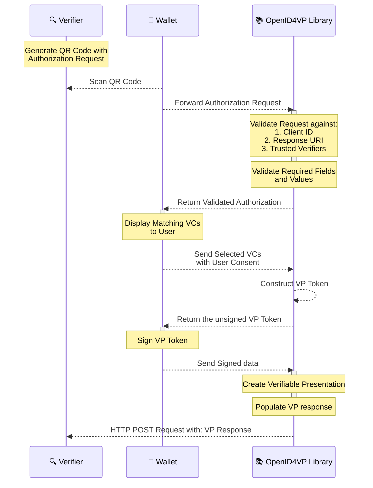

# OpenID4VP

## OpenID4VP - Online Sharing

This library for **wallet-side** processing of [OpenID for Verifiable Presentations](https://openid.net/specs/openid-4-verifiable-presentations-1_0.html) (OpenID4VP). This library validates incoming authorization requests, helps build Verifiable Presentations (with signing delegated to your app), and sends responses to the verifier.

**Key Responsibilities:**

* **OpenID4VP Library**

    * Handles OpenID4VP protocol workflows and compliance
    * Simplifies Verifiable Presentation creation and response exchange
    * Reduces development complexity and integration time

* **Library Consumer App**

    * Owns user consent and credential selection
    * Performs secure cryptographic signing

Build OpenID4VP capabilities faster with a library designed to remove protocol complexity, reduce implementation risk, and accelerate your journey toward interoperable digital credentials.

## Supported features

### Feature Matrix by Specification Version

**Legend:** ✅ = Supported | ❌ = Not Implemented | N/A = Not Applicable

| Feature                                       | Draft 23  | Version 1.0 | Notes                                                                                                                                                        |
|-----------------------------------------------|:---------:|:-----------:|--------------------------------------------------------------------------------------------------------------------------------------------------------------|
| **Device Flow**                               |           |             |                                                                                                                                                              |
| — Cross device flow                           |     ✅     |      ✅      | Wallet scans QR code and passes data to this library                                                                                                         |
| — Same device flow                            |     ✅     |      ✅      | Wallet receives VP request via deeplink                                                                                                                      |
| **Client ID Prefix**                          |           |             | Equivalent to Client ID Scheme in draft 23                                                                                                                   |
| — pre-registered                              |     ✅     |      ✅      | Validated via `WalletConfig.trustedVerifiers`                                                                                                                |
| — redirect_uri                                |     ✅     |      ✅      |                                                                                                                                                              |
| — decentralized_identifier                    | ✅ (`did`) |      ✅      |                                                                                                                                                              |
| **Authorization Request Delivery**            |           |             | Per [RFC 9101](https://www.rfc-editor.org/info/rfc9101/#name-authorization-request)                                                                          |
| — By value (signed request)                   |     ✅     |      ✅      |                                                                                                                                                              |
| — By value (unsigned request)                 |     ✅     |      ✅      | Via URL-encoded parameters                                                                                                                                   |
| — By reference (request_uri)                  |     ✅     |      ✅      | Fetched via HTTP GET/POST                                                                                                                                    |
| — Request signing algorithms                  |     ✅     |      ✅      | Ed25519                                                                                                                                                      |
| **Presentation Request**                      |           |             |                                                                                                                                                              |
| — DCQL Query                                  |     ❌     |      ✅      |                                                                                                                                                              |
| — Presentation Definition                     |     ✅     |      ❌      | By value or via `presentation_definition_uri`                                                                                                                |
| — Scope parameter                             |     ❌     |      ❌      | Not implemented                                                                                                                                              |
| **VP Response Modes**                         |           |             |                                                                                                                                                              |
| — direct_post                                 |     ✅     |      ✅      |                                                                                                                                                              |
| — direct_post.jwt                             |     ✅     |      ✅      | Unsigned and Encrypted response                                                                                                                              |
| — iar-post / iae_post                         |     ✅     |      ✅      |                                                                                                                                                              |
| — iar-post.jwt / iae_post.jwt                 |     ✅     |      ✅      | Unsigned and Encrypted response                                                                                                                              |
| **VP Response Type**                          |           |             |                                                                                                                                                              |
| — vp_token                                    |     ✅     |      ✅      |                                                                                                                                                              |
| — vp_token id_token                           |     ❌     |      ❌      | Not implemented                                                                                                                                              |
| — code                                        |     ❌     |      ❌      | Not implemented                                                                                                                                              |
| **Authorization Response Encryption**         |           |             | For `direct_post.jwt` and `iar-post.jwt` / `iae_post.jwt` modes                                                                                              |
| — Encryption algorithm (content)              |     ✅     |      ✅      | A256GCM                                                                                                                                                      |
| — Key agreement algorithm                     |     ✅     |      ✅      | ECDH-ES                                                                                                                                                      |
| **VP Token Generation**                       |           |             |                                                                                                                                                              |
| — DCQL Query-based                            |     ❌     |      ✅      |                                                                                                                                                              |
| — Presentation Definition-based               |     ✅     |      ❌      |                                                                                                                                                              |
| — Error responses                             |     ✅     |      ✅      | Any failure during VP request validation / user consent rejection / VP response preparation is prepared as Authorization Error response and sent to Verifier |
| **Supported Verifiable Presentation Formats** |           |             |                                                                                                                                                              |
| — ldp_vp                                      |     ✅     |      ✅      |                                                                                                                                                              |
| — mso_mdoc                                    |     ✅     |      ✅      |                                                                                                                                                              |
| — vc+sd-jwt / dc+sd-jwt                       |     ✅     |      ✅      |                                                                                                                                                              |

## Libraries Available in

This library is available in Kotlin and Swift, supporting Android, JVM and iOS platforms.

- **Kotlin**: [Android (AAR) & JVM (JAR)](https://github.com/inji/inji-openid4vp/tree/master/kotlin)
- **Swift**: [iOS](https://github.com/inji/inji-openid4vp-ios-swift)

### Core Methods

The library provides the following methods organized into different workflow patterns:

#### Primary Flow Methods

| Method                           | Purpose                                                                                                                                    |
|----------------------------------|--------------------------------------------------------------------------------------------------------------------------------------------|
| **`authenticateVerifier()`**     | Validates incoming authorization requests from verifiers. Resolves request objects, verifies signatures, and returns a structured request. |
| **`getMatchingCredentials()`**   | *(DCQL Helper)* Evaluates DCQL queries against your wallet's credentials to determine which satisfy the verifier's requirements.           |
| **`constructUnsignedVPToken()`** | Prepares VP tokens based on selected credentials. Returns unsigned data that your wallet must sign.                                        |

#### Response Submission — Two Patterns Available

**Option 1: Construct & Send (Recommended)** — SDK handles VP Response submission

| Method                           | Purpose                                                                                                  |
|----------------------------------|----------------------------------------------------------------------------------------------------------|
| **`sendVPResponseToVerifier()`** | Assembles signed VP tokens into an OpenID4VP response **and submits it** to the verifier.                |
| **`sendErrorInfoToVerifier()`**  | Constructs and sends error/rejection responses to the verifier (e.g., user denial, validation failures). |

**Option 2: Construct Only (Advanced)** — You handle VP Response submission yourself

| Method                      | Purpose                                                                              |
|-----------------------------|--------------------------------------------------------------------------------------|
| **`constructVPResponse()`** | Constructs the VP response **without sending**. You handle VP Response submission.   |
| **`constructErrorInfo()`**  | Constructs an error response **without sending**. You handle VP Response submission. |

> **For detailed API reference including parameters, response structures, examples, and exceptions, refer to the** [**Kotlin API Reference**](https://github.com/inji/inji-openid4vp/tree/master/docs/integration-guide.md) **or** [**Swift API Reference**](https://github.com/inji/inji-openid4vp-ios-swift/docs/integration-guide.md) **accordingly.**

---

#### OpenID4VP library and Wallet integration:

The below diagram shows the interactions between Wallet, Verifier and OpenID4VP library.

