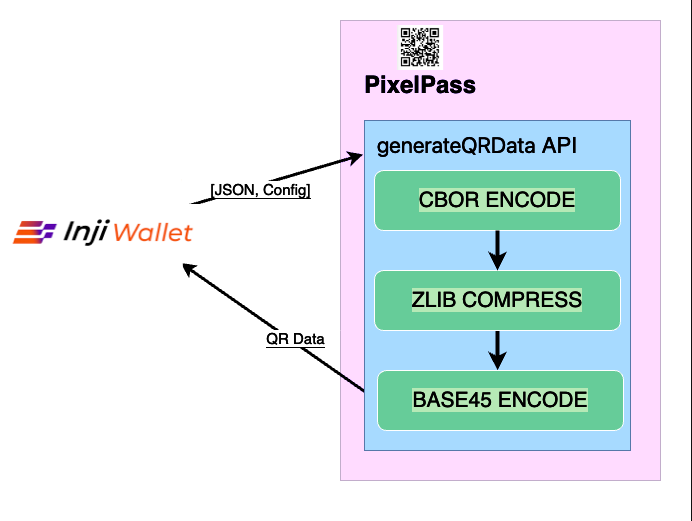
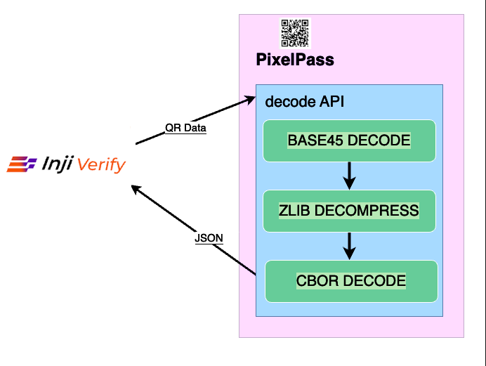

# PixelPass

## PixelPass

PixelPass is a versatile and easy-to-use library designed to simplify working with QR codes and data compression. It allows you to generate QR codes from any given data with just a single function. If you’re working with JSON, PixelPass can take that data, compress it, and convert it into a compact format using CBOR encoding, making it smaller and more efficient for QR code generation. The library can also decode this compressed data, turning CBOR back into the original JSON format. Additionally, for more complex use cases, PixelPass offers the ability to map your JSON data to a specific structure, compress it, and encode it into CBOR. Later, you can also reverse this process, decoding the CBOR back into its mapped JSON structure. With these capabilities, PixelPass makes managing, compressing, and encoding data for QR codes easy and efficient.

### Availability

PixelPass is available across multiple platforms and programming languages, making it accessible for diverse development environments:

- **[Node.js/JavaScript](https://github.com/inji/pixelpass/tree/master/js)**: Available as an NPM package for web and Node.js applications
- **[Kotlin/Android](https://github.com/inji/pixelpass/tree/master/kotlin)**: Published as an AAR (Android Archive) library for native Android development
- **[Java](https://github.com/inji/pixelpass/tree/master/kotlin)**: Available as a JAR (Java Archive) for Java backend applications
- **[Swift/iOS](https://github.com/inji/pixelpass-ios-swift)**: Available as a Swift package for native iOS development

### Features

PixelPass provides essential features for efficient data encoding and QR code generation:

* Compresses data using zlib with the highest compression level (level 9).
* Encodes and decodes data with the base45 format.
* For JSON data, applies CBOR encoding/decoding to achieve additional size reduction.
* With JSON and a Mapper provided, maps the JSON and then performs CBOR encoding/decoding to further shrink the data size.
* Supports multiple output formats including base64-encoded PNG images and base45-encoded strings.
* Provides comprehensive error handling for robust data processing.

### APIs Overview

PixelPass exposes six primary APIs for different use cases:

- **generateQRCode**: Creates a visual QR code (base64 PNG) from compressed and encoded data
- **generateQRData**: Produces base45-encoded strings suitable for raw data transfer
- **decode**: Reverses the encoding process to retrieve original JSON from base45 strings
- **decodeBinary**: Decompresses binary zip data
- **getMappedData**: Transforms JSON using a mapper and applies optional CBOR encoding for reduced size
- **decodeMappedData**: Reverses mapped and encoded data back to original JSON structure 
- **toJson(base64UrlEncodedCborEncodedString: String)**: Decodes base64 URL-encoded CBOR data and converts it into its JSON structure.

These APIs support multiple compression and encoding strategies, allowing developers to choose the approach that best fits their credential sharing scenarios.

> **Note**: For comprehensive API documentation and detailed usage examples, refer to the API sections in the respective repositories:
> - [JavaScript/Node.js API Guide](https://github.com/inji/pixelpass/tree/master/js#apis)
> - [Kotlin/Android API Guide/Java API Guide](https://github.com/inji/pixelpass/blob/master/kotlin/Readme.md#apis)
> - [Swift/iOS API Guide](https://github.com/inji/pixelpass-ios-swift#api-reference)

## Use Cases

### 1. Sharing Credentials as QR Codes

Credential sharing as QR codes is a core use case that leverages the PixelPass library. A Wallet application encodes credential data using `pixelPass.generateQRData(data, header)` into a QR code, which can then be shared with or scanned by a Verifier application. The Verifier uses PixelPass to decode and validate the credential data.

This use case is available within the Inji Ecosystem with the following components:

- **Wallet**: Inji Wallet
- **Verifier**: Inji Verify
- **Issuer**: Inji Certify
- **Applicable Credential Formats**: 
  - ldp_vc

**User Flow**

1. User downloads a credential from Inji Certify via Inji Wallet
2. User opens the credential detail view, which displays a QR code
3. User opens Inji Verify and chooses to scan or upload the credential QR code:
   - **Scan Option**: Select the "Scan QR Code" tab and allow Inji Verify to scan the QR code using the device camera
   - **Upload Option**: Select the "Upload QR Code" tab and upload the QR code image downloaded from Inji Wallet
4. After scanning or uploading, Inji Verify decodes the QR data, validates the credential, and displays it in the UI

**PixelPass & Inji Wallet Integration:**

The below diagram shows how Inji Wallet utilises PixelPass library.

<figure><figcaption></figcaption></figure>

**PixelPass & Inji Verify Integration:**

The below diagram shows how Inji Verify utilises PixelPass library.

<figure><figcaption></figcaption></figure>

For more details on this use case, refer to the [detailed guide](../../../../../inji-verify/build-and-deploy/creating-verifiable-credentials-and-generating-qr-codes.md).

### 2. Displaying mDoc Credential Data

For credentials in the `mso_mdoc` format, the Issuer provides credentials as base64 URL-encoded CBOR data. Wallet applications can use the `toJson(base64UrlEncodedCborEncodedString)` API to convert the CBOR data to JSON format for display in the UI.

This use case is available within the Inji Ecosystem with the following components:

- **Wallet**: Inji Wallet
- **Issuer**: Inji Certify

**User Flow**

1. User downloads a Mobile Driving License from Inji Certify via Inji Wallet
2. User opens the credential detail view where the mDoc data is displayed in a readable format

---

