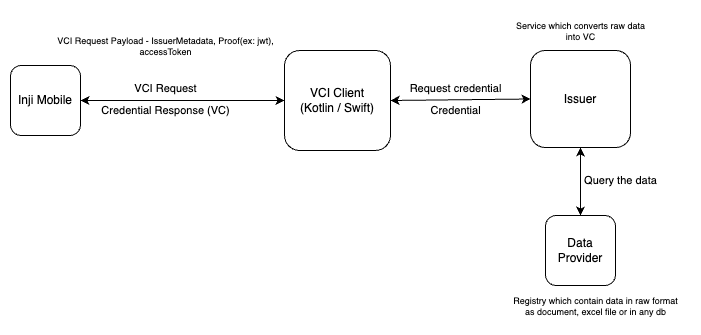

# VCI-Client

## VCI-Client

vci-client library enables to carry out the credential request from the consumer application (mobile wallet or web) and download the VC.

## Features:

* Request credentials from OID4VCI-compliant credential issuers
* Supports both the Verifiable Credential download flows defined in the OID4VCI specification:
  * Issuer Initiated Flow (Credential Offer Flow).
  * Wallet Initiated Flow (Trusted Issuer Flow).
* Authorization server discovery for both download flows
* PKCE-compliant OAuth 2.0 Authorization Code flow (RFC 7636)
  * PKCE session is managed internally by the library
* Well-defined exception handling with VCI-XXX error codes (see more on this)
* Support for multiple Credential formats:
  * ldp\_vc
  * mso\_mdoc
  * vc+sd-jwt / dc+sd-jwt
* Presentation During Issuance (PDI) support for both download flows

> ⚠️ Consumer of this library is responsible for processing and rendering the credential after it is downloaded.

* Kotlin and Swift artifacts are available to integrate with the native mobile applications.

Below sections details on the steps for integrating the Kotlin and Swift packages into the app.

## Kotlin package for vci-client:

### Repository

* inji-vci-client repo is [here](https://github.com/inji/inji-vci-client)

## Supported platforms

* Android (via aar)
* JVM (via jar)

### Installation

Snapshot builds are available [here](https://central.sonatype.com/artifact/io.inji/inji-vci-client-aar).


Note: implementation "io.inji:inji-vci-client:0.7.0"


## iOS: Swift package for vci-client:

### Repository

* [inji-vci-client-ios-swift repository](https://github.com/inji/inji-vci-client-ios-swift/)

### Installation

Add VCIClient to your Swift Package Manager dependencies:

```shell
.package(url: "https://github.com/inji/inji-vci-client-ios", from: "0.7.0")
```

## APIs

The library provides the following APIs for credential issuance:

| Use Case                                | Method Name                              | Description                                                     |
| --------------------------------------- | ---------------------------------------- | --------------------------------------------------------------- |
| **Obtain Issuer Metadata**              | `getIssuerMetadata()`                    | Retrieve issuer metadata from well-known endpoint               |
| **Get Supported Credentials**           | `getCredentialConfigurationsSupported()` | Get supported credential configurations from issuer             |
| **Fetch Credential (Credential Offer)** | `fetchCredentialUsingCredentialOffer()`  | Request credential using credential offer (Pre-Auth/Auth flows) |
| **Fetch Credential (Trusted Issuer)**   | `fetchCredentialFromTrustedIssuer()`     | Request credential from a trusted issuer (Auth flow)            |

> **Note:** For detailed API documentation including parameters, return types, and usage examples, refer to the [Kotlin API Reference](https://github.com/inji/inji-vci-client/tree/master/kotlin#-api-overview) or [Swift implementation documentation](https://github.com/inji/inji-vci-client-ios-swift/tree/master/#-api-overview).

### VCI-Client and Inji Wallet integration:

The below diagram shows how Inji Wallet utilises vci-client library.

<figure><figcaption></figcaption></figure>
