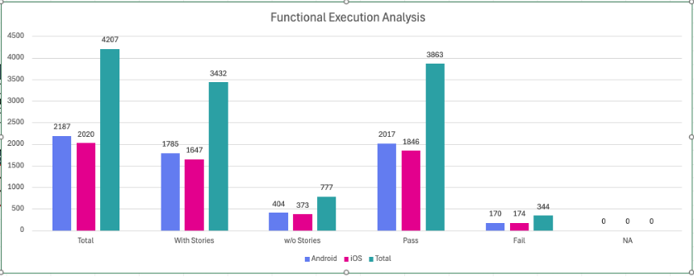
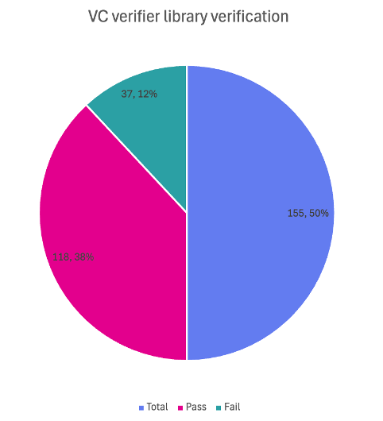
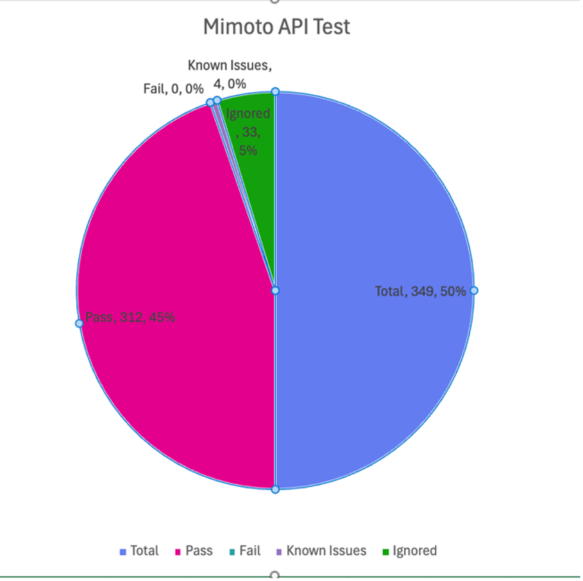
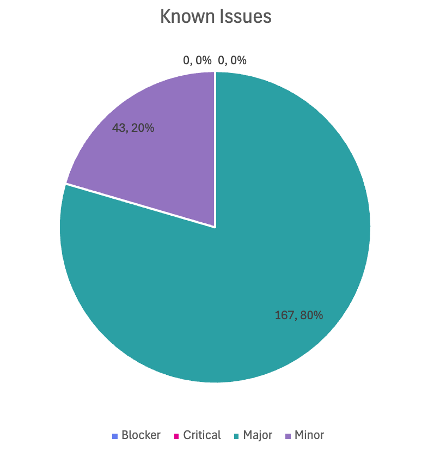

# Test Report

## Introduction

The scope of testing is to verify fitment to the specification from the perspective of Functionality, Configurability and Customizability. Verification is performed not only from the end-user perspective but also from the System Integrator (SI) point of view. Hence, the Configurability and Extensibility of the software are also assessed. This ensures the readiness of the software for use in multiple countries and diverse identity ecosystems.

### Overview and Scope

#### Authentication & Security

* Biometric unlock: Verify app access using device-registered biometrics (fingerprint/face) and the fallback to passcode if biometric disabled.
* Passcodes unlock: Validate the setup, verification of a numeric PIN for securing app access.
* Key Management: Validate the rotation of keys within the device's with drag and drop options from application.
* Wallet binding: Validate that the wallet binding (vc activation) and its credentials are securely bound to the specific device.
* Logout: Verify that logging out clears the active session and requires re-authentication to re-enter the application.

#### Credential Management (Download & Storage)

* VC download via MOSIP: Test fetching credentials using a UIN or VID with OTP authentication against the MOSIP backend.
* VC downloads via Sunbird: Test the successful download and rendering of credentials from Sunbird RC-based registries.
* Credential Offer: Test the end-to-end flow of receiving a credential offer via QR and initiating the issuance process.
* SD JWT VC download: Verify the download and selective disclosure capabilities of credentials in SD-JWT format.
* SVG VC download: Check the download and correct visual rendering of credentials using dynamic SVG templates defined by the issuer.
* Credential registry: Verify the wallet's ability to fetch and display trusted issuers and their metadata from the central registry.
* Backup and restore: Test the backup of credentials to cloud storage and their successful restoration on a new device.
* Deleting VC: Validate the permanent removal of a credential from the wallet and UI.

#### Credential Usage & Sharing

* BLE (offline) VC sharing: Share VCs offline using Bluetooth Low Energy with face auth and with fingerprint biometric authentication.
* Pinning a VC: Verify the functionality to pin frequently used credentials to the top of the home screen for quick access.
* OpenID4VP: Test the online presentation and sharing of credentials to a verifier using the standard OpenID for Verifiable Presentations flow.
* QR code Login: Verify using the wallet to scan a QR code and authenticate user login for third-party Relying Parties.

#### User Experience & Navigation

* Multi language support: Check UI rendering, label translations, and layout stability across all supported languages (Kannada, Hindi, Tamil, Arabic, Filipino and English).
* Deep link navigation (same device flow): Verify that external links (e.g., `inji://`) correctly open the app and navigate to specific screens.

## Test Approach

The Functional verification of the Inji Mobile Wallet application is performed on Android and iOS platforms to ensure alignment with product specifications and business requirements. Analyzed with respect to functional stability, data integrity, and UI consistency. The validation adopts a persona-based testing strategy, simulating real-world user scenarios across diverse device matrices and multi-language configurations to ensure robustness in both online and offline environments.

* Functionality
* Combination
* Configurability
* Customizability
* Library verification (vc-verifier)

### Test Organization

Test Organization

<table data-header-hidden><thead><tr><th valign="top"></th><th valign="top"></th><th valign="top"></th></tr></thead><tbody><tr><td valign="top">Name</td><td valign="top">Functional Role</td><td valign="top">Responsibilities</td></tr><tr><td valign="top">Aswin</td><td valign="top">QA Engineer</td><td valign="top">Verifying the functionality, stability of the application, and performing combination testing.</td></tr><tr><td valign="top">Nitin Hegde</td><td valign="top">QA Lead</td><td valign="top">Verifying the functionality, stability of the application, and report preparation.</td></tr><tr><td valign="top">Chaitanya K</td><td valign="top">QA Manager</td><td valign="top">Overviewing the test execution and review of report.</td></tr><tr><td valign="top">Ragini Krishna</td><td valign="top">Senior QA Manager</td><td valign="top">High-level governance and executive reviews of reports and execution.</td></tr></tbody></table>

### Test Planning 

* Data Readiness: Validate the availability of all services along with configured identity schemas (UIN/VID) to support biometric and authentication flows.
* Data Strategy: Refresh test data for every cycle by generating new QR codes for credential offers and preparing specific datasets for Sunbird/e-Signet integrations.
* Coverage Distribution: Distribute test scenarios across a diverse matrix of Android and iOS devices and distinct user personas to ensure comprehensive compatibility coverage.

### Test Devices

Table 2: Test Devices

<table data-header-hidden><thead><tr><th width="231.69140625" valign="top"></th><th valign="top"></th></tr></thead><tbody><tr><td valign="top">Device Model</td><td valign="top">OS and BLE version</td></tr><tr><td valign="top">iPhone 7</td><td valign="top">iOS 15.8 BLE 4.2</td></tr><tr><td valign="top">iPhone 11</td><td valign="top">iOS 26.1 BLE 5.0</td></tr><tr><td valign="top">iPhone 13</td><td valign="top">iOS 18.6.2 BLE 5.0</td></tr><tr><td valign="top">iPhone 14</td><td valign="top">iOS 26.2 BLE 5.3</td></tr><tr><td valign="top">SS Galaxy A03 core</td><td valign="top">Android 11 BLE 4.2</td></tr><tr><td valign="top">Vivo Y73</td><td valign="top">Android 13 BLE 5.0</td></tr><tr><td valign="top">Redmi 6A</td><td valign="top">Android 9 BLE 4.2</td></tr><tr><td valign="top">Techno POVA 6 NEO</td><td valign="top">Android 14 BLE 5.0</td></tr><tr><td valign="top">OPPO A59 5G</td><td valign="top">Android 13 BLE 5.3</td></tr><tr><td valign="top">ONE PLUS 12R</td><td valign="top">Android 15 BLE 5.3</td></tr><tr><td valign="top">Infinix NOTE 50X 5G</td><td valign="top">Android 15 BLE 5.4</td></tr><tr><td valign="top">Redmi 7A</td><td valign="top">Android 10 BLE 4.2</td></tr><tr><td valign="top">iTel</td><td valign="top">Android 14 BLE 5.0</td></tr><tr><td valign="top">Xiaomi Redmi NOTE 13 Pro</td><td valign="top">Android 15 BLE 5.2</td></tr></tbody></table>

### Test Environment

Test Environment

<table data-header-hidden><thead><tr><th valign="top"></th></tr></thead><tbody><tr><td valign="top">Images (qa-inji1 env)</td></tr><tr><td valign="top">mosipqa/inji-verify-service:0.16.x</td></tr><tr><td valign="top">mosipqa/inji-verify-ui:0.16.x</td></tr><tr><td valign="top">mosipqa/inji-certify-with-plugins:0.13.x</td></tr><tr><td valign="top">mosipid/apitest-mimoto:0.20.0</td></tr><tr><td valign="top">mosipqa/mimoto:develop</td></tr><tr><td valign="top">mosipqa/inji-web:develop</td></tr></tbody></table>

<table data-header-hidden><thead><tr><th valign="top"></th></tr></thead><tbody><tr><td valign="top">Images (released env)</td></tr><tr><td valign="top">mosipid/mimoto:0.20.0</td></tr><tr><td valign="top">mosipid/apitest-mimoto:0.20.0</td></tr><tr><td valign="top">mosipid/inji-verify-service:0.15.2</td></tr><tr><td valign="top">mosipid/inji-verify-ui:0.15.2</td></tr><tr><td valign="top">mosipid/inji-certify-with-plugins:0.13.1</td></tr><tr><td valign="top">mosipid/inji-web:0.15.0</td></tr><tr><td valign="top">mosipid/esignet-with-plugins:1.6.2</td></tr><tr><td valign="top">mosipid/authentication-service:1.2.1.0</td></tr><tr><td valign="top">mosipid/authentication-internal-service:1.2.1.0</td></tr><tr><td valign="top">mosipid/authentication-otp-service:1.2.1.0</td></tr><tr><td valign="top">mosipid/kernel-notification-service:1.2.0.1</td></tr><tr><td valign="top">mosipid/registration-processor-stage-group-1:1.2.1.1</td></tr></tbody></table>

### Test Execution Report

### Test case execution summary

Manual Test Execution was completed across both Android and iOS platforms, achieving a 100% execution rate for all planned scenarios. The testing validated core functionalities with a high pass rate, while identified issues on both platforms have been logged for defect resolution.

Test Execution Summary

<table data-header-hidden><thead><tr><th width="294.25" valign="top"></th><th valign="top"></th><th valign="top"></th><th valign="top"></th><th valign="top"></th></tr></thead><tbody><tr><td valign="top">Platform</td><td valign="top">Total</td><td valign="top">Pass</td><td valign="top">Fail</td><td valign="top">Skip</td></tr><tr><td valign="top">Android</td><td valign="top">2187</td><td valign="top">2017</td><td valign="top">170</td><td valign="top">0</td></tr><tr><td valign="top">iOS</td><td valign="top">2020</td><td valign="top">1846</td><td valign="top">174</td><td valign="top">0</td></tr><tr><td valign="top">Total</td><td valign="top">4207</td><td valign="top">3863</td><td valign="top">344</td><td valign="top">0</td></tr><tr><td valign="top">
Test cases: 4207 Passed: 3863 Failed: 344 Skipped: 0

Test Rate: 100% With Pass Rate: 91%
</td><td valign="top"></td><td valign="top"></td><td valign="top"></td><td valign="top"></td></tr></tbody></table>

<figure><figcaption></figcaption></figure>

#### Combination Testing with device components

This section details Combination Testing results for Inji Mobile on Android and iOS, specifically validating workflows like sharing Verifiable Credentials (VCs) across devices. These tests confirm the application's stability when orchestrating multiple components such as Bluetooth, camera, and biometrics during these cross-platform interactions.

Combination Result

<table data-header-hidden><thead><tr><th valign="top"></th><th valign="top"></th><th valign="top"></th><th valign="top"></th></tr></thead><tbody><tr><td valign="top">Total</td><td valign="top">Passed</td><td valign="top">Failed</td><td valign="top">Skip</td></tr><tr><td valign="top">Total</td><td valign="top">192</td><td valign="top">29</td><td valign="top">0</td></tr><tr><td valign="top">Test Rate: 100% With Pass Rate: 84.89%</td><td valign="top"></td><td valign="top"></td><td valign="top"></td></tr></tbody></table>

### Automation Result VC verifier

vc-verifier is a backend library that cryptographically checks if a Verifiable Credential (VC) is authentic, tamper-proof, and issued by a trusted source. The automation suite verifies this logic by running tests on various valid and invalid credential scenarios to ensure the system accurately accepts real IDs and rejects fake ones.

VC Verifier Library

<table data-header-hidden><thead><tr><th valign="top"></th><th valign="top"></th><th valign="top"></th><th valign="top"></th><th valign="top"></th></tr></thead><tbody><tr><td valign="top">Total</td><td valign="top">Pass</td><td valign="top">Fail</td><td valign="top">Known Issues</td><td valign="top">Ignored</td></tr><tr><td valign="top">155</td><td valign="top">118</td><td valign="top">37</td><td valign="top">0</td><td valign="top">0</td></tr><tr><td valign="top">Test Rate: 100% With Pass Rate: 76.12%</td><td valign="top"></td><td valign="top"></td><td valign="top"></td><td valign="top"></td></tr></tbody></table>

<figure><figcaption></figcaption></figure>

### Automation Result Mimoto API

Mimoto is the Backend for Frontend (BFF) service for Inji Wallet, acting as a secure proxy to orchestrate critical workflows like request validation, Verifiable Credential (VC) downloads, and wallet binding. The Mimoto API automation validates these BFF endpoints to ensure seamless integration and reliable data exchange between the Inji mobile application and the underlying services.

Mimoto API Automation Result

<table data-header-hidden><thead><tr><th valign="top"></th><th valign="top"></th><th valign="top"></th><th valign="top"></th><th valign="top"></th></tr></thead><tbody><tr><td valign="top">Total</td><td valign="top">Pass</td><td valign="top">Fail</td><td valign="top">Known Issues</td><td valign="top">Ignored</td></tr><tr><td valign="top">349</td><td valign="top">312</td><td valign="top">0</td><td valign="top">4</td><td valign="top">33</td></tr><tr><td valign="top">Test Rate: 100% With Pass Rate: 89%</td><td valign="top"></td><td valign="top"></td><td valign="top"></td><td valign="top"></td></tr></tbody></table>

<figure><figcaption></figcaption></figure>

## Defect Metrics

### Defect Metrics for the Release 0.21.0

The following table depicts only the bugs which are found and not addressed in the current release.

Table 8: Defect Metrics for the Release

<table data-header-hidden><thead><tr><th valign="top"></th><th valign="top"></th><th valign="top"></th><th valign="top"></th><th valign="top"></th></tr></thead><tbody><tr><td valign="top">Blocker</td><td valign="top">Critical</td><td valign="top">Major</td><td valign="top">Minor</td><td valign="top">Total</td></tr><tr><td valign="top">0</td><td valign="top">0</td><td valign="top">8</td><td valign="top">4</td><td valign="top">20</td></tr></tbody></table>

### Known Issues Metrics

This section focuses on a separate category of issues that are known but not addressed in the current release. It provides a count and severity distribution for these defects across releases.

Table 9: Defect Metrics for the known issues

<table data-header-hidden><thead><tr><th valign="top"></th><th valign="top"></th><th valign="top"></th><th valign="top"></th><th valign="top"></th></tr></thead><tbody><tr><td valign="top">Blocker</td><td valign="top">Critical</td><td valign="top">Major</td><td valign="top">Minor</td><td valign="top">Total</td></tr><tr><td valign="top">0</td><td valign="top">0</td><td valign="top">167</td><td valign="top">43</td><td valign="top">210</td></tr></tbody></table>

<figure><figcaption></figcaption></figure>

Known Issues Table Representation Chart

## Conclusion

This section summarizes the key findings of test execution. It also provides a final QA recommendation on the build's readiness for release. The functional verification for Inji Mobile Wallet version 0.21.0 has been successfully completed across Android and iOS platforms. The testing cycle achieved a 100% execution rate with a 91% pass rate across a total of 4,207 test cases. Additionally, API automation via Mimoto achieved a 100% pass rate.

While there are 20 open defects (8 Critical, 8 Major, 4 Minor) and 210 known issues, there are zero blocker defects that are open. The application has demonstrated functional stability and data integrity consistent with product specifications.

### QA Approval

The build has successfully met the defined exit criteria and is recommended for release. The approval is based on the following satisfied conditions:

* Test Case Execution Completion: 100% of planned scenarios executed.
* Defect Status: No Blocker defects remain open.
* Documentation Sign-off: All test artifacts and reports are finalized.
* Test Environment Stability: The test environment remained stable throughout the execution cycle.

Report is signed off details

<table data-header-hidden><thead><tr><th valign="top"></th><th valign="top"></th><th valign="top"></th></tr></thead><tbody><tr><td valign="top">Name</td><td valign="top">Functional Role</td><td valign="top">Responsibilities</td></tr><tr><td valign="top">Chaitanya K</td><td valign="top">QA Manager</td><td valign="top"></td></tr><tr><td valign="top">Ragini Krishna</td><td valign="top">Senior QA Manager</td><td valign="top"></td></tr></tbody></table>

## Appendix

This includes additional reference information for the report. It contains a history of document versions and a list of acronyms and their meanings.

### Appendix A: Versions

<table data-header-hidden><thead><tr><th></th><th></th><th></th><th valign="top"></th></tr></thead><tbody><tr><td></td><td>Date</td><td>Author</td><td valign="top">Reviewers</td></tr><tr><td>V1.0</td><td>10/12/2025</td><td>Nitin Hegde</td><td valign="top">
Chaitanya K

Ragini Krishna
</td></tr></tbody></table>

### Appendix B: Acronyms

<table data-header-hidden><thead><tr><th width="228.53515625" valign="top"></th><th valign="top"></th></tr></thead><tbody><tr><td valign="top">Acronym</td><td valign="top">Literal Translation</td></tr><tr><td valign="top">MOSIP</td><td valign="top">Modular Open Source Identity Platform</td></tr><tr><td valign="top">UIN</td><td valign="top">Unique Identification Number</td></tr><tr><td valign="top">VID</td><td valign="top">Virtual Identification</td></tr><tr><td valign="top">SVG</td><td valign="top">Scalable Vector Graphics</td></tr><tr><td valign="top">SD-JWT</td><td valign="top">Selective Disclosure - JSON Web Token</td></tr><tr><td valign="top">VC</td><td valign="top">Verifiable Credentials</td></tr><tr><td valign="top">OpenID4VP</td><td valign="top">OpenID for Verifiable Presentations</td></tr></tbody></table>

<table data-header-hidden><thead><tr><th></th><th></th><th></th><th valign="top"></th><th valign="top"></th></tr></thead><tbody><tr><td>Version</td><td>Author</td><td>Date</td><td valign="top">Review</td><td valign="top">Affected Sections</td></tr><tr><td>V1.0</td><td>Nitin Hegde</td><td>10/12/2025</td><td valign="top">
1. Chaitanya Kesiraju

2. Ragini Krishna
</td><td valign="top">New Document</td></tr></tbody></table>

Github link for the detailed report is [**here**](https://github.com/mosip/test-management/tree/master/inji/0.21.0).
