# End User Guide

## Overview

Inji Wallet (Web) end-user guide is structured as below:

* Interface Overview
* Downloading VCs as PDF
* Preference
  * Change Language
* Login to download/store credentials in the web wallet
  * Log in with Google or any other IDP
* OpenIDVP - Presenting Verifiable Credential

#### Interface Overview

Inji Wallet (Web) offers a browser-based interface similar to Inji Wallet, designed to be fully responsive across desktops, tablets, and mobile browsers. This section provides a high-level overview of the interface (Desktop View), labelling each key component to help you quickly locate items referred to throughout this guide.

#### Interface Elements

* **Login**\
  Use Google or any configured OpenID-compliant Identity Provider (IdP) to log in and store credentials securely in the web wallet.
* **Main Menu**\
  Access navigation options for Dashboard, Issuers, Preferences, and more.
* **Language Selector**\
  Change the interface language using the dropdown in the header.
* **Workspace**\
  The main content area where you interact with the wallet, issuers, and credentials.
* **Search Bar**\
  Search for available credential types or issuers.
*   **Issuers Section**\
    Browse through a list of trusted credential issuers. Each issuer displays supported credential types.

    <figure>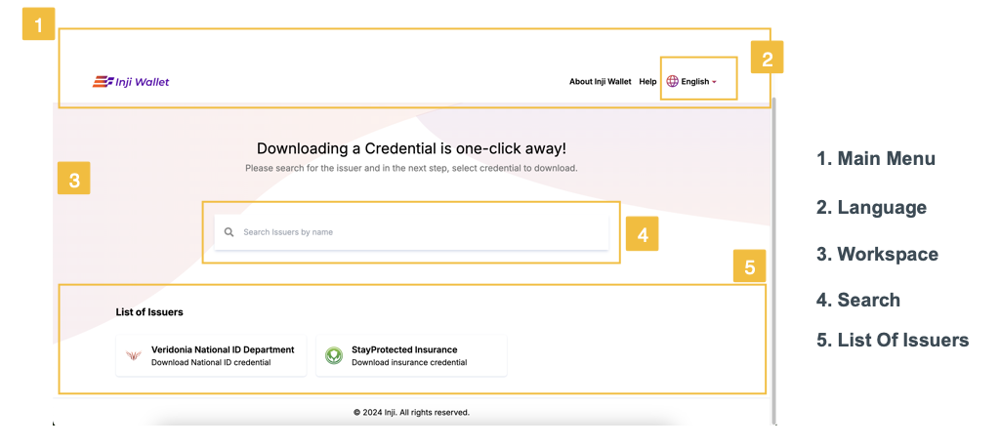<figcaption>
Interface Overview
</figcaption></figure>

### Download VCs

#### Downloading National ID VC as PDF

You can download your National ID, here we will see how to do it when we use eSignet for Authentication; using OTP.

**Q**. **What details I need to provide to download my credential**?

**A**. The credential issuer would have provided details such as UIN/VID in case of MOSIP National ID, You need to enter these information to be able to download Insurance VC.

To download a National ID VC using eSignet as authentication layer (OTP method)

* Launch the Inji Wallet (Web) in your web browser, The home page presents you with the list of Issuers. You can also use the 'Search' box to search for and quickly find the Issuer (Credential Issuer) you are looking for.
  * Locate and click an '**Issuer**' on the Workspace, Or
  * Search for an issuer by its name in **Search** box and click to proceed,\
    **Note**: On selecting an **Issuer** from '**list of Issuers**' it takes you to next page where you select a '**Credential Type**' (National Id here) to download it as PDF.

<figure>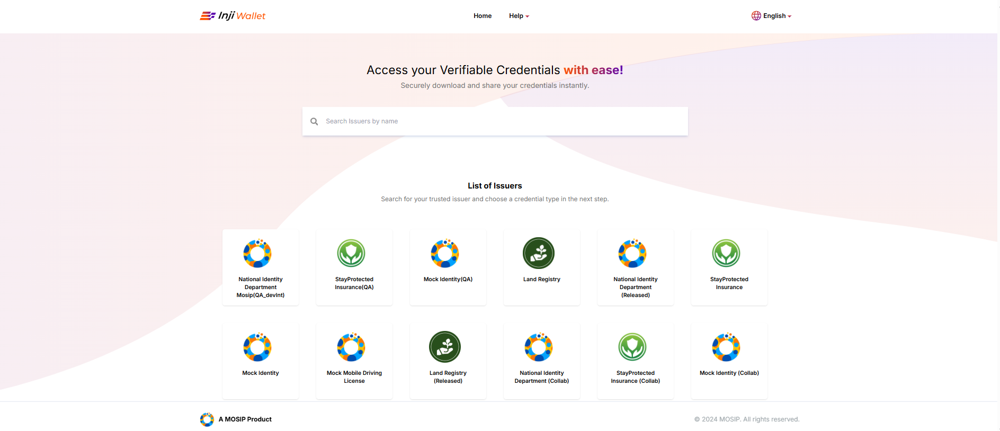<figcaption>
Inji Web in Web Browser
</figcaption></figure>

* On 'List of Credential Types' screen, select the '**Credential Type**', It opens '**Share** **Validity Screen**' as popup.

<figure>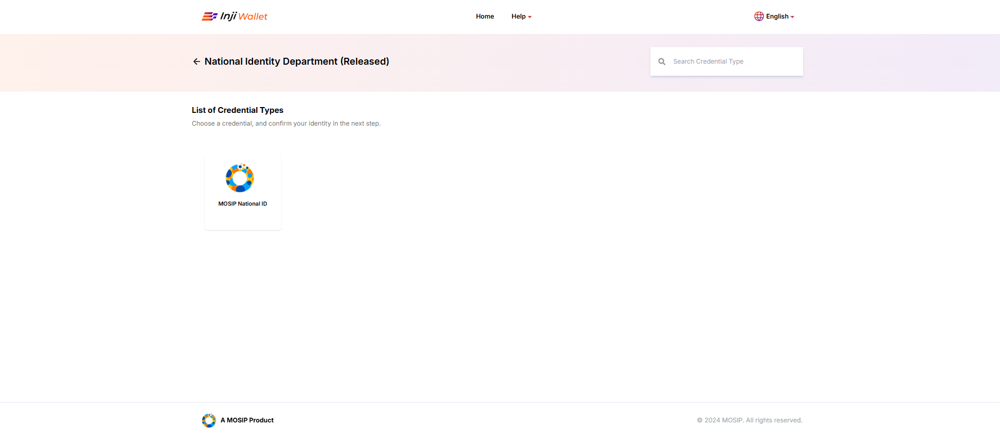<figcaption>
List Of Credential Type
</figcaption></figure>

* On '**Share Validity**' popup you can choose to decide the number of times a credential can be used, choose from drop down (Once, Twice, Unlimited or Custom ). Click ok and proceed, It takes you to next page for authentication (eSignet).

<figure>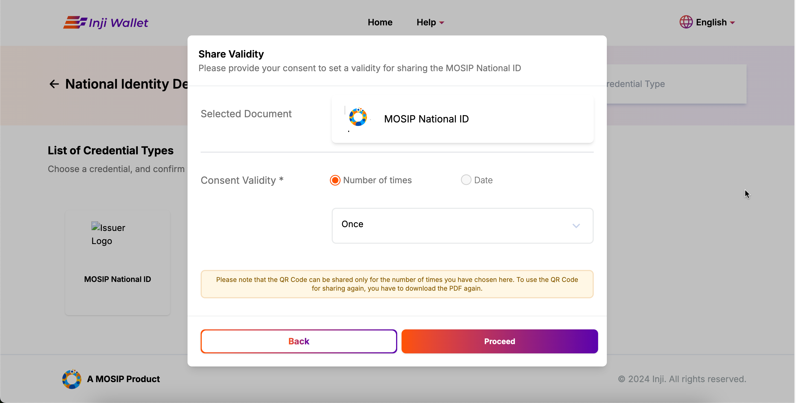<figcaption>
Share Validity
</figcaption></figure>

* On eSignet authentication page enter UIN/VID and click on '**Get OTP**', a next screen will appear asking you to enter OTP.

<figure>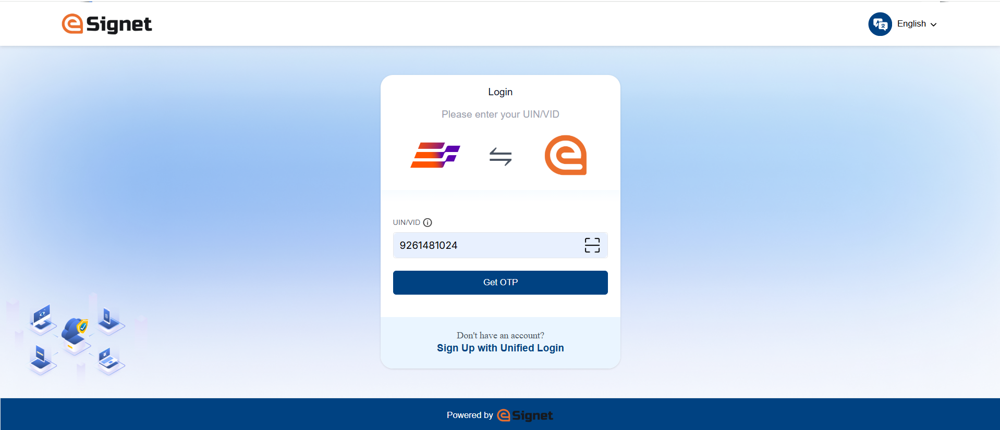<figcaption>
Authentication page
</figcaption></figure>

* Enter the OTP you received and click **Verify**.

<figure>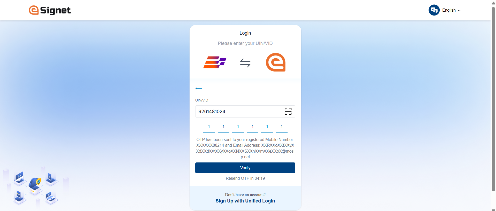<figcaption>
Enter OTP
</figcaption></figure>

* A download progress screen appears.

<figure>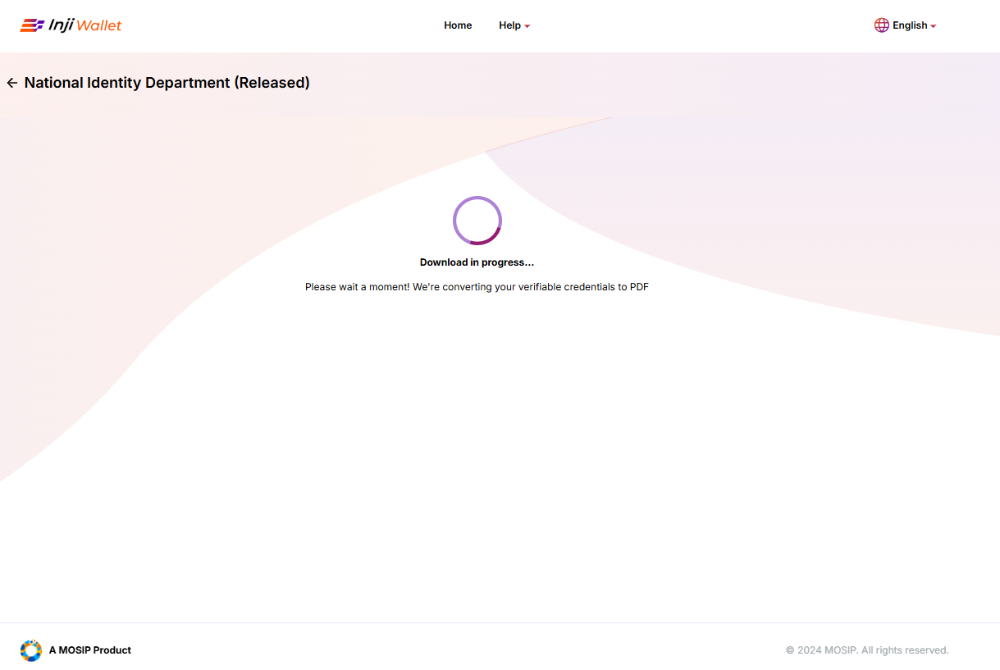<figcaption>
Verify Progress
</figcaption></figure>

* PDF will be generated and stored in the **Downloads** folder of the system.

<figure>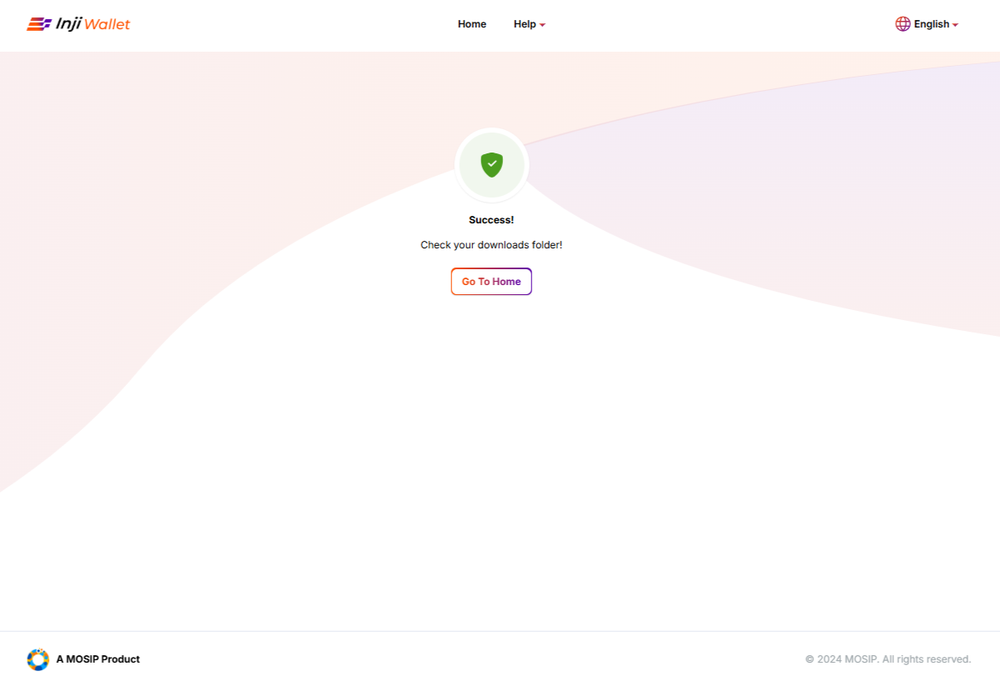<figcaption>
Download Success
</figcaption></figure>

* You can view the PDF of the downloaded VC (National ID) from download folder.

<figure>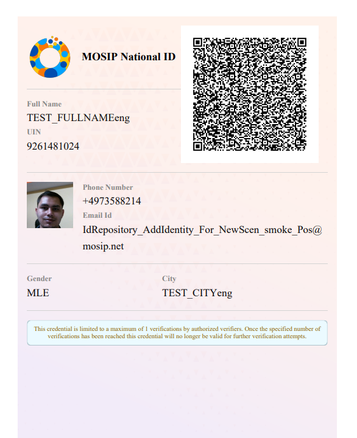<figcaption>
Downloaded National ID VC as PDF
</figcaption></figure>

#### Downloading Insurance VC as PDF

You can download your Insurance VC, here we will see how to do it when we use eSignet for Authentication; using OTP.

**Q - What details do I need to provide to download my credential?**

**A** - The credential issuer must have provided details such as **Policy Number**, **Name** and **DOB** for an Insurance card. This information has to be fed to the authentication system to enable download.

To download an Insurance ID VC using eSignet for authentication (KBI method), follow the step below:

* Launch the Inji Web application in your web browser. The application home page presents you with the **list of Issuers**. You can also use the '**Search**' box to quickly find an Issuer (Insurance provider).
  * Click-select a particular 'Issuer' (Insurance provider) which issued you the Insurance (Insurance VC Issuer), you will land to its **Credential Types** selection page.

<figure>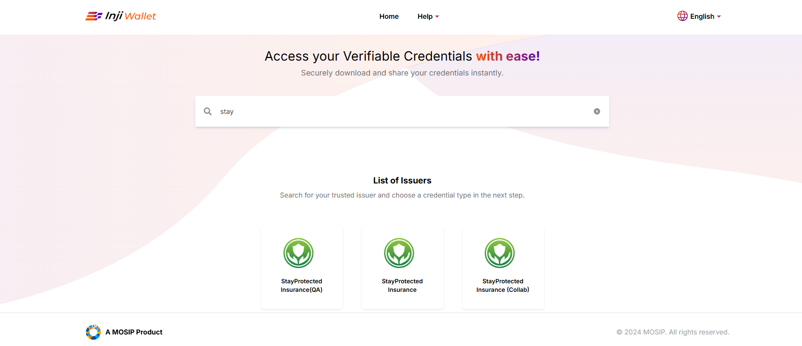<figcaption>
Launch application
</figcaption></figure>

* On the **Credentials Types** page, choose a credential type from the List of Credentials section, '**Share Validity**' popup will appear.

<figure>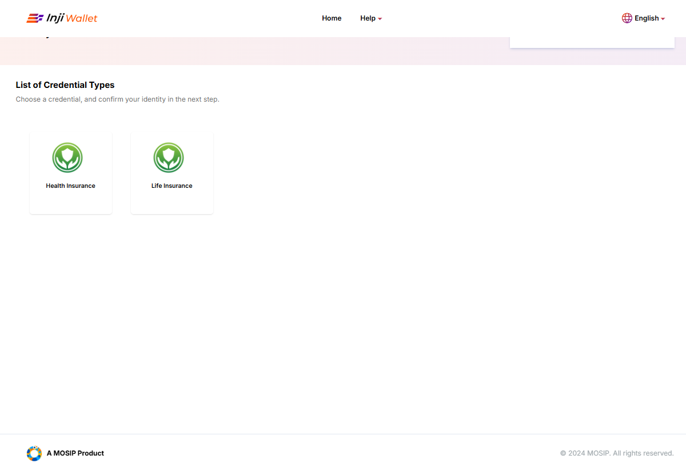<figcaption>
List Of Issuers
</figcaption></figure>

* On '**Share Validity**' screen you can choose to decide the number of times a credential can be used, choose from tyhe dropdown (Once, Twice, Unlimited or Custom). Click Ok and proceed, It takes you to next page for authentication (eSignet).

<figure>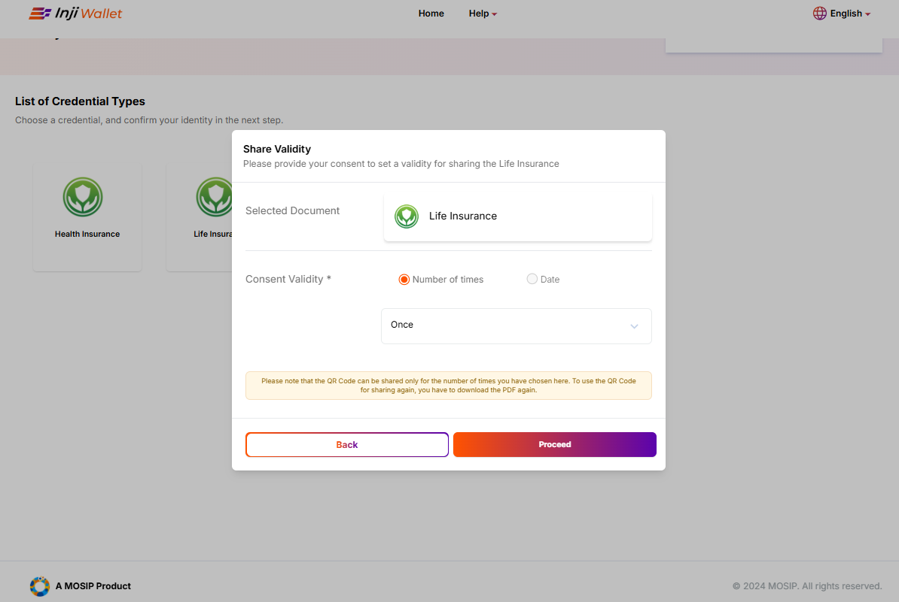<figcaption>
VC Validity
</figcaption></figure>

* On eSignet authentication page enter **Policy Number**, **Name** and **DOB** (KBI Method) and click on '**Login**'. **Note**: All the fields are mandatory.

<figure>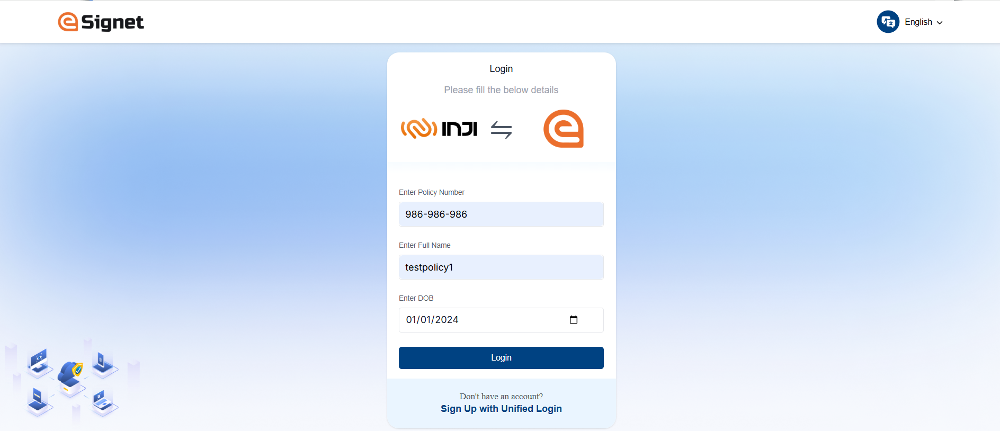<figcaption>
Authentication page
</figcaption></figure>

* Credential is downloaded in the background and PDF will be generated and stored in the **Downloads** folder of the system (A download progress screen is also seen when the credential is being downloaded).

<figure>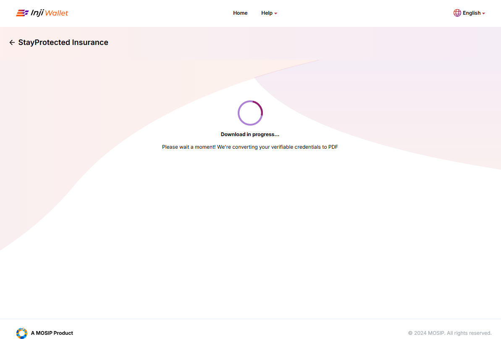<figcaption>
Download Progress
</figcaption></figure>

* The generated pdf is stored in the Downloads folder of the system. You can view the PDF of the downloaded VC (Insurance) from download folder.

<figure>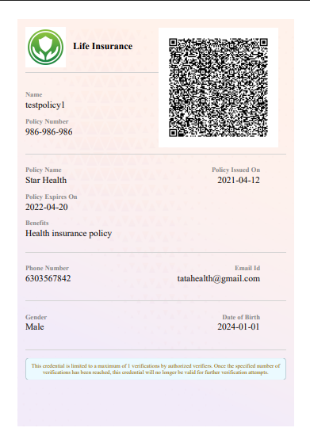<figcaption>
Downloaded Insurance VC as PDF
</figcaption></figure>

### Preference

#### Language Selection

You can choose your preferred language using '**language Selection**' options available on the **Main-Menu**. Inji Web now supports 4 International Language (English, French and Arabic) and 3 Indian Languages (Tamil, Hindi and Kannada).

<figure>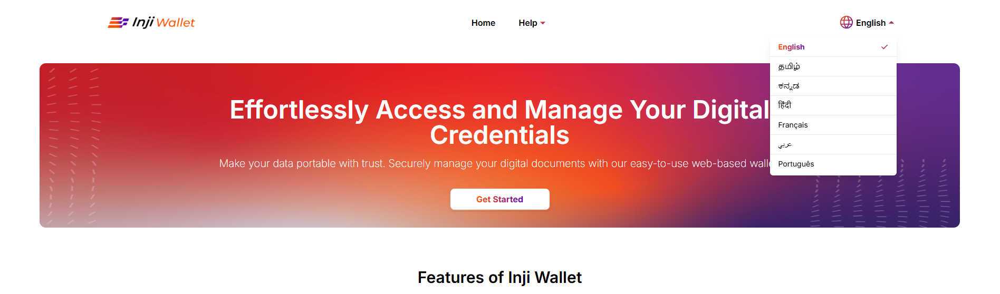<figcaption>
Language Preference
</figcaption></figure>

## Login to Download/Store Credentials in the Web Wallet

**Note:** Screenshots will be added soon to enhance the user experience and better explain the steps shown below.

You can now log in to Inji Web using Google or any other supported Identity Provider (IDP) to:

* **Add and securely store your credentials** in Inji's Web Wallet
* **Download credentials** directly to your device

In this section, you'll learn how to:

* Log in to Inji Web Wallet
* Save credentials for future access
* Download credentials as needed

### Login with Google or any other IDP

1.  **Launch Inji Web Wallet in Browser**\
    Navigate to the wallet URL in any browser.

    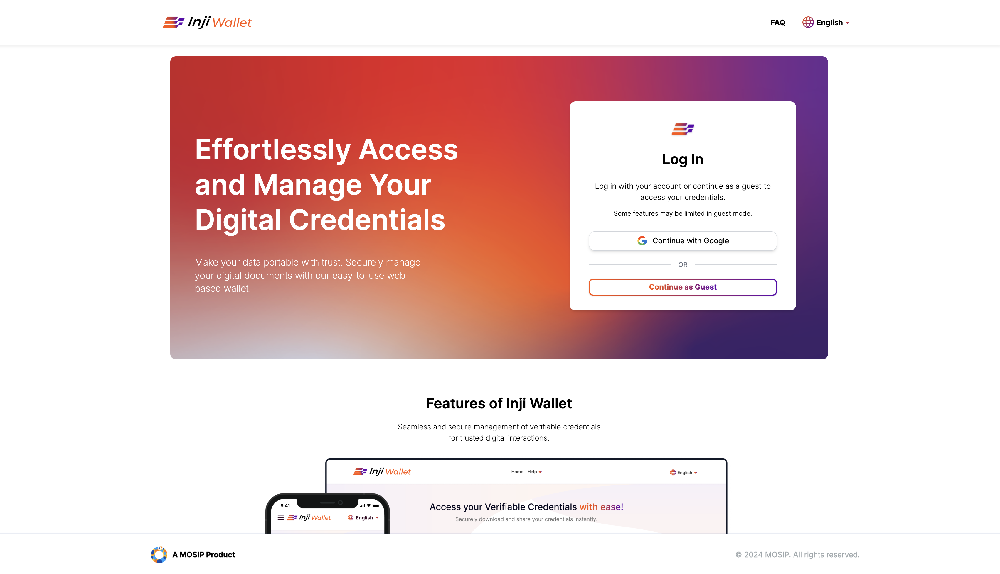
2.  **Click "Login with Gmail"**\
    Select the Google login option on the homepage.

    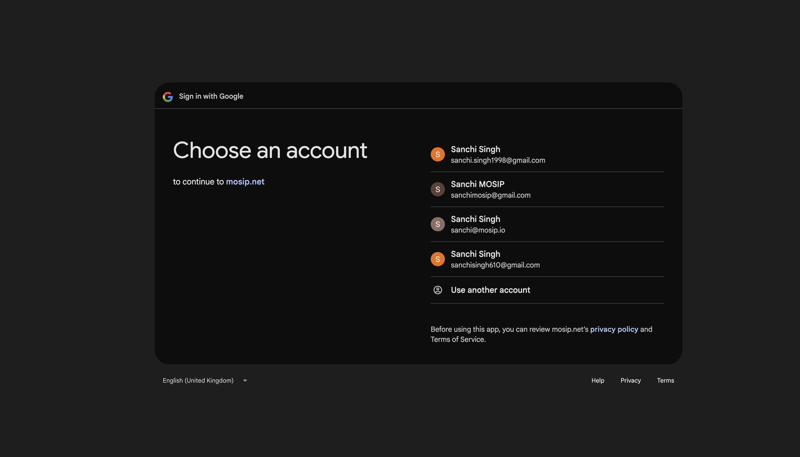
3.  **Select Google Account**\
    Choose your Google account or enter login credentials.

    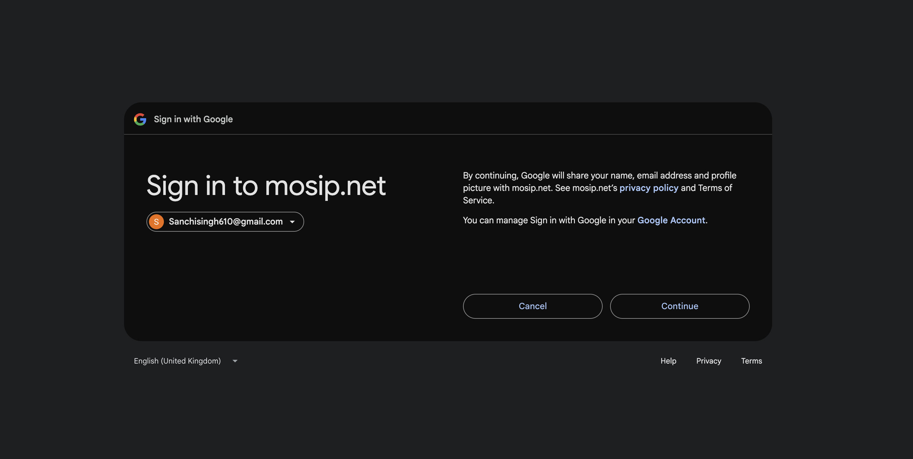
4.  **Post-login Welcome Page**\
    You will land on the dashboard showing issuer and credential options.

    .png)
5.  **Set Passcode (First-Time Only)**\
    You'll be prompted to set a local passcode to secure your web wallet.

    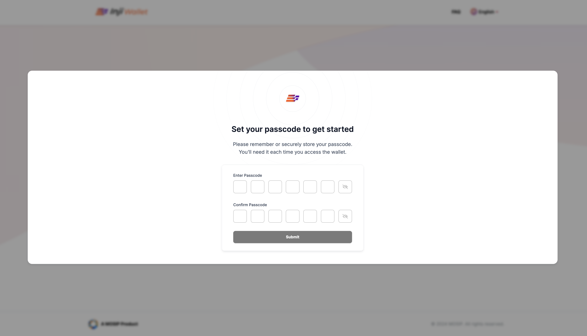

    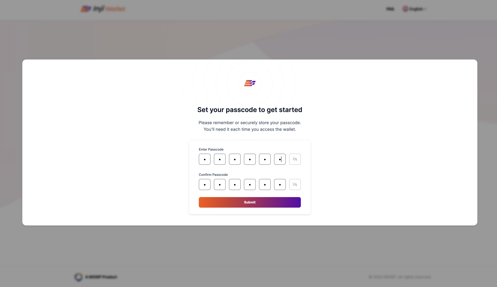

### Download VCs (Login)

**Note:** A few example issuers are listed below. You can explore more issuers in the **Collab environment** via the UI or configure additional issuers as needed to test and explore this feature further.

#### Download National ID VC

**Q. What details are needed?**

You’ll need your **UIN/VID**as provided by the credential issuer.

1. Login to Inji Web Wallet
2. Search or Select 'Republic of Veridonia National ID Department'
3. Choose 'Veridonia National ID' Credential Type

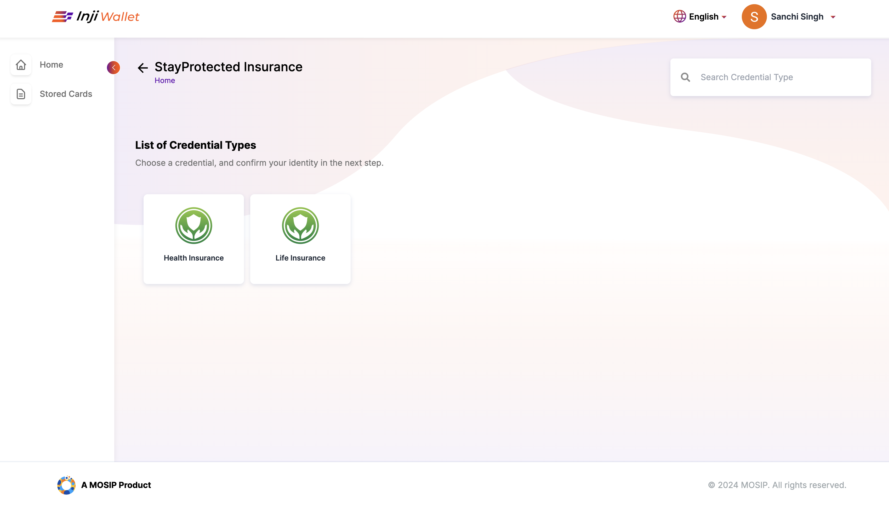

4. **Authenticate via eSignet (OTP method)**
   * Enter UIN/VID → Click 'Get OTP'
   * Enter OTP → Click 'Verify'
5. **Download Starts Automatically**\
   Verifiable Credential is stored in your web wallet in the "stored cards" page.

#### Download Insurance VC

**Q. What details are needed?**

You’ll need **Policy No., Name, and Date of Birth** as shared by the issuer.

**Steps:**

1. Login to Inji Web Wallet
2. Search or Select 'StayProtected Insurance'
3. Choose 'Health Insurance' or 'Life Insurance' as Credential Type
4. Authenticate via eSignet (KBI method)
   * Enter required fields
5. Download Starts Automatically\
   Verifiable Credential is stored in your web wallet in the "stored cards" page.

### Manage Stored Credentials

.png)

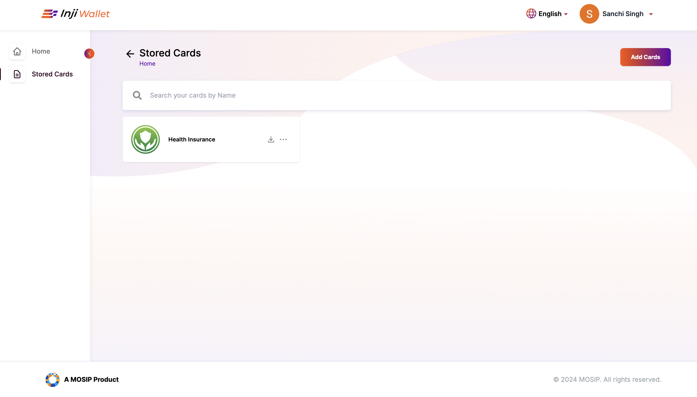

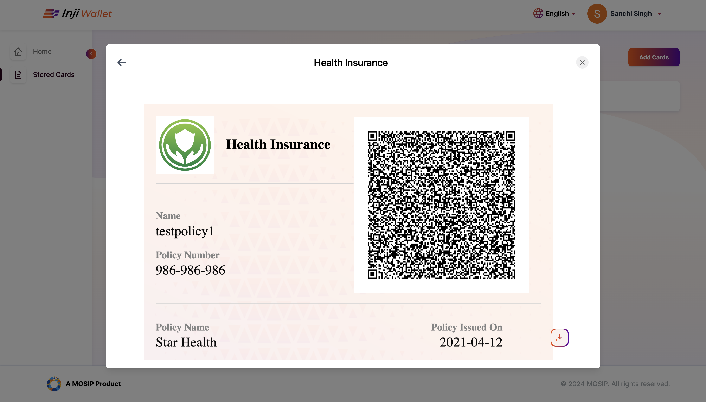

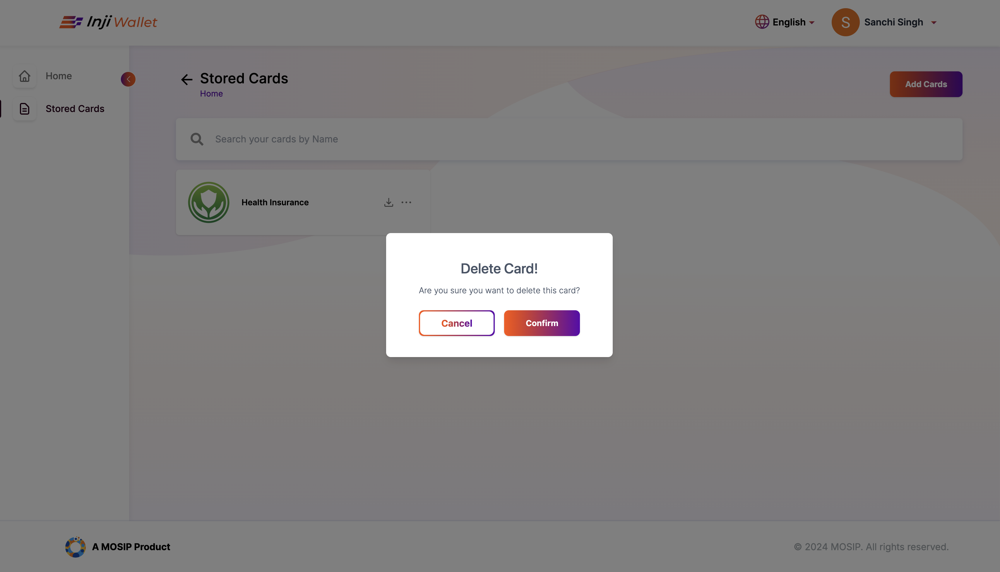

#### View Credentials (Login Mode)

1. Navigate to the **Stored Cards** section in the Inji Web Wallet.

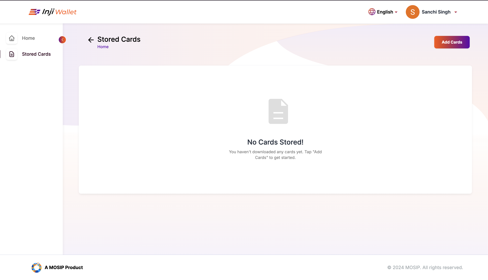

2. If your wallet has been created but no credentials have been downloaded yet, the **Stored Cards** section will appear empty.
   * Click on the **Add Cards** option to initiate the credential download flow.
   * Follow the steps outlined in the [Download VCs (Login)](end-user-guide.md#download-vcs-login) section to retrieve your credentials.
3. Once credentials are downloaded, they will appear in a mini card view within the **Stored Cards** section.
4. For each stored credential, you can click on the **three-dot menu (⋮)** to explore additional actions:
   * **View** – Preview the credential within the wallet.
   * **Download** – Download the VC as a PDF with an embedded QR code.
   * **Delete** – Remove the credential from your web wallet.

#### Profile & Language Preferences

**Access Profile Options**

1. Click on the **Profile Icon** in the top-right corner of the page (next to the language selector).
2. Upon clicking, a dropdown will appear with the following options:
   * `FAQs` – View frequently asked questions
   * `Profile` – View or manage your account
   * `Logout` – Securely log out of your session
3. To change your preferred language:
   * Click on the **Language Icon** (globe) next to your profile
   * A list of supported languages will appear
   * Select your preferred language from the dropdown

.png)

#### Passcode Reset Flow

If you forget your passcode during login, you can click **“Forgot Passcode”** to set up a new one.

1. On the **"Enter Your Passcode"** screen, click "**Forgot Passcode"** to reset your wallet.
2. Enter and confirm your new passcode.
3. Click **Submit** to save.
4. Log in again with your new passcode and re-download your credentials.


**What happens when you forget your passcode?**

* Your wallet will be securely **reset**.
* All previously stored credentials will be **deleted** from your wallet.
* You’ll be guided to create and confirm a **new passcode**.
* The new passcode will remain tied to your same **Google login (Gmail ID)**.
* You will need to **re-download your credentials** from the original issuers.


#### Lockout Rules

* 5 Wrong attempts → Wallet locked temporarily for **1 hour**.
* After 1 hour → You can try again (Round 2).
* 5 wrong attempts again → Wallet locked temporarily for **1 more hour**.
* On the **last round (3rd attempt)**:
  * You will see a **warning message** (“Last attempt left before permanent lock”).
  * If entered incorrectly again, your wallet will be **permanently locked**.

#### Permanent Lock

* Once locked permanently, the **only option** is to reset your wallet.
* Resetting your wallet means:
  * All previously stored credentials will be **deleted**.
  * You will need to **set a new passcode**.
  * The new passcode will stay tied to your Google login (Gmail ID).
  * You must **re-download all your credentials** from the issuers.


**Note:**

* No passcode recovery mechanism is available.
* Passcode change after login is not supported yet.


<figure><figcaption></figcaption></figure>

<figure><figcaption></figcaption></figure>

<figure><figcaption></figcaption></figure>

## OpenID4VP — Presenting Verifiable Credentials

This section describes how to **present your JSON-LD Verifiable Credentials (VCs)** from **Inji Web Wallet** using the **OpenID4VP** presentation flow. It covers the entry points for the user actions inside the wallet based on the verifier request.

### Prerequisites

* You have one or more **JSON-LD VCs** stored in **Stored Cards** (post-login)
* The verifier supports **OpenID4VP**.


#### Important Note (Reference Image Only)

The images shown above are **reference designs** intended to help users and implementers understand **how the OpenID4VP flow will look end-to-end**—from a **verifier initiating a Verifiable Presentation (VP) request** to the **Inji Web Wallet opening and completing the presentation,** not to represent functionality currently available in Inji Verify.

These screens illustrate the **expected user journey**, including:

* How a verifier request specific credential types
* How a user select cards in Inji Web Wallet
* How wallet selection and redirection may look in future releases

**Current Capability Status**

At the moment, **Inji Verify doesn't yet support OpenID4VP initiation or redirection**. This feature is **planned for an upcoming release** of Inji Verify.

Therefore:

* Inji Web Wallet already supports receiving and completing OpenID4VP flows
* But Inji Verify cannot yet generate the VP request for the web-based wallet flow


<figure><figcaption>
<strong>Presentation Request from Verifier</strong>
</figcaption></figure>

<figure><figcaption>
<strong>Credential Selection Panel from Verifier</strong>
</figcaption></figure>

<figure><figcaption>
<strong>Wallet Selection Panel from Verifer</strong>
</figcaption></figure>

### Step-by-Step Flow

If you want to try the **OpenID4VP feature in Inji Web Wallet right now**, you can:

**Set up the Inji Mock OpenID4VP Services locally**

* These [**mock** ](https://github.com/mosip/inji-mock-services/blob/release-0.5.x/openid4vp-service/README.md)services can generate OpenID4VP requests. Set up the mock verifiable presentation services using the [README](https://github.com/mosip/inji-mock-services/blob/release-0.5.x/openid4vp-service/README.md).
* They allow implementors and integrators to test the complete flow
* Useful for sandbox testing, demos, and development purposes

This enables you to fully experience the **verifier → wallet → verifier** flow until formal support is added to Inji Verify.

**Receive the request**

* Click the verifier’s **“Request Verifiable Credentials”** via the verifier portal, which redirects you to the **Inji Web Wallet** post selection from the verifier portal itself. To test the flow, follow the above steps for the [local setup](https://github.com/mosip/inji-mock-services/blob/release-0.5.x/openid4vp-service/README.md).

**Open the presentation screen**

* Inji Web presents a trust-screen displaying the verifier’s identity. The user may select **Yes, proceed** to continue with the request or **No, cancel** if they do not trust the verifier.

<figure><figcaption>
<strong>Verifier Trust Screen</strong>
</figcaption></figure>

<figure><figcaption>
<strong>Verifier Trust Info</strong>
</figcaption></figure>

<figure><figcaption>
<strong>Verifer Trust Cancel Pop-up</strong>
</figcaption></figure>

**Credential Selection & Consent**

* After the user confirms **'Yes, I trust this Verifier'**, Inji Web displays a screen showing the cards(Verifiable Credentials) requested by the verifier. The user can review each requested card (Verifiable Credentials), select the ones they wish to share, and then click **'I Consent & Share'** to proceed. If the user doesn't want to continue, they may click **'Cancel'** to stop the presentation flow with no information shared.

<figure><figcaption>
<strong>Selection of Cards and Consent</strong>
</figcaption></figure>

**No Matching Credentials Found**

If the verifier’s request does not match any cards (Verifiable Credentials) stored in the user’s Inji Web Wallet, the wallet displays a **No matching credentials found** message. This informs the user that they do not hold any cards (Verifiable Credentials) that satisfies the verifier’s request. The user can click **Go to Home** to return to the main dashboard and either download new credentials or try a different request.

<figure><figcaption>
<strong>No Matching Credential Found</strong>
</figcaption></figure>

**Preparing and Completing the Presentation**

* Once the user consents to share the selected credentials, Inji Web begins preparing the secure Verifiable Presentation. A loading screen appears, indicating that the web wallet is generating and signing the presentation according to the OpenID4VP protocol.

<figure><figcaption>
<strong>Preparing Presentation Request</strong>
</figcaption></figure>

* After the presentation is successfully created and sent, the user sees a confirmation screen stating that the credentials have been securely shared with the verifier. The shared credential names are displayed for transparency, and the web wallet automatically redirects the user back to the verifier in a few seconds to complete the process.

<figure><figcaption>
<strong>Confirmation Screen and Redirecting back to Verifier</strong>
</figcaption></figure>

### Quick Notes

* Credentials stored in the web wallet are **only accessible post-login**.
* Guest users can download directly to the device, but **credentials are not stored in the web wallet.**
* OpenID4VP is a standards-compliant presentation flow. The verifier creates a presentation request (either as a link/redirect). The wallet responds with a verifiable presentation after you review and approve the requested claims.
