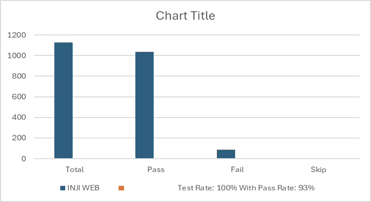
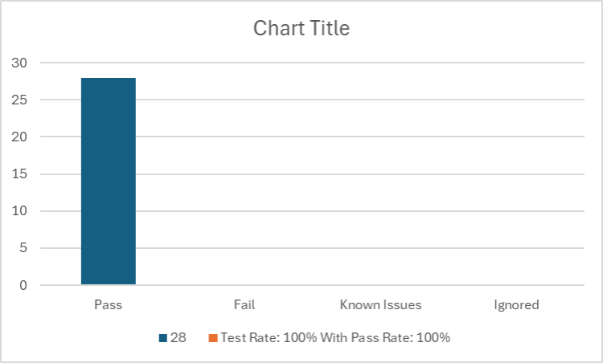
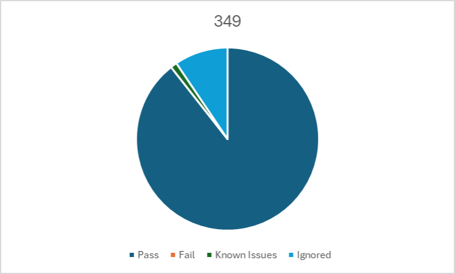

# Test Report

## Introduction

The scope of testing is to verify fitment to the specification from the perspective of Functionality, Configurability and Customizability. Verification is performed not only from the end-user perspective but also from the System Integrator (SI) point of view. Hence, the Configurability and Extensibility of the software are also assessed. This ensures the readiness of the software for use in multiple countries and diverse identity ecosystems.

### Overview and Scope 

* Inji Home page
* Issuer and Credential selection
* Authenticating with user credentials
* PDF Generation and Auto download
* Retrieve Issuers and Credential list
* Downloading VC
* Multi languages support
* Error Handling
* Issuers support
* QR Code
* Durian data storage integration
* Login with Google and Passcode
* OpenID4VP Implementation
* Secure Time Bound Storage
* Locale Support
* Authorization endpoint discovery through auth server well-known
* Sd jwt support
* SVG Support
* Claim 169

## Test Approach 

The Functional verification of the Inji Web application is performed on Windows, Android and iOS platforms to ensure alignment with product specifications and business requirements. Analyzed with respect to functional stability, data integrity, and UI consistency. The validation adopts a persona-based testing strategy, simulating real-world user scenarios across diverse device matrices and multi-language configurations to ensure robustness in both online and offline environments.

* Functionality
* API & UI Automation
* Configurability
* Customizability

## Test Organization 

**Table:** Test Organization

<table data-header-hidden><thead><tr><th width="145.37890625" valign="top"></th><th valign="top"></th><th valign="top"></th></tr></thead><tbody><tr><td valign="top"><strong>Name</strong></td><td valign="top"><strong>Functional Role</strong></td><td valign="top"><strong>Responsibilities</strong></td></tr><tr><td valign="top">Mrudula</td><td valign="top">QA Engineer</td><td valign="top">Verifying the functionality, stability of the application,and report preparation.</td></tr><tr><td valign="top">Chaitanya K</td><td valign="top">QA Manager</td><td valign="top">Overviewing the test execution and review of the report.</td></tr><tr><td valign="top">Ragini Krishna</td><td valign="top">Senior QA Manager</td><td valign="top">High-level governance and executive reviews of reports and execution.</td></tr></tbody></table>

### Test Planning 

* Data Readiness: Validate the availability of all services along with configured identity schemas (UIN/VID) to support biometric and authentication flows.
* Coverage Distribution: Execute test scenarios across a broad matrix of browsers on Windows and Mac system spanning multiple user personas to ensure end-to-end compatibility covers

### Browser Versions

Used the below browser versions in testing INJI WEB

* Chrome: Version 145.0.7632.160
* Firefox: Version 148.0 (64-bit)
* Edge: Version 145.0.3800.82
* Safari : Version 17

### Test Environment 

Table: Test Environment

<table data-header-hidden><thead><tr><th valign="top"></th></tr></thead><tbody><tr><td valign="top">Images (qa-inji1 env)</td></tr><tr><td valign="top">INJI Web - Injistackqa/ui-test:0.16.x</td></tr><tr><td valign="top">Injistackqa/inji-web:0.16.x</td></tr><tr><td valign="top">Injistackqa/apitest-mimoto:0.21.x</td></tr><tr><td valign="top">Injistackqa/mimoto:0.21.x</td></tr></tbody></table>

## Test Execution Report 

### Test case execution summary 

Table: Test Execution Summary

<table data-header-hidden><thead><tr><th valign="top"></th><th valign="top"></th><th valign="top"></th><th valign="top"></th><th valign="top"></th></tr></thead><tbody><tr><td valign="top">Platform</td><td valign="top">Total</td><td valign="top">Pass</td><td valign="top">Fail</td><td valign="top">Skip</td></tr><tr><td valign="top">INJI WEB</td><td valign="top">1125</td><td valign="top">1036</td><td valign="top">89</td><td valign="top">0</td></tr><tr><td valign="top">Test Rate: 100% With Pass Rate: 93%</td><td valign="top"></td><td valign="top"></td><td valign="top"></td><td valign="top"></td></tr></tbody></table>

### &#x20;

<figure><figcaption></figcaption></figure>

<figure><figcaption></figcaption></figure>

### Automation INJI Web UI 

Table: UI Automation

<table data-header-hidden><thead><tr><th valign="top"></th><th valign="top"></th><th valign="top"></th><th valign="top"></th><th valign="top"></th></tr></thead><tbody><tr><td valign="top">Total</td><td valign="top">Pass</td><td valign="top">Fail</td><td valign="top">Known Issues</td><td valign="top">Ignored</td></tr><tr><td valign="top">28</td><td valign="top">28</td><td valign="top">0</td><td valign="top">0</td><td valign="top">0</td></tr><tr><td valign="top">Test Rate: 100% With Pass Rate: 100%</td><td valign="top"></td><td valign="top"></td><td valign="top"></td><td valign="top"></td></tr></tbody></table>

<figure><figcaption></figcaption></figure>

<figure><figcaption></figcaption></figure>

### Automation INJI Web API Mimoto 

Table: API Automation Result

<table data-header-hidden><thead><tr><th valign="top"></th><th valign="top"></th><th valign="top"></th><th valign="top"></th><th valign="top"></th></tr></thead><tbody><tr><td valign="top">Total</td><td valign="top">Pass</td><td valign="top">Fail</td><td valign="top">Known Issues</td><td valign="top">Ignored</td></tr><tr><td valign="top">349</td><td valign="top">312</td><td valign="top">0</td><td valign="top">4</td><td valign="top">33</td></tr><tr><td valign="top">Test Rate: 100% With Pass Rate: 100%</td><td valign="top"></td><td valign="top"></td><td valign="top"></td><td valign="top"></td></tr></tbody></table>

<figure><figcaption></figcaption></figure>

<figure><figcaption></figcaption></figure>

## Defect Metrics 

### Defect Metrics for the Release 0.16.0 

The following table depicts only the bugs which are found and not addressed in the current release.

Table: Defect Metrics for the Release

<table data-header-hidden><thead><tr><th valign="top"></th><th valign="top"></th><th valign="top"></th><th valign="top"></th><th valign="top"></th></tr></thead><tbody><tr><td valign="top">Blocker</td><td valign="top">Critical</td><td valign="top">Major</td><td valign="top">Minor</td><td valign="top">Total</td></tr><tr><td valign="top">0</td><td valign="top">0</td><td valign="top">1</td><td valign="top">5</td><td valign="top">6</td></tr></tbody></table>

### Known Issues Metrics 

This section focuses on a separate category of issues that are known but not addressed in the current release. It provides a count and severity distribution for these defects across releases.

Table: Defect Metrics for the known issues

<table data-header-hidden><thead><tr><th valign="top"></th><th valign="top"></th><th valign="top"></th><th valign="top"></th><th valign="top"></th></tr></thead><tbody><tr><td valign="top">Blocker</td><td valign="top">Critical</td><td valign="top">Major</td><td valign="top">Minor</td><td valign="top">Total</td></tr><tr><td valign="top">0</td><td valign="top">0</td><td valign="top">54</td><td valign="top">28</td><td valign="top">82</td></tr></tbody></table>

## Conclusion 

This section summarises the key findings of test execution. It also provides a final QA recommendation on the build's readiness for release. The functional verification for Inji-web version 0.16.0 has been completed. The testing cycle achieved a 100% execution rate and a 92% pass rate across 1125 test cases. Additionally, API automation achieved a 100% pass rate.

While there are 6 open defects (0 Critical, 1 Major, 5 Minor) and 82 known issues in total, there are zero blocker defects identified. The application has demonstrated functional stability and data integrity consistent with product specifications.

### QA Approval 

The build has successfully met the defined exit criteria and is recommended for release. The approval is based on the following conditions:

* Test Case Execution Completion: 100% of planned scenarios executed.
* Defect Status: No Blocker defects remain open.
* Documentation Sign-off: All test artefacts and reports are finalized.
* Test Environment Stability: The test environment remained stable throughout the execution cycle.

**Table**: Report is signed off details

<table data-header-hidden><thead><tr><th valign="top"></th><th valign="top"></th><th valign="top"></th></tr></thead><tbody><tr><td valign="top">Name</td><td valign="top">Functional Role</td><td valign="top">Responsibilities</td></tr><tr><td valign="top">Chaitanya K</td><td valign="top">QA Manager</td><td valign="top"></td></tr><tr><td valign="top">Ragini Krishna</td><td valign="top">Senior QA Manager</td><td valign="top"></td></tr></tbody></table>

## Appendix 

This includes additional reference information for the report. It contains a history of document versions and a list of acronyms and their meanings.

### Appendix A: Versions 

<table data-header-hidden><thead><tr><th width="111.70703125"></th><th></th><th></th><th valign="top"></th></tr></thead><tbody><tr><td>Version</td><td>Date</td><td>Author</td><td valign="top">Reviewers</td></tr><tr><td>V1.0</td><td>10/12/2025</td><td>Santosh</td><td valign="top">
Chaitanya K

Ragini Krishna
</td></tr></tbody></table>

The GitHub link to the detailed report is [**here**](https://github.com/mosip/test-management/tree/master/inji-web/inji%20web%200.16.0).
