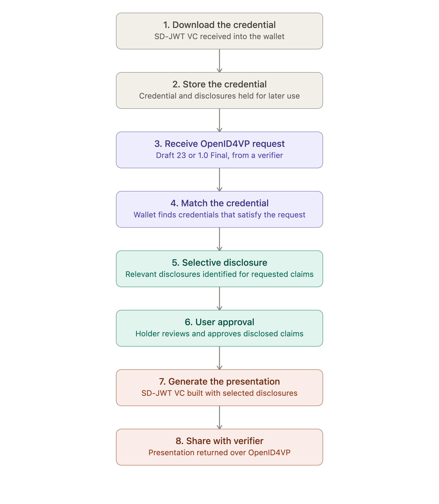

# IETF SD-JWT VC and Selective Disclosure

## Overview

An **SD-JWT VC (Selective Disclosure JSON Web Token Verifiable Credential)** is a credential format defined by the [IETF SD-JWT](https://datatracker.ietf.org/doc/draft-ietf-oauth-selective-disclosure-jwt/22/) specifications. Unlike a conventional signed credential, an SD-JWT VC does not carry all of its claims as plaintext. Selectively disclosable claims are represented in the credential only as cryptographic hashes, while the actual claim values are held separately as **Disclosures**. To reveal a claim, the holder shares the corresponding Disclosure alongside the credential; a verifier can then recompute the hash and confirm it matches the value committed to by the issuer.

This matters for a wallet because it changes what the web wallet is able to offer the user at presentation time: rather than sharing an entire credential, or requiring the issuer to produce a different credential for every possible combination of attributes, the wallet can share only the specific claims a given verifier has requested, provided the credential was issued with those claims marked as selectively disclosable.

**Inji Web Wallet** supports downloading and storing IETF SD-JWT VC credentials, and supports presenting them to a verifier through an **OpenID for Verifiable Presentations (OpenID4VP)** flow, using the credential's available disclosures to share only the claims a verifier requests.

It is important to be precise about what this means in practice: Inji Web Wallet does not edit, redact, or strip fields out of the credential itself. The SD-JWT VC's signed payload is never modified. Instead, the wallet selects which of the available disclosures to include when it constructs the presentation. A claim can only be selectively disclosed if the issuer originally made it selectively disclosable when the credential was issued; the web wallet cannot selectively disclose a claim that was not structured this way at issuance.

**Example:**

A user's IETF SD-JWT VC may contain:

* Name
* Date of birth
* Nationality
* Address

If a verifier requests only the user's date of birth, Inji Web Wallet uses the disclosure corresponding to that claim to build a presentation containing just that attribute subject to how the credential was issued and what the presentation request asks for. Name, nationality, and address remain undisclosed.

> **Scope note:** This page documents IETF SD-JWT VC and selective disclosure support in **Inji Web Wallet** only specifically, downloading, storing, viewing, and presenting SD-JWT VC credentials via OpenID4VP. It does not cover SD-JWT VC issuance, OpenID4VCI, issuer-side selective disclosure configuration, Inji Certify, or the Inji Verify.

#### Why This Feature Matters

* **Data minimization** — the web wallet can share only the attributes a verifier actually needs, rather than the full credential.
* **Privacy-preserving presentations** — claims that are not disclosed remain cryptographically hidden; they are never transmitted to the verifier.
* **Holder control** — the user reviews and approves what is being shared before any presentation is sent.
* **Reduced unnecessary disclosure** — fewer personal attributes move through the ecosystem for any single interaction, reducing exposure if a verifier's systems are later compromised.
* **Standards-based interoperability** — built on the IETF SD-JWT VC specifications and OpenID4VP, so presentations can be exchanged with any conformant verifier rather than a proprietary format.
* **Support for real-world minimal-disclosure use cases**, such as:
  * Proving age eligibility without revealing a full date of birth
  * Proving educational attainment without revealing every academic record
  * Proving employment status without revealing salary or role details
  * Proving eligibility for a healthcare or welfare service without revealing an entire medical or civil record

#### Supported Credential Format

| Credential Format                                                     | Inji Web Wallet                                                                     |
| --------------------------------------------------------------------- | ----------------------------------------------------------------------------------- |
| IETF SD-JWT VC                                                        | Supported (download, storage; presentation with selective disclosure via OpenID4VP) |
| W3C Verifiable Credential Data Model 1.1 and Data Model 2.0 (JSON-LD) | Supported (presentation via OpenID4VP)                                              |

IETF SD-JWT VC is a distinct credential format from the **W3C Verifiable Credentials Data Model** and from **ISO/IEC 18013-5 mDoc/mDL**. It uses JSON/JWT-based encoding and IETF-defined selective disclosure mechanics, rather than the JSON-LD proof model used by W3C VCs or the CBOR-based, session-bound disclosure model used by mDoc/mDL. This page does not attempt a full comparison of these formats; it documents Inji Web Wallet's handling of SD-JWT VC specifically.

#### How Does the Selective Disclosure Flow Work?

**User Flow (Step-by-Step)**

**1. Download the Credential**

Once an IETF SD-JWT VC has been issued to the user, it becomes available for download into Inji Web Wallet through the wallet's standard credential download flow. From the wallet's perspective, this step is about receiving and ingesting the credential; the issuance exchange itself (including OpenID4VCI) is outside the scope of this document.

**2. Store the Credential**

Inji Web Wallet stores the downloaded IETF SD-JWT VC, including its signed payload and the associated Disclosures so that it is available for later presentation. Stored credentials appear alongside the user's other Verifiable Credentials in the wallet's credential storage.

**3. View the Credential**

Inji Web Wallet renders the credential and its claims for the user, consistent with how other credential types are displayed in the wallet's credential view. Specific rendering behavior (layout, templates, which fields are shown) is subject to the wallet's existing credential rendering capability.

**4. Receive an OpenID4VP Request**

A verifier initiates a presentation request using **OpenID for Verifiable Presentations (OpenID4VP)**. The request identifies the credential type and/or the specific claims the verifier requires.

Inji Web Wallet supports OpenID4VP presentation requests conforming to:

* [**OpenID4VP Draft 23**](https://docs.inji.io/inji-wallet/inji-web/overview/features/verifiable-credential-presentation-openid4vp)
* [**OpenID4VP 1.0 Final**](verifiable-credential-presentation-openid4vp-published-v1.0.md)

**5. Match the Credential**

Inji Web Wallet evaluates the incoming presentation request against the credentials held in the wallet, identifying which stored credential(s) can satisfy the requested claims. Where the request specifies particular claims, the wallet determines which of the available SD-JWT VC Disclosures correspond to those claims.

**6. Selective Disclosure**

A credential may contain several claims, only some of which were marked as selectively disclosable at issuance. For presentation, Inji Web Wallet identifies which Disclosures correspond to the claims requested by the verifier and includes only those disclosures in the presentation. The wallet does not alter or remove fields from the signed credential; the underlying IETF SD-JWT VC remains intact; only the set of Disclosures shared with the verifier is scoped to what was requested and approved.

**7. User Approval**

Before any presentation is sent, the user reviews the claims being requested and approves their disclosure. Nothing is shared with the verifier without this step.

**8. Generate the Presentation**

Once the user approves, Inji Web Wallet constructs the IETF SD-JWT VC presentation using the credential together with the selected disclosures, in the form required by the OpenID4VP flow in use.

**9. Share with the Verifier**

The resulting presentation is returned to the verifier through the OpenID4VP response mechanism defined by the request. The verifier then independently validates the presentation.


<figure><figcaption></figcaption></figure>

#### Selective Disclosure Example

Credential held in Inji Web Wallet contains:

* Name
* Date of Birth
* Nationality
* Address

Verifier requests:

* Date of Birth

Web Wallet flow:

1. Identifies the relevant SD-JWT VC in storage.
2. Identifies that Date of Birth is the requested claim.
3. Locates the Disclosure corresponding to Date of Birth.
4. Includes that Disclosure in the presentation.
5. Sends the presentation to the verifier.

The verifier receives confirmation of the Date of Birth claim without receiving Name, Nationality, or Address.

This behavior depends entirely on the credential having been issued with the relevant claims marked as selectively disclosable. If a claim was not issued as selectively disclosable, the wallet cannot present it in isolation.

#### OpenID4VP Support

Inji Web Wallet supports credential presentation using:

* [**OpenID for Verifiable Presentations Draft 23**](https://openid.net/specs/openid-4-verifiable-presentations-1_0-ID3.html)
* [**OpenID for Verifiable Presentations 1.0 Final**](https://openid.net/specs/openid-4-verifiable-presentations-1_0.html)

At a high level, the wallet's role in an OpenID4VP exchange is:

```
Verifier
  → sends presentation request
  → Inji Web Wallet receives request
  → wallet evaluates available credentials
  → user approves requested information
  → wallet creates presentation
  → presentation is returned to verifier
```

This page does not attempt to restate the OpenID4VP specification; it documents that Inji Web Wallet supports presentation flows against both Draft 23 and 1.0 Final for IETF SD-JWT VC credentials.

#### Selective Disclosure During OpenID4VP

OpenID4VP and SD-JWT VC serve distinct, complementary roles in this flow:

* **OpenID4VP** defines the presentation exchange: how a verifier requests credentials/claims, and how a web wallet returns a presentation. OpenID4VP itself does not provide the selective disclosure mechanism.
* **IETF SD-JWT VC** provides the credential format and the cryptographic selective disclosure mechanism (hashed claims plus separate disclosures) that make it possible to reveal only some claims from a credential.

**Within Inji Web Wallet, this plays out as:**

* OpenID4VP determines what the verifier is requesting.
* Inji Web Wallet evaluates the request against stored credentials.
* IETF SD-JWT VC's Disclosure mechanism determines which claims can actually be selectively presented.
* The holder authorizes the presentation.
* The wallet returns the resulting presentation to the verifier over OpenID4VP.

#### Security and Privacy Considerations

* Selective disclosure reduces the amount of personal data shared in any single transaction, but it is not a substitute for a verifier limiting its own requests to what it actually needs.
* Inji Web Wallet only includes disclosures for claims requested and approved by the user for a given presentation.
* Users should review what is being requested before approving a presentation.
* Verifiers are expected to request only the claims necessary for their use case; selective disclosure protects against the wallet over-sharing, not against a verifier over-asking.
* SD-JWT's hash-based commitment mechanism allows a verifier to cryptographically confirm that a disclosed claim was genuinely issued and has not been altered.
* Selective disclosure limits _what_ is shared, not necessarily unlinkability or anonymity — repeated presentations of the same credential, or metadata around the exchange, may still allow correlation. Inji Web Wallet should not be described as providing absolute privacy or anonymity.

#### Current Limitations

| Area                                          | Status        |
| --------------------------------------------- | ------------- |
| Status/revocation checking for IETF SD-JWT VC | Not supported |
| Offline SD-JWT VC presentation                | Not supported |

#### Learn More

* [IETF SD-JWT specification (draft-ietf-oauth-selective-disclosure-jwt)](https://datatracker.ietf.org/doc/draft-ietf-oauth-selective-disclosure-jwt/)
* [IETF SD-JWT-based Verifiable Credentials specification (draft-ietf-oauth-sd-jwt-vc)](https://datatracker.ietf.org/doc/draft-ietf-oauth-sd-jwt-vc/)
* [OpenID for Verifiable Presentations specification](https://openid.net/specs/openid-4-verifiable-presentations-1_0.html)
* [IETF SD-JWT Technical Design](https://github.com/inji/inji-web/blob/v1.0.0-alpha.1/docs/SDJWTOpenID4VPIntegrationGuide.md)&#x20;

