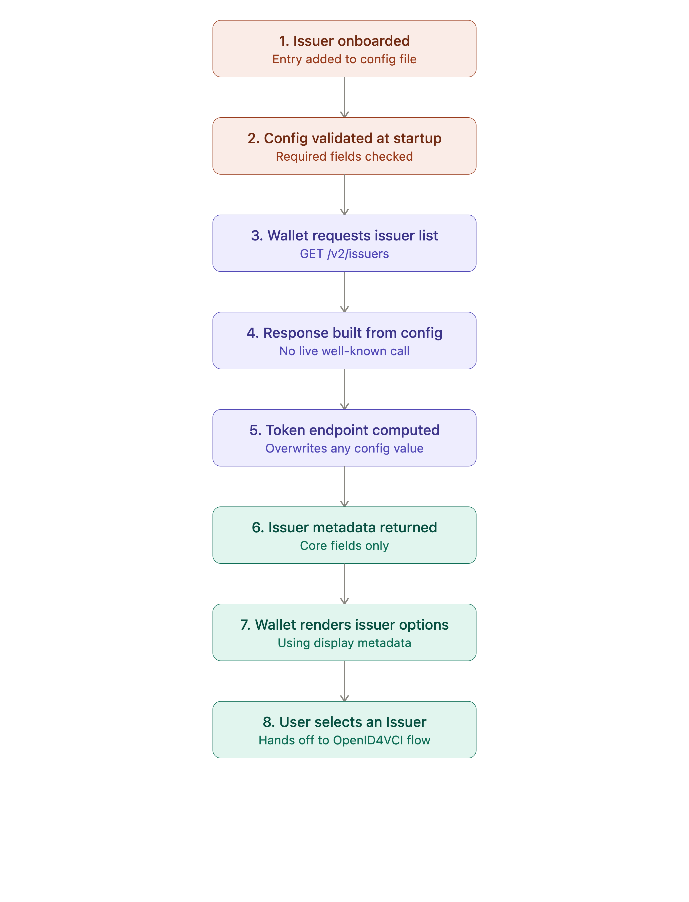

# Issuer Configuration and Onboarding (V2 API)

#### Overview

Before a user can download a credential in Inji Web Wallet, the wallet needs to know which Issuers exist, what they're called, how to reach them, and how to request a credential from each one. This information comes from **mimoto-issuers-config.json**, a configuration file read by Mimoto (the Inji Web Wallet backend), and exposed to clients through the **Issuers V2 API**.

In this flow:

* An Issuer is onboarded by adding an entry to `mimoto-issuers-config.json`.
* Mimoto validates that entry at startup.
* Inji Web Wallet's client calls the V2 API to retrieve the list of onboarded Issuers (or a single Issuer by ID).
* The API returns issuer metadata straight from configuration — no live call to the Issuer is made — with the `token_endpoint` computed by Mimoto at runtime.
* The wallet uses this metadata to display Issuer options to the user and to drive the OpenID4VCI issuance flow.

The same configuration file also backs the existing **V1** Issuers API, which additionally resolves some fields from each Issuer's live well-known endpoint. V2 is a leaner, configuration-only alternative to V1.

> **Scope note:** This page documents how Inji Web Wallet discovers and configures Issuers via the V2 API. It does not cover the OpenID4VCI credential download flow itself (see the separate OpenID4VCI Credential Issuance page), Issuer-side implementation, or Inji Certify.

#### Why This Feature Matters

* **Fast, predictable issuer listing** — V2 responses come only from local configuration, with no outbound well-known call, so listing Issuers is quick and doesn't depend on every Issuer being reachable at request time.
* **Backward compatibility** — the same config file drives both the existing V1 API and the new V2 API, so onboarding an Issuer once makes it available through either.
* **Schema flexibility** — both a minimal (new) and an extended (old) issuer schema are supported, and can be mixed freely in the same config file, so existing configurations don't need to be rewritten to adopt V2.
* **Consistent token endpoint handling** — `token_endpoint` is always computed and injected by Mimoto at runtime, removing a class of configuration drift where a stale or incorrect endpoint could be checked into config.
* **Fail-fast validation** — required fields are validated at Mimoto startup, so a misconfigured Issuer is caught before it can affect a user session.

#### Supported Schemas

| Schema         | Required Fields                                                                                                      | Optional / Extra Fields                                                                                                       | V2 Behaviour                                                                                                   |
| -------------- | -------------------------------------------------------------------------------------------------------------------- | ----------------------------------------------------------------------------------------------------------------------------- | -------------------------------------------------------------------------------------------------------------- |
| New (minimal)  | `issuer_id`, `protocol`, `display`, `client_id`, `client_alias`, `qr_code_type`, `enabled`, `credential_issuer_host` | `token_endpoint` (ignored if present; computed at runtime)                                                                    | Fully supported                                                                                                |
| Old (extended) | Same required fields as above                                                                                        | `wellknown_endpoint`, `redirect_uri`, `authorization_audience`, `proxy_token_endpoint`, `credential_issuer`, `token_endpoint` | Extra fields are accepted in config but ignored by V2's response; V2 still returns only the core issuer fields |

Both schemas can appear side by side in the same `issuers` array in `mimoto-issuers-config.json`.

#### V1 vs V2: What Changes for Inji Web Wallet

| Area                                                                                                            | V1 (`/issuers`)                                                                        | V2 (`/v2/issuers`)                                                                                      |
| --------------------------------------------------------------------------------------------------------------- | -------------------------------------------------------------------------------------- | ------------------------------------------------------------------------------------------------------- |
| Data source                                                                                                     | Config file, enriched with fields resolved from each Issuer's live well-known endpoint | Config file only — no well-known call                                                                   |
| Extended-schema fields (`wellknown_endpoint`, `redirect_uri`, `authorization_audience`, `proxy_token_endpoint`) | Returned as-is from config, when present                                               | Not returned — V2 responses are limited to the core issuer fields                                       |
| `token_endpoint`                                                                                                | Computed by Mimoto at runtime and returned; overwrites any value in config             | Computed by Mimoto at runtime and returned; overwrites any value in config                              |
| Dependence on Issuer availability                                                                               | Can depend on the Issuer's well-known endpoint being reachable                         | Independent of Issuer availability — purely local configuration                                         |
| Error handling                                                                                                  | —                                                                                      | Returns `400` if config is inaccessible; `404` for an invalid `issuer-id` on the single-issuer endpoint |

#### How Does the Flow Work?

1. **An Issuer is onboarded.** An entry describing the Issuer is added to `mimoto-issuers-config.json`, under the `mosip.openid.issuers`-configured file, using either the minimal or extended schema.
2. **Mimoto validates the configuration at startup.** Required fields (`issuer_id`, `protocol`, `display`, `client_id`, `client_alias`, `qr_code_type`, `enabled`, `credential_issuer_host`) are checked for every entry; a missing or invalid required field causes startup to fail with a clear message.
3. **Inji Web Wallet requests the issuer list.** The wallet client calls `GET /v2/issuers` (or `GET /v2/issuers/{issuer-id}` for a single Issuer).
4. **Mimoto builds the response from configuration only.** No outbound call is made to the Issuer's well-known endpoint for V2; the response is assembled directly from the matching config entries.
5. **Mimoto computes the token endpoint at runtime.** For every issuer in the response, `token_endpoint` is generated as `${mosip.api.public.url}${server.servlet.context-path}/get-token/{issuerId}`, overwriting any value present in config.
6. **Mimoto returns the issuer metadata.** The response includes `issuer_id`, `protocol`, `display`, `client_id`, `token_endpoint`, `client_alias`, `qr_code_type`, `enabled`, and `credential_issuer_host` for each matching Issuer.
7. **Inji Web Wallet renders the issuer options.** The wallet uses the `display` metadata (name, logo, title, description) to show the user which Issuers are available to download a credential from.
8. **User selects an Issuer.** Selecting an Issuer hands off into the OpenID4VCI credential issuance flow, using the `credential_issuer_host`, `client_id`, and computed `token_endpoint` returned by V2.

<figure><figcaption></figcaption></figure>

#### Security and Privacy

* V2 issuer listing does not make outbound calls to Issuers, which reduces the wallet's exposure to an unreachable or slow Issuer endpoint during a routine listing request.
* `token_endpoint` values are always generated by Mimoto rather than trusted from configuration, reducing the risk of a stale or maliciously altered endpoint being served to a client.
* Required-field validation at startup helps ensure a wallet does not present or attempt to use an incompletely configured Issuer to a user.
* This page does not cover the security properties of the credential issuance exchange itself (proof of possession, nonce handling); see the OpenID4VCI Credential Issuance page for that.

#### Learn More

* [OpenID for Verifiable Credential Issuance 1.0 (Final Specification)](https://openid.net/specs/openid-4-verifiable-credential-issuance-1_0.html)
* [Inji Web Wallet Backend (Mimoto) — Technical Design](https://github.com/inji/mimoto/blob/master/docs/IssuersV2EndpointMigration.md)&#x20;

