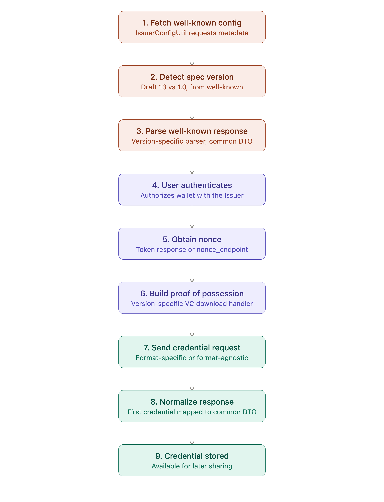

# Verifiable Credential Issuance(OpenID4VCI) : Published v1.0

## Overview

Inji Web Wallet lets a user obtain Verifiable Credentials (VCs) from a credential Issuer and store them in their wallet, using **OpenID for Verifiable Credential Issuance (OpenID4VCI)**. In this flow:

* An Issuer publishes a well-known configuration describing what credentials it can issue and how.
* Inji Web Wallet reads and parses that configuration.
* The user authenticates with the Issuer and authorizes the wallet to request a credential on their behalf.
* The wallet constructs a proof of possession, requests the credential, and receives it back from the Issuer.
* The credential is stored in the wallet for later use, including sharing it with a Verifier via OpenID4VP.

Inji Web Wallet supports two versions of the OpenID4VCI specification side by side: **Draft 13** and **the 1.0 Final specification**. The wallet detects which version an Issuer speaks from its well-known response and routes the download flow accordingly, so the same wallet can issue credentials from Issuers on either version.

> **Scope note:** This page documents credential _issuance_ into Inji Web Wallet only. It does not cover credential sharing/presentation (OpenID4VP), Inji Certify, Issuer-side implementation, or the Inji Mobile Wallet.

#### Why This Feature Matters

* **Standards-based issuance** built on the OpenID4VCI specification rather than a proprietary onboarding format.
* **Forward and backward compatibility:** the wallet can issue from Issuers still running Draft 13 as well as Issuers that have moved to the 1.0 Final specification, without the user needing to know which.
* **Format-agnostic by design:** the 1.0 credential request structure is not tied to a single credential format, so the underlying handler can be extended as new formats are supported.
* **Consistent downstream behaviour**: regardless of which specification version an Issuer uses, the wallet normalizes the result to a common internal representation, so the rest of the wallet (storage, display, sharing) is unaffected by which version was used to obtain the credential.
* **Extensibility**: The version-detection and parsing design is built so that future specification versions can be added with minimal changes elsewhere in the wallet.

#### Supported Specification Versions

| OpenID4VCI Version | Well-Known Response Shape                                                                            | Nonce Source                                                        | Inji Web Wallet Support |
| ------------------ | ---------------------------------------------------------------------------------------------------- | ------------------------------------------------------------------- | ----------------------- |
| Draft 13           | `credential_configurations_supported` → `display`                                                    | `c_nonce` from the token response                                   | Supported               |
| 1.0 Final          | `credential_configurations_supported` → `credential_metadata` → `display`; optional `nonce_endpoint` | Dedicated `nonce_endpoint`, when present in the well-known response | Supported               |

Version detection happens once, at the start of the flow, by inspecting the Issuer's well-known response:

1. If a non-empty `nonce_endpoint` field is present → **v1.0**.
2. Else, if `credential_configurations_supported` → `credential_metadata` is present → **v1.0.**
3. Else, if `credential_configurations_supported` → `display` is present → **Draft 13**.
4. If none of the above match → defaults to **v1.0.**

#### OpenID4VCI Draft 13 vs 1.0: What Changes for Inji Web Wallet

<table data-search="false"><thead><tr><th width="246.765625">Area</th><th>Draft 13</th><th>v1.0</th></tr></thead><tbody><tr><td>Specification status</td><td>Draft</td><td>Final</td></tr><tr><td>Display metadata location</td><td><code>credential_configurations_supported</code> → <code>display</code></td><td><code>credential_configurations_supported</code> → <code>credential_metadata</code> → <code>display</code></td></tr><tr><td>Nonce for proof of possession</td><td><code>c_nonce</code> returned in the token response</td><td>Optional <code>nonce_endpoint</code> in the well-known response; if present, the wallet fetches a nonce from it before building the proof. If absent, no <code>c_nonce</code> claim is added to the proof JWT</td></tr><tr><td>Credential request structure</td><td>Format-specific request body</td><td>Format-agnostic request keyed by <code>credential_configuration_id</code>, with proofs supplied as <code>proofs.jwt: [...]</code></td></tr><tr><td>Credential response structure</td><td>Single credential in the response</td><td><code>credentials</code> array, able to hold multiple credentials per response</td></tr><tr><td>Number of credentials handled by Inji Web</td><td>One</td><td>One — even though the 1.0 response structure supports multiple credentials, Inji Web currently sends a single proof object per request, so only the first credential in the <code>credentials</code> array is extracted and used</td></tr><tr><td>Presentation to the rest of the wallet</td><td>Normalized common response DTO</td><td>Normalized to the same common response DTO used for Draft 13, so downstream code (storage, display, sharing) does not need to know which version issued the credential</td></tr></tbody></table>

> Inji Web Wallet currently sends only one proof object per credential request. As a result, even against a v1.0 Issuer capable of returning multiple credentials in one response, the wallet takes only the first credential from the `credentials` array.

#### How Does the Flow Work?

1. **Wallet fetches the Issuer's well-known configuration.** Inji Web Wallet's `IssuerConfigUtil` requests the Issuer's well-known metadata, describing the credentials it can issue and how to request them.
2. **Wallet detects the specification version.** A version detector inspects the well-known response (checking for `nonce_endpoint`, then `credential_metadata`, then `display`) and determines whether the Issuer is on Draft 13 or 1.0.
3. **Wallet parses the well-known response.** A version-specific parser (selected via a well-known parser factory) parses and validates the response using the DTO appropriate to that version, then maps the result into a common internal DTO used by the rest of the flow.
4. **User authenticates and authorizes.** The user logs in to the Issuer and authorizes the wallet to request a credential, following the OAuth 2.0-based authorization flow underlying OpenID4VCI.
5. **Wallet obtains a nonce, where required.** For a Draft 13 Issuer, the wallet takes the `c_nonce` from the token response. For a 1.0 Issuer that publishes a `nonce_endpoint`, the wallet fetches a nonce from that endpoint; if no `nonce_endpoint` is present, no nonce claim is added to the proof.
6. **Wallet builds the proof of possession.** A version-specific VC download handler (selected via a VC download handler factory) constructs the proof JWT, embedding the nonce where applicable.
7. **Wallet sends the credential request.** For Draft 13, this is a format-specific request. For 1.0, this is the format-agnostic request keyed by `credential_configuration_id`, with the proof supplied under `proofs.jwt`.
8. **Wallet receives and normalizes the credential response.** The handler parses the response for its version (a single credential object for Draft 13; a `credentials` array for 1.0), extracts the credential to use, and returns it in the same normalized format regardless of version.
9. **Credential is stored in the wallet.** The normalized credential is handed back to the calling flow (wallet login flow or guest download flow) and stored for later use.

<figure><figcaption></figcaption></figure>

#### Current Limitations

<table data-search="false"><thead><tr><th>Area</th><th>Status</th></tr></thead><tbody><tr><td>Multiple credentials returned in a single 1.0 credential response</td><td>Not supported — Inji Web Wallet sends a single proof per request and extracts only the first credential from the <code>credentials</code> array</td></tr><tr><td>Credential formats covered by the format-agnostic 1.0 request</td><td>mDoc/mDL not supported</td></tr><tr><td><code>nonce_endpoint</code>-based nonce retrieval</td><td>Supported when the Issuer's well-known response includes a non-empty <code>nonce_endpoint</code></td></tr><tr><td>Batch credential issuance (multiple proofs per request)</td><td>Not supported</td></tr></tbody></table>

#### Security and Privacy

* The wallet validates and normalizes the Issuer's well-known response before acting on it, regardless of specification version.
* Proof-of-possession binds the credential request to the wallet's key material, and includes a nonce where the Issuer's version and configuration require one, to reduce replay risk.
* The wallet only proceeds with issuance after the user has authenticated with the Issuer and authorized the request.
* As with any issuance flow, the Issuer remains responsible for verifying the user's eligibility before issuing a credential; OpenID4VCI standardizes the exchange, not the Issuer's eligibility checks.

#### Learn More

* [OpenID for Verifiable Credential Issuance 1.0 (Final Specification)](https://openid.net/specs/openid-4-verifiable-credential-issuance-1_0.html)
* [OpenID for Verifiable Credential Issuance Draft 13 Specification](https://openid.net/specs/openid-4-verifiable-credential-issuance-1_0-ID1.html)
* [Inji Web Wallet Backend (Mimoto) — Technical Design ](https://github.com/inji/mimoto/blob/v1.0.0-alpha.1/docs/VCIssuanceV1SpecificationSupport.md)

