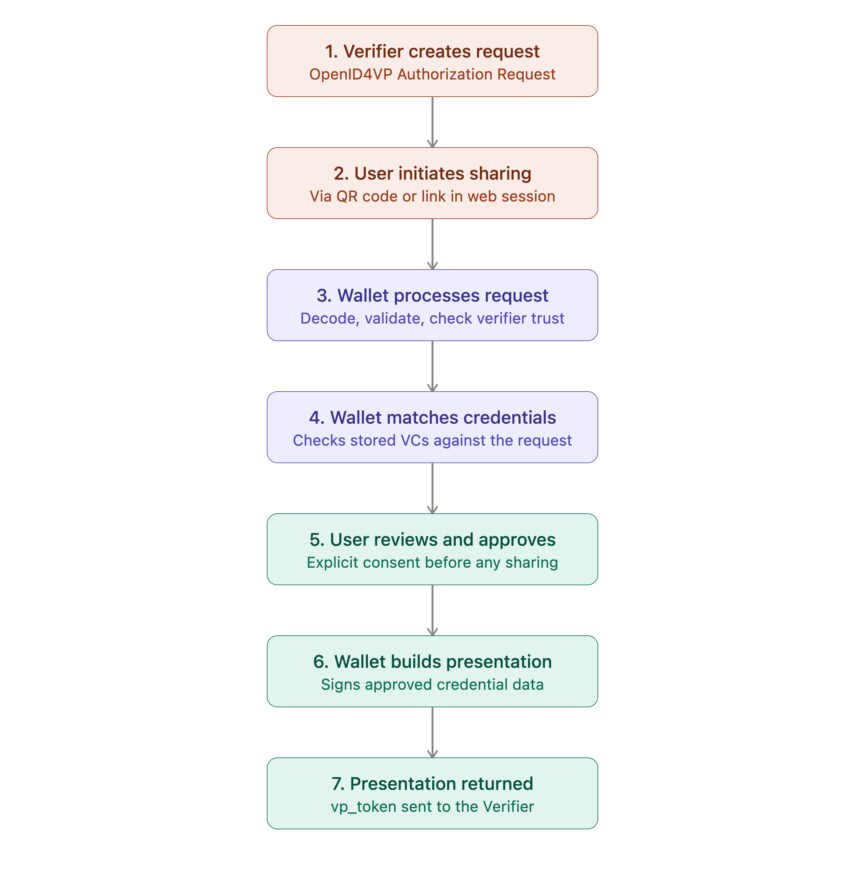

# Verifiable Credential Presentation (OpenID4VP) : Published v1.0

## Overview

Inji Web Wallet lets a user share Verifiable Credentials (VCs) already stored in their wallet with an online Verifier using **OpenID for Verifiable Presentations (OpenID4VP)**. In this flow:

* A Verifier requests one or more credentials (and specific claims from them) from the user.
* Inji Web Wallet receives and processes that request.
* The wallet identifies which stored credentials can satisfy it.
* The user reviews and approves what will be shared.
* The wallet builds the Verifiable Presentation (VP) and returns it to the Verifier.

The broader OpenID4VP ecosystem also defines the **Digital Credentials Query Language (DCQL),** the JSON-based query language introduced in the OpenID4VP 1.0 Final specification, that lets a Verifier describe exactly which credentials and claims it needs (format, type, specific claims, and combinations of credentials via credential sets), rather than asking for a whole credential. DCQL affects the wallet side of the exchange too: instead of matching against a looser request, the wallet evaluates a structured query against its stored credentials to determine what satisfies it.

> **Scope note:** This page documents credential _sharing/presentation_ from Inji Web Wallet only. It does not cover credential issuance (OpenID4VCI), Inji Certify, verifier-side implementation, or the Inji Mobile Wallet.

#### Why This Feature Matters

* **Standards-based sharing** — built on the OpenID4VP specification rather than a proprietary exchange format.
* **Interoperability** — works with any OpenID4VP-compliant Verifier, including Inji Verify.
* **User consent** — the holder sees and approves what is being shared before anything leaves the wallet.
* **Browser-based access** — no app install is required; credentials can be shared from any supported browser.
* **Alignment with an evolving standard** — as the OpenID4VP specification has matured from draft versions toward DCQL-based querying in 1.0 Final, wallet-side credential matching is moving toward more precise, claim-level requests instead of coarse "give me this credential type" requests.

#### Supported Credential Types

| Credential Format                                    | OpenID4VP Presentation Support in Inji Web Wallet                                                                                                                        |
| ---------------------------------------------------- | ------------------------------------------------------------------------------------------------------------------------------------------------------------------------ |
| W3C Verifiable Credentials (JSON-LD, Data Model 1.1) | Supported — live OpenID4VP presentation to a compliant Verifier                                                                                                          |
| IETF SD-JWT VC                                       | Download and storage supported; **selective-disclosure sharing via OpenID4VP is listed as "Coming Soon"** in current Inji Web documentation, not yet generally available |
| ISO 18013-5 (mDL / mDoc)                             | Not yet supported for OpenID4VP presentation                                                                                                                             |

#### How Does the Flow Work?

1. **Verifier creates a presentation request.** The Verifier (e.g., Inji Verify or another OpenID4VP-compliant relying party) constructs an OpenID4VP Authorization Request describing the credential(s) it needs.
2. **User initiates sharing from Inji Web Wallet.** The user, logged into their Web Wallet session with credentials stored under "Stored Cards," triggers the sharing flow — for example via a Verifier-presented QR code or link that carries the Authorization Request.
3. **Inji Web Wallet processes the request.** The wallet decodes and validates the Authorization Request, confirms the Verifier is trusted, and works out which of the requester's criteria need to be matched.
4. **Wallet matches stored credentials.** The wallet checks its stored, logged-in credentials against the request and determines which ones (and, where claim-level requests are used, which claims) can satisfy it.
5. **User reviews and approves.** The wallet shows the user what is being requested and by whom, and the user must explicitly consent before anything is shared.
6. **Wallet builds the Verifiable Presentation.** For supported JSON-LD credentials, the wallet constructs and signs the Verifiable Presentation containing the approved credential data.
7. **Presentation is returned to the Verifier.** The signed VP is sent back to the Verifier through the response mechanism defined by the Authorization Request, completing the online, real-time sharing flow.

<figure><figcaption></figcaption></figure>

#### DCQL: What's Verified for Inji Web Wallet

The wider OpenID4VP 1.0 Final specification uses DCQL, rather than the earlier Presentation Exchange / `presentation_definition` model, as its standard mechanism for a Verifier to describe required credentials and claims. DCQL queries are made up of:

* **Credential Queries** — each describing a single credential the Verifier wants (its format, and optionally claims to request from it).
* **Claim Queries** — used inside a credential query to ask for specific claims (e.g., date of birth) rather than the whole credential.
* **Credential Set Queries** — used to express combinations, such as "either a National ID or a Passport" or "both an Education credential and an Identity credential."

At the level of Inji's published ecosystem documentation, DCQL and the OpenID4VP 1.0 Final specification are explicitly confirmed for **Inji Verify** (the verifier component), which documents supporting Presentation Exchange in releases up to 0.18.x and DCQL in later releases, both compliant with OpenID4VP 1.0 Final. Inji's **OpenID4VP library**, used to build wallet-side OpenID4VP support, is documented against **OpenID4VP Draft 23**, using the draft-era Presentation Definition model, and is referenced in the context of the Inji Mobile Wallet.

**Published Inji Web Wallet documentation does not currently state, at a protocol-version level, which of Draft 23 or OpenID4VP 1.0 Final (and therefore which of Presentation Definition or DCQL) Inji Web Wallet itself implements for its OpenID4VP presentation flow.** Because this page must not assert protocol-version support that hasn't been confirmed against the Inji Web Wallet implementation specifically, this detail is called out below under **Implementation Verification Required** rather than presented as fact.

#### DCQL and Selective Disclosure

These are distinct pieces of the picture, and it's worth keeping them separate:

* **DCQL** describes _what_ a Verifier is asking for (which credentials, which claims, and in what combinations).
* **Selective disclosure** (for SD-JWT VC) determines _how_ a credential that supports it can reveal only the requested claims while keeping the rest hidden.
* **OpenID4VP** is the transport/exchange protocol that carries the request and the resulting presentation between Verifier and wallet.

DCQL itself does not provide cryptographic selective disclosure — it can _ask_ for specific claims, but a wallet can only fulfill that claim-level request with true selective disclosure if the underlying credential format supports it. For Inji Web Wallet, SD-JWT VC selective-disclosure sharing via OpenID4VP is currently listed as a pipeline feature, not a shipped one, so this claim-level, format-native selective disclosure is not yet available in the wallet's presentation flow.

#### Current Limitations

<table data-search="false"><thead><tr><th>Area</th><th>Status</th></tr></thead><tbody><tr><td>OpenID4VP presentation of mDoc/mDL credentials</td><td>Not supported</td></tr></tbody></table>

#### Security and Privacy

* A well-behaved Verifier should request only the credentials and claims it actually needs for the transaction at hand.
* Inji Web Wallet validates the Verifier's Authorization Request and confirms the Verifier's legitimacy before presenting any credential options to the user.
* The user can review what is being requested and by whom before approving a share; nothing is sent without explicit consent.
* Where claim-level requests and selective disclosure are available, they can reduce how much data is disclosed beyond what a transaction actually requires.
* The Verifier remains responsible for validating the presentation it receives (signatures, freshness, and credential status).
* OpenID4VP is a protocol for standardized, consented credential exchange — it does not, by itself, guarantee anonymity or prevent a Verifier from correlating requests across sessions.

#### Learn More

* [OpenID for Verifiable Presentations 1.0 (Final Specification)](https://openid.net/specs/openid-4-verifiable-presentations-1_0.html)
* [Inji Verify — Overview (OpenID4VP verification flow)](https://docs.inji.io/inji-verify/overview)
* [Inji OpenID4VP Library (GitHub)](https://github.com/mosip/inji-openid4vp)
* [Inji Web Wallet Backend (Mimoto) — Technical Design ](https://github.com/inji/mimoto/blob/v1.0.0-alpha.1/docs/OVP-1.0-Support.md)
