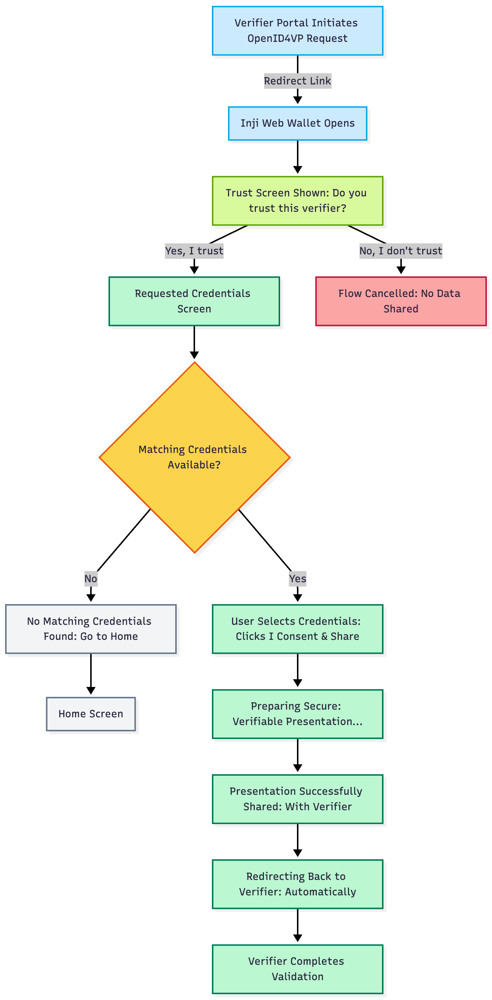

# Verifiable Credential Presentation (OpenID4VP)

## **Overview**

Inji Web Wallet supports **Verifiable Credential (VC) Presentation** using the [**OpenID4VP**](https://openid.net/specs/openid-4-verifiable-presentations-1_0-ID3.html) standard.\
This allows users to **securely share their JSON-LD Verifiable Credentials** directly with a verifier through a **live, interactive, verifier-initiated** flow.

Using this feature, Inji Web can receive a presentation request from a verifier, prompt the user for trust and consent, select matching credentials from the wallet, and send a cryptographically signed Verifiable Presentation (VP) back to the verifier.

This enables **real-time, standards-compliant, privacy-respecting** credential sharing without needing to upload PDF files or scan QR codes manually. This feature's page explains the entire capability in a clear, functional, end-to-end way.

### **Why This Feature Matters**

* **Secure by Design:** Uses [**OpenID4VP**](https://openid.net/specs/openid-4-verifiable-presentations-1_0-ID3.html) for end-to-end, signed presentations.
* **User Controlled:** Users explicitly trust the verifier, choose which credentials to share, and consent before sharing.
* **Interoperable:** Works with any [**OpenID4VP**](https://openid.net/specs/openid-4-verifiable-presentations-1_0-ID3.html)-compliant verifier.
* **Paperless & Instant:** No need for scanning, printing, or uploading PDFs.
* **Future Scalable:** Forms the foundation for SD-JWT selective disclosure (coming soon).

### **Supported Credential Types**

**Currently supported**:

* **W3C JSON-LD Verifiable Credentials (VC Data Model 1.1)**\\
  * Supported for full OpenID4VP presentation flow

**Coming Soon**:

* **IETF SD-JWT** (Selective disclosure via OpenID4VP)
* **ISO 18013-5 mDL / mDoc**

### **How does the OpenID4VP Flow Work?**

A functional walkthrough of the complete user journey:

#### **User Flow (Step-by-Step)**

1. **Verifier initiates a presentation request** (via redirect\_uri ).
2. **Inji Web Wallet opens** and shows a trust screen with the verifier identity.
3. **User approves trust** (“Yes, proceed”) or declines (“No, cancel request”).
4. **The web wallet displays requested credentials** and allows the user to select which to share.
5. **User gives consent** (“I Consent & Share”).
6. **Wallet prepares and signs** a Verifiable Presentation.
7. **Presentation is sent to the verifier** via the OpenID4VP protocol.
8. **User sees a success screen** and is automatically redirected back to the verifier.

<figure><figcaption>
<strong>User Flow Diagram</strong>
</figcaption></figure>

For a step-by-step walkthrough of how users start the flow from the verifier and complete it in the UI, see the [**End User Guide**.](../../functional-overview/end-user-guide.md#openid4vp-presenting-verifiable-credentials)

### **Current Limitations**

* **Inji Verify does not yet support initiating OpenID4VP** (coming in a future release).
* Only **JSON-LD credentials** are supported today.
* SD-JWT selective disclosure is not yet supported(coming in a future release).

### **Test the Feature Today**

To try OpenID4VP with Inji Web, refer [here](../../functional-overview/end-user-guide.md#openid4vp-presenting-verifiable-credentials)!


**Important:**\
In the current release of Inji Web Wallet 0.15.0 version, only the **mock verifier services** can generate OpenID4VP requests.

