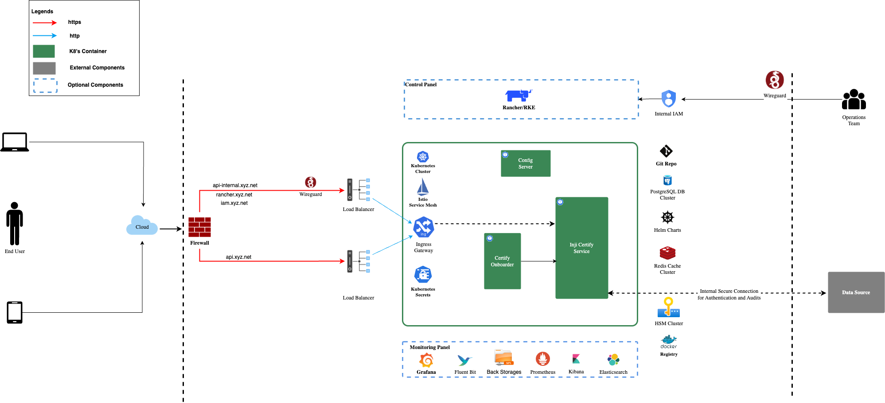
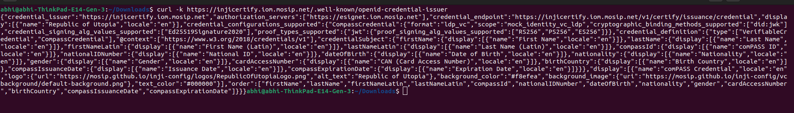
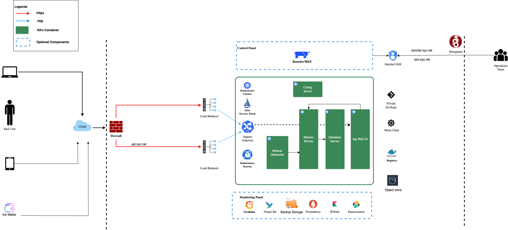
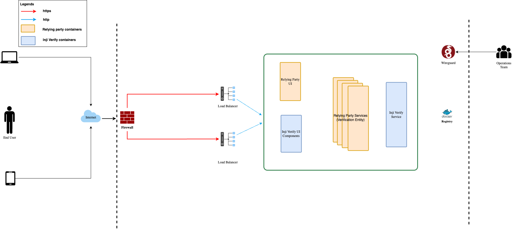

# Inji Deployment Guide

## Overview

[Inji](../../) is a digital credentialing stack that enables users to securely download, store, share, and verify credentials. This guide is structured to provide a comprehensive approach for deploying the Inji stack (Inji Certify, Mimoto, Inji Web and Inji Verify). Not only the Inji Stack, this deployment guide has taken an approach to cover everything from deploying Wireguard to Base Infrastructure setup, Core Infra setup to configurations and finally the Inji Stack deployment.

### Do I need to read through the entire guide to be able to deploy Inji?

This is the first question you could ask and the answer is No! If you have the Infrastructure ready and you just want to deploy the Inji stack you can directly jump to the [Inji Stack Deployment](deploy.md#inji-stack-deployment) section.

### How is this guide structured and organized?

1. [**Introduction**](deploy.md#introduction): Provides an overview of the Inji stack, deployment scenarios, required skill sets, system architecture, and key considerations for on-premise deployments.
2. [**Prerequisites**](deploy.md#prerequisites-for-overall-deployment): Outlines infrastructure details, hardware/software/network requirements, and initial setup steps.
3. [**Base Infrastructure Setup**](deploy.md#base-infrastructure-setup): Guides you through setting up the foundational infrastructure for Inji, including Kubernetes provisioning, NGINX configuration, networking, and optionally, the observability cluster and monitoring module.
4. [**Core Infrastructure Configuration**](deploy.md#core-infrastructure-components-setup): Explains the external services required—such as the database, artifactory, etc.,—and provides steps for their installation and configuration.
5. [**Inji Stack Deployment**](deploy.md#inji-stack-deployment): Offers step-by-step instructions to deploy Inji modules (Certify, Wallet, Verify) along with configuration guidance.
6. [**Contribution and Community**](deploy.md#contribution-and-community): Highlights how you can contribute code, share feedback, or reach out for support while working with the application.

Each section provides direct steps and references to external resources for a streamlined deployment experience.

### Typical Deployment Scenarios

The scenarios listed below are only a few examples. Inji Stack can support many more deployment possibilities depending on the country, organization, or individual requirements.

| Deployment Scenario                                       | Modules Included                       | Countries / Use Case Example                                                                                                      |
| --------------------------------------------------------- | -------------------------------------- | --------------------------------------------------------------------------------------------------------------------------------- |
| Full Stack Deployment (with eSignet)                      | Certify, Web Wallet, Verify, Mimoto    | Countries using MOSIP eSignet for authentication                                                                                  |
| Full Stack Deployment (without eSignet / own Auth Server) | Certify, Web Wallet, Verify, Mimoto    | Countries using their own authentication servers                                                                                  |
| Module-Specific Deployment (with eSignet)                 | Selected modules based on requirement  | Certify + Verify: Issuance & verification focus                                                                                   |
| Module-Specific Deployment (without eSignet)              | Selected modules based on requirement  | Web Wallet + Mobile Wallet: Credential holding/presentation                                                                       |
| Hybrid Deployment                                         | Some modules on-premise, some on cloud | Countries with regulatory/data residency constraints, for example issuer to be on-prem while the inji wallet is deployed on cloud |
| Phased Rollout Deployment                                 | Gradual deployment of modules/regions  | Pilot projects or regional rollouts                                                                                               |

### Basic Skill-sets Required

Deploying Inji Stack is easier while you have Base Infrastructure ready, still, if you want to deploy it 'On-Premise' and from scratch, this guide helps you with the instructions to achieve this.


**Note**: The basic Skill-sets mentioned below, in fact, expects you to know the following to be able to deploy it from scratch and that too on a bare metal servers (On-Premise). This should not get intimidating as in typical scenarios we expect the infrastructure to be deployed by an experienced 'System-Admin/DevOps'. However in case you want to evangelize Inji in your organization and want to have a hands-on with the deployment, this guide helps you with the steps and instructions to achieve this.


* **Linux System Administration**: Proficiency in Linux command-line operations, user and permission management, and basic networking.
* **Networking Fundamentals**: Knowledge of firewalls, load balancers, DNS, and secure network configuration.
* **Containerisation**: Experience with Docker or similar container technologies for building and managing service containers.
* **Kubernetes Administration**: Understanding of Kubernetes concepts, cluster setup, resource management, and troubleshooting.
* **Helm**: Familiarity with Helm for managing Kubernetes manifests and deployments.
* **Database Management**: Basic skills in managing PostgreSQL or similar databases, including initialization and schema setup.
* **Configuration Management**: Ability to manage application configuration files, secrets, and certificates securely.
* **Monitoring and Logging**: Understanding of logging and monitoring tools to observe system health and troubleshoot issues.
* **Security Best Practices**: Awareness of secure credential handling, certificate management, and access control.
* **Scripting**: Basic scripting skills (e.g., Bash, Python) for automation and operational tasks.
* **Familiarity with CI/CD Pipelines**: Understanding of continuous integration and deployment processes is a plus.

### Deployment Architecture of Inji

Links to the deployment architecture diagrams below take you to respective sections of this guide and illustrate the high-level deployment architecture for Inji Stack, showing how core components interact within the Kubernetes cluster, including ingress, services, and external integrations.

* [Inji Certify](deploy.md#deploying-inji-certify)
* Inji Wallet
  * [Inji Web Wallet](deploy.md#deploying-inji-web-wallet)
  * [Mimoto(backend for Wallet)](deploy.md#deploying-mimoto-backend-for-inji-wallet)
* [Inji Verify](deploy.md#deploying-inji-verify)

### Typical Deployment Order

For a smooth and error-free setup of the Inji Stack, it is recommended to follow the deployment order starting with Inji Certify, followed by mimoto backend for Inji Wallet(Mobile+Web), next the Inji Web Wallet, and finally Inji Verify. This sequence ensures that foundational services and dependencies are available before deploying modules that rely on them, leading to a more stable and seamless deployment experience.

### Deployment Considerations for On-Premise Inji Stack

The section helps you to have a quick understanding of what you should expect when you go about deploying Inji-Stack, especially if you are deploying it 'On-Premise' and from scratch.

* Inji modules are deployed as microservices in a Kubernetes cluster.
* Wireguard is used as a trust network extension to access the admin, control, and observation panes.
* Inji uses Nginx server for:
  * SSL termination
  * Reverse Proxy
  * CDN/Cache management
  * Load balancing
* Kubernetes (k8's) cluster is administered using the rke tools and kubectl commands.
* We have two k8's clusters:
  * **Observation cluster** \[Optional] - This cluster is part of the observation plane and assists with administrative tasks. By design, this is kept independent from the actual cluster as a good security practice and to ensure clear segregation of roles and responsibilities. As a best practice, this cluster or its services should be internal and should never be exposed to the external world.
    * Rancher is used for managing the Inji cluster.
    * Keycloak in this cluster is used to manage user access and rights for the observation plane.
    * It is recommended to configure log monitoring and network monitoring in this cluster during production deployment.
    * In case you have an internal container registry, then it should run here.
  * **Inji cluster** - This cluster runs all the Inji components and core infrastructure components like kafka, Postgres, minio, etc.
    * Inji Services are deployed in this cluster.

## Prerequisites for Overall Deployment

While we have placed the **Prerequisites** specific to a section under respective sections itself, here, this '**Prerequisites**' lists the common ones which you will need no matter which component you are deploying such as Wireguard, PC - Tools and Utilities etc.

### Personal Computer

Follow the steps mentioned here to install the required tools on your personal computer to create and manage the k8's cluster.

#### Operating Systems

The Inji stack can be deployed with a PC having one of the following operating systems, however for this guide we have considered a linux machine with Ubuntu 22.04 LTS.

* **Linux** (Ubuntu 22.04 LTS - recommended for production deployments)
* **Windows**
* **macOS (OSX)**



#### Tools and Utilities

You should have these tools installed on your local machine from where you will be running the ansible playbooks to create and manage the k8 cluster using RKE1.

* [Ansible](https://docs.ansible.com/ansible/latest/installation_guide/installation_distros.html) - version > 2.12.4
* Command line utilities:
  * [kubectl](https://kubernetes.io/docs/tasks/tools/#kubectl)- version 2.12.4 or higher
  * [helm](https://helm.sh/docs/intro/install/)- any client version above 3.0.0 and add below repos as well

```
helm repo add bitnami https://charts.bitnami.com/bitnami
helm repo add mosip https://mosip.github.io/mosip-helm
```

* [rke](https://rancher.com/docs/rke/latest/en/installation/) : version: [1.3.10](https://github.com/rancher/rke/releases/tag/v1.3.10)
* [Istioctl](https://istio.io/latest/docs/setup/getting-started/#download) : version: 1.15.0
*   Create a directory as mosip in your PC and:

    * clone k8’s infra repo with tag : 1.2.0.2 (**whichever is the latest version**) inside mosip directory. `git clone https://github.com/mosip/k8s-infra -b v1.2.0.2`
    * clone mosip-infra with tag : 1.2.0.2 (**whichever is the latest version**) inside mosip directory. `git clone https://github.com/mosip/mosip-infra -b v1.2.0.2`
    * Set below mentioned variables in bashrc and excute command `source .bashrc`

    ```
    export INJI_ROOT=<location of mosip directory>
    export K8_ROOT=$INJI_ROOT/k8s-infra
    export INFRA_ROOT=$INJI_ROOT/mosip-infra
    ```

    > Note: Above mentioned environment variables will be used throughout the installation to move between one directory to other to run install scripts.
* Wireguard Client - Refer to the [Setup Wireguard Client on your PC](deploy.md#setup-wireguard-client-on-your-pc) section for the instructions.

### Setting Up Wireguard


**Note**: In case you already have VPN configured to access nodes privately please skip Wireguard installation and continue to use the same VPN.


Wireguard bastian server provides secure private channel to access Inji cluster. Bastian server restricts public access, and enables access to only those clients who have their public key listed in Wireguard server.

WireGuard is a modern, fast, and secure VPN (Virtual Private Network) protocol and software that creates encrypted tunnels between devices.

* Wireguard bastian server provides secure private channel to access Inji cluster.
* Bastian server restricts public access, and enables access to only those clients who have their public key listed in Wireguard server.
* Bastion server listens on UDP port 51820.


**Note**: You can also refer to [Wireguard Administrator's Guide](https://github.com/mosip/k8s-infra/blob/main/docs/wireguard-administrators-guide.md) for more on Wireguard configuration and management.


#### Prerequisites to Set Up Wireguard

**Wireguard Bastion Host**

* **VMs and Hardware Specifications**
  * 1 VM (ensure to set up active-passive for HA)
  * Specification - 2 vCPUs, 4 GB RAM, 8 GB Storage (HDD)
* **Server Network Interfaces**
  * Private interface: On the same internal network as all other nodes (e.g., local NAT network).
  * Public interface: Either a direct public IP or a firewall/NAT rule forwarding UDP port 51820 to this interface's IP address.

#### Setting up Wireguard VM and wireguard bastion server

Before proceeding, Create a Wireguard server VM with the mentioned specification under 'Prerequisites' above. This VM will be used to set up the Wireguard server. Once the VM is ready, open the required ports on the Bastion server VM.

**Open required ports in the Bastian server VM**

Configure the firewall on the Bastion server virtual machine to allow network traffic through specific ports needed for your application or remote access.

* `cd $K8_ROOT/wireguard/`
* Create copy of `hosts.ini.sample` as `hosts.ini` and update the required details for wireguard VM
* `cp hosts.ini.sample hosts.ini`


**Note**:

* Remove `[Cluster]` complete section from copied `hosts.ini` file.
* Add below mentioned details:
  * ansible\_host : public IP of Wireguard Bastion server. eg. 100.10.20.56
  * ansible\_user : user to be used for installation. In this ref-impl we use Ubuntu user.
  * ansible\_ssh\_private\_key\_file : path to pem key for ssh to wireguard server. eg. `~/.ssh/wireguard-ssh.pem`


* Execute ports.yml to enable ports on VM level using ufw:`ansible-playbook -i hosts.ini ports.yaml`


**Note**:

* Permission of the pem files to access nodes should have 400 permission. `sudo chmod 400 ~/.ssh/privkey.pem`
* These ports are only needed to be opened for sharing packets over UDP.
* Take necessary measure on firewall level so that the Wireguard server can be reachable on 51820/udp.


**Install docker**

* execute docker.yml to install docker and add user to docker group:

```sh
ansible-playbook -i hosts.ini docker.yaml
```

* Setup Wireguard server
  * SSH to wireguard VM
  * `ssh -i <path to .pem> ubuntu@<Wireguard server public ip>`
  * Create directory for storing wireguard config files.\
    `mkdir -p wireguard/config`
  *   Install and start wireguard server using docker as given below:

      ```sh
      sudo docker run -d \
      --name=wireguard \
      --cap-add=NET_ADMIN \
      --cap-add=SYS_MODULE \
      -e PUID=1000 \
      -e PGID=1000 \
      -e TZ=Asia/Calcutta \
      -e PEERS=30 \
      -p 51820:51820/udp \
      -v /home/ubuntu/wireguard/config:/config \
      -v /lib/modules:/lib/modules \
      --sysctl="net.ipv4.conf.all.src_valid_mark=1" \
      --restart unless-stopped \
      ghcr.io/linuxserver/wireguard
      ```


**Note**:

* Increase the number of peers above in case more than 30 wireguard client confs (-e PEERS=30) are needed.
* Change the directory to be mounted to wireguard docker as per need. All your wireguard confs will be generated in the mounted directory (`-v /home/ubuntu/wireguard/config:/config`).


#### Setup Wireguard Client on your PC

* Install Wireguard client on your PC using [steps](https://www.wireguard.com/install/).
* Assign `wireguard.conf`:
* SSH to the wireguard server VM.
* `cd /home/ubuntu/wireguard/config`
* assign one of the PR for yourself and use the same from the PC to connect to the server.
  *   create `assigned.txt` file to assign the keep track of peer files allocated and update everytime some peer is allocated to someone.

      ```
      peer1 :   peername
      peer2 :   xyz
      ```

      * use `ls` cmd to see the list of peers.
      * get inside your selected peer directory, and add mentioned changes in `peer.conf`:
        * `cd peer1`
        * `nano peer1.conf`
          * Delete the DNS IP.
          * Update the allowed IP's to subnets CIDR ip . e.g. 10.10.20.0/23
        * Share the updated `peer.conf` with respective peer to connect to wireguard server from Personel PC.
* add `peer.conf` in your PC’s `/etc/wireguard` directory as `wg0.conf`.
* start the wireguard client and check the status:

```
sudo systemctl start wg-quick@wg0
sudo systemctl status wg-quick@wg0
```

* Once connected to wireguard, you should be now able to login using private IP’s.

## Base Infrastructure Setup

## What do we mean here by Base Infrastructure Setup?

"Base Infrastructure Setup" refers to preparing all foundational resources and configurations needed before deploying the Inji stack. This includes provisioning servers/VMs, configuring networks and firewalls, setting up SSL certificates, installing Kubernetes clusters and required tools (Docker, kubectl, Helm, etc.), establishing secure access (e.g., Wireguard VPN), and deploying essential services like NGINX, storage, monitoring, and logging. It ensures the environment is ready for Inji stack installation.

* **Provisioning foundational resources** required for the Inji stack, including:
  * Virtual machines (VMs) or servers as per hardware requirements.
  * Network configuration (internal connectivity, firewall rules, DNS).
  * SSL certificate setup for secure communications.
* **Setting up Kubernetes clusters**:
  * Installing and configuring Kubernetes (using RKE, Rancher, etc.).
  * Ensuring cluster nodes are accessible and properly networked.
* **Configuring supporting infrastructure**:
  * Installing Docker and required CLI tools (kubectl, helm, ansible, istioctl).
  * Setting up passwordless SSH access to all nodes.
  * Preparing configuration files (hosts.ini, values.yaml, etc.).
* **Deploying essential services**:
  * Setting up NGINX for SSL termination, reverse proxy, and load balancing.
  * Configuring storage classes (e.g., NFS) for persistent storage.
  * Setting up monitoring, logging, and alerting tools (Prometheus, Grafana, Fluentd, etc.).
* **Establishing secure access**:
  * Installing and configuring Wireguard VPN for secure cluster access.
  * Ensuring only authorized users can access the infrastructure.
* **Importing clusters into management tools** (e.g., Rancher) for centralized administration.

### Prerequisites for Base Infrastructure Setup

Before deploying any Inji Stack module, ensure that the following common prerequisites are met. These requirements apply to all modules and must be fulfilled to guarantee a smooth and successful deployment process.

#### On-Prem Server Requirements

> **Note:** You can deploy Inji on an environment and operating system that supports Kubernetes-based deployments. Ensure your chosen OS and infrastructure meet the prerequisites and compatibility requirements. **Note**: This guide references using **Ubuntu Server 22.04 LTS**. **Note:** For large-scale deployments or environments with strict security requirements, an on-premises setup is recommended. For pilot projects, demonstrations, or rapid prototyping, a cloud-based deployment may be more suitable.

> **Note**: Virtual Machines (VMs) can use any operating system as per convenience. For this installation guide, Ubuntu OS is referenced throughout.

#### VMs-Virtual Machines (Hardware, Network, Certificate and DNS) - Along with Nginx server (use Loadbalancer if required)

* **VMs and Hardware Specifications**
  * 3 VMs (allocate etcd, control plane, and worker nodes accordingly for HA)
  * Specification - 8 vCPUs, 32 GB RAM, 64 GB Storage (HDD)
* **Network Interfaces**
  * Internal interface: On the same internal network as all other nodes, with internet access.
* **Wildcard SSL Certificate for the Inji K8s Cluster**
  * A valid wildcard SSL certificate for the domain used to access the inji Kubernetes cluster.
  * This certificate must be stored inside the Nginx server VM for the inji cluster.
  * For example, a domain like \*.sandbox.xyz.net could serve as the corresponding example.


**Note**: Network Requirements

* All the VM's should be able to communicate with each other.
* Need stable Intra network connectivity between these VM's.
* All the VM's should have stable internet connectivity for docker image download (in case of local setup ensure to have a locally accessible docker registry).


#### DNS Requirements

Below is a sample mapping of domain names to their respective IP addresses and purposes for a typical Inji deployment. Update these as per your environment.

* **rancher.xyz.net**
  * Maps to: Private IP of Nginx server or load balancer (Observation cluster)
  * Purpose: Rancher dashboard for monitoring and managing the Kubernetes cluster.
* **keycloak.xyz.net**
  * Maps to: Private IP of Nginx server (Observation cluster)
  * Purpose: Administrative IAM tool (Keycloak) for Kubernetes administration.
* **sandbox.xyz.net**
  * Maps to: Private IP of Nginx server (MOSIP cluster)
  * Purpose: Index page for links to MOSIP environment dashboards (not for production/UAT use).
* **api-internal.sandbox.xyz.net**
  * Maps to: Private IP of Nginx server (MOSIP cluster)
  * Purpose: Internal APIs, accessible privately over Wireguard.
* **api.sandbox.xyz.net**
  * Maps to: Public IP of Nginx server (MOSIP cluster)
  * Purpose: Publicly exposed APIs.
* **iam.sandbox.xyz.net**
  * Maps to: Private IP of Nginx server (MOSIP cluster)
  * Purpose: OpenID Connect server (default: Keycloak) for service access, accessible over Wireguard.
* **postgres.sandbox.xyz.net**
  * Maps to: Private IP of Nginx server (MOSIP cluster)
  * Purpose: Points to Postgres server, connect via port forwarding over Wireguard.
* **injiweb.sandbox.xyz.net**
  * Maps to: Public IP of Nginx server (MOSIP cluster)
  * Purpose: Public access to Inji Web portal.
* **injicertify.sandbox.xyz.net**
  * Maps to: Public IP of Nginx server (MOSIP cluster)
  * Purpose: Public access to Inji Certify portal.
* **injiverify.sandbox.xyz.net**
  * Maps to: Public IP of Nginx server (MOSIP cluster)
  * Purpose: Public access to Inji Verify portal.

> **Note:** Ensure all DNS records are created and point to the correct IP addresses (public or private) as per your network design. For private domains, access is typically restricted via Wireguard VPN.

#### PC Requirements

See the [Tools and Utilities](deploy.md#tools-and-utilities) section for common prerequisites required for all deployments.

### Setting Up Kubernetes Cluster

> **Note:** For detailed VM provisioning steps and hardware/network prerequisites, see the [Prerequisites](deploy.md#prerequisites-for-base-infrastructure-setup) above for VM - Hardware specification and more.

* Find the **kubernetes infrastructure repository** [here](https://github.com/mosip/k8s-infra/tree/v1.2.0.1) which contains the scripts to install and configure Kubernetes cluster with required monitoring, logging and alerting tools.
  * After reviewing the `k8s-infra` repository and ensuring that you also have all the required tools and utilities installed on your local machine, the next step is to provision and configure your Kubernetes cluster nodes (VMs or servers) according to the hardware and network requirements specified under 'Prerequisites' above. Once your nodes are ready and accessible, proceed to run the provided Ansible playbooks and scripts from the `k8s-infra` repository to set up the Kubernetes cluster, networking, and essential infrastructure components.
*   Run `env-check-setup.yaml` to check if cluster nodes are fine and doesn't have known issues in it.

    * `cd $K8_ROOT/rancher/on-prem`
    * Create copy of `hosts.ini.sample` as `hosts.ini` and update the required details for MOSIP k8 cluster nodes.
    * `cp hosts.ini.sample hosts.ini`

    > Note:
    >
    > * Ensure you are inside `on-prem` directory as mentioned above.
    > * ansible\_host : internal IP of nodes. eg. 100.10.20.56, 100.10.20.57 ...
    > * ansible\_user : user to be used for installation. In this ref-implementation we use Ubuntu user.
    > * ansible\_ssh\_private\_key\_file : path to pem key for ssh to wireguard server. eg. `~/.ssh/nodes-ssh.pem`

    * `ansible-playbook -i hosts.ini env-check-setup.yaml`
    * This ansible checks if localhost mapping ia already present in `/etc/hosts` file in all cluster nodes, if not it adds the same.
* Setup passwordless ssh into the cluster nodes via pem keys. (Ignore if VM’s are accessible via pem’s).
  * Generate keys on your PC
    * `ssh-keygen -t rsa`
  * Copy the keys to remote rancher node VM’s:
    * `ssh-copy-id <remote-user>@<remote-ip>`
  * SSH into the node to check password-less SSH
    * `ssh -i ~/.ssh/<your private key> <remote-user>@<remote-ip>`
  * Rancher UI : (deployed in Observation K8 cluster)
* Open ports and Install docker on Inji K8 Cluster node VM’s.
  * `cd $K8_ROOT/mosip/on-prem`
  * create copy of `hosts.ini.sample` as `hosts.ini` and update the required details for wireguard VM.
    * `cp hosts.ini.sample hosts.ini`
  *   Update `vpc_ip` variable in `ports.yaml` with `vpc CIDR ip` to allow access only from machines inside same vpc.

      > Note:
      >
      > * CIDR Range will be shared by the Infra provider.
      > * Make sure all the nodes are covered in the provided CIDR range. (nginx server, K8 cluster nodes for observation as well as mosip).
  * execute `ports.yml` to enable ports on VM level using ufw:
    * `ansible-playbook -i hosts.ini ports.yaml`
  *   Disable swap in cluster nodes. (Ignore if swap is already disabled)

      * `ansible-playbook -i hosts.ini swap.yaml`

      > Caution: Always verify swap status with `swapon --show` before running the playbook to avoid unnecessary operations.
  * execute `docker.yml` to install docker and add user to docker group:
    * `ansible-playbook -i hosts.ini docker.yaml`
* Creating RKE Cluster Configuration file
  * `rke config`
  *   Command will prompt for nodal details related to cluster, provide inputs w.r.t below mentioned points:

      * `SSH Private Key Path` :
      * `Number of Hosts`:
      * `SSH Address of host` :
      * `SSH User of host` :

      ```
      Is host (<node1-ip>) a Control Plane host (y/n)? [y]: y
      Is host (<node1-ip>) a Worker host (y/n)? [n]: y
      Is host (<node1-ip>) an etcd host (y/n)? [n]: y
      ```

      * Make all the nodes Worker `host` by default.
      * To create an HA cluster, specify more than one host with role `Control Plane` and `etcd host`.
  * `Network Plugin Type` : Continue with canal as default network plugin.
  * For rest for other configuration opt the required or default value.
* As result of rke config command `cluster.yml` file will be generated inside same directory, update the below mentioned fields:
  * `nano cluster.yml`
  *   Remove the default Ingress install

      ```
      ingress:
      provider: none
      ```
  *   Update the name of the kubernetes cluster in `cluster.yaml`

      ```
      `cluster_name: sandbox-name`
      ```
  * For production deplopyments edit the `cluster.yml`, according to this [RKE Cluster Hardening Guide](https://github.com/mosip/k8s-infra/blob/v1.2.0.1-B1/docs/rke-cluster-hardening.md).
*   Setup up the cluster:

    * Once `cluster.yml` is ready, you can bring up the kubernetes cluster using simple command.
      *   This command assumes the `cluster.yml` file is in the same directory as where you are running the command.

          * `rke up`

          ```
          INFO[0000] Building Kubernetes cluster
          INFO[0000] [dialer] Setup tunnel for host [10.0.0.1]
          INFO[0000] [network] Deploying port listener containers
          INFO[0000] [network] Pulling image [alpine:latest] on host [10.0.0.1]
          ...
          INFO[0101] Finished building Kubernetes cluster successfully
          ```
      * The last line should read `Finished building Kubernetes cluster successfully` to indicate that your cluster is ready to use.
      *   Copy the kubeconfig files

          ```
          cp kube_config_cluster.yml $HOME/.kube/<cluster_name>_config
          chmod 400 $HOME/.kube/<cluster_name>_config
          ```
    * To access the cluster using kubeconfig file use any one of the below method:
    * `cp $HOME/.kube/<cluster_name>_config $HOME/.kube/config`

    **Alternatively**

    ```
    * `export KUBECONFIG="$HOME/.kube/<cluster_name>_config`
    ```
* Test cluster access:
  * `kubectl get nodes`
  * Command will result in details of the nodes of the rancher cluster.
* Save Your files
  * Save a copy of the following files in a secure location, they are needed to maintain, troubleshoot and upgrade your cluster.:
    * `cluster.yml`: The RKE cluster configuration file.
    * `kube_config_cluster.yml`: The [Kubeconfig file](https://rke.docs.rancher.com/kubeconfig) for the cluster, this file contains credentials for full access to the cluster.
    * `cluster.rkestate`: The [Kubernetes Cluster State file](https://rke.docs.rancher.com/installation#kubernetes-cluster-state), this file contains credentials for full access to the cluster.

### K8s (Kubernetes) Cluster Configuration

#### Ingress and Storage Class setup

[**Istio**](https://istio.io/) **Ingress setup**

It is a service mesh for the MOSIP K8 cluster which provides transparent layers on top of existing microservices along with powerful features enabling a uniform and more efficient way to secure, connect, and monitor services.

* `cd $K8_ROOT/mosip/on-prem/istio`
* `./install.sh`
* This will bring up all the Istio components and the Ingress Gateways.
*   Check Ingress Gateway services:

    * `kubectl get svc -n istio-system`

    > Note: Response should contain service names as mentioned below.
    >
    > * `istio-ingressgateway`: external facing istio service.
    > * `istio-ingressgateway-internal`: internal facing istio service.
    > * `istiod`: Istio daemon for replicating the changes to all envoy filters.

**Storage classes (NFS)**

Multiple storage classes options are available for onprem K8's cluster. In this reference deployment will continue to use NFS as a storage class.

* Move to nfs directory in your personel computer.

```sh
cd $K8_ROOT/nfs
```

* Create a copy of hosts.ini.sample as hosts.ini.

```sh
cp hosts.ini.sample hosts.ini

```

*   Update the NFS machine details in `hosts.ini` file.

    > Note :
    >
    > * Add below mentioned details:
    > * ansible\_host : internal IP of NFS server. eg. 10.12.23.21. In our reference implementation using nginx server
    > * ansible\_user : user to be used for installation, in this ref-impl we use Ubuntu user.
    > * ansible\_ssh\_private\_key\_file : path to pem key for ssh to wireguard server. eg. `~/.ssh/wireguard-ssh.pem` .
* Make sure Kubeconfig file is set correctly to point to required mosip cluster.

```sh
kubectl config view
```


**Note**:

* Output should show the cluster name to confirm you are pointing to right kubernetes cluster.
* If not pointing to right K8 cluster change the kubeconfig to connect to right K8 cluster.
* Enable firewall with required ports:


```sh
  ansible-playbook -i ./hosts.ini nfs-ports.yaml
```

* SSH to the nfs node:

```sh
ssh -i ~/.ssh/nfs-ssh.pem ubuntu@<internal ip of nfs server>

```

* Clone `k8s-infra` repo in nginx VM:

```sh
git clone https://github.com/mosip/k8s-infra -b v1.2.0.1
```

* Move to the nfs directory:

```sh
cd /home/ubuntu/k8s-infra/nfs/

```

* Execute script to install nfs server:

```sh
sudo ./install-nfs-server.sh

```

> Note: > \* Script prompts for below mentioned user inputs: > > `> ..... > Please Enter Environment Name: <envName> > ..... > ..... > ..... > [ Export the NFS Share Directory ] > exporting *:/srv/nfs/mosip/<envName> > NFS Server Path: /srv/nfs/mosip/<envName> >` > > \* envName: env name eg. dev/qa/uat...

* Switch to your personel computer and excute below mentioned commands:

```sh
cd $K8_ROOT/nfs/ <!-- mosip or inji -->
```

```sh
./install-nfs-client-provisioner.sh
```


<pre><code><strong>Note: 
</strong>
Script prompts for:
* NFS Server: NFS server ip for persistence.
* NFS Path : NFS path for storing the persisted data. eg. /srv/nfs/mosip/
</code></pre>


* Post installation check:
  * Check status of NFS Client Provisioner from your PC, make sure pointing to right kubeconfig file.

```sh
kubectl -n nfs get deployment.apps/nfs-client-provisioner 
```

* Check status of nfs-client storage class.

```sh
  kubectl get storageclass
  NAME                 PROVISIONER                            RECLAIMPOLICY   VOLUMEBINDINGMODE   ALLOWVOLUMEEXPANSION   AGE
  longhorn (default)   driver.longhorn.io                     Delete          Immediate           true                   57d
  nfs-client           cluster.local/nfs-client-provisioner   Delete          Immediate           true                   40s
```

#### Inji K8's (Kubernetes) cluster Nginx server setup

**SSL certificate creation**

* For Nginx server setup, we need ssl certificate, add the same into Nginx server.
* Incase valid ssl certificate is not there generate one using letsencrypt:
  * SSH into the nginx server
  * Install Pre-requisites:

```sh
  sudo apt update -y
  sudo apt-get install software-properties-common -y
  sudo add-apt-repository ppa:deadsnakes/ppa
  sudo apt-get update -y
  sudo apt-get install python3.8 -y
  sudo apt install letsencrypt -y
  sudo apt install certbot python3-certbot-nginx -y
```

* Generate wildcard SSL certificates for your domain name.
  * `sudo certbot certonly --agree-tos --manual --preferred-challenges=dns -d *.sandbox.mosip.net -d sandbox.mosip.net`
    * replace `sanbox.mosip.net` with your domain.
    * The default challenge HTTP is changed to DNS challenge, as we require wildcard certificates.
    * Create a DNS record in your DNS service of type TXT with host `_acme-challenge.sandbox.xyz.net`, with the string prompted by the script.
    * Wait for a few minutes for the above entry to get into effect.\
      \*\* Verify\*\*: `host -t TXT _acme-challenge.sandbox.mosip.net`
    * Press enter in the `certbot` prompt to proceed.
    * Certificates are created in `/etc/letsencrypt` on your machine.
    * Certificates created are valid for 3 months only.
* `Wildcard SSL certificate` [renewal](https://github.com/mosip/k8s-infra/blob/v1.2.0.1/docs/wildcard-ssl-certs-letsencrypt.md#ssl-certificate-renewal). This will increase the validity of the certificate for next 3 months.

**Nginx server setup for Inji K8's cluster**

* Move to nginx directory in your local:
* `cd $K8_ROOT/mosip/on-prem/nginx/`
* Open required ports :
  * Use any editor to create new `hosts.ini` file:

```sh
  nano hosts.ini
```

* Add below mentioned lines with updated details of nginx server to the `hosts.ini` and save.

```sh
[nginx]
node-nginx ansible_host=<internal ip> ansible_user=root ansible_ssh_private_key_file=<pvt .pem file>
```

* Execute below mentoned command to open required ports:

```sh
  ansible-playbook -i hosts.ini mosip/on-prem/nginx/nginx_ports.yaml

```

* Login to the nginx server node.
* Clone k8s-infra

```sh
  cd $K8_ROOT/mosip/on-prem/nginx
  sudo ./install.sh
```

* Provide below mentioned inputs as and when prompted
  * MOSIP nginx server internal ip
  * MOSIP nginx server public ip
  * Publically accessible domains (comma seperated with no whitespaces)
  * SSL cert path
  * SSL key path
  * Cluster node ip's (comma seperated no whitespace)
* Post installation check
  * `sudo systemctl status nginx`
  * Steps to uninstall nginx (incase it is required)\
    `sudo apt purge nginx nginx-common`
  * **DNS mapping**: Once nginx server is installed sucessfully, create DNS mapping for observation cluster related domains as mentioned in DNS requirement section.

**Check Overall nginx and istio wiring**

* Install `httpbin`: This utility docker returns http headers received inside the cluster.
* `httpbin` can be used for general debugging - to check ingress, headers etc.\
  Make sure pointing to right kubeconfig file.

```sh
  cd $K8_ROOT/utils/httpbin
  ./install.sh
```

* To see what is reaching the httpbin (example, replace with your domain name):

```sh
curl https://api.sandbox.xyz.net/httpbin/get?show_env=true
curl https://api-internal.sandbox.xyz.net/httpbin/get?show_env=true
```

#### \[Optional] Monitoring module deployment

> Note :
>
> * Monitoring in the sandbox environment is optional and can be deployed if required.
> * For production environments, alternative monitoring tools can be used.
> * These steps can also be skipped in development environments if monitoring is not needed.
> * Incase skipping execute below commands to install monitoring crd as the same is required by mosip services:
>
> ```
> helm repo add prometheus-community https://prometheus-community.github.io/helm-charts
> helm repo update
> kubectl create ns cattle-monitoring-system
> helm -n cattle-monitoring-system install rancher-monitoring-crd mosip/rancher-monitoring-crd
> ```

* Prometheus and Grafana and Alertmanager tools are used for cluster monitoring.
* Select 'Monitoring' App from Rancher console -> `Apps & Marketplaces`.
*   In Helm options, open the YAML file and disable Nginx Ingress.

    ```
     ingressNginx:
     enabled: false
    ```
* Click on `Install`.

#### \[Optional] Alerting setup

**Note**:

* Alerting in the sandbox environment is optional and can be deployed if required.
* For production environments, alternative alerting tools can be used.
* These steps can also be skipped in development environments if alerting is not needed.
* Alerting is part of cluster monitoring, where alert notifications are sent to the configured email or slack channel.
* Monitoring should be deployed which includes deployment of prometheus, grafana and alertmanager.
* Create [slack incoming webhook](https://api.slack.com/messaging/webhooks).
*   After setting slack incoming webhook update `slack_api_url` and `slack_channel_name` in `alertmanager.yml`.

    * `cd $K8_ROOT/monitoring/alerting/`
    * `nano alertmanager.yml`
    * Update:

    ```
    global:
    resolve_timeout: 5m
    slack_api_url: <YOUR-SLACK-API-URL>
    ...
    slack_configs:
    - channel: '<YOUR-CHANNEL-HERE>'
    send_resolved: true
    ```
* Update `Cluster_name` in `patch-cluster-name.yaml`.
* `cd $K8_ROOT/monitoring/alerting/`
* `nano patch-cluster-name.yaml`
* Update:

```
spec:
externalLabels:
cluster: <YOUR-CLUSTER-NAME-HERE>
```

* Install Default alerts along some of the defined custom alerts:

```
cd $K8_ROOT/monitoring/alerting/
./install.sh
```

* Alerting is installed.

#### \[Optional] Logging module setup and installation

> Note :
>
> * Logging in the sandbox environment is optional and can be deployed if required.
> * For production environments, alternative logging tools can be used.
> * These steps can also be skipped in development environments if logging is not needed.

Inji uses [Rancher Fluentd](https://ranchermanager.docs.rancher.com/v2.0-v2.4/explanations/integrations-in-rancher/cluster-logging/fluentd) and elasticsearch to collect logs from all services and reflect the same in Kibana Dashboard.

* Install Rancher FluentD system : Required for screpping logs outs of all the microservices from Inji k8 cluster.
  * Install Logging from Apps and marketplace within the Rancher UI.
  * Select Chart Version `100.1.3+up3.17.7` from Rancher console -> Apps & Marketplaces.
* Configure Rancher FluentD
  * Create `clusteroutput`
    * `kubectl apply -f clusteroutput-elasticsearch.yaml`
  * Start `clusterFlow`
    * `kubectl apply -f clusterflow-elasticsearch.yaml`
  *   Install elasticsearch, kibana and Istio addons\\

      ```
      cd $K8_ROOT/logging
      ./intall.sh
      ```
  * set `min_age` in `elasticsearch-ilm-script.sh` and execute the same.
  *   `min_age` : is the minimum no. of days for which indices will be stored in elasticsearch.

      ```
       cd $K8_ROOT/logging

      ./elasticsearch-ilm-script.sh
      ```
  * Inji provides set of Kibana Dashboards for checking logs and throughputs.
    * Brief description of these dashboards are as follows:
      * [01-logstash.ndjson](https://github.com/mosip/k8s-infra/blob/v1.2.0.1/logging/dashboards/01-logstash.ndjson) contains the logstash _Index_ Pattern required by the rest of the dashboards.
      * [02-error-only-logs.ndjson](https://github.com/mosip/k8s-infra/blob/v1.2.0.1/logging/dashboards/03-service-logs.ndjson) contains a Search dashboard which shows only the error logs of the services, called `MOSIP Error Logs` dashboard.
      * [03-service-logs.ndjson](https://github.com/mosip/k8s-infra/blob/v1.2.0.1/logging/dashboards/03-service-logs.ndjson) contains a Search dashboard which show all logs of a particular service, called Inji Service Logs dashboard.
      * [04-insight.ndjson](https://github.com/mosip/k8s-infra/blob/v1.2.0.1/logging/dashboards/04-insight.ndjson) contains dashboards which show insights into Inji processes, like the number of UINs generated (total and per hr), the number of Biometric deduplications processed, number of packets uploaded etc, called `Inji Insight` dashboard.
      * [05-response-time.ndjson](https://github.com/mosip/documentation/blob/inji/docs/readme/setup/mosip/on-prem-installation-guidelines.md) contains dashboards which show how quickly different MOSIP Services are responding to different APIs, over time, called `Response Time` dashboard.
* Import dashboards:
  * `cd K8_ROOT/logging`
  * `./load_kibana_dashboards.sh ./dashboards <cluster-kube-config-file>`
* View dashboards

Open kibana dashboard from `https://kibana.sandbox.xyz.net`.

Kibana --> Menu (on top left) --> Dashboard --> Select the dashboard.

## Core Infrastructure Components Setup

This section covers the installation and configuration of essential infrastructure components required for the Inji stack, including configmaps, databases, object storage, secrets management, configuration server, and artifactory.

### Inji Stack Configmap: For inji K8's env

* `inji-stack-config` configmap: For inji K8's env, `inji-stack-config` configmap in `default` namespace contains Domain related information. Follow below steps to add domain details for `inji-stack-config` configmap.
* Update the domain names in `inji-stack-cm.yaml` correctly for your environment.


**Note**: You can find the `inji-stack-cm.yaml` file in the deployment scripts or configuration directory of the Inji stack repository, typically under the `deploy` or `k8s` folder. If it is not present, you can create it using the sample configmap YAML provided in this guide, and then update the domain names as per your environment before applying it to your Kubernetes cluster


```yaml
kubectl apply -f - <<EOF
## The data here is of generic interest to modules in different namespaces hence this is marked as inji-stack-config.
## Replace your domain names here.
## api-host:  External public access. (Typically required only in production rollouts).
## api-internal-host: Internal secure access over Wireguard.
## By default all domains and subdomains listed below point to api-internal-host. Modify this default behavior ONLY in production rollout as follows:
apiVersion: v1
kind: ConfigMap
metadata:
  name: inji-stack-config
  namespace: default
data:
  inji-version: develop
  installation-domain: sandbox.xyz.net
  api-host: api.sandbox.xyz.net
  iam-external-host: iam.sandbox.xyz.net
  api-internal-host: api-internal.sandbox.xyz.net
  injiweb-host: injiweb.sandbox.xyz.net
  injiverify-host: injiverify.sandbox.xyz.net
  injicertify-host: injicertify.sandbox.xyz.net
  inji-postgres-host: postgres.sandbox.xyz.net
  esignet-mock-host: esignet-mock.sandbox.xyz.net
  mosipid-identity-esignet-host: esignet-mosipid.sandbox.xyz.net
  esignet-insurance-host: esignet-insurance.sandbox.xyz.net
  minio-host: minio.sandbox.mosip.net
EOF
```

#### conf-secret installation

* [conf-secret installation](https://github.com/mosip/mosip-infra/tree/v1.2.0.2/deployment/v3/mosip/conf-secrets)

#### Config Server Installation

**Create values.yaml**

```sh
cd /path/to/config-server/
touch values.yaml
```

This ensures that `values.yaml` is available for your Helm install command and can be referenced directly during the config-server deployment.

* Create a `values.yaml` file that will contain the configuration for the chart and send it to your config-server installation.

```sh
  touch values.yaml
```

* Review `values.yaml` and make sure git repository parameters are as per your installation and enable only the required environment variables.

````yaml
gitRepo:
  uri: https://github.com/mosip/inji-config
  version: release-0.8.x
  ## Folders within the base repo where properties may be found.
  searchFolders: ""
  private: false
  ## User name of user who has access to the private repo. Ignore for public repo
  username: ""
  token: ""
```
```
envVariables:
  - name: SPRING_CLOUD_CONFIG_SERVER_OVERRIDES_MOSIP_API_PUBLIC_HOST
    valueFrom:
      configMapKeyRef:
        name: inji-stack-config
        key: api-host
    enabled: true

  - name: SPRING_CLOUD_CONFIG_SERVER_OVERRIDES_MOSIP_API_INTERNAL_HOST
    valueFrom:
      configMapKeyRef:
        name: inji-stack-config
        key: api-internal-host
    enabled: true

  - name: SPRING_CLOUD_CONFIG_SERVER_OVERRIDES_MOSIP_PARTNER_CRYPTO_P12_PASSWORD
    valueFrom:
      secretKeyRef:
        key: mosip-partner-crypto-p12-password
        name: conf-secrets-various
    enabled: false

  - name: SPRING_CLOUD_CONFIG_SERVER_OVERRIDES_MPARTNER_DEFAULT_MOBILE_SECRET
    valueFrom:
      secretKeyRef:
        key: mpartner_default_mobile_secret
        name: keycloak-client-secrets
    enabled: false

  - name: SPRING_CLOUD_CONFIG_SERVER_OVERRIDES_KEYCLOAK_INTERNAL_URL
    valueFrom:
      configMapKeyRef:
        name: keycloak-host
        key: keycloak-internal-url
    enabled: false

  - name: SPRING_CLOUD_CONFIG_SERVER_OVERRIDES_KEYCLOAK_EXTERNAL_URL
    valueFrom:
      configMapKeyRef:
        name: keycloak-host
        key: keycloak-external-url
    enabled: false

  - name: SPRING_CLOUD_CONFIG_SERVER_OVERRIDES_KEYCLOAK_INTERNAL_HOST
    valueFrom:
      configMapKeyRef:
        name: keycloak-host
        key: keycloak-internal-host
    enabled: false

  - name: SPRING_CLOUD_CONFIG_SERVER_OVERRIDES_KEYCLOAK_EXTERNAL_HOST
    valueFrom:
      configMapKeyRef:
        name: keycloak-host
        key: keycloak-external-host
    enabled: false

  - name: SPRING_CLOUD_CONFIG_SERVER_OVERRIDES_DB_DBUSER_PASSWORD
    valueFrom:
      secretKeyRef:
        name: db-common-secrets
        key: db-dbuser-password
    enabled: false

  - name: SPRING_CLOUD_CONFIG_SERVER_OVERRIDES_S3_ACCESSKEY
    valueFrom:
      configMapKeyRef:
        name: s3
        key: s3-user-key
    enabled: false

  - name: SPRING_CLOUD_CONFIG_SERVER_OVERRIDES_S3_REGION
    valueFrom:
      configMapKeyRef:
        name: s3
        key: s3-region
    enabled: false

  - name: SPRING_CLOUD_CONFIG_SERVER_OVERRIDES_S3_SECRETKEY
    valueFrom:
      secretKeyRef:
        name: s3
        key: s3-user-secret
    enabled: false

  - name: SPRING_CLOUD_CONFIG_SERVER_OVERRIDES_MOSIP_ESIGNET_HOST
    valueFrom:
      configMapKeyRef:
        key: esignet-host
        name: inji-stack-config
    enabled: false
    
  - name: SPRING_CLOUD_CONFIG_SERVER_OVERRIDES_MOSIP_ESIGNET_MOCK_HOST
    valueFrom:
      configMapKeyRef:
        key: esignet-mock-host
        name: inji-stack-config
    enabled: true

  - name: SPRING_CLOUD_CONFIG_SERVER_OVERRIDES_MOSIPID_IDENTITY_ESIGNET_HOST
    valueFrom:
      configMapKeyRef:
        key: mosipid-identity-esignet-host
        name: inji-stack-config
    enabled: false

  - name: SPRING_CLOUD_CONFIG_SERVER_OVERRIDES_MOSIP_ESIGNET_INSURANCE_HOST
    valueFrom:
      configMapKeyRef:
        key: esignet-insurance-host
        name: inji-stack-config
    enabled: false  

  - name: SPRING_CLOUD_CONFIG_SERVER_OVERRIDES_MOSIP_INJI_DATASHARE_HOST
    valueFrom:
      configMapKeyRef:
        key: inji-datashare-host
        name: inji-stack-config
    enabled: false

  - name: SPRING_CLOUD_CONFIG_SERVER_OVERRIDES_MOSIP_INJIWEB_HOST
    valueFrom:
      configMapKeyRef:
        key: injiweb-host
        name: inji-stack-config
    enabled: true

  - name: SPRING_CLOUD_CONFIG_SERVER_OVERRIDES_MOSIP_INJIVERIFY_HOST
    valueFrom:
      configMapKeyRef:
        key: injiverify-host
        name: inji-stack-config
    enabled: true

  - name: SPRING_CLOUD_CONFIG_SERVER_OVERRIDES_MOSIP_INJICERTIFY_HOST
    valueFrom:
      configMapKeyRef:
        key: injicertify-host
        name: inji-stack-config
    enabled: true

```

* Create a file named `configserver.sh`:

```sh
  touch configserver.sh
````

* Open the file and paste the following content into it in the same directory where `values.yaml` is created.

```sh
#!/bin/bash
# Installs config-server
## Usage: ./install.sh [kubeconfig]

if [ $# -ge 1 ] ; then
export KUBECONFIG=$1
fi

NS=config-server
CHART_VERSION=12.0.1

read -p "Is conf-secrets module installed?(Y/n) " yn
if [ $yn = "Y" ]; then read -p "Is values.yaml for config-server chart set correctly as part of Pre-requisites?(Y/n) " yn; fi
if [ $yn = "Y" ]
then
echo Create $NS namespace
kubectl create ns $NS

    # set commands for error handling.
    set -e
    set -o errexit   ## set -e : exit the script if any statement returns a non-true return value
    set -o nounset   ## set -u : exit the script if you try to use an uninitialised variable
    set -o errtrace  # trace ERR through 'time command' and other functions
    set -o pipefail  # trace ERR through pipes

    echo Istio label
    kubectl label ns $NS istio-injection=enabled --overwrite
    helm repo update

    UTIL_URL=https://raw.githubusercontent.com/mosip/mosip-infra/master/deployment/v3/utils/copy_cm_func.sh
    COPY_UTIL=./copy_cm_func.sh
    DST_NS=config-server # DST_NS: Destination namespace
    wget -q $UTIL_URL -O copy_cm_func.sh && chmod +x copy_cm_func.sh
    echo Copy configmaps and secrets
    $COPY_UTIL configmap inji-stack-config default $NS
    if kubectl -n conf-secrets get secret conf-secrets-various >/dev/null 2>&1; then
        $COPY_UTIL secret conf-secrets-various conf-secrets $NS
    else
        echo "Skipping copy, conf-secrets-various secret not found"
    fi
    if kubectl -n s3 get configmap s3 >/dev/null 2>&1 && kubectl -n s3 get secret s3 >/dev/null 2>&1; then
        $COPY_UTIL configmap s3 s3 $NS
        $COPY_UTIL secret s3 s3 $NS
    else
        echo "Skipping copy, s3 config or secret not found"
    fi

    echo Installing config-server
    helm -n $NS install config-server mosip/config-server -f values.yaml --wait --version $CHART_VERSION
    echo Installed Config-server.
else
echo Exiting the MOSIP installation. Please meet the pre-requisites and than start again.
kill -9 `ps --pid $$ -oppid=`; exit
fi
```

* Run the Script

```sh
    chmod +x configserver.sh
    ./configserver.sh
```

## Inji Stack Deployment

Once **Prerequisites**, **Base Infrastructure**, and the **Core Infrastructure Setup and Configuration** are complete, now you can proceed with the deployment of the Inji stack components.

For detailed deployment steps, architecture, and module-level instructions, refer to the following:

* [Inji Certify](deploy.md#deploying-inji-certify)
* Inji Wallet
  * [Inji Web Wallet](deploy.md#deploying-inji-web-wallet)
  * [Mimoto(backend for Wallet)](deploy.md#deploying-mimoto-backend-for-inji-wallet)
* [Inji Verify](deploy.md#deploying-inji-verify)

### Deploying Inji Certify

While you have a deployment environment ready, you can now proceed with the installation of Inji Certify by following the steps explained here.

**Note:** Before deploying Inji Certify, it is recommended to always use the latest [released version](https://docs.inji.io/inji-certify/releases). Each release includes enhancements, technical upgrades, and new features to ensure the best experience.

#### Understanding the Deployment Approach for Inji Certify

Inji Certify is deployed as **containerized microservices** in your Kubernetes cluster.

#### Deployment Architecture for Inji Certify

<figure><figcaption></figcaption></figure>

**Where Will it Run?**

* **Target Environment**: Your main Kubernetes cluster
* **Deployment Method**: Helm charts that pull Docker images from container registries
* **Access Point**: Through your configured NGINX ingress at `https://injicertify.sandbox.xyz.net`

**What Gets Installed?**

1. **Kubernetes Pods**: Running Inji Certify microservices
2. **Services**: For internal communication
3. **Ingress Rules**: For external access via NGINX
4. **ConfigMaps & Secrets**: For configuration and credentials

#### Deployment Process

**Step 1: Pre-Deployment Checklist**

Before deploying Inji Certify, ensure the following infrastructure components and configurations are in place as mentioned [above](deploy.md#prerequisites)

* [Base Infrastructure](deploy.md#base-infrastructure-setup)
* [Core Infrastructure](deploy.md#core-infrastructure-components-setup)
* [Inji Stack ConfigMap](deploy.md#inji-stack-config-for-inji-k8s-env)
* [Postgres Installation](https://github.com/mosip/mosip-infra/tree/v1.2.0.2/deployment/v3/external/postgres)
  * Note: Before running the Postgres install script, update the `POSTGRES_HOST` value in `install.sh` with the correct PostgreSQL host.
* [Config Server Secerts](https://github.com/mosip/mosip-infra/tree/v1.2.0.2/deployment/v3/mosip/conf-secrets)
* [Config Server](deploy.md#config-server-installation)
* [Artifactory](https://github.com/mosip/artifactory-ref-impl/tree/v1.3.0-beta.2/deploy)
* Redis Installation

**Step 2: Prepare Your Deployment Environment**

From your **local machine**, you'll run deployment scripts that:

* Connect to your Kubernetes cluster via `kubectl`
* Deploy containerized services using Helm charts
* Configure ingress rules through Istio

**Step 3: Clone and Navigate to Deployment Scripts**

```bash
# On your local machine (connected to K8s cluster via kubectl)
git clone https://github.com/mosip/inji-certify.git
cd inji-certify/deploy
```

**Step 4: Deploy Redis (if not already deployed)**

```bash
cd redis
./install.sh
```

**Step 5: Initialize Database**

```bash
cd ../db_scripts
# Update init_values.yaml with your database configuration, update the necessary parameters for your PostgreSQL database. Provide path or how to navigate to this yaml in cloned repo.
./init_db.sh
```

**Step 6: Deploy Inji Certify Microservices**

```bash
cd ../inji-certify
./install.sh
```

#### What Happens During Installation

1. **Helm Charts Execution**: Downloads and deploys Docker containers
2. **Service Registration**: Services register with config-server for configuration
3. **Database Initialization**: Creates required tables and seed data
4. **Ingress Configuration**: Configures routes through Istio gateway
5. **Health Checks**: Verifies all pods are running and healthy

\###3 Verification Steps

**Check Pod Status**

```sh
kubectl get pods -n inji-certify
```


Note :\
Ensure nelow mentioned services are listed in the output result of above command.\
You can even check Rancher incase deployed.\
1\. inji-certify\
2\. inji-softhsm


**Verify Service Endpoints**

```sh
kubectl get services -n inji-certify
```


Note :\
Ensure below mentioned services are listed in the output result of above command.\
You can even check Rancher incase deployed.\
1\. inji-certify\
2\. inji-softhsm


**Test External Access**

```sh
curl -k https://injicertify.sandbox.xyz.net/health
```

<figure><figcaption></figcaption></figure>

#### Success Criteria for Inji Certify Deployment

1. **Deployment Scripts Executed Successfully**
   * All deployment scripts (`install.sh`) for Redis and Inji Certify microservices complete without errors.
   * No failed Helm releases or container pull issues during deployment.
2. **Pods Running and Healthy**
   * All Inji Certify-related pods are in `Running` or `Completed` status.
   * Verified via `kubectl get pods -n inji-certify`
3. **Services Registered and Reachable**
   * Microservices register successfully with the config-server.
   * All services are listed and accessible within the cluster:`kubectl get services -n inji-certify`
4. **Database Initialized Correctly**
   * PostgreSQL tables and seed data are created as per `init_values.yaml`.
   * No database errors during initialization.
5. **Ingress Configured Properly**
   * Istio ingress rules are correctly applied.
   * Services are reachable externally through the configured gateway.
6. **External Access Verified**
   * Health endpoint responds successfully `curl -k https://injicertify.sandbox.xyz.net/health`
   * HTTP 200 response received.

#### Important Notes

* **Remote Deployment**: You deploy from your local machine to the remote K8s cluster
* **Container Registry**: Docker images are pulled from public/private registries during deployment
* **Configuration**: All configuration comes from your config-server and configmaps

#### Troubleshooting

If deployment fails, check:

1. **Cluster Connectivity**: `kubectl cluster-info`
2. **Prerequisites**: Ensure config-server, postgres, redis are running
3. **Resources**: Verify cluster has sufficient CPU/memory
4. **Network**: Ensure ingress and DNS are properly configured

You can also refer to the [ReadMe](https://github.com/mosip/inji-certify/blob/master/deploy/README.md) file for deployment steps given in individual module repositories.

**Need help or have questions?**\
In case you encounter any issues or have queries while using or deploying the application, please post them in the [MOSIP Community](https://community.mosip.io/). The community and maintainers are available to assist you.

### Deploying Mimoto backend for Inji Wallet

This section provides a structured, step-by-step guide to deploy Mimoto, which serves as the backend for Inji Mobile Wallet and Inji Web Wallet. Follow these instructions to ensure a successful and reproducible deployment.

**Note**: Before deploying mimoto, it is recommended to always use the latest released version. Each release includes enhancements, technical upgrades, and new features to ensure the best experience.

#### Understanding the Deployment Approach of Mimoto

Mimoto is deployed as **containerized microservices** in your Kubernetes cluster.

**Where Will it Run?**

* **Target Environment**: Your main Kubernetes cluster
* **Deployment Method**: Helm charts and shell scripts that pull Docker images from container registries
* **Access Point**: Through your configured NGINX ingress (domain as configured)

**What Gets Installed?**

1. **Kubernetes Pods**: Running Mimoto microservices
2. **Services**: For internal communication
3. **Ingress Rules**: For external access via NGINX/Istio
4. **ConfigMaps & Secrets**: For configuration and credentials

#### Deployment Process

**Step 1: Pre-Deployment Checklist**

Before deploying the mimoto (backend for Inji Wallet), ensure the following infrastructure components and configurations are in place as mentioned below:

* [Base Infrastructure](deploy.md#base-infrastructure-setup)
* [Core Infrastructure](deploy.md#core-infrastructure-components-setup)
* [Postgres Installation](https://github.com/mosip/mosip-infra/tree/v1.2.0.2/deployment/v3/external/postgres)
  * Note: Before running the Postgres install script, update the POSTGRES\_HOST value in install.sh with the correct PostgreSQL host.
* [Config Server Secrets](deploy.md#config-server-secrets)
* [Config Server Installation](deploy.md#config-server-installation)
* **Artifactory Installation**
  * For installation instructions, refer to the [artifactory installation guide](https://github.com/mosip/artifactory-ref-impl/tree/v0.10.0-INJI/deploy).
  * Artifactory is used to store, manage, and distribute build artifacts (such as Docker images, Helm charts, binaries, and other deployment packages) required by the Inji stack and related services. Installing Artifactory ensures that all deployment dependencies are securely managed and easily accessible during automated deployments and upgrades.
  * **Why install Artifactory?**
    * Centralizes storage of deployment artifacts for consistency and reliability.
    * Enables version control and traceability of all build packages.
    * Facilitates automated CI/CD pipelines by providing a secure and scalable repository.
    * Supports integration with Kubernetes, Docker, and Helm for seamless deployments.
* Redis Installation

**Step 2: Clone and Navigate to Deployment Scripts**

```bash
# On your local machine (connected to K8s cluster via kubectl)
git clone https://github.com/mosip/mimoto.git
cd mimoto/deploy
```

**Step 3: Install Redis (If Not Already Installed)**

To install Redis, run:

```sh
cd deploy/redis
./install.sh
```

**Step 4: Initialize Database**

Update the values file for PostgreSQL initialization as needed, then run:

```sh
cd ../../db_scripts
./init_db.sh
```

**Step 5: Install Partner Onboarder**

To install the Partner Onboarder module:

```sh
cd ../partner-onboarder
./install.sh
```

During the execution of the `install.sh` script, you will be prompted to provide information for the S3 bucket, including its name and URL.

Once the job completes, log in to your S3 or NFS storage and verify the reports. There should be no failures.


**Note:**\
If you are running the Onboarder in a separate INJI cluster, update the `extraEnvVars` section in `values.yaml` accordingly.


**Step 6: Install Mimoto**

Before installing Mimoto, ensure that the database host and port are correctly configured in the `values.yaml` file.

To install Mimoto:

```sh
cd ../deploy/mimoto
./install.sh
```

During the execution of the `install.sh` script, you will be prompted to specify whether a public domain and a valid SSL certificate are present on the server.

* If the server does **not** have a public domain and valid SSL certificate, select `n`.\
  This will enable an init-container with an `emptyDir` volume, which will download the server's self-signed SSL certificate and mount it to the Java keystore (`cacerts`) within the container.\
  This is useful for deployments using self-signed SSL certificates.

**Step 6: Onboarding a New Issuer for VCI**

To onboard a new issuer for VCI:

1. Create a folder named `certs` in the root directory.
2. Inside `certs`, create a file named `oidckeystore.p12`.
3. Store the keys as different aliases for each issuer in this file.

For more details, refer to the official documentation or the relevant section in the repository.

#### Verification Steps

*   **Check Pod Status:**

    ```sh
    kubectl get pods -n mimoto
    ```
*   **Check Service Endpoints:**

    ```sh
    kubectl get services -n mimoto
    ```
*   **Test External Access:**

    ```sh
    curl -k https://<your-mimoto-domain>/health
    ```

#### Important Notes

* **Remote Deployment**: You deploy from your local machine to the remote K8s cluster.
* **Container Registry**: Docker images are pulled from public/private registries during deployment.
* **Configuration**: All configuration comes from your config-server and configmaps.

#### Success Criteria for Mimoto Deployment

**Note:** Screenshots for each success criteria step will be added shortly to provide a visual reference.

1. **Deployment Scripts Executed Successfully**
   * All installation scripts (`install.sh`) for Redis, Partner Onboarder, and Mimoto complete without errors.
   * No failed Helm releases or container pull issues during deployment.
2. **Redis Installed and Running**
   * Redis pod is running and healthy.
   * Verified via:`kubectl get pods -n mimoto`
3. **Database Initialized Correctly**
   * PostgreSQL tables and seed data are created as per `values.yaml`.
   * No database errors during initialization.
4. **Partner Onboarder Installed and Functional**
   * Partner Onboarder module installed without errors.
   * Reports are successfully generated and visible in S3 or NFS storage.
   * Correct S3 bucket configuration provided during installation.
5. **Mimoto Installed Successfully**
   * Database host and port are correctly configured in `values.yaml`.
   * SSL certificate handling works correctly (self-signed or public domain).
   * All Mimoto pods are running and healthy.
6. **Onboarding New Issuer for VCI**
   * `certs/oidckeystore.p12` is correctly created with all required keys and aliases.
   * Issuer onboarding can be verified through logs or API calls.
7. **Pods Running and Healthy**
   * All Mimoto-related pods are in `Running` or `Completed` status.
   * Verified via `kubectl get pods -n mimoto`
8. **Services Registered and Reachable**
   * All microservices are listed and accessible`kubectl get services -n mimoto`
9. **External Access Verified**
   * Health endpoint responds successfully `curl -k https://<your-mimoto-domain>/health`
   * HTTP 200 response received.

#### Troubleshooting

If deployment fails, check:

1. **Cluster Connectivity**: `kubectl cluster-info`

* This command checks if your local `kubectl` is properly configured and can communicate with the Kubernetes cluster.
* It displays information about the cluster's master and services, confirming that your connection is active and functional.

2. **Prerequisites**: Ensure config-server, postgres, redis are running
3. **Resources**: Verify cluster has sufficient CPU/memory
4. **Network**: Ensure ingress and DNS are properly configured
5. **Logs**: Check pod logs for errors: `kubectl logs <pod-name> -n mimoto`

You can also refer to the [ReadMe](https://github.com/mosip/mimoto/blob/develop/deploy/README.md) file for deployment steps given in individual module repositories.

**Need help or have questions?**\
In case you encounter any issues or have queries while using or deploying the application, please post them in the [MOSIP Community](https://community.mosip.io/). The community and maintainers are available to assist you.

### Deploying Inji Web Wallet

This section explains how to deploy the Inji Web Wallet, which comes with a **reference** web UI and DataShare. This web UI serves as a sample implementation to help integrators and countries build their own customized user interface.

**Note**: Before deploying Inji Web Wallet, it is recommended to always use the latest [released version](https://docs.inji.io/inji-wallet/inji-web/inji-web). Each release includes enhancements, technical upgrades, and new features to ensure the best experience.

#### Understanding the Deployment Approach of Inji Web Wallet

Inji Web UI and dataShare are deployed as **containerized microservices** in your Kubernetes cluster.

#### Deployment Architecture for Inji Web Wallet

<figure><figcaption></figcaption></figure>

**Where Will It Run?**

* **Target Environment**: Your main Kubernetes cluster
* **Deployment Method**: Helm charts that pull Docker images from container registries
* **Access Point**: Through your configured NGINX ingress at `https://injiweb.sandbox.xyz.net` (and DataShare endpoints as configured)

**What Gets Installed?**

1. **Kubernetes Pods**: Running Inji Web UI and DataShare microservices
2. **Services**: For internal communication
3. **Ingress Rules**: For external access via NGINX/Istio
4. **ConfigMaps & Secrets**: For configuration and credentials

#### Deployment Process of Inji Web Wallet

**Step 1: Pre-Deployment Checklist**

Before deploying Inji Web Wallet, ensure the following infrastructure components and configurations are in place as mentioned below:

* [Base Infrastructure](deploy.md#base-infrastructure-setup)
* [Core Infrastructure](deploy.md#core-infrastructure-components-setup)
* [inji-stack-config ConfigMap](deploy.md#inji-stack-config-for-inji-k8s-env)
* [Config Server Secrets](deploy.md#config-server-secrets)
* [Postgres Installation](https://github.com/mosip/mosip-infra/tree/v1.2.0.2/deployment/v3/external/postgres)
* [Config Server Installation](deploy.md#config-server-installation)
* [Object store installation](https://github.com/mosip/mosip-infra/tree/v1.2.0.2/deployment/v3/external/object-store)
  * Note: Before running the minio install script, update the EXTERNAL\_HOST value in install.sh with the correct minio host.

**Step 2: Prepare Your Deployment Environment**

From your **local machine**, you'll run deployment scripts that:

* Connect to your Kubernetes cluster via `kubectl`
* Deploy containerized services using Helm charts
* Configure ingress rules through Istio/NGINX

**Step 4: Clone and Navigate to Deployment Scripts**

```sh
git clone https://github.com/mosip/inji-web.git
cd inji-web/deploy
```

**Step 5: Prepare Configuration**

* Review and update the `values.yaml` file for your environment (domain names, DB connection, object store endpoints, etc.).
* Ensure the `active_profile_env` parameter in the config map of the `config-server-share` is set to:

```
default,inji-default,standalone
```

**Step 6: Deploy DataShare (if required)**

If DataShare is a separate module, deploy it first:

```sh
cd datashare
./install.sh
cd ..
```

**Step 6: Deploy Inji Web UI**

From the `deploy` directory:

```sh
cd injiweb
./install.sh
```

**Step 7: Verification Steps**

*   Check pod status:

    ```sh
    kubectl get pods -n injiweb
    ```
*   Check service endpoints:

    ```sh
    kubectl get services -n injiweb
    ```
*   Test external access:

    ```sh
    curl -k https://injiweb.sandbox.xyz.net/health
    ```

**Step 8: Post-Installation Configuration**

* Confirm that the `active_profile_env` in the config-server-share config map is set as described above.
* Ensure DNS records for `injiweb.sandbox.xyz.net` and any DataShare endpoints are correctly mapped to your ingress controller.

#### Important Notes

* **Remote Deployment**: You deploy from your local machine to the remote K8s cluster
* **Container Registry**: Docker images are pulled from public/private registries during deployment
* **Configuration**: All configuration comes from your config-server and configmaps

#### Success Criteria for Inji Web Wallet Deployment

**Note:** Screenshots for each success criteria step will be added shortly to provide a visual reference.

**Your deployment is successful if**:

1. Pods are Running and Healthy

* All pods in the `injiweb` namespace show **STATUS = Running** and **READY** counts match.
* `kubectl get pods -n injiweb` shows no `CrashLoopBackOff` or `Error`.

2. Services are Registered and Reachable

* `kubectl get services -n injiweb` lists expected **Inji Web** and **DataShare** services.
* Each service has a valid `ClusterIP` or `LoadBalancer`.

3. Configuration is Applied Correctly

* Ensure the `active_profile_env` parameter in the config map of the `config-server-share` is set to: default,inji-default, standalone
* No config fetch errors appear in Inji Web pod logs.

4. Ingress/DNS is Working

* DNS entries (e.g., `injiweb.sandbox.xyz.net`) point correctly to your ingress controller.
* Running `curl k https://injiweb.sandbox.xyz.net/health` returns HTTP 200 with a healthy response.

5. DataShare Module (if deployed) is Accessible

* DataShare pods are up and healthy.
* DataShare endpoints are reachable and registered in Kubernetes.

6. No Critical Errors in Logs

* Reviewing logs (`kubectl logs <pod-name> -n injiweb`) shows no failures during startup or runtime.

#### Troubleshooting

If deployment fails, check:

1. **Cluster Connectivity**: `kubectl cluster-info`

* This command checks if your local `kubectl` is properly configured and can communicate with the Kubernetes cluster.
* It displays information about the cluster's master and services, confirming that your connection is active and functional.

2. **Prerequisites**: Ensure config-server, postgres, redis are running
3. **Resources**: Verify cluster has sufficient CPU/memory
4. **Network**: Ensure ingress and DNS are properly configured
5. **Logs**: Check pod logs for errors: `kubectl logs <pod-name> -n injiweb`

You can also refer to the [ReadMe](https://github.com/mosip/inji-web/blob/develop/deploy/inji-web/README.md) file for deployment steps given in individual module repositories.

**Need help or have questions?**\
In case you encounter any issues or have queries while using or deploying the application, please post them in the [MOSIP Community](https://community.mosip.io/). The community and maintainers are available to assist you.

### Deploying Inji Verify

This section provides step-by-step instructions to install Inji Verify. Please follow these guidelines to make sure a successful setup in your environment.

**Note:** Before deploying Inji Verify, it is recommended to always use the latest [released version](https://docs.inji.io/inji-verify/releases). Each release includes enhancements, technical upgrades, and new features to ensure the best experience.

#### Understanding the Deployment Approach of Inji Verify

Inji Verify is deployed as **containerized microservices** in your Kubernetes cluster.

#### Deployment Architecture for Inji Verify

<figure><figcaption></figcaption></figure>

**Where Will It Run??**

* **Target Environment**: Your main Kubernetes cluster
* **Deployment Method**: Helm charts that pull Docker images from container registries
* **Access Point**: Through your configured NGINX ingress at `https://injiverify.sandbox.xyz.net`

**What Gets Installed?**

1. **Kubernetes Pods**: Running Inji Verify microservices
2. **Services**: For internal communication
3. **Ingress Rules**: For external access via NGINX
4. **ConfigMaps & Secrets**: For configuration and credentials

#### Deployment Process of Inji Verify

**Step 1: Pre-Deployment Checklist**

Before deploying Inji Verify, ensure the following infrastructure components and configurations are in place as mentioned [above](deploy.md#prerequisites)

* [Base Infrastructure](deploy.md#base-infrastructure-setup)
* [Core Infrastructure](deploy.md#core-infrastructure-components-setup)
* [inji-stack-config ConfigMap](deploy.md#inji-stack-config-for-inji-k8s-env)
* [Postgres Installation](https://github.com/mosip/mosip-infra/tree/v1.2.0.2/deployment/v3/external/postgres)
  * Note: Before running the Postgres install script, update the POSTGRES\_HOST value in install.sh with the correct PostgreSQL host.

**Step 2: Prepare Your Deployment Environment**

From your **local machine**, you'll run deployment scripts that:

* Connect to your Kubernetes cluster via `kubectl`
* Deploy containerized services using Helm charts
* Configure ingress rules through Istio

**Step 3: Clone and Navigate to Deployment Scripts**

```sh
git clone https://github.com/mosip/inji-verify.git
cd inji-verify/deploy
```

**Step 4: Initialize Database**

Update the values file for PostgreSQL initialization as needed.

```sh
cd ../db_scripts
# Update init_values.yaml with your database configuration, update the necessary parameters for your PostgreSQL database.
./init_db.sh
cd ../deploy
```

**Step 5: Deploy Inji Verify Microservices**

```sh
./install-all.sh
```

#### What Happens During Installation

1. **Helm Charts Execution**: Downloads and deploys Docker containers
2. **Service Registration**: Services register with config-server for configuration
3. **Database Initialization**: Creates required tables and seed data
4. **Ingress Configuration**: Configures routes through Istio gateway
5. **Health Checks**: Verifies all pods are running and healthy

#### Verification Steps

**Check Pod Status**

```sh
kubectl get pods -n inji-verify
```

**Verify Service Endpoints**

```sh
kubectl get services -n inji-verify
```

**Test External Access**

```sh
curl -k https://injiverify.sandbox.xyz.net/health
```

### Managing Inji Verify Services

*   **Delete all services:**

    ```sh
    ./delete-all.sh
    ```
*   **Restart all services:**

    ```sh
    ./restart-all.sh
    ```

#### Important Notes

* **Remote Deployment**: You deploy from your local machine to the remote K8s cluster
* **Container Registry**: Docker images are pulled from public/private registries during deployment
* **Configuration**: All configuration comes from your config-server and configmaps

#### Success Criteria for Inji Verify Deployment

**Note:** Screenshots for each success criteria step will be added shortly to provide a visual reference.

1. **Deployment Scripts Executed Successfully**
   * Deployment scripts (`install-all.sh`) complete without errors.
   * No failed Helm releases or container pull issues during deployment.
2. **Pods Running and Healthy**
   * All Inji Verify pods are in `Running` or `Completed` status.
   * Verified via `kubectl get pods -n inji-verify`
3. **Services Registered and Reachable**
   * Microservices are registered with the config-server.
   * All services are listed and accessible within the cluster `kubectl get services -n inji-verify`
4. **Database Initialized Correctly**
   * PostgreSQL tables and seed data are created as per `init_values.yaml`.
   * No database errors during initialization.
5. **Ingress Configured Properly**
   * Istio ingress rules are correctly applied.
   * Services are reachable externally through the configured gateway.
6. **External Access Verified**
   * Health endpoint responds successfully `curl -k https://injiverify.sandbox.xyz.net/health`
   * HTTP 200 response received.
7. **Service Management Functional**
   * Ability to restart services using `./restart-all.sh`.
   * Ability to delete services using `./delete-all.sh`.

### Troubleshooting

If deployment fails, check:

1. **Cluster Connectivity**: `kubectl cluster-info`

* This command checks if your local `kubectl` is properly configured and can communicate with the Kubernetes cluster.
* It displays information about the cluster's master and services, confirming that your connection is active and functional.

2. **Prerequisites**: Ensure config-server, postgres, redis are running
3. **Resources**: Verify cluster has sufficient CPU/memory
4. **Network**: Ensure ingress and DNS are properly configured
5. **Logs**: Check pod logs for errors: `kubectl logs <pod-name> -n inji-verify`

You can also refer to the [ReadMe](https://github.com/mosip/inji-verify/blob/develop/deploy/README.md) file for deployment steps given in individual module repositories.

## Contribution and Community

We welcome contributions from everyone!

Check [here](https://docs.inji.io/readme/contribution/code-contribution) to learn how you can contribute code to this application. If you have any questions or run into issues while trying out the application, feel free to post them in the [MOSIP Community](https://community.mosip.io/) — we’ll be happy to help you out.

***

***
