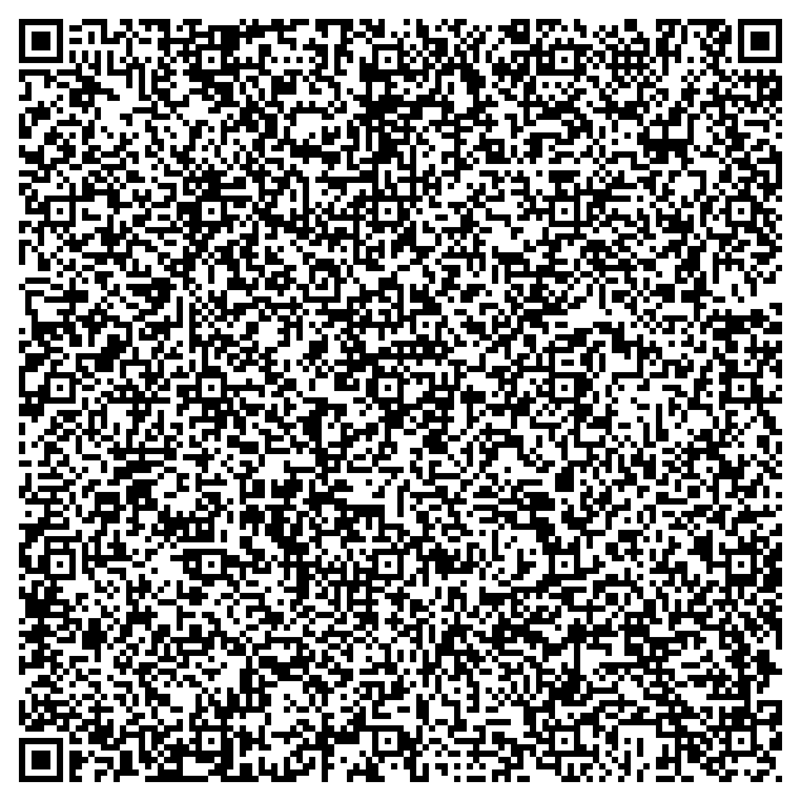
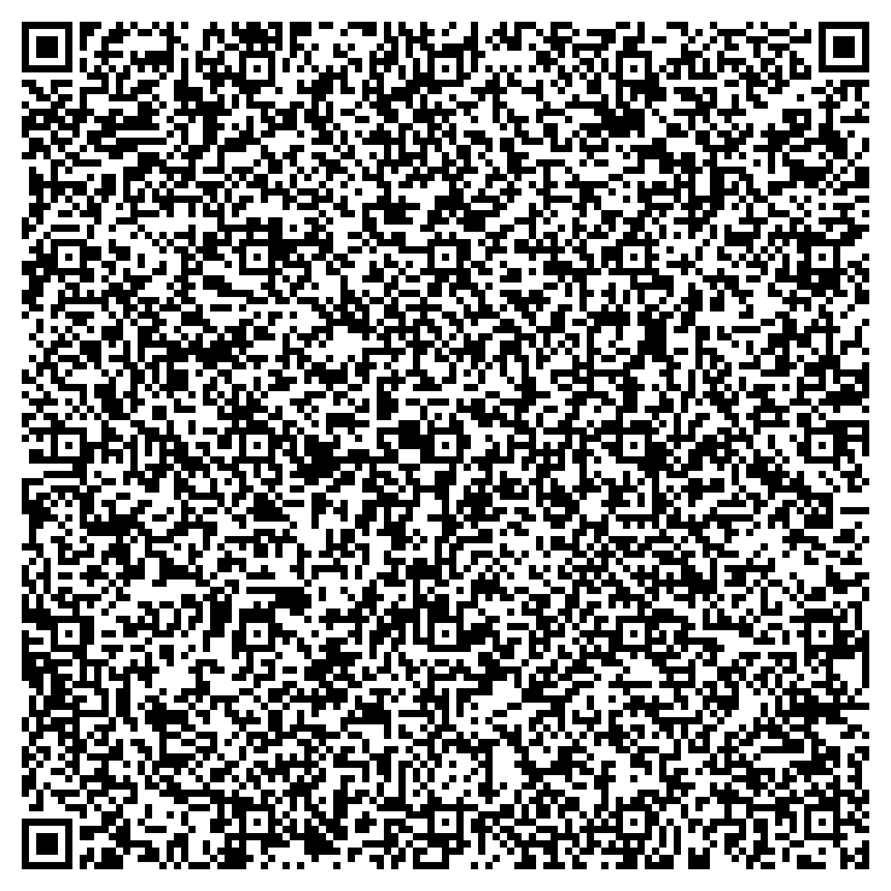
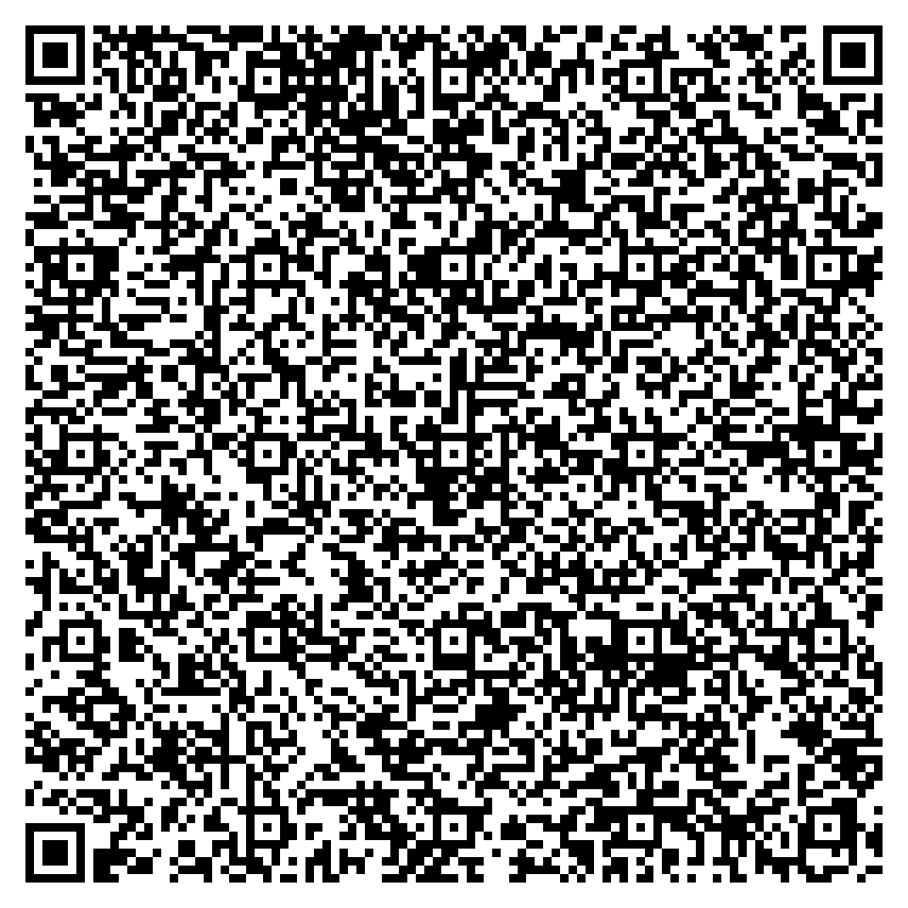

# Using Mock Data

## Introduction

Welcome to the Inji ecosystem, which encompasses the Inji Mobile Wallet, Inji Web Wallet, Inji Verify, and Inji Certify. These tools provide a powerful platform for managing and verifying digital credentials with ease. This document guides you through using mock data to explore the functionalities of each component, allowing you to understand and leverage their capabilities effectively. Read on to discover how you can interact with Inji's ecosystem, using demo credentials and mock data as explained below.

Whether you're a Developer, System Integrator, or an Enthusiast eager to dive into the world of verifiable credentials, use this guide for necessary information to get started with Inji in our [**Collab**](https://collab.mosip.net/) environment. Let's begin this journey of seamless setup and exploration.

This guide explains the use of mock data for following:

* Inji Mobile Wallet
* Inji Web Wallet
* Inji Verify

### Inji Mobile Wallet

**What would you need?**

You will need UIN (Unique identification number) as a demo credential whic will allow you to explore Inji's capabilities and experience seamless VC sharing. You can also try this with 'Sample Insurance Credentials'.

#### **UIN Credentials**

* Issuance of UIN (Unique identification number) as a demo credential will allow you to explore Inji's capabilities and experience seamless VC sharing firsthand.
* Now you can self generate your own UIN Credential using the [Collab environment](https://collab.mosip.net/).
  * Click on the **Get UIN** button located at the top-right corner of the page. This will open the [Self Registration Form](https://self-register.collab.mosip.net/), Alternatively, you can simply click on this [link](https://self-register.collab.mosip.net/) to self register. You need to duly fill the self registration form.
  * On successful registration the UIN is sent to you over the email you used for registration, For more details you follow the [Generating Demo Credentials Guide](https://docs.mosip.io/1.2.0/general/collab-getting-started-guide/generating-demo-credentials).

**Note**: You can use 111111 as the OTP, for any OTP based feature in Collab environment.

#### Insurance Credentials:

For sample Insurance Credentials, please provide the below details in the eSignet authentication page:

* Policy Name: insuranceCredentials
* DOB: 2000-01-01
* Policy Number: 12345

### Inji Web Wallet

The mock data you will need for Inji Web Wallet is same as that of Inji Mobile Wallet (Explained above).

### Inji Verify

Follow the procedure to try out Inji Verify in our collab environment:

1. To obtain sample verifiable credentials embedded in a QR code, please initiate the process by following the steps to generate the QR code, click [**here**](https://docs.mosip.io/inji/inji-verify/build-and-deploy/creating-verifiable-credentials-and-generating-qr-codes)!
2. To use the QR code with verifiable credentials and test out the Inji Verify application, exploring the scan and upload features, please use the QR codes provided below:

### Verifiable QR Code - Valid VC

#### Sample QR code - Valid VC Data

<div align="center"><figure><figcaption><p>Valid Verifiable Credentials - Data Model v2.0</p></figcaption></figure></div>

#### Data Model v2.0

```json
{
    "credential": {
        "credentialSubject": {
            "gender": "Male",
            "primaryCropType": "Maize",
            "mobileNumber": "9876543210",
            "postalCode": "453000",
            "landArea": "3 hectares",
            "fullName": "John Doe",
            "secondaryCropType": "Rice",
            "dateOfBirth": "25-05-1990",
            "face": "data:image/png;base64,iVBORw0KGgoAAAANSUhEUgAAABwAAAAFCAYAAABW1IzHAAAAHklEQVQokWNgGPaAkZHxPyMj439sYrSQo51PBgsAALa0ECF30JSdAAAAAElFTkSuQmCC",
            "farmerID": "987654321",
            "villageOrTown": "Koramangala",
            "district": "Bangalore",
            "id": "did:jwk:eyJrdHkiOiJSU0EiLCJlIjoiQVFBQiIsInVzZSI6InNpZyIsImtpZCI6Iml3Qkl1Q2QzaFU1NlBWM3VTc3gzekhMc1E4SXdYckdHdmh6YkE1VlJuQkEiLCJhbGciOiJSUzI1NiIsIm4iOiJtMWlMQ0prNzA5VkpIbUF2MURsWUxsblA0UDEtLXFfU3Q3aVo3WjhWbXk0d0Mxb2FTQWxXdjFXZjlKQXg2YmQ3OXdMbDhINEkwa25GeG9FbkktTUhvOUtGRXpFcGdJNXZIUHY2X0M2dWI4RmUwaXphRVFXTlY3VEpVRG54MVZ5OU5UZS15ekFVd2dfWk91Y0pFb3hyQW54VXM5OFcyTWpyUmtZdHVQcTlKRUxVTzRJM0wxX1B5S21hRG8zN0xCR3NVamhLVmQ0X0VzTkVPQ3AwQTZwbnBaUUd1S1RteXVhMUVYSDhLWUVTSEZ4alA4NGVCaGk0YmZPSWMwQjQ2VlZrVG81WG9TeUtnRi1xemRyTGFQRGJwZGxBaVNKMEJ5Vk5jaUE3Z2ctWEJLQkV0QVd1b19EQ3pYZUsxREJKT2txMXlkWEJzeWdjeGtpVmdobnFtUTFsVHcifQ==",
            "state": "Karnataka",
            "landOwnershipType": "Owner"
        },
        "validUntil": "2027-10-09T03:08:19.711Z",
        "validFrom": "2025-10-09T03:08:19.711Z",
        "type": [
            "VerifiableCredential",
            "FarmerCredential"
        ],
        "@context": [
            "https://www.w3.org/ns/credentials/v2",
            "https://piyush7034.github.io/my-files/farmer.json",
            "https://w3id.org/security/suites/ed25519-2020/v1"
        ],
        "issuer": "did:web:piyush7034.github.io:my-files:sample-ed25519",
        "credentialStatus": {
            "statusPurpose": "revocation",
            "statusListIndex": "7",
            "id": "http://localhost:8090/v1/certify/credentials/status-list/649d3d36-2719-42eb-9f00-ac479a906059#7",
            "type": "BitstringStatusListEntry",
            "statusListCredential": "http://localhost:8090/v1/certify/credentials/status-list/649d3d36-2719-42eb-9f00-ac479a906059"
        },
        "proof": {
            "type": "Ed25519Signature2020",
            "created": "2025-10-08T21:38:19Z",
            "proofPurpose": "assertionMethod",
            "verificationMethod": "did:web:piyush7034.github.io:my-files:sample-ed25519#LYs95rEHKsqm1_TIFJxffLUXHZL1rM_h-UuwRi6PtN4",
            "proofValue": "z5Z3Rj9rhV5b6whiq4EgZaD8gmtsBtfMEqwNXAgasCxtBRCpc35DkiGFyRfy8NYDtXBDX6RjAUpWfgNGn94t2ywgm"
        }
    }
}
```

#### Sample QR code - Valid VC Data

<div align="center"><figure><figcaption><p>Valid Verifiable Credentials - Data Model v1.1</p></figcaption></figure></div>

#### Data Model v1.1

```json
{
    "credential": {
        "issuanceDate": "2025-10-09T03:05:40.782Z",
        "credentialSubject": {
            "gender": "Male",
            "primaryCropType": "Maize",
            "mobileNumber": "9876543210",
            "postalCode": "453000",
            "landArea": "3 hectares",
            "fullName": "John Doe",
            "secondaryCropType": "Rice",
            "dateOfBirth": "25-05-1990",
            "face": "data:image/png;base64,iVBORw0KGgoAAAANSUhEUgAAABwAAAAFCAYAAABW1IzHAAAAHklEQVQokWNgGPaAkZHxPyMj439sYrSQo51PBgsAALa0ECF30JSdAAAAAElFTkSuQmCC",
            "farmerID": "987654321",
            "villageOrTown": "Koramangala",
            "district": "Bangalore",
            "id": "did:jwk:eyJrdHkiOiJSU0EiLCJlIjoiQVFBQiIsInVzZSI6InNpZyIsImtpZCI6IkVIdXU5eU5MN1VFcnFDd0hWOUdPTk5KWWdxQmVvMVhUTmY0OU95Tk1LN0EiLCJhbGciOiJSUzI1NiIsIm4iOiJ2VmF1dFFYa3JMUXVaU2hGWWFDNkRMNEZOcnMzcm5meTVkVjhyWVJRQnhyOW1oZllfdGxwTzc5QzRiZnplS1BzaVBXN0c4NEMtZGt4QlNOR3RXV0wwdy1oX3JOd3Y2eUFMT1VZaGdtcnZVeGhWakhCRzFMdTFtTUhERF9JZlpJb0lpV1JRZkpvMGZYMFBzZ2FrRWhIZmxjWHdPNk1DaVItNGVNTUdhNU0zR2ViTVQtUHlsQVVKYzJiN2NoaGFvTlJYQWNWbTBsZTFmUG5RRGJfQ21XMENxOW9kOHFjQUwtellqc0F3MnJzMWxhZ3RDcTdsSXVIWkszUnF2U0NQb2lmSG1ZZEZvdzZnNkF5eTlyNzhxc2VwYkU3d3JDYS1aRF92TkxHblpTbXVac3RicmxxZkxfelFfdnlwNjM1NTMtRmNPNGlKNW1Md0w4Z2pwTWRrVmVMRFEifQ==",
            "state": "Karnataka",
            "landOwnershipType": "Owner"
        },
        "type": [
            "VerifiableCredential",
            "FarmerCredential"
        ],
        "@context": [
            "https://www.w3.org/2018/credentials/v1",
            "https://piyush7034.github.io/my-files/farmer.json",
            "https://w3id.org/security/suites/ed25519-2020/v1"
        ],
        "issuer": "did:web:piyush7034.github.io:my-files:sample-ed25519",
        "expirationDate": "2027-10-09T03:05:40.782Z",
        "proof": {
            "type": "Ed25519Signature2020",
            "created": "2025-10-08T21:35:40Z",
            "proofPurpose": "assertionMethod",
            "verificationMethod": "did:web:piyush7034.github.io:my-files:sample-ed25519#LYs95rEHKsqm1_TIFJxffLUXHZL1rM_h-UuwRi6PtN4",
            "proofValue": "z3BW5Tx6ZHJ53rriixAwkrbjGEurLP5eNWwZQQkmEMEEWtLK5qJRThA6wyuyaiin7ucfaUDk4H2BKVBLpSAqcDPcu"
        }
    }
}
```

### **Verifiable QR Code - Expired VC**

<div align="center"><figure><figcaption><p>Expired Verifiable Credentials</p></figcaption></figure></div>

### **Sample QR code - Expired VC Data**

```json
{
    "id": "did:rcw:ab01ec3f-9f67-4ce8-ade1-8fce82a9bee1",
    "type": [
        "VerifiableCredential",
        "LifeInsuranceCredential",
        "InsuranceCredential"
    ],
    "proof": {
        "type": "Ed25519Signature2020",
        "created": "2024-05-03T12:53:39Z",
        "proofValue": "z4GVSorSVms65uTSLHRdqJB7Km7UuyzGzYbu9uKuwBPRLgHLmBMa8YnBczVh4id2PMsrB31kjCbe6NVLdA9jThURs",
        "proofPurpose": "assertionMethod",
        "verificationMethod": "did:web:challabeehyv.github.io:DID-Resolve:3313e611-d08a-49c8-b478-7f55eafe62f2#key-0"
    },
    "issuer": "did:web:challabeehyv.github.io:DID-Resolve:3313e611-d08a-49c8-b478-7f55eafe62f2",
    "@context": [
        "https://www.w3.org/2018/credentials/v1",
        "https://holashchand.github.io/test_project/insurance-context.json",
        {
            "LifeInsuranceCredential": {
                "@id": "InsuranceCredential"
            }
        },
        "https://w3id.org/security/suites/ed25519-2020/v1"
    ],
    "issuanceDate": "2024-05-03T12:53:39.113Z",
    "expirationDate": "2024-06-02T12:53:39.110Z",
    "credentialSubject": {
        "id": "did:jwk:eyJrdHkiOiJFQyIsInVzZSI6InNpZyIsImNydiI6IlAtMjU2Iiwia2lkIjoic3pGa2cyOVFFalpiQ1VheFRfbFdiZElEU1ZQNWhlREhTeGR6UlhTOW1WZyIsIngiOiJzeVZ2Y2pEX1k0Y0xFS2NUTGR3a1dEWnR1RGpGWGxwcUtLZ2l5TDB2ZUY0IiwieSI6Ii13eGZIMDZRclRCZGljOG1yRDRBM2E0alhGREx1RnlBa0NPMm56Z3BNUGMiLCJhbGciOiJFUzI1NiJ9",
        "dob": "1991-08-13",
        "email": "challarao@beehyv.com",
        "gender": "Male",
        "mobile": "0123456789",
        "benefits": [
            "Critical Surgery",
            "Full body checkup"
        ],
        "fullName": "Challarao V",
        "policyName": "Start Insurance Gold Premium",
        "policyNumber": "1234567",
        "policyIssuedOn": "2023-04-20T20:48:17.684Z",
        "policyExpiresOn": "2033-04-20T20:48:17.684Z"
    }
}
```

### **Verifiable QR Code - Invalid VC**

<div align="center"><figure><figcaption><p>Invalid Verifiable Credential</p></figcaption></figure></div>

### **Sample QR code - Invalid VC Data**

```json
{
    "id": "did:cbse:327b6c3f-ce17-4c00-ae4f-7fb2313b0626",
    "type": [
        "VerifiableCredential",
        "UniversityDegreeCredential"
    ],
    "proof": {
        "type": "Ed25519Signature2020",
        "created": "2024-05-16T07:27:43Z",
        "proofValue": "z56crqnnjmvDa46FqmAnVhEttqKtFMTQ1et1mM5dA3WSHtb5ncQ36sS8fG3fxw6dpvtqbqvaE5FzaqwJTBX6dGH3P",
        "proofPurpose": "assertionMethod",
        "verificationMethod": "did:web:Sreejit-K.github.io:VCTest:d40bdb68-6a8d-4b71-9c2a-f3002513ae0e#key-0"
    },
    "issuer": "did:web:Sreejit-K.github.io:VCTest:d40bdb68-6a8d-4b71-9c2a-f3002513ae0e",
    "@context": [
        "https://www.w3.org/2018/credentials/v1",
        "https://sreejit-k.github.io/VCTest/udc-context2.json",
        "https://w3id.org/security/suites/ed25519-2020/v1"
    ],
    "issuanceDate": "2023-02-06T11:56:27.259Z",
    "expirationDate": "2025-02-08T11:56:27.259Z",
    "credentialSubject": {
        "id": "did:example:2002-AR-015678",
        "type": "UniversityDegreeCredential",
        "ChildFullName": "Alex Jameson Taylor",
        "ChildDob": "January 15, 2003",
        "ChildGender": "Male",
        "ChildNationality": "Arandian",
        "ChildPlaceOfBirth": "Central Hospital, New Valera, Arandia",
        "FatherFullName": "Michael David Taylor",
        "FatherDob": "April 22, 1988",
        "FatherNationality": "Arandian",
        "MotherFullName": "Emma Louise Taylor",
        "MotherDob": "June 5, 1990",
        "MotherNationality": "Arandian",
        "RegistrationNumber": "2002-AR-015678",
        "DateOfRegistration": "January 20, 2002",
        "DateOfIssuance": "January 22, 2002"
    }
}
```


Feel free to scan or upload these QR codes to experience the functionality firsthand.

